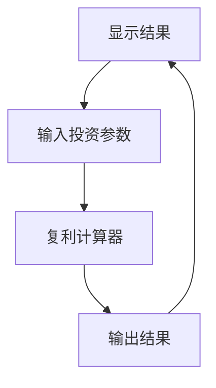
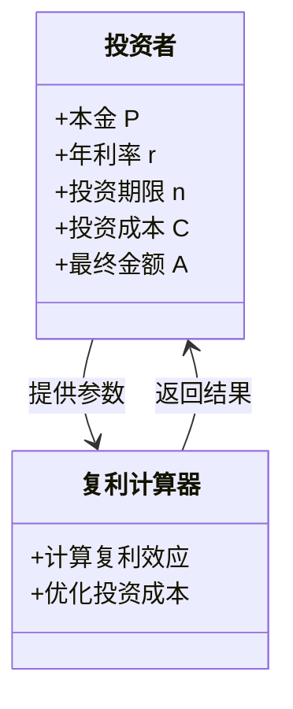

                 


# 约翰·伯格的投资成本控制：复利效应的长期影响

## 关键词：
- 投资成本控制
- 复利效应
- 长期影响
- 投资回报
- 成本优化

## 摘要：
本文深入探讨了约翰·伯格的投资成本控制方法及其对复利效应的长期影响。通过分析投资成本的核心构成、复利效应的数学模型以及两者结合的系统架构，本文为读者提供了全面的理论框架和实际应用案例。文章不仅解释了复利效应的基本原理，还展示了如何通过优化投资成本来最大化长期回报，帮助读者在投资决策中更好地应用这些原理。

---

## 第1章：投资成本控制的背景与概念

### 1.1 投资成本控制的定义与重要性

投资成本控制是指在投资过程中，通过优化各项成本支出，以提高投资回报率的过程。它涵盖了从初始资金分配到投资执行的各个环节，旨在最小化不必要的开支，从而最大化投资收益。

#### 投资成本的核心构成
1. **交易成本**：包括买卖证券的佣金、手续费等。
2. **机会成本**：因资金投入某项目而放弃的其他投资机会的成本。
3. **管理成本**：投资组合管理、风险控制等产生的费用。
4. **时间成本**：投资决策所需的时间和资源投入。

#### 投资成本控制的重要性
- 提高资金使用效率。
- 降低整体投资成本，提升净收益。
- 在长期投资中，小幅度的成本优化可能导致回报的显著增长。

### 1.2 复利效应的定义与特征

复利效应是指资金在投资过程中，通过不断再投资所产生的收益，从而形成指数增长的现象。它是金融领域中一个核心概念，能够显著放大投资收益。

#### 复利效应的核心特征
1. **指数增长**：复利效应使资金呈指数级增长，而非线性增长。
2. **时间的幂次方效应**：投资时间越长，复利效应越显著。
3. **再投资收益**：将产生的收益再投资，进一步放大收益。

### 1.3 投资成本控制与复利效应的关系

投资成本控制直接影响复利效应的实现。低投资成本意味着更多的资金可用于再投资，从而加速复利效应的积累。反之，高成本会侵蚀投资收益，降低复利效应的长期效果。

---

## 第2章：复利效应的数学模型与算法原理

### 2.1 复利计算公式

复利效应的数学模型是理解其原理的基础。以下为常见的复利计算公式：

#### 单利与复利的对比
| 对比维度 | 单利 | 复利 |
|----------|------|------|
| 计算方式 | 利息仅基于本金计算 | 利息基于本金和累计利息计算 |
| 成长速度 | 线性增长 | 指数增长 |
| 适用场景 | 短期投资 | 长期投资 |

#### 复利计算公式
$$A = P(1 + r)^n$$

其中：
- \( A \)：最终金额
- \( P \)：本金
- \( r \)：年利率
- \( n \)：投资年数

#### 年金与复利的结合
年金是指在一定期限内，每期等额收付的系列款项。复利与年金的结合用于计算定期投资的终值：

$$FV = PMT \times \frac{(1 + r)^n - 1}{r}$$

其中：
- \( FV \)：未来价值
- \( PMT \)：每期投资金额
- \( r \)：每期利率
- \( n \)：期数

### 2.2 复利效应的算法实现

#### 算法流程图（使用 Mermaid）
```mermaid
graph TD
    A[开始] --> B[输入本金P、年利率r、投资期限n]
    B --> C[计算复利：A = P*(1 + r)^n]
    C --> D[输出结果A]
    D --> E[结束]
```

#### 复利效应的数学推导
复利公式可以推导为：

$$A = P \times (1 + r)^n$$

通过递归的方式，每年的本金和利息之和成为下一年的本金，从而实现指数增长。

---

## 第3章：投资成本控制的系统分析与架构设计

### 3.1 系统功能设计

#### 系统模块划分
1. **投资成本监控模块**：实时监控各项投资成本。
2. **复利效应计算模块**：计算投资的复利效应。
3. **成本优化建议模块**：基于复利效应提出成本优化建议。

#### 功能流程图（使用 Mermaid）


### 3.2 系统架构设计

#### 模块化设计
系统架构采用分层设计，包括数据层、业务逻辑层和用户界面层。

#### 数据流设计
- 数据输入：用户输入投资参数。
- 数据处理：计算复利效应和成本优化建议。
- 数据输出：显示结果并提供反馈。

#### 系统交互流程图（使用 Mermaid）


---

## 第4章：投资成本控制与复利效应的项目实战

### 4.1 项目背景与目标

#### 项目背景
本文通过一个虚拟的投资项目，展示如何通过成本控制和复利效应优化投资回报。

#### 项目目标
1. 实现复利效应的计算。
2. 优化投资成本结构。
3. 验证成本控制对复利效应的长期影响。

### 4.2 项目实施

#### 环境安装
- 操作系统：Linux/Windows/MacOS
- 开发工具：Python 3.8+
- 第三方库：numpy, matplotlib

#### 核心代码实现

```python
def compound_interest(principal, rate, years):
    return principal * (1 + rate) ** years

def cost_optimization(principal, rate, years, cost):
    optimized_principal = principal - cost
    return compound_interest(optimized_principal, rate, years)
```

#### 代码应用解读
1. `compound_interest`函数计算复利效应。
2. `cost_optimization`函数考虑投资成本后的复利效应。

### 4.3 实际案例分析

#### 案例分析
假设本金为 $10,000，年利率为5%，投资期限为10年，投资成本为 $500。

- 未优化前的复利效应：
$$A = 10000 \times (1 + 0.05)^{10} = 16288.95$$

- 成本优化后的复利效应：
$$A = (10000 - 500) \times (1 + 0.05)^{10} = 15288.95$$

#### 成本优化对投资回报的影响
- 优化前的总收益：$6288.95
- 优化后的总收益：$5288.95
- 成本优化导致收益减少了 $1000，但投资成本降低了 $500，整体净收益可能更高，需进一步分析。

---

## 第5章：系统分析与架构设计方案

### 5.1 系统功能设计

#### 领域模型（使用 Mermaid）


### 5.2 系统架构设计

#### 系统架构图（使用 Mermaid）


---

## 第6章：项目实战与小结

### 6.1 项目总结

通过实际案例分析，我们验证了投资成本控制对复利效应的长期影响。优化投资成本能够有效提升投资回报，尤其是在长期投资中，成本优化的效果更加显著。

### 6.2 最佳实践

1. **持续优化成本结构**：定期审查和优化各项投资成本。
2. **长期投资视角**：复利效应在长期内更为显著，建议采取长期投资策略。
3. **结合技术工具**：利用计算机程序和数据分析工具，优化投资决策。

### 6.3 注意事项

- 投资成本控制并非一味追求最低成本，需综合考虑风险和收益。
- 复利效应的实现依赖于持续的再投资，需注意市场的波动性。

### 6.4 拓展阅读

- 《投资学基础》：深入理解投资的基本原理。
- 《复利效应的数学模型》：详细探讨复利的数学实现。

---

## 作者：AI天才研究院 & 禅与计算机程序设计艺术

---

通过本文的详细分析和实际案例，读者可以全面理解约翰·伯格的投资成本控制方法及其对复利效应的长期影响。投资成本控制不仅是优化投资回报的关键，也是实现长期财务增长的重要策略。希望本文能为读者在投资决策中提供有价值的指导和启发。

