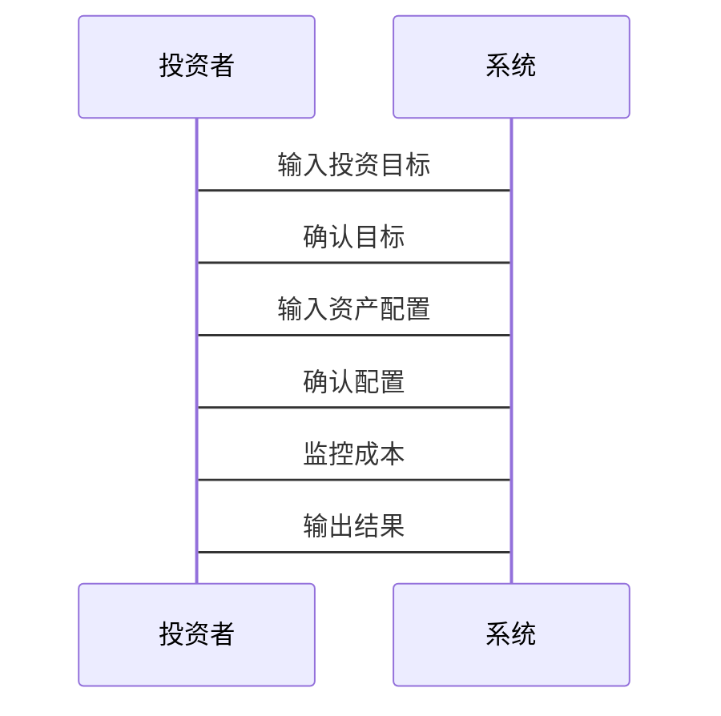

                 


# 约翰·伯格的投资成本控制：复利的力量

## 关键词：
- 复利
- 投资成本控制
- 约翰·伯格
- 资产配置
- 长期投资
- 成本优化

## 摘要：
本文深入探讨了复利在投资中的重要性，结合约翰·伯格的成本控制理念，分析了复利的数学模型、算法实现以及在实际投资中的应用。通过系统化的成本控制策略和优化的投资组合设计，展示了如何利用复利效应最大化投资收益。

---

# 第一部分：投资成本控制与复利概述

## 第1章：复利的核心概念与应用

### 1.1 复利的定义与基本原理
- 复利的定义
- 复利与单利的对比
- 复利的指数增长效应

### 1.2 投资成本控制的重要性
- 成本的定义及其在投资中的作用
- 约翰·伯格的成本控制理念
- 成本控制对投资收益的影响

### 1.3 复利在投资中的核心地位
- 复利的指数增长效应
- 复利与长期投资的关系
- 复利在不同投资策略中的应用

---

## 第2章：复利的数学模型与算法原理

### 2.1 复利计算的数学公式
- 复利的终值公式：$$FV = P \times (1 + r)^n$$
- 复利的现值公式：$$PV = \frac{FV}{(1 + r)^n}$$
- 复利的年金公式：$$PMT = \frac{P \times r \times (1 + r)^n}{(1 + r)^n - 1}$$

### 2.2 复利的算法实现
- 复利计算的步骤
- 复利算法的流程图
```mermaid
graph TD
A[开始] --> B[输入本金P]
B --> C[输入年利率r]
C --> D[输入投资期限n]
D --> E[计算终值FV = P*(1+r)^n]
E --> F[输出结果]
F --> G[结束]
```

### 2.3 复利模型的优化与应用
- 复利模型的优化方法
- 复利模型的误差分析
- 复利模型的实际应用案例

---

## 第3章：投资成本控制的核心策略

### 3.1 成本控制的基本原则
- 最小化不必要的开支
- 优化资产配置
- 风险与收益的平衡

### 3.2 约翰·伯格的成本控制方法
- 低成本投资策略
- 长期持有与复利效应
- 避免频繁交易的成本

### 3.3 成本控制的实施步骤
- 确定投资目标
- 选择低成本投资工具
- 定期评估与调整

---

## 第4章：系统化投资成本控制与复利的应用

### 4.1 系统化成本控制的架构设计
- 系统功能模块划分
  - 投资目标设定
  - 资产配置
  - 成本监控
- 系统架构图


### 4.2 系统化成本控制的实现
- 系统功能设计
- 系统接口设计
- 系统交互流程图


### 4.3 复利在系统化投资中的应用
- 复利效应的系统化实现
- 系统化成本控制对复利的影响
- 实际案例分析与解读

---

## 第5章：项目实战：基于复利的成本控制系统开发

### 5.1 环境安装与配置
- 开发工具安装
- 依赖库安装
- 系统环境配置

### 5.2 核心功能实现
- 投资目标设定模块
- 资产配置优化模块
- 成本监控与分析模块

### 5.3 代码实现与解读
```python
def compound_interest(principal, rate, years):
    return principal * (1 + rate) ** years
```
- 函数解读：计算复利终值
- 示例代码运行结果分析

### 5.4 实际案例分析
- 案例背景介绍
- 案例分析与计算
- 案例总结与优化建议

---

## 第6章：最佳实践与小结

### 6.1 小结
- 复利的核心作用
- 成本控制的关键策略
- 系统化方法的优势

### 6.2 注意事项
- 风险管理的重要性
- 长期投资的纪律性
- 成本控制的边界条件

### 6.3 扩展阅读
- 相关书籍推荐
- 在线资源与工具
- 进一步研究的方向

---

## 参考文献
- 约翰·伯格的著作
- 相关投资理论书籍
- 专业投资报告与论文

---

## 作者：AI天才研究院/AI Genius Institute & 禅与计算机程序设计艺术/Zen And The Art of Computer Programming

---

通过以上目录结构，文章将从理论到实践，系统地讲解复利与投资成本控制的内在联系，结合约翰·伯格的理念，提供实用的策略与方法，帮助读者在投资中最大化收益。

