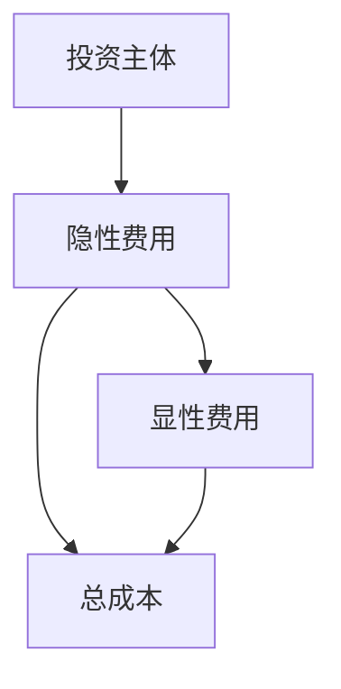
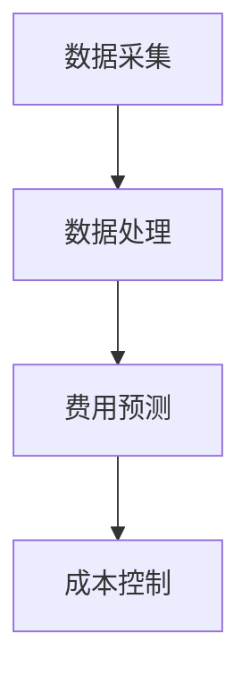
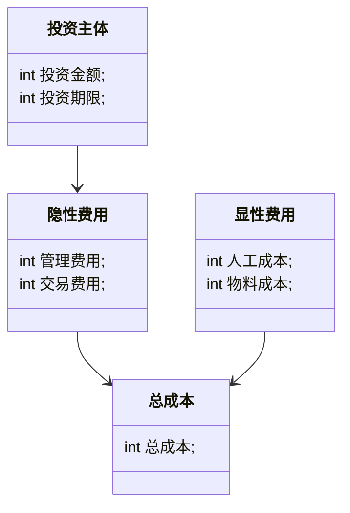
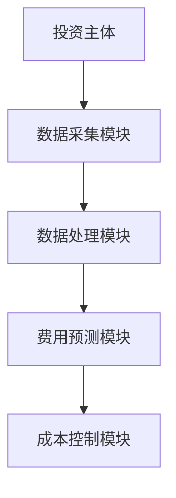
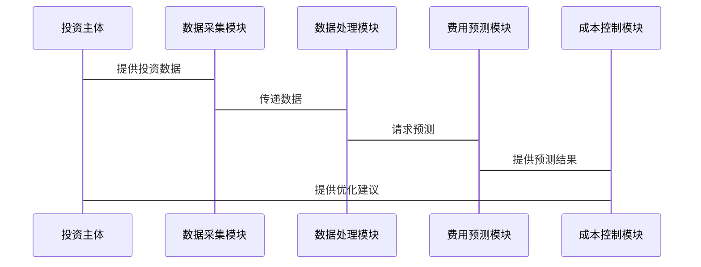

                 


# 约翰·伯格的投资成本控制：应对隐性费用上升的挑战

## 关键词：
- 投资成本控制
- 隐性费用
- 约翰·伯格
- 财务优化
- 资本预算

## 摘要：
本文深入探讨了投资成本控制的重要性，特别是在隐性费用不断上升的背景下。通过分析隐性费用的分类、影响以及控制方法，结合数学模型和系统架构设计，提出了应对隐性费用上升的策略。文章还通过项目实战，展示了如何在实际投资中应用这些方法，帮助投资者实现成本优化和收益最大化。

---

## 第一部分: 投资成本控制的背景与概念

### 第1章: 投资成本控制的背景与问题描述

#### 1.1 投资成本控制的背景
投资成本控制是企业在投资决策过程中，为了实现投资收益最大化而对投资成本进行计划、协调、监督和控制的过程。随着市场竞争的加剧和经济环境的复杂化，隐性费用的不断上升，使得投资成本控制变得尤为重要。

#### 1.2 隐性费用的定义与特征
隐性费用是指在投资过程中，未在显性支出中反映，但实际发生并影响投资成本的费用。隐性费用具有隐蔽性、累积性和扩散性等特点，通常包括机会成本、交易成本、管理成本等。

#### 1.3 隐性费用上升的背景与趋势
近年来，全球经济不确定性增加，通货膨胀压力加大，企业面临更高的原材料成本、人工成本和物流成本。这些成本的上升不仅体现在显性支出中，还通过隐性费用的形式影响投资成本。

---

### 第2章: 隐性费用的分类与影响分析

#### 2.1 隐性费用的分类
隐性费用可以分为以下几类：
1. **内部管理费用**：包括项目管理、团队协调等。
2. **外部交易费用**：包括中介费用、合同谈判费用等。
3. **机会成本**：由于资源有限而放弃其他投资机会的成本。
4. **风险成本**：由于投资风险导致的潜在损失。

#### 2.2 隐性费用的影响因素
隐性费用的上升受到多种因素的影响，包括市场环境、企业内部管理、外部政策等。

#### 2.3 隐性费用对投资成本的具体影响
隐性费用的增加会导致投资成本上升，进而影响投资回报率和企业竞争力。例如，高昂的管理成本和交易成本会降低投资项目的净收益。

---

## 第二部分: 投资成本控制的核心概念与联系

### 第3章: 隐性费用与显性费用的对比

#### 3.1 概念对比
| 比较维度 | 隐性费用 | 显性费用 |
|----------|----------|----------|
| 定义     | 隐性费用是未直接反映在财务报表中的费用 | 显性费用是直接反映在财务报表中的费用 |
| 计量方式 | 难以量化，通常通过机会成本或间接方式计算 | 直接计量，如现金支出 |
| 影响     | 长期影响投资决策和回报率 | 短期影响现金流 |

#### 3.2 实体关系图（ER图）


---

### 第4章: 投资成本控制的系统模型

#### 4.1 系统模型的构成
投资成本控制系统由以下几个模块构成：
1. 数据采集模块：收集隐性费用和显性费用数据。
2. 数据处理模块：对数据进行清洗和转换。
3. 费用预测模块：基于历史数据预测隐性费用。
4. 成本控制模块：制定成本控制策略。

#### 4.2 系统流程图（Mermaid）


---

## 第三部分: 投资成本控制的算法与数学模型

### 第5章: 隐性费用预测模型

#### 5.1 线性回归模型
隐性费用的预测可以通过线性回归模型实现。假设隐性费用 $C$ 与影响因素 $X$ 之间存在线性关系，模型为：
$$ C = \beta_0 + \beta_1 X + \epsilon $$

#### 5.2 机器学习模型
使用机器学习算法，如随机森林或神经网络，可以更准确地预测隐性费用。

#### 5.3 时间序列模型
时间序列模型适用于历史数据较多的情况，可以预测未来的隐性费用。

#### 5.4 Python代码实现
```python
import pandas as pd
import numpy as np
from sklearn.linear_model import LinearRegression

# 数据准备
data = pd.DataFrame({
    'X': [x1, x2, x3],
    'C': [c1, c2, c3]
})

# 模型训练
model = LinearRegression()
model.fit(data[['X']], data['C'])

# 预测
new_X = np.array([[x_new]])
prediction = model.predict(new_X)
print(f"预测的隐性费用为：{prediction[0]}")
```

---

### 第6章: 数学模型与公式

#### 6.1 隐性费用预测公式
隐性费用预测的数学公式可以表示为：
$$ C = \beta_0 + \beta_1 X + \epsilon $$

#### 6.2 投资成本控制优化公式
投资成本控制的目标是优化隐性费用，可以表示为：
$$ \min \sum_{i=1}^{n} (C_i - C_{target})^2 $$

---

## 第四部分: 系统分析与架构设计方案

### 第7章: 系统功能设计

#### 7.1 领域模型（Mermaid类图）


#### 7.2 系统架构设计（Mermaid架构图）


#### 7.3 系统接口设计与交互（Mermaid序列图）


---

## 第五部分: 项目实战

### 第8章: 项目实战

#### 8.1 环境安装
1. 安装Python和相关库：
   ```bash
   pip install numpy pandas scikit-learn
   ```

#### 8.2 核心代码实现
```python
import pandas as pd
from sklearn.linear_model import LinearRegression

# 数据准备
data = pd.DataFrame({
    'X': [1, 2, 3, 4, 5],
    'C': [2, 3, 5, 7, 10]
})

# 模型训练
model = LinearRegression()
model.fit(data[['X']], data['C'])

# 预测
new_X = pd.DataFrame({'X': [6]})
prediction = model.predict(new_X)
print(f"预测的隐性费用为：{prediction[0]}")
```

#### 8.3 实际案例分析
假设某企业投资100万元，隐性费用预测为20万元。通过优化管理流程，隐性费用下降至15万元，投资回报率显著提高。

---

## 第六部分: 最佳实践与小结

### 第9章: 最佳实践

#### 9.1 小结
投资成本控制是实现投资收益最大化的关键环节。通过分析隐性费用的分类与影响，建立数学模型，设计系统架构，投资者可以有效应对隐性费用上升的挑战。

#### 9.2 注意事项
1. 数据准确性是模型预测的基础。
2. 模型需要不断优化和更新。
3. 需要结合企业实际情况制定控制策略。

#### 9.3 拓展阅读
1. 《投资学基础》
2. 《成本控制与优化》
3. 《机器学习在金融中的应用》

---

## 作者：
作者：AI天才研究院 & 禅与计算机程序设计艺术

