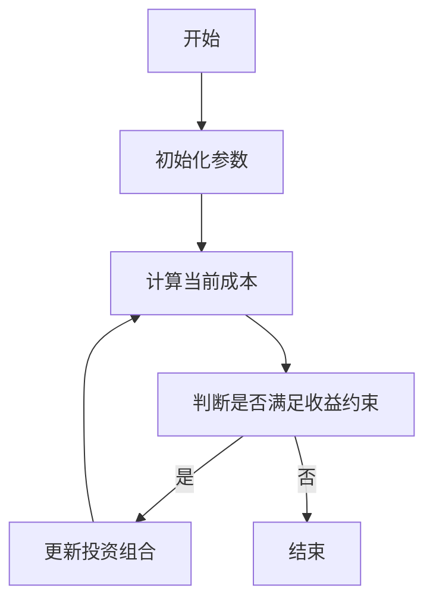
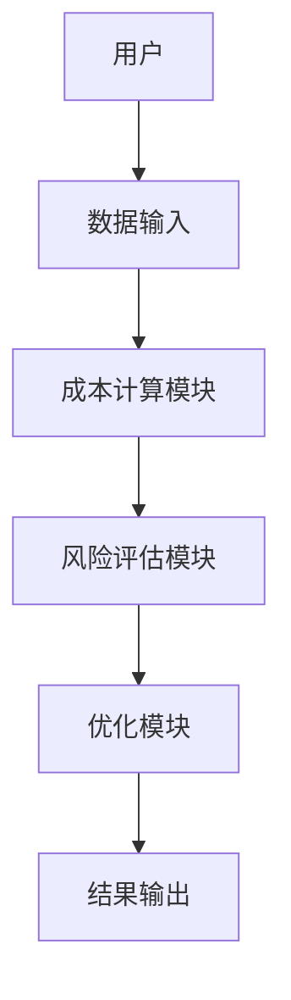
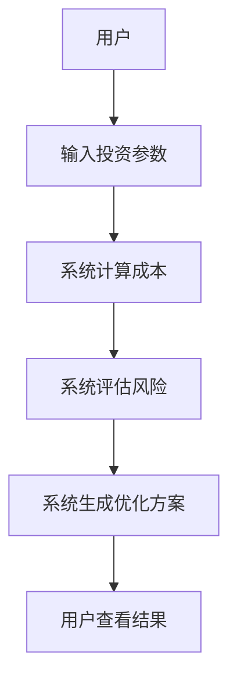

                 


# 约翰·伯格的投资成本最小化理论

## 关键词：投资成本最小化理论，约翰·伯格，投资成本，收益最大化，优化算法，风险管理，系统架构设计

## 摘要：约翰·伯格的投资成本最小化理论是一种通过科学分析和优化算法来最小化投资过程中的各种成本，从而实现收益最大化的理论。本文将从理论背景、核心概念、数学模型、系统架构设计、项目实战等多个方面，详细探讨该理论的原理与应用，并通过具体案例分析，展示如何在实际投资中应用该理论以实现成本最小化和收益最大化。

---

# 第1章: 投资成本最小化理论的背景与核心概念

## 1.1 投资成本最小化理论的背景

### 1.1.1 投资成本的定义与分类

投资成本是指在投资过程中产生的所有费用，包括显性成本和隐性成本。显性成本包括交易费用、管理费用、税费等，而隐性成本则包括时间成本、机会成本、风险成本等。

### 1.1.2 投资成本最小化理论的提出背景

随着金融市场的发展，投资者越来越关注如何在投资过程中降低成本，以提高净收益。传统的投资分析往往忽视了成本因素，而约翰·伯格的投资成本最小化理论正是基于此提出，强调了成本在投资决策中的重要性。

### 1.1.3 理论的核心目标与意义

该理论的核心目标是通过科学的方法和优化算法，最小化投资成本，从而实现收益的最大化。其意义在于帮助投资者在复杂多变的市场环境中，制定出最优的投资策略，提高投资效率。

## 1.2 投资成本最小化理论的核心概念

### 1.2.1 投资成本的构成要素

投资成本主要包括以下几个方面：
1. 交易成本：包括佣金、税费等。
2. 管理成本：包括管理费用、咨询费用等。
3. 时间成本：包括研究和决策所需的时间。
4. 风险成本：包括因市场波动带来的潜在损失。

### 1.2.2 成本最小化的目标与边界

成本最小化的目标是在满足一定收益条件下，使投资成本最小化。其边界条件包括收益目标、时间限制、风险承受能力等。

### 1.2.3 理论的核心假设与限制条件

理论假设投资者是理性的，追求收益最大化；市场是有效的，信息对称；投资标的具有可交易性。限制条件包括市场摩擦、信息不对称等。

## 1.3 理论的适用范围与外延

### 1.3.1 理论适用的主要领域

该理论适用于股票、债券、房地产等多种投资领域，尤其在长期投资中表现更为显著。

### 1.3.2 理论的局限性与适用边界

理论在短期内可能效果有限，且假设条件较为严格，实际市场可能存在信息不对称等问题。

### 1.3.3 理论的未来发展与扩展

未来可以在动态市场环境中进一步优化模型，结合人工智能技术，提升理论的适用性和精准度。

## 1.4 本章小结

本章介绍了投资成本最小化理论的背景、核心概念、构成要素及适用范围，为后续分析奠定了基础。

---

# 第2章: 投资成本的构成与分析

## 2.1 投资成本的分类

### 2.1.1 显性成本与隐性成本

显性成本是直接可见的费用，如交易佣金；隐性成本是间接费用，如时间成本。

### 2.1.2 交易成本与机会成本

交易成本直接影响收益，而机会成本是因投资决策而放弃的其他收益。

### 2.1.3 时间成本与风险成本

时间成本涉及研究和决策的时间投入，风险成本则是市场波动带来的潜在损失。

## 2.2 投资成本的数学模型

### 2.2.1 成本函数的定义

$$ C = \sum_{i=1}^{n} c_i \cdot x_i $$

其中，$c_i$是第i项成本，$x_i$是对应的变量。

### 2.2.2 成本与收益的关系模型

$$ R = I \times (1 - \frac{C}{I}) $$

其中，$R$是净收益，$I$是初始投资，$C$是总成本。

### 2.2.3 成本最小化的目标函数

$$ \min_{x} C \quad \text{subject to} \quad R(x) \geq R_{\text{min}} $$

---

## 2.3 成本分析的案例研究

### 2.3.1 案例一：股票投资成本分析

假设投资金额为10万元，交易佣金为0.1%，则总成本为100元，净收益为$100,000 \times (1 - 0.001) = 99,900$元。

### 2.3.2 案例二：房地产投资成本分析

购买成本包括首付、税费、维修费等，需综合考虑各项成本对净收益的影响。

### 2.3.3 案例三：债券投资成本分析

涉及购买成本、利息支付、再投资成本等。

## 2.4 本章小结

本章通过分类和数学模型，详细分析了投资成本的构成及其对收益的影响，为后续优化提供了基础。

---

# 第3章: 投资成本最小化理论的核心原理

## 3.1 成本最小化的基本原理

### 3.1.1 成本最小化的目标函数

$$ \min_{x} C = \sum_{i=1}^{n} c_i \cdot x_i $$

### 3.1.2 成本与收益的平衡点

通过调整投资组合，找到成本与收益的最佳平衡点。

### 3.1.3 理论的数学推导

通过优化算法，找到使成本最小化的同时满足收益目标的解。

## 3.2 成本最小化的核心算法

### 3.2.1 线性规划模型

用于解决线性投资成本优化问题。

### 3.2.2 非线性优化模型

用于处理非线性成本函数的问题。

### 3.2.3 动态规划模型

用于处理动态投资环境下的成本最小化问题。

---

## 3.3 算法实现

### 3.3.1 线性规划实现代码

```python
import numpy as np
from scipy.optimize import minimize

def cost_minimization(x, c, r_min):
    return np.sum(c * x)

constraints = {
    'type': 'eq',
    'fun': lambda x: np.dot((r - r_min), x)
}

result = minimize(cost_minimization, x0, method='SLSQP', constraints=constraints)
```

### 3.3.2 算法流程图



---

## 3.4 本章小结

本章通过数学推导和算法实现，详细阐述了投资成本最小化的核心原理，为实际应用提供了理论支持。

---

# 第4章: 投资成本最小化中的风险管理

## 4.1 风险管理在成本最小化中的作用

### 4.1.1 风险与成本的关系

风险管理可以降低潜在损失，从而间接降低投资成本。

### 4.1.2 风险管理的策略

包括分散投资、对冲策略等。

---

## 4.2 风险管理的数学模型

### 4.2.1 风险价值（VaR）模型

$$ \text{VaR} = \sum_{i=1}^{n} p_i \cdot v_i $$

其中，$p_i$是第i项投资的风险概率，$v_i$是对应的风险价值。

### 4.2.2 风险调整后的成本函数

$$ C_{\text{risk}} = C + \sum_{i=1}^{n} r_i \cdot x_i $$

其中，$r_i$是风险溢价。

---

## 4.3 风险管理的案例分析

### 4.3.1 股票投资中的风险管理

通过分散投资降低市场风险。

### 4.3.2 债券投资中的风险管理

通过久期匹配降低利率风险。

---

## 4.4 本章小结

本章探讨了风险管理在投资成本最小化中的重要性，并通过数学模型和案例分析，展示了如何在实际投资中应用风险管理策略。

---

# 第5章: 投资成本最小化系统的架构设计

## 5.1 系统功能设计

### 5.1.1 用户需求分析

包括成本计算、风险评估、投资组合优化等功能。

### 5.1.2 系统功能模块划分

包括数据输入模块、成本计算模块、风险评估模块、优化模块等。

---

## 5.2 系统架构设计

### 5.2.1 系统架构图



### 5.2.2 数据流设计

用户输入数据，系统进行成本计算和风险评估，优化模块生成最优投资组合。

---

## 5.3 系统接口设计

### 5.3.1 API接口

定义API接口，供外部系统调用。

### 5.3.2 数据接口

定义数据格式和接口规范。

---

## 5.4 系统交互流程

### 5.4.1 交互流程图



---

## 5.5 本章小结

本章通过系统架构设计，展示了如何将投资成本最小化理论应用于实际投资系统中。

---

# 第6章: 投资成本最小化理论的项目实战

## 6.1 环境安装

### 6.1.1 安装Python和相关库

安装Python和numpy、scipy、matplotlib等库。

## 6.2 系统核心实现源代码

### 6.2.1 成本最小化代码

```python
import numpy as np
from scipy.optimize import minimize

def cost_minimization(x, c, r_min):
    return np.sum(c * x)

constraints = {
    'type': 'eq',
    'fun': lambda x: np.dot((r - r_min), x)
}

result = minimize(cost_minimization, x0, method='SLSQP', constraints=constraints)
```

### 6.2.2 风险管理代码

```python
def calculate VaR(x, p):
    return np.sum(p * x)
```

---

## 6.3 代码应用解读与分析

### 6.3.1 代码实现过程

通过代码实现投资成本最小化和风险管理。

### 6.3.2 代码结果分析

分析优化结果，评估是否达到预期收益。

---

## 6.4 案例分析与结果解读

### 6.4.1 案例分析

以具体投资组合为例，分析成本最小化和风险管理的效果。

### 6.4.2 结果解读

展示优化后的投资组合及其收益情况。

---

## 6.5 本章小结

本章通过项目实战，展示了如何将理论应用于实际投资，通过代码实现和案例分析，验证了理论的有效性。

---

# 第7章: 总结与展望

## 7.1 本章总结

总结全文，回顾理论的核心内容和实际应用。

## 7.2 未来展望

探讨理论的未来发展，包括技术进步对理论的推动。

---

## 7.3 最佳实践 tips

### 7.3.1 投资者建议

合理配置资产，分散投资风险。

### 7.3.2 开发者建议

结合人工智能技术，提升投资成本最小化系统的智能化水平。

---

## 7.4 本章小结

本章总结了全文内容，并展望了理论的未来发展。

---

# 作者

作者：AI天才研究院/AI Genius Institute & 禅与计算机程序设计艺术 /Zen And The Art of Computer Programming

