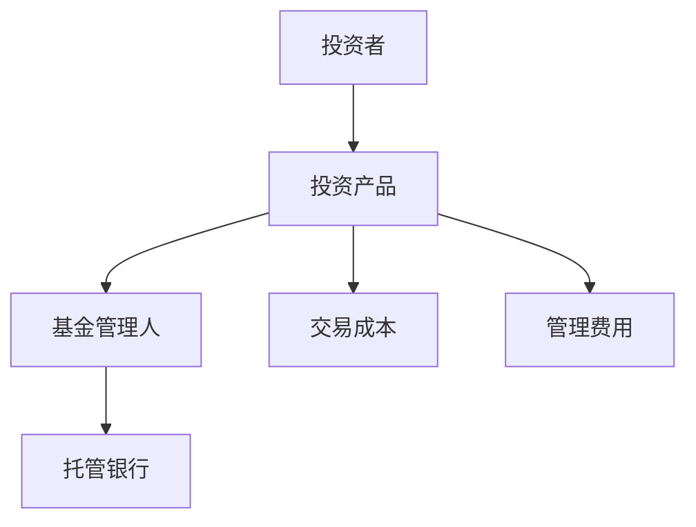
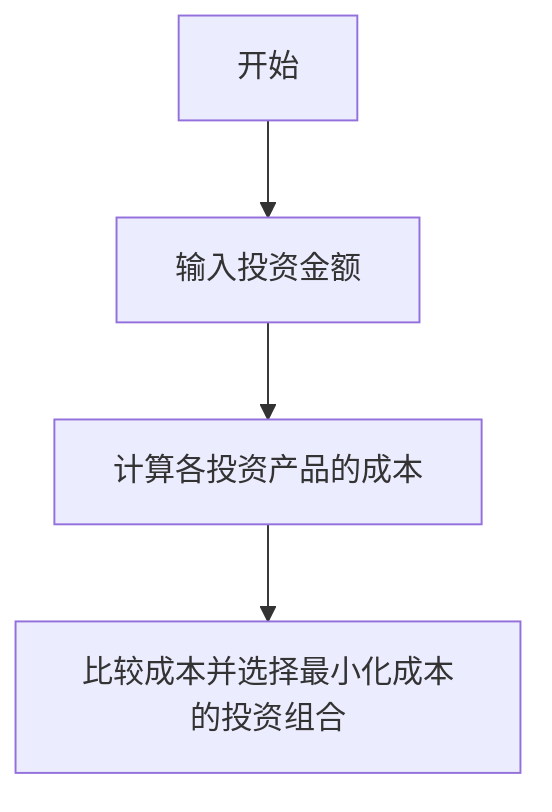
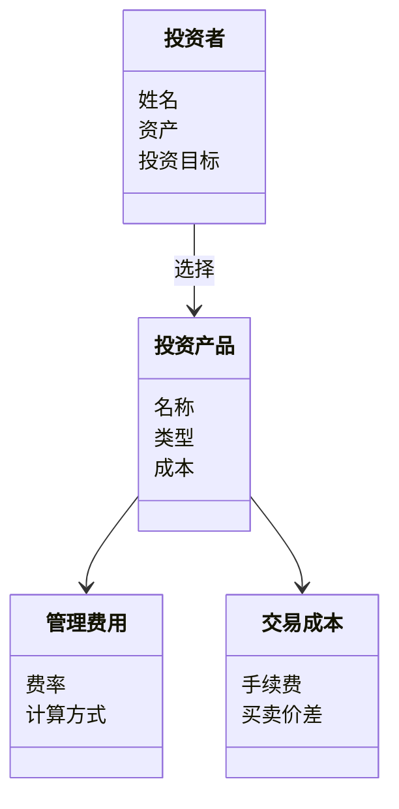
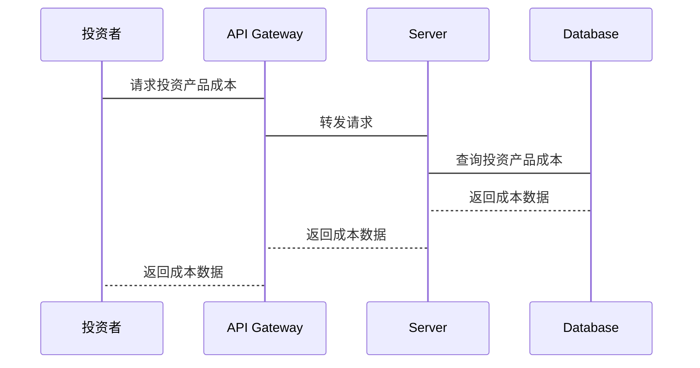

                 


# 《约翰·伯格的投资成本最小化策略》

## 关键词：投资成本，约翰·伯格，指数基金，被动管理，投资策略

## 摘要：本文深入探讨了约翰·伯格的投资成本最小化策略，分析其核心理念、算法原理和实际应用，帮助投资者理解如何通过降低投资成本实现长期收益最大化。

---

# 第一部分: 投资成本最小化策略的背景与基础

## 第1章: 投资成本的概念与重要性

### 1.1 投资成本的基本概念

#### 1.1.1 投资成本的定义与组成
投资成本是指在投资过程中产生的各项费用，包括交易成本、管理费用、托管费用等。这些成本会直接影响投资收益，因此最小化投资成本是投资者追求长期收益的重要策略。

#### 1.1.2 投资成本在投资决策中的作用
投资成本是投资决策的重要考量因素。高成本的投资策略可能导致收益减少，而低成本的策略则有助于实现更高的净收益。

#### 1.1.3 投资成本的分类与影响因素
投资成本可以分为显性成本（如交易费用）和隐性成本（如机会成本）。影响投资成本的主要因素包括市场流动性、投资规模、管理费用率等。

### 1.2 约翰·伯格与投资成本最小化策略

#### 1.2.1 约翰·伯格的背景与投资理念
约翰·伯格是投资界的传奇人物，他创立了 Vanguard 集团，并倡导指数基金投资。他的投资理念强调低成本和长期持有，认为市场难以预测，被动投资是更优的选择。

#### 1.2.2 伯格的投资成本最小化策略的核心思想
伯格认为，长期投资的收益主要来自资产本身的增长，而非频繁交易或高费用的主动管理。他通过指数基金实现了低成本投资，避免了主动管理的高额费用。

#### 1.2.3 伯格策略的实践成果与影响力
伯格的策略帮助投资者实现了长期稳定的收益， Vanguard 的指数基金以其低费用率和优秀的业绩表现闻名，成为全球投资者的首选。

### 1.3 投资成本最小化策略的现实意义

#### 1.3.1 降低投资成本对投资者的益处
低成本投资策略能够帮助投资者最大化净收益，尤其是在长期投资中，复利效应使得成本的差异更加显著。

#### 1.3.2 投资成本在不同市场环境下的表现
在牛市中，低成本策略的优势可能不明显，但在熊市或震荡市场中，低成本策略能够更好地保护投资者的本金。

#### 1.3.3 长期投资与成本最小化的结合
长期投资与低成本策略的结合能够最大化投资收益，同时减少市场的短期波动对投资组合的影响。

---

# 第2章: 投资成本的核心概念与联系

## 2.1 投资成本的核心概念原理

### 2.1.1 投资成本的构成要素分析
投资成本主要包括交易成本、管理费用、托管费用和其他隐性成本。这些成本在不同的投资策略和市场环境中表现各异。

### 2.1.2 投资成本与投资收益的关系
投资成本是影响投资收益的重要因素，低成本策略能够帮助投资者实现更高的净收益。长期来看，投资成本的差异会显著影响投资结果。

### 2.1.3 投资成本在不同资产类别中的表现
股票、债券和基金等不同资产类别中的投资成本表现不同，投资者需要根据自身需求选择合适的投资标的。

## 2.2 核心概念属性特征对比表格

| 成本类型 | 定义 | 影响 | 优化方法 |
|---------|------|------|----------|
| 交易成本 | 每次交易的手续费和买卖价差 | 影响短期收益 | 通过批量交易或长期持有降低 |
| 管理费用 | 基金管理人的管理费 | 长期侵蚀收益 | 选择低费率基金 |
| 时间成本 | 投资决策的时间投入 | 影响投资效率 | 通过自动化工具优化 |

## 2.3 ER实体关系图（使用 Mermaid）



---

# 第3章: 投资成本最小化策略的算法原理

## 3.1 算法原理概述

### 3.1.1 成本最小化算法的目标
通过优化投资组合中的各项成本，实现投资收益的最大化。

### 3.1.2 算法的基本思路
根据投资目标和风险偏好，选择低成本的投资工具，如指数基金，并长期持有，避免频繁交易。

### 3.1.3 算法的适用场景
适用于长期投资、资产配置和风险管理。

## 3.2 成本最小化算法的数学模型

### 3.2.1 数学模型的构建
$$ \text{总成本} = \text{交易成本} + \text{管理费用} + \text{时间成本} $$

### 3.2.2 算法优化公式
$$ \text{最优投资组合} = \argmin_{w} \left( \sum_{i=1}^{n} w_i \cdot c_i \right) $$

其中，\( w_i \) 是投资比例，\( c_i \) 是对应的投资成本。

## 3.3 算法流程图（使用 Mermaid）



---

# 第4章: 系统分析与架构设计方案

## 4.1 问题场景介绍
投资成本分析系统用于帮助投资者优化投资组合，降低投资成本，实现收益最大化。

## 4.2 项目介绍
开发一个投资成本分析系统，帮助投资者选择低成本的投资工具，并优化投资组合。

## 4.3 系统功能设计（领域模型 Mermaid 类图）



## 4.4 系统架构设计（Mermaid 架构图）


## 4.5 系统接口设计
系统接口包括用户登录、投资产品查询、成本计算等。

## 4.6 系统交互设计（Mermaid 序列图）



---

# 第5章: 项目实战

## 5.1 环境安装
安装 Python、Pandas、Matplotlib 等工具。

## 5.2 系统核心实现源代码

```python
import pandas as pd
import matplotlib.pyplot as plt

# 数据加载
data = pd.read_csv('投资成本.csv')

# 成本计算
data['总成本'] = data['交易成本'] + data['管理费用'] + data['时间成本']

# 可视化
plt.bar(data['投资产品'], data['总成本'])
plt.title('投资产品的总成本分析')
plt.xlabel('投资产品')
plt.ylabel('总成本')
plt.show()
```

## 5.3 代码应用解读与分析
代码实现投资成本的计算和可视化，帮助投资者选择低成本投资产品。

## 5.4 实际案例分析和详细讲解剖析
以伯格的指数基金为例，分析其成本结构和投资收益。

## 5.5 项目小结
通过项目实战，投资者能够理解如何通过低成本策略实现收益最大化。

---

# 第6章: 最佳实践、小结、注意事项、拓展阅读

## 6.1 最佳实践
选择低成本投资工具，长期持有，避免频繁交易。

## 6.2 小结
本文深入分析了约翰·伯格的投资成本最小化策略，从理论到实践，帮助投资者优化投资组合。

## 6.3 注意事项
投资者需根据自身风险偏好和财务状况选择合适的投资策略。

## 6.4 拓展阅读
推荐阅读《投资学》、《约翰·伯格的投资之道》等书籍。

---

# 作者：AI天才研究院/AI Genius Institute & 禅与计算机程序设计艺术 /Zen And The Art of Computer Programming

