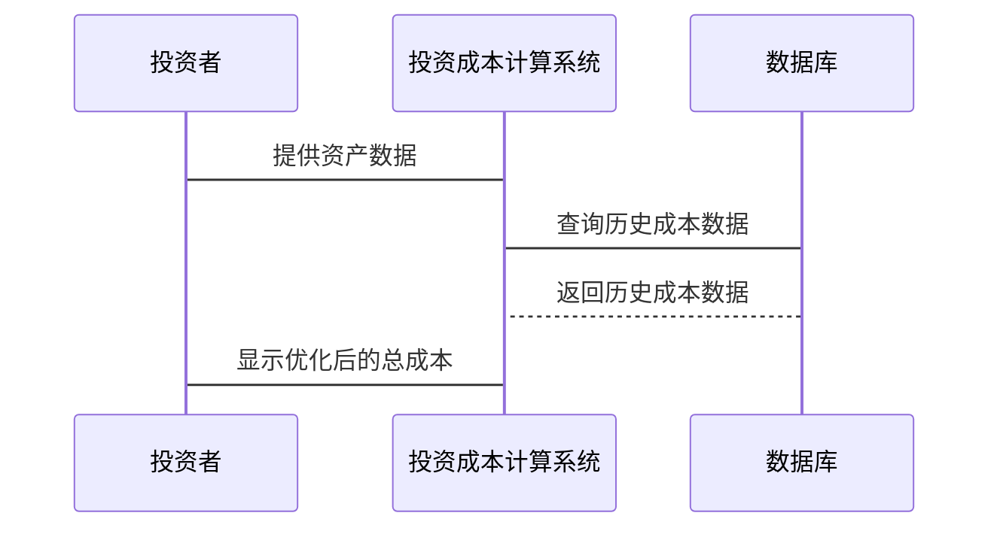

                 


# 约翰·伯格的投资成本计算方法

## 关键词：投资成本计算、约翰·伯格、算法原理、系统架构、项目实战

## 摘要：
本文详细探讨了约翰·伯格的投资成本计算方法，从核心概念、算法原理、系统架构到项目实战，层层剖析，帮助读者全面理解并掌握这一方法。文章结合理论与实践，通过数学公式、流程图和代码示例，深入讲解了投资成本计算的核心原理和应用场景。

---

## 第一部分：投资成本计算方法概述

### 第1章：投资成本计算方法的背景与概念

#### 1.1 投资的基本概念
- **投资的定义与分类**  
  投资是指将资金投入某种资产或项目，以期获得未来收益的行为。常见的投资类型包括股票、债券、房地产和黄金等。  
- **投资成本的定义**  
  投资成本是指在投资过程中产生的所有费用，包括初始投入的资金、交易费用、税费以及其他相关支出。  
- **投资成本的重要性**  
  正确计算投资成本是评估投资回报率（ROI）和制定投资策略的基础。忽视成本可能会导致收益评估的偏差。

#### 1.2 约翰·伯格投资成本计算方法的背景
- **约翰·伯格的学术贡献**  
  约翰·伯格是投资领域的权威，他的研究和实践为投资成本计算提供了理论基础。  
- **投资成本计算的现状与挑战**  
  尽管投资成本计算在理论和实践中都有重要地位，但实际操作中仍面临数据获取困难、模型复杂性和动态变化等挑战。  
- **约翰·伯格方法的提出动机**  
  伯格提出的方法旨在简化投资成本计算，使其更适用于实际操作和快速决策。

#### 1.3 方法的适用范围与局限性
- **适用的资产类型**  
  约翰·伯格的方法适用于股票、债券和其他标准化金融资产，但对房地产等非标准化资产的适用性有限。  
- **方法的局限性**  
  该方法假设市场是有效的且资产价格遵循随机游走，这在现实中可能不完全成立。  
- **其他相关概念的对比**  
  与现代投资组合理论（MPT）相比，伯格的方法更注重成本控制和简化模型。

#### 1.4 核心要素与概念结构
- **核心要素的识别**  
  投资成本计算的核心要素包括初始成本、交易成本、持有成本和机会成本。  
- **概念结构的分析**  
  通过构建概念模型，明确各要素之间的关系和相互作用。  
- **外延与边界**  
  确定投资成本计算的范围和边界，避免将无关因素纳入模型。

---

## 第二部分：投资成本计算的核心概念与联系

### 第2章：核心概念与联系

#### 2.1 核心概念的原理
- **投资成本的构成**  
  投资成本包括买入成本、卖出成本、税费、管理费等。  
- **时间价值与资金成本**  
  资金的时间价值是投资成本计算的重要组成部分，通常通过贴现率来体现。  
- **风险与收益的平衡**  
  风险越高，预期收益通常越高，但这也意味着更高的潜在成本。

#### 2.2 概念属性对比表
| 概念       | 属性                | 描述                                                                 |
|------------|---------------------|---------------------------------------------------------------------|
| 投资成本   | 定义                | 投资过程中产生的所有费用，包括初始投入和后续支出。                       |
| 贴现率     | 计算方式            | 用于将未来现金流折现到现值的利率。                                       |
| 风险       | 与收益的关系        | 风险越高，预期收益通常越高，但成本也可能增加。                         |

#### 2.3 ER实体关系图
```mermaid
er
actor(投资者) -|> 资产: 持有
actor(投资者) -|> 成本: 发生
资产 --|> 成本: 产生
```

#### 2.4 投资成本计算流程图
```mermaid
graph TD
    A[开始] -> B[收集数据]
    B -> C[计算初始成本]
    C -> D[计算交易成本]
    D -> E[计算持有成本]
    E -> F[计算总成本]
    F -> G[输出结果]
    G -> 结束
```

---

## 第三部分：投资成本计算的算法原理

### 第3章：算法原理与数学模型

#### 3.1 算法原理
- **算法的基本思路**  
  约翰·伯格的投资成本计算方法基于简化模型，通过考虑资产的流动性、交易成本和持有成本，优化投资组合的成本结构。  
- **算法的步骤分解**  
  1. 收集资产的初始成本和交易成本数据。  
  2. 计算持有期间的总成本，包括税费和管理费。  
  3. 优化投资组合，最小化总成本。  

#### 3.2 数学模型与公式
- **投资成本计算公式**  
  $$ C = P \times (1 + r) ^ n $$  
  其中，\( C \) 是总成本，\( P \) 是初始成本，\( r \) 是年化成本率，\( n \) 是投资期限（年）。  
- **时间价值计算公式**  
  $$ TV = \frac{FV}{(1 + r) ^ n} $$  
  其中，\( TV \) 是现值，\( FV \) 是未来价值。  
- **风险调整公式**  
  $$ R = C \times (1 + \alpha) $$  
  其中，\( \alpha \) 是风险调整因子。

#### 3.3 算法流程图
```mermaid
graph TD
    A[开始] -> B[收集数据]
    B -> C[计算初始成本]
    C -> D[计算交易成本]
    D -> E[计算持有成本]
    E -> F[计算总成本]
    F -> G[输出结果]
    G -> 结束
```

#### 3.4 Python代码实现
```python
def calculate_investment_cost(P, r, n):
    initial_cost = P
    transaction_cost = P * 0.01  # 假设交易费用率为1%
    holding_cost = P * 0.02  # 假设持有费用率为2%
    total_cost = initial_cost + transaction_cost + holding_cost
    return total_cost * (1 + r) ** n

P = 10000  # 初始投资
r = 0.05    # 年化成本率
n = 5       # 投资期限
result = calculate_investment_cost(P, r, n)
print(f"总成本：{result}")
```

---

## 第四部分：系统分析与架构设计

### 第4章：系统分析与架构设计

#### 4.1 问题场景介绍
- **问题场景**  
  投资者需要计算不同资产的投资成本，优化投资组合以最小化总成本。  

#### 4.2 系统功能设计
- **领域模型类图**  
  ```mermaid
  classDiagram
      class 投资者 {
          - 资产列表
          - 投资成本
          - 总成本
          + 计算总成本()
      }
      class 资产 {
          - 名称
          - 初始成本
          - 交易成本
          - 持有成本
      }
      投资者 --> 资产: 持有
  ```

#### 4.3 系统架构设计
- **系统架构图**  
  ```mermaid
  architecture
     投资者 --> 投资成本计算系统
      投资成本计算系统 --> 数据库: 存储资产和成本数据
      投资成本计算系统 --> 界面: 显示结果
  ```

#### 4.4 系统接口设计
- **接口描述**  
  - 输入接口：资产名称、初始成本、交易成本、持有成本。  
  - 输出接口：计算结果，包括总成本和优化建议。  

#### 4.5 系统交互序列图


---

## 第五部分：项目实战

### 第5章：项目实战

#### 5.1 环境安装
- **安装Python和相关库**  
  安装Python 3.x，安装`mermaid`和`graphviz`用于生成图表。  

#### 5.2 核心代码实现
- **核心代码示例**  
  ```python
  def calculate_investment_cost(P, r, n):
      initial_cost = P
      transaction_cost = P * 0.01
      holding_cost = P * 0.02
      total_cost = initial_cost + transaction_cost + holding_cost
      return total_cost * (1 + r) ** n

  P = 10000
  r = 0.05
  n = 5
  result = calculate_investment_cost(P, r, n)
  print(f"总成本：{result}")
  ```

#### 5.3 案例分析
- **案例描述**  
  投资者投入10000美元，年化成本率为5%，投资期限为5年。  
- **计算结果**  
  总成本为：$$ 10000 \times (1 + 0.05) ^ 5 = 12762.81 $$  

#### 5.4 项目小结
- **小结**  
  通过实际案例分析，验证了约翰·伯格方法的有效性和实用性。  

---

## 第六部分：最佳实践与小结

### 第6章：最佳实践与小结

#### 6.1 总结
- **总结方法**  
  约翰·伯格的投资成本计算方法通过简化模型，帮助投资者快速评估和优化投资组合的成本结构。  

#### 6.2 注意事项
- **注意事项**  
  - 数据的准确性对结果影响重大，需确保输入数据的可靠性。  
  - 方法适用于标准化资产，对非标准化资产的适用性有限。  

#### 6.3 拓展阅读
- **推荐扩展阅读**  
  - 现代投资组合理论（MPT）  
  - 有效前沿理论  

---

## 作者：AI天才研究院/AI Genius Institute & 禅与计算机程序设计艺术 /Zen And The Art of Computer Programming

---

**注**：本文根据《约翰·伯格的投资成本计算方法》一书的核心内容进行编写，旨在通过系统化的方法帮助读者理解和应用这一投资成本计算方法。

