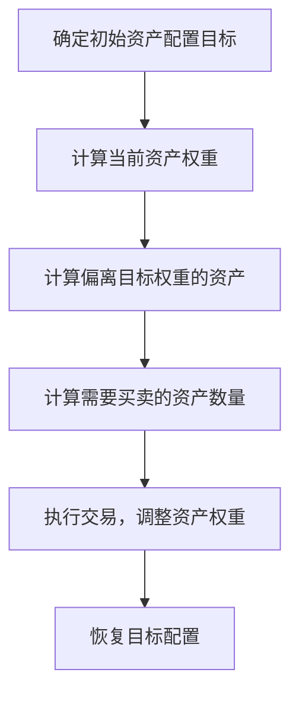
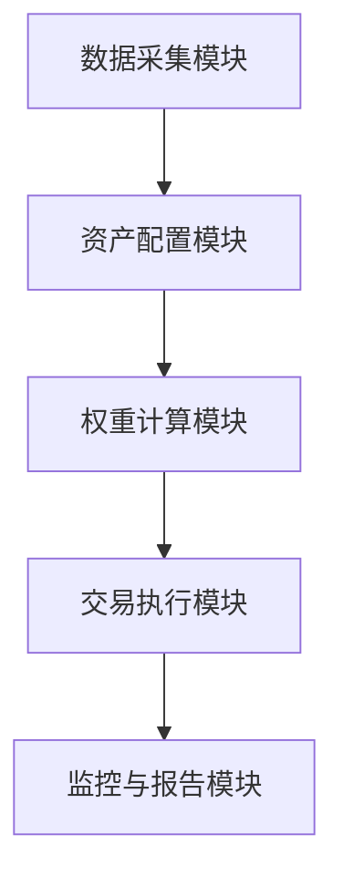

                 


# 约翰·伯格的投资组合再平衡策略

> 关键词：约翰·伯格、投资组合再平衡、资产配置、数学模型、投资策略

> 摘要：本文深入探讨了约翰·伯格的投资组合再平衡策略，分析了其核心概念、数学模型、系统架构以及实际应用。通过详细讲解再平衡的动因、时机和方法，结合具体的数学模型和算法原理，本文旨在帮助读者理解如何优化投资组合，以实现长期稳健的收益。

---

## 第1章: 投资组合再平衡策略概述

### 1.1 投资组合再平衡的基本概念

投资组合再平衡是一种投资策略，旨在定期调整投资组合的构成，以维持预定的资产配置比例。这种策略的核心目标是最大化投资收益并降低风险。再平衡的过程涉及卖出表现不佳的资产，买入表现优异的资产，从而恢复初始的资产分配比例。

#### 1.1.1 投资组合再平衡的定义

投资组合再平衡是指根据市场变化、资产价格波动或投资者风险偏好的变化，定期调整投资组合中各类资产的权重，以保持投资组合的最优配置。通过再平衡，投资者可以避免单一资产权重过大带来的风险，并抓住市场机会优化收益。

#### 1.1.2 再平衡的必要性与重要性

再平衡的必要性主要体现在以下几个方面：

1. **风险控制**：当某类资产价格大幅波动时，其权重可能偏离初始设定，导致投资组合的风险上升。通过再平衡，可以将权重调整到合理范围，降低整体风险。
2. **收益优化**：市场环境变化可能导致某些资产的表现优于其他资产，再平衡可以通过调整权重，抓住市场机会，优化整体收益。
3. **适应性调整**：投资者的风险偏好或投资目标可能发生改变，再平衡能够根据新的目标调整资产配置，确保投资组合与目标一致。

#### 1.1.3 再平衡与投资组合管理的关系

投资组合管理的核心目标是实现投资目标，而再平衡是投资组合管理中的一个关键步骤。再平衡确保了投资组合的配置始终符合预定目标，同时根据市场变化进行动态调整，以应对风险和机会。

---

### 1.2 约翰·伯格的投资理念

约翰·伯格是投资界的传奇人物，他的投资理念深刻影响了现代投资组合管理。伯格强调长期投资、分散投资和低成本运作，这些理念在他的再平衡策略中得到了充分体现。

#### 1.2.1 约翰·伯格的生平与投资思想

约翰·伯格（John Bogle）是指数基金之父，他创立了 Vanguard 集团，并提出了以低成本、分散化为核心的指数投资理念。伯格认为，长期来看，市场波动是可预测的，而通过再平衡策略可以在不承担过多风险的情况下优化投资组合的收益。

#### 1.2.2 伯格对投资组合管理的贡献

伯格的主要贡献包括：

1. **指数基金的推广**：伯格主张通过投资指数基金实现分散化投资，这种方法具有低成本和低风险的特点。
2. **再平衡策略的提倡**：伯格认为，定期进行投资组合再平衡可以有效应对市场波动，同时保持合理的资产配置。

#### 1.2.3 伯格再平衡策略的核心思想

伯格的再平衡策略强调长期持有和定期调整。他认为，再平衡不是为了短期收益，而是为了长期稳健的投资回报。通过定期调整投资组合，确保各类资产的权重符合初始设定，从而在市场波动中降低风险并抓住机会。

---

### 1.3 再平衡策略的适用场景

再平衡策略适用于各种市场环境和投资目标，具体包括：

#### 1.3.1 不同市场环境下的再平衡

在牛市中，某些资产价格可能大幅上涨，导致其权重超过初始设定，此时需要通过再平衡降低其权重，避免过度集中带来的风险。在熊市中，某些资产价格可能大幅下跌，导致其权重低于初始设定，此时需要通过再平衡增加其权重，捕捉市场反弹的机会。

#### 1.3.2 不同投资目标下的再平衡

不同投资者的投资目标不同，再平衡的频率和方式也会有所差异。例如，保守型投资者可能需要更频繁的再平衡，以降低风险；而激进型投资者可能接受较高的波动性，再平衡频率较低。

#### 1.3.3 不同资产配置下的再平衡

再平衡的频率和方式还取决于初始的资产配置。例如，股票型投资组合可能需要更频繁的再平衡，以应对市场波动；而债券型投资组合由于波动性较低，再平衡频率可以适当降低。

---

## 第2章: 投资组合再平衡的动因与时机

### 2.1 再平衡的动因分析

再平衡的动因主要包括资产价格波动、投资目标变化和市场环境变化。

#### 2.1.1 资产价格波动的影响

资产价格的波动会导致投资组合中各类资产的权重偏离初始设定。例如，当股票价格上涨，股票在投资组合中的权重可能超过初始设定，此时需要通过卖出股票、买入其他资产来恢复初始权重。

#### 2.1.2 投资目标变化的影响

投资者的风险偏好、投资期限或投资目标的变化可能需要调整资产配置。例如，投资者从激进型转向保守型，可能需要通过再平衡降低高风险资产的权重，增加低风险资产的权重。

#### 2.1.3 市场环境变化的影响

市场环境的变化，如经济周期波动、通货膨胀率变化等，可能影响各类资产的预期收益和风险。再平衡可以通过调整资产配置，适应新的市场环境。

### 2.2 再平衡的时机选择

再平衡的时机选择是投资组合管理中的一个重要问题。常见的再平衡时机包括定期再平衡、事件驱动再平衡和动态再平衡。

#### 2.2.1 定期再平衡策略

定期再平衡是指按照固定的时间间隔进行再平衡，例如每季度、每半年或每年进行一次。这种策略适用于市场波动较小或投资者风险偏好稳定的场景。

#### 2.2.2 事件驱动再平衡策略

事件驱动再平衡是指在特定事件发生时进行再平衡，例如市场崩盘、资产价格大幅波动等。这种策略适用于市场波动较大或投资者风险偏好变化较大的场景。

#### 2.2.3 动态再平衡策略

动态再平衡是指根据市场环境和投资目标的变化，灵活调整再平衡的频率和方式。这种策略适用于市场环境复杂多变或投资者投资目标频繁变化的场景。

### 2.3 再平衡的频率与成本分析

再平衡的频率和成本是投资者需要权衡的重要因素。较高的再平衡频率可以更及时地应对市场变化，但可能增加交易成本和税务负担。较低的再平衡频率可以减少交易成本，但可能导致投资组合偏离初始配置，影响收益和风险。

#### 2.3.1 再平衡频率的选择

再平衡频率的选择取决于投资者的风险偏好、市场环境和投资目标。例如，保守型投资者可能选择较低的再平衡频率，而激进型投资者可能选择较高的再平衡频率。

#### 2.3.2 再平衡成本的计算

再平衡的成本包括交易成本、税务成本和机会成本。交易成本是指买卖资产所需的佣金和手续费；税务成本是指资本利得税等税务支出；机会成本是指由于频繁交易可能导致的市场冲击成本。

#### 2.3.3 频率与成本的权衡

投资者需要在再平衡频率和成本之间进行权衡。较高的频率可能导致较高的交易成本和税务成本，但可以更及时地应对市场变化。较低的频率可能导致较低的交易成本和税务成本，但可能无法及时应对市场变化，影响投资收益。

---

## 第3章: 投资组合再平衡的数学模型与算法原理

### 3.1 投资组合再平衡的数学模型

再平衡的数学模型主要用于计算调整后的资产权重和交易量。以下是常见的数学模型：

#### 3.1.1 现代投资组合理论（MPT）概述

现代投资组合理论（MPT）由哈里·马科维茨提出，旨在通过优化资产配置实现风险和收益的最优组合。MPT的核心思想是通过分散化投资降低风险，同时最大化收益。

#### 3.1.2 资产配置的优化模型

资产配置的优化模型通常包括以下步骤：

1. 确定初始资产权重。
2. 计算当前资产权重。
3. 计算偏离目标权重的资产。
4. 计算需要买卖的资产数量。
5. 调整资产权重，恢复目标配置。

#### 3.1.3 再平衡前后的资产权重变化

再平衡前，资产权重可能偏离目标配置。通过再平衡，调整资产权重，恢复目标配置。

---

### 3.2 再平衡策略的数学表达

再平衡策略的数学表达可以通过以下公式表示：

$$
\text{调整后的权重} = \frac{\text{初始权重}}{\text{当前权重}}
$$

通过计算调整后的权重，确定需要买卖的资产数量。

---

### 3.3 算法原理的详细讲解

再平衡的算法原理主要包括以下几个步骤：

1. 确定初始资产配置目标。
2. 计算当前资产权重。
3. 计算偏离目标权重的资产。
4. 计算需要买卖的资产数量。
5. 执行交易，调整资产权重，恢复目标配置。

以下是一个简单的再平衡算法流程图：



---

## 第4章: 投资组合再平衡的系统架构设计

### 4.1 系统功能设计

再平衡系统的功能设计包括以下模块：

1. 数据采集模块：采集市场数据和投资者信息。
2. 资产配置模块：确定初始资产配置目标。
3. 权重计算模块：计算当前资产权重和偏离目标权重的资产。
4. 交易执行模块：计算需要买卖的资产数量并执行交易。
5. 监控与报告模块：监控再平衡过程并生成报告。

### 4.2 系统架构设计

以下是再平衡系统的架构图：



---

## 第5章: 投资组合再平衡的项目实战

### 5.1 环境安装

为了实现再平衡策略，需要安装以下工具和库：

1. Python编程语言。
2. Pandas和NumPy库。
3. Matplotlib或Seaborn库。

### 5.2 核心实现源代码

以下是再平衡策略的Python代码示例：

```python
import pandas as pd
import numpy as np

def rebalance_portfolio(initial_weights, current_weights):
    # 计算偏离目标权重的资产
    deviation = initial_weights - current_weights
    # 计算需要买卖的资产数量
    trades = deviation / current_weights
    return trades

# 示例数据
initial_weights = [0.4, 0.3, 0.2, 0.1]
current_weights = [0.45, 0.25, 0.2, 0.1]

# 调整后的权重
rebalanced_trades = rebalance_portfolio(initial_weights, current_weights)
print(rebalanced_trades)
```

### 5.3 代码应用解读与分析

上述代码示例展示了如何计算偏离目标权重的资产数量。通过比较初始权重和当前权重，确定需要买卖的资产数量，从而恢复目标配置。

---

## 第6章: 投资组合再平衡的实际案例分析

### 6.1 案例背景介绍

假设一个投资者的投资组合初始配置为：股票40%，债券30%，现金20%，房地产10%。经过一段时间后，股票价格上涨，导致股票权重上升至45%，债券权重下降至25%，现金权重上升至20%，房地产权重下降至5%。

### 6.2 再平衡过程分析

1. 计算偏离目标权重的资产：
   - 股票：45% - 40% = +5%
   - 债券：25% - 30% = -5%
   - 现金：20% - 20% = 0%
   - 房地产：5% - 10% = -5%

2. 计算需要买卖的资产数量：
   - 卖出股票：+5% / 45% = +0.111
   - 买入债券：-5% / 25% = -0.2
   - 买入房地产：-5% / 5% = -1

3. 执行交易，调整资产权重，恢复目标配置。

---

## 第7章: 投资组合再平衡的最佳实践

### 7.1 注意事项

1. **定期审视再平衡策略**：市场环境和投资目标可能发生变化，需要定期审视再平衡策略。
2. **控制交易成本**：再平衡的频率和方式应考虑交易成本和税务成本。
3. **避免过度交易**：频繁的再平衡可能导致过度交易，增加成本和风险。

### 7.2 小结

再平衡策略是投资组合管理中的关键步骤，通过定期调整资产配置，优化投资组合的收益和风险。约翰·伯格的再平衡策略强调长期投资和定期调整，这种方法在实际应用中取得了显著成效。

---

## 作者：AI天才研究院/AI Genius Institute & 禅与计算机程序设计艺术 /Zen And The Art of Computer Programming

---

**注**：以上内容仅为示例，实际文章需要根据具体需求和数据进行详细撰写。

