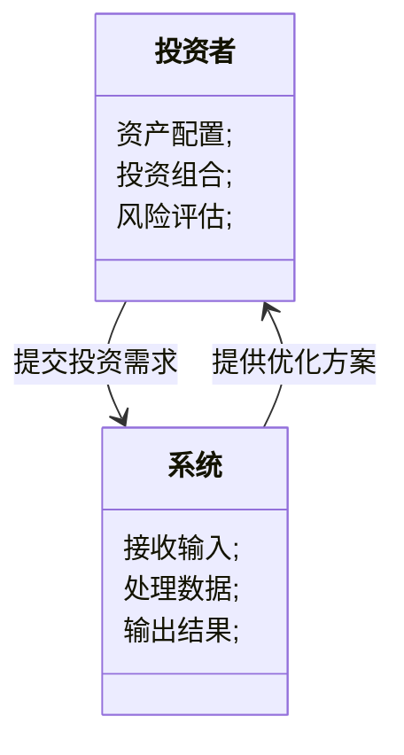

                 


```markdown
# 约翰·伯格的投资者教育理念

> 关键词：投资者教育，约翰·伯格，投资理念，长期投资，分散投资，资产配置

> 摘要：本文将深入探讨约翰·伯格的投资者教育理念，分析其核心思想、实践方法以及对现代投资策略的影响。通过系统分析和实际案例，我们将揭示如何通过科学的投资方法实现财富增值。

---

# 第一部分: 投资者教育的背景与重要性

# 第1章: 投资者教育的背景与现状

## 1.1 投资者教育的背景
### 1.1.1 当前投资市场的复杂性
在现代金融市场中，投资者面临的信息量巨大，市场波动剧烈，投资工具日益多样化。然而，许多投资者由于缺乏系统的投资知识，容易陷入短期波动的干扰，难以实现长期稳健的投资收益。

### 1.1.2 投资者认知的误区
许多投资者倾向于追涨杀跌，频繁交易，忽视了长期投资的重要性。此外，过度关注短期收益往往导致忽视风险控制和资产配置。

### 1.1.3 投资者教育的重要性
通过科学的投资者教育，可以帮助投资者建立正确的投资理念，避免常见误区，从而实现长期稳健的投资回报。

## 1.2 约翰·伯格的投资者教育理念
### 1.2.1 伯格的教育背景与投资哲学
约翰·伯格是指数基金之父，他创立了先锋集团（Vanguard），倡导低成本、被动式投资策略。他的投资哲学强调长期持有、分散投资和避免市场择时。

### 1.2.2 伯格对投资者教育的贡献
伯格通过撰写《投资法宝》等书籍，向普通投资者普及了指数投资的理念，帮助投资者理解长期投资的重要性。

### 1.2.3 伯格理念的核心思想
伯格的核心思想包括：  
1. 长期投资是实现财富增值的关键。  
2. 分散投资可以有效降低风险。  
3. 避免频繁交易，减少费用对收益的侵蚀。

## 1.3 投资者教育的目标与意义
### 1.3.1 投资者教育的目标
帮助投资者建立科学的投资理念，掌握基本的投资方法，避免常见投资误区。

### 1.3.2 投资者教育的意义
通过教育，投资者可以更好地理解市场运作机制，制定合理的投资策略，实现长期稳健的投资回报。

### 1.3.3 投资者教育的实施路径
通过书籍、课程、讲座等多种形式，向投资者普及科学的投资知识，帮助其建立正确的投资理念。

## 1.4 本章小结
本章介绍了投资者教育的背景和现状，重点阐述了约翰·伯格的投资者教育理念及其重要性。伯格的长期投资、分散投资和低成本投资理念为现代投资者提供了重要的指导。

---

# 第2章: 投资者行为与心理分析

## 2.1 投资者行为分析
### 2.1.1 投资者的决策模式
投资者的行为受到心理、情绪和环境的影响，容易出现非理性决策。

### 2.1.2 投资者的行为偏差
常见的行为偏差包括过度自信、从众心理、损失厌恶等，这些偏差可能导致错误的投资决策。

### 2.1.3 行为对投资结果的影响
行为偏差可能导致投资者错过长期投资机会，或在市场波动中遭受损失。

## 2.2 投资者心理分析
### 2.2.1 投资者心理特征
投资者的心理特征包括贪婪、恐惧、乐观和悲观等，这些心理特征会影响其投资决策。

### 2.2.2 心理因素对投资决策的影响
心理因素可能导致投资者在市场高点买入，在市场低点卖出，违背长期投资原则。

### 2.2.3 如何克服心理障碍
通过科学的投资者教育，可以帮助投资者克服心理障碍，坚持长期投资策略。

## 2.3 伯格理念对投资者心理的启示
### 2.3.1 避免情绪化决策
伯格强调理性决策，避免因情绪波动而做出错误的投资决策。

### 2.3.2 坚持长期投资
伯格认为，长期投资可以平滑短期市场波动的影响，实现稳健的长期收益。

### 2.3.3 保持理性与耐心
投资者需要克服贪婪与恐惧，保持理性和耐心，避免因短期市场波动而改变投资策略。

## 2.4 本章小结
本章分析了投资者的行为和心理特征，揭示了心理因素对投资决策的影响。伯格的长期投资理念为投资者提供了克服心理障碍的有效方法。

---

# 第3章: 投资者教育的核心概念与联系

## 3.1 投资的基本原理
### 3.1.1 资产配置的核心作用
资产配置是投资成功的关键，通过合理分配不同类型资产，可以降低风险并提高收益。

### 3.1.2 分散投资的风险控制
分散投资可以降低特定资产的风险，通过投资不同类型的资产来实现风险分散。

### 3.1.3 价值投资的长期收益
价值投资强调购买优质资产，长期持有，通过企业的成长实现投资收益。

## 3.2 核心概念对比表
以下是对几种投资策略的对比：

| 投资策略 | 优点 | 缺点 |
|----------|------|------|
| 价值投资 | 长期收益稳定 | 需要较高的选股能力 |
| 股票投资 | 收益潜力大 | 风险较高 |
| 债券投资 | 风险较低 | 收益潜力有限 |
| 指数投资 | 分散风险，费用低 | 无法超越市场表现 |

## 3.3 ER实体关系图
```mermaid
erd
actor 投资者;
portfolio 投资组合;
asset 资产;
risk 风险;
return 收益;

investor -> portfolio: 创建投资组合
portfolio -> asset: 持有资产
asset -> return: 产生收益
asset -> risk: 存在风险
```

## 3.4 本章小结
本章详细介绍了投资者教育的核心概念，包括资产配置、分散投资和价值投资，并通过对比表和实体关系图展示了这些概念之间的联系。

---

# 第4章: 投资组合优化的数学模型

## 4.1 投资组合优化的基本原理
### 4.1.1 现代投资组合理论概述
现代投资组合理论（MPT）由哈里·马科维茨提出，强调通过分散投资降低风险。

### 4.1.2 投资组合优化的目标函数
目标函数通常为最大化收益或最小化风险。

### 4.1.3 约束条件的设定
常见的约束条件包括投资比例限制、风险承受能力等。

## 4.2 投资组合优化的数学公式
### 4.2.1 均值-方差优化公式
$$ \text{Minimize } \sigma^2 \text{ subject to } \mu \geq \text{目标收益} $$

### 4.2.2 马科维茨优化模型
$$ \text{Minimize } \sum_{i=1}^n w_i^2 \sigma_i^2 + 2 \sum_{i < j} w_i w_j \sigma_{ij} \text{ subject to } \sum_{i=1}^n w_i = 1 $$

### 4.2.3 最优投资组合的实现
通过求解上述数学模型，可以找到最优的投资组合。

## 4.3 投资组合优化的代码实现
```python
import numpy as np

def portfolio_optimization(returns, cov_matrix, target_return):
    n = len(cov_matrix)
    ones = np.ones(n)
    inv_cov = np.linalg.inv(cov_matrix)
    w_bar = inv_cov.dot(ones) / (ones.T.dot(inv_cov.dot(ones)))
    return w_bar
```

## 4.4 本章小结
本章通过数学模型和代码实现，展示了如何优化投资组合，实现风险和收益的最佳平衡。

---

# 第5章: 投资者教育的系统分析与架构设计

## 5.1 系统功能设计
### 5.1.1 领域模型


### 5.1.2 系统架构设计


## 5.2 系统接口设计
### 5.2.1 输入接口
投资者输入投资需求和风险偏好。

### 5.2.2 输出接口
系统输出优化后的投资组合和风险评估结果。

## 5.3 系统交互设计
### 5.3.1 交互流程
1. 投资者提交投资需求。
2. 系统接收输入并进行数据处理。
3. 系统生成优化后的投资组合。
4. 系统输出投资组合和风险评估结果。

## 5.4 本章小结
本章通过系统分析和架构设计，展示了如何通过技术手段实现投资者教育理念的落地。

---

# 第6章: 投资者教育的项目实战

## 6.1 项目环境安装
### 6.1.1 安装Python
```bash
python --version
pip install numpy pandas matplotlib
```

### 6.1.2 安装必要的库
```bash
pip install numpy matplotlib scikit-learn
```

## 6.2 系统核心实现源代码
### 6.2.1 投资组合优化代码
```python
import numpy as np
import pandas as pd
import matplotlib.pyplot as plt

def portfolio_optimizer(returns):
    n = returns.shape[1]
    ones = np.ones(n)
    inv_cov = np.linalg.inv(returns.cov())
    w_bar = inv_cov.dot(ones) / (ones.T.dot(inv_cov.dot(ones)))
    return w_bar

# 示例数据
returns = pd.DataFrame({
    '股票': [0.05, 0.03, 0.07, 0.04],
    '债券': [0.02, 0.03, 0.01, 0.02],
    '指数基金': [0.06, 0.05, 0.08, 0.07]
})

weights = portfolio_optimizer(returns)
print("最优权重:", weights)
```

### 6.2.2 可视化展示
```python
plt.bar(weights.index, weights.values)
plt.title('最优投资组合权重分布')
plt.xlabel('资产类别')
plt.ylabel('权重')
plt.show()
```

## 6.3 项目小结
本章通过实际案例展示了如何利用Python代码实现投资组合优化，帮助投资者制定科学的投资策略。

---

# 第7章: 投资者教育的最佳实践与小结

## 7.1 最佳实践
### 7.1.1 长期投资的重要性
坚持长期投资，避免频繁交易。

### 7.1.2 分散投资的好处
通过分散投资降低风险，实现稳健收益。

### 7.1.3 低成本投资的优势
降低费用对投资收益的影响。

## 7.2 小结
通过本文的分析，我们深入探讨了约翰·伯格的投资者教育理念，结合理论与实践，为投资者提供了科学的投资指导。

## 7.3 注意事项
投资者在实际操作中应结合自身风险承受能力和投资目标，制定合理的投资策略。

## 7.4 拓展阅读
推荐阅读《投资法宝》（The Intelligent Investor）等书籍，深入了解伯格的投资理念。

---

# 结语

约翰·伯格的投资者教育理念为现代投资提供了重要的指导。通过本文的分析，我们希望读者能够掌握科学的投资方法，实现长期稳健的投资回报。

作者：AI天才研究院 & 禅与计算机程序设计艺术
```

