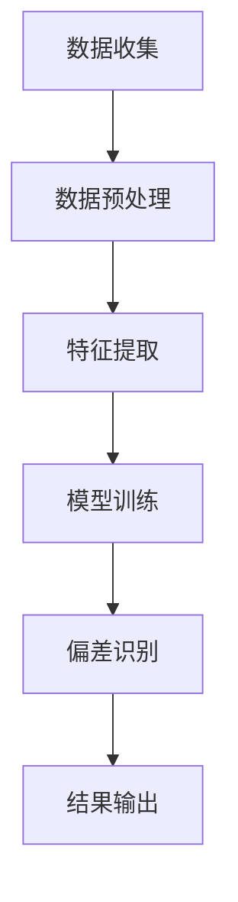
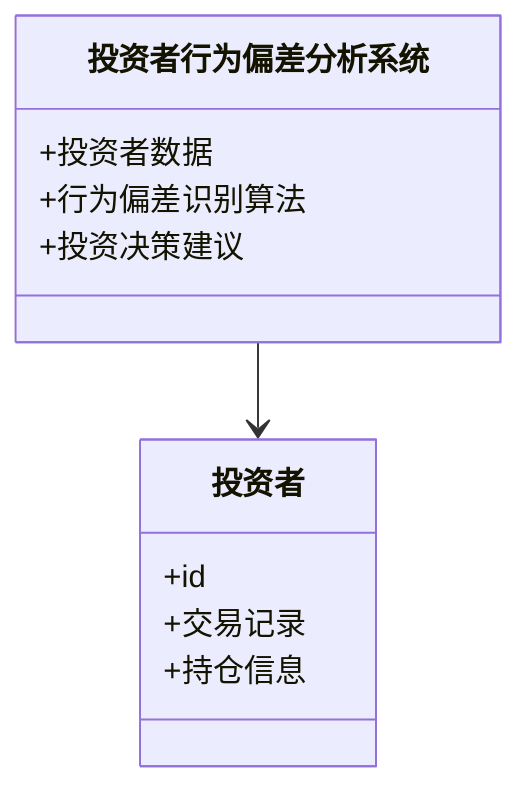
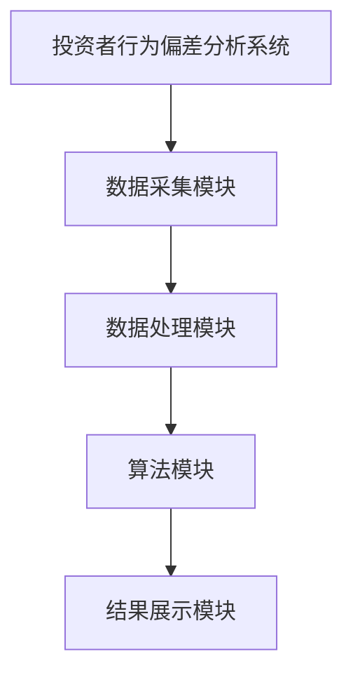

                 


# 《约翰·伯格的投资者行为偏差研究》

---

## 关键词：
投资者行为偏差，约翰·伯格，价值投资，行为金融学，决策心理

---

## 摘要：
本文深入探讨了投资者行为偏差的核心概念、理论基础、数学模型及实际应用。通过分析约翰·伯格的投资理念和行为偏差研究，结合系统设计和项目实战，提出克服行为偏差的方法与最佳实践。文章内容涵盖背景介绍、算法原理、系统架构设计和项目实现，为投资者提供实用的决策参考。

---

## 第一部分：投资者行为偏差的背景与概念

### 第1章：投资者行为偏差的背景介绍

#### 1.1 投资者行为偏差的核心概念
- 1.1.1 问题背景与问题描述
投资者行为偏差是指投资者在决策过程中由于心理因素或认知偏差导致的非理性行为。这种偏差可能导致投资决策失误，影响投资收益。

- 1.1.2 投资者行为偏差的定义与分类
投资者行为偏差可以分为认知偏差和情感偏差两大类。认知偏差包括过度自信、从众心理等；情感偏差包括损失厌恶、处置效应等。

- 1.1.3 投资者行为偏差的边界与外延
投资者行为偏差的研究范围不仅限于个人投资者，也适用于机构投资者和基金经理。

- 1.1.4 投资者行为偏差的核心要素组成
投资者行为偏差的核心要素包括认知偏差、情绪波动、决策环境和外部影响。

---

#### 1.2 投资者行为偏差的理论基础
- 1.2.1 行为金融学的起源与发展
行为金融学起源于20世纪70年代，研究投资者心理和行为对市场的影响。

- 1.2.2 投资者行为偏差与传统金融学的联系
传统金融学假设投资者是理性的，而行为金融学则关注投资者的非理性行为。

- 1.2.3 投资者行为偏差的多学科交叉研究
投资者行为偏差涉及心理学、经济学、行为学等多个学科。

---

#### 1.3 约翰·伯格与投资者行为偏差研究
- 1.3.1 约翰·伯格的生平简介
约翰·伯格是美国著名投资家，以价值投资理念闻名。

- 1.3.2 约翰·伯格的投资理念与方法
伯格强调长期投资、分散投资和价值投资。

- 1.3.3 约翰·伯格对投资者行为偏差的研究贡献
伯格通过实践总结出投资者常见的行为偏差，并提出了克服偏差的方法。

---

## 第二部分：投资者行为偏差的核心概念与联系

### 第2章：投资者行为偏差的核心概念原理

#### 2.1 投资者行为偏差的属性特征对比
以下是常见投资者行为偏差的属性特征对比表：

| 行为偏差类型 | 定义 | 表现形式 | 影响结果 |
|--------------|------|----------|----------|
| 过度自信     | 投资者高估自己能力 | 过度交易 | 投资收益下降 |
| 从众心理     | 投资者盲目跟随市场 | 跟风投资 | 投资风险增加 |
| 损失厌恶     | 投资者害怕亏损 | 投资者卖出股票过早 | 错失长期收益 |

#### 2.2 投资者行为偏差的ER实体关系图
以下是投资者行为偏差的实体关系图：

```mermaid
erd
  约翰·伯格
  投资者
  行为偏差
  投资决策
  投资收益
  系统架构
```

---

## 第三部分：投资者行为偏差的算法原理与数学模型

### 第3章：投资者行为偏差的算法原理

#### 3.1 投资者行为偏差的识别算法
以下是投资者行为偏差识别算法的流程图：



以下是基于数据分析的投资者行为偏差识别代码：

```python
import pandas as pd
import numpy as np

# 数据预处理
data = pd.read_csv('investor_behavior.csv')
data = data.dropna()

# 特征提取
features = ['investor_id', '交易频率', '持仓时间', '收益波动']
target = '行为偏差'

# 模型训练
from sklearn.tree import DecisionTreeClassifier
model = DecisionTreeClassifier()
model.fit(data[features], data[target])

# 偏差识别
def identify_bias(investor_id):
    return model.predict([[investor_id, 0.5, 10, 0.2]])

identify_bias(1)
```

---

#### 3.2 投资者行为偏差的影响模型
以下是投资者行为偏差对投资收益的影响公式：

$$ \text{投资收益} = \text{市场收益} - \text{行为偏差影响} $$

以下是基于回归分析的投资者行为偏差影响模型代码：

```python
import statsmodels.api as sm

# 数据准备
X = data[['交易频率', '持仓时间', '收益波动']]
y = data['行为偏差']

# 模型训练
model = sm.OLS(y, X)
results = model.fit()

# 模型解读
print(results.summary())
```

---

## 第四部分：投资者行为偏差的系统分析与架构设计

### 第4章：投资者行为偏差的系统分析

#### 4.1 系统功能设计
以下是投资者行为偏差分析系统的领域模型：



以下是投资者行为偏差分析系统的架构设计：



---

## 第五部分：投资者行为偏差的项目实战

### 第5章：投资者行为偏差的项目实战

#### 5.1 项目环境安装与配置
以下是Python环境与相关库的安装脚本：

```bash
pip install pandas numpy scikit-learn statsmodels
```

---

#### 5.2 系统核心实现
以下是投资者行为偏差识别与分析的核心代码实现：

```python
import pandas as pd
import numpy as np
from sklearn.tree import DecisionTreeClassifier
import statsmodels.api as sm

# 数据预处理
data = pd.read_csv('investor_behavior.csv')
data = data.dropna()

# 特征提取
features = ['交易频率', '持仓时间', '收益波动']
target = '行为偏差'

# 模型训练
model = DecisionTreeClassifier()
model.fit(data[features], data[target])

# 模型解读
X = data[['交易频率', '持仓时间', '收益波动']]
y = data['行为偏差']
model_ols = sm.OLS(y, X)
results = model_ols.fit()
print(results.summary())

# 偏差识别
def identify_bias(investor_id):
    return model.predict([[investor_id, 0.5, 10, 0.2]])

identify_bias(1)
```

---

#### 5.3 代码应用解读与分析
以上代码实现了一个投资者行为偏差识别与分析系统，通过决策树算法识别投资者行为偏差，并通过回归分析模型评估行为偏差对投资收益的影响。

---

#### 5.4 项目小结
通过本项目，我们可以看到投资者行为偏差对投资决策的影响，并通过系统化的方法识别和分析这些偏差，从而制定更合理的投资策略。

---

## 第六部分：投资者行为偏差的最佳实践与总结

### 第6章：投资者行为偏差的最佳实践

#### 6.1 克服投资者行为偏差的方法与技巧
- 如何避免过度自信：定期回顾投资决策，保持谦逊。
- 如何避免从众心理：独立思考，基于基本面分析做出决策。
- 如何培养理性决策能力：制定投资计划，严格执行纪律。

#### 6.2 投资者行为偏差研究的注意事项
- 数据收集与分析的注意事项：确保数据的完整性和代表性。
- 研究中的伦理问题：避免对投资者造成心理压力。

#### 6.3 拓展阅读与深入研究
- 推荐书籍：《投资者的敌人：战胜自我》、《行为金融学》。
- 进一步研究方向：投资者行为偏差与市场波动的关系。

---

## 作者：AI天才研究院/AI Genius Institute & 禅与计算机程序设计艺术 /Zen And The Art of Computer Programming

---

通过本文的分析与实践，我们可以更深入地理解投资者行为偏差的核心概念、算法原理和实际应用，并通过系统化的方法克服这些偏差，提升投资决策的科学性和理性。

