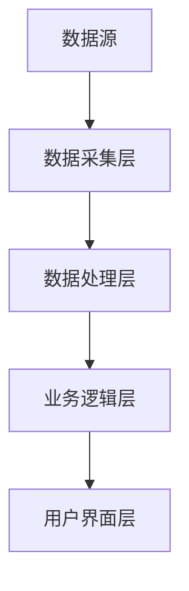

                 

# 约翰·伯格的投资者行为学观点

> 关键词：投资者行为学、约翰·伯格、价值投资、安全边际、市场波动

> 摘要：本文从投资者行为学的视角，深入分析了约翰·伯格的核心投资理念，结合其对市场波动、安全边际及长期投资策略的见解，探讨了其理论在现代投资实践中的应用价值。通过系统化的分析与架构设计，本文为投资者提供了基于伯格观点的实践指南。

---

## 第一章：投资者行为学概述

### 1.1 投资者行为学的定义与研究范围

投资者行为学是一门研究投资者心理、决策过程及其与市场交互关系的学科。其研究范围涵盖投资者的决策模式、认知偏差、情绪波动以及这些因素如何影响市场行为。

- **定义**：投资者行为学通过分析投资者的心理和行为模式，揭示其在金融市场中的决策规律。
- **研究范围**：包括投资者的决策过程、认知偏差、情绪波动以及这些因素如何影响市场价格波动和投资策略。

### 1.2 投资者行为学的重要性和应用价值

投资者行为学在金融领域具有重要意义，它不仅帮助投资者理解自身的决策模式，还能帮助金融机构设计更有效的投资工具和服务。

- **重要性**：投资者行为学为理解市场波动提供了心理层面的解释，帮助投资者避免情绪化决策。
- **应用价值**：通过分析投资者行为，可以优化投资策略，提高投资组合的稳定性。

---

## 第二章：约翰·伯格的投资者行为学理论

### 2.1 约翰·伯格的生平与投资理念

约翰·伯格是价值投资的倡导者，强调长期投资和安全边际的重要性。

- **生平简介**：伯格是指数基金之父，其投资理念深受格雷厄姆的影响。
- **投资哲学**：伯格认为投资的本质是寻找内在价值高于市场价格的企业。

### 2.2 伯格的投资者行为学理论框架

伯格的理论框架强调安全边际和市场估值的重要性。

- **安全边际**：通过比较市场价格与内在价值，确保投资的安全性。
- **市场估值**：通过分析市盈率、市净率等指标，判断市场是否被高估或低估。

---

## 第三章：投资者行为学的核心概念

### 3.1 投资者心理与行为的分析

投资者心理是行为学研究的核心，认知偏差和情绪波动是影响决策的主要因素。

- **认知偏差**：如过度自信、从众心理等，会导致非理性的投资决策。
- **情绪波动**：市场波动常常引发投资者的恐慌或贪婪情绪。

### 3.2 伯格投资模型的核心要素

伯格模型的核心要素包括安全边际、市场估值和投资组合优化。

- **安全边际**：通过计算市场价格与内在价值的差异，确定投资的安全性。
- **市场估值**：通过分析市场指标，判断市场的整体估值水平。

---

## 第四章：投资者行为学的算法原理与数学模型

### 4.1 投资者行为预测的算法模型

通过分析历史数据，可以建立投资者行为预测的数学模型。

- **数学模型**：利用回归分析等方法，预测投资者的决策模式。
- **算法实现**：通过机器学习算法，预测市场波动和投资者行为。

### 4.2 伯格投资模型的数学公式

伯格模型的数学公式包括安全边际计算和市场估值分析。

- **安全边际公式**：$ \text{安全边际} = \text{内在价值} - \text{市场价格} $
- **市场估值公式**：$ \text{市盈率} = \frac{\text{股价}}{\text{每股收益}} $

---

## 第五章：系统分析与架构设计方案

### 5.1 投资者行为分析系统的功能设计

- **系统功能模块**：包括数据采集、行为分析、策略优化等功能模块。
- **系统架构设计**：采用分层架构，包括数据层、业务逻辑层和用户界面层。

### 5.2 系统架构图

---

## 总结

约翰·伯格的投资者行为学观点为我们提供了深刻的启示，强调了长期投资和安全边际的重要性。通过系统化的分析和架构设计，我们可以更好地理解和应用这些理论，优化投资决策。

---

**作者：AI天才研究院**  
*参考文献：*  
1. 《约翰·伯格的投资哲学》  
2. 《投资者行为学的数学模型与算法分析》

