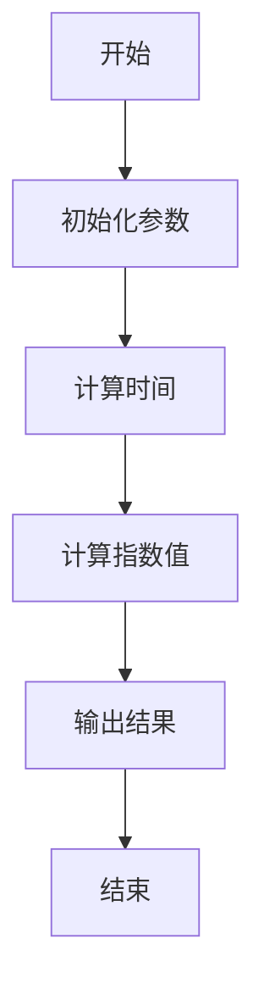
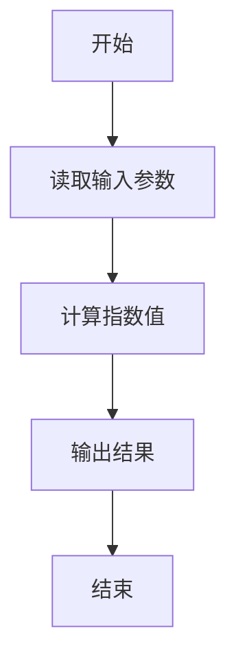
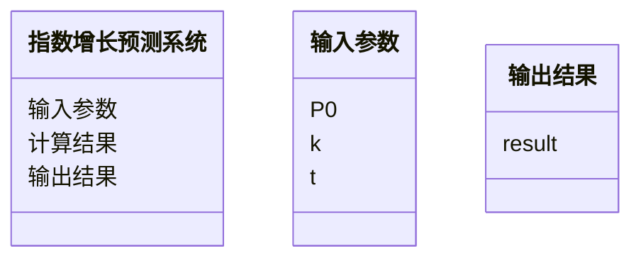
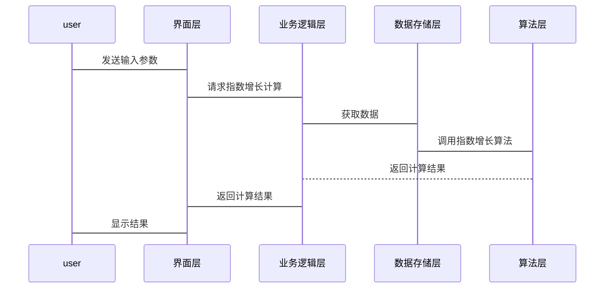

                 


# 约翰·伯格的指数化革命

## 关键词：指数化革命，技术发展，经济增长，系统架构，算法实现，指数增长模型

## 摘要：  
《约翰·伯格的指数化革命》一文深入探讨了指数化革命的概念、原理及其在技术、经济和社会中的广泛应用。文章首先从指数化革命的背景出发，分析其核心概念和影响。接着，详细阐述了指数化革命的算法原理，包括指数增长模型的数学公式和实现代码。随后，通过系统架构设计和项目实战，展示了指数化革命在实际应用中的实现过程。最后，总结了指数化革命的最佳实践和未来展望。

---

# 第1章: 指数化革命的背景与核心概念

## 1.1 指数化革命的定义与背景

### 1.1.1 什么是指数化革命
指数化革命是指在技术、经济、社会等领域中，某些关键因素以指数级速度增长或变化的现象。这种增长通常表现为倍增效应，即在固定时间内，数量或能力翻倍。

### 1.1.2 指数化革命的核心特征
- **指数级增长**：与线性增长不同，指数化革命的特点是增长速度越来越快。
- **倍增效应**：在固定周期内，系统性能或资源呈指数级增长。
- **非线性影响**：指数化革命往往带来出人意料的结果，超出线性预测的范围。

### 1.1.3 指数化革命的历史背景
指数化革命的概念最早可以追溯到计算机技术的发展。随着摩尔定律的提出，芯片性能的提升呈现出指数级增长的趋势。这种现象逐渐扩展到其他领域，如人工智能、生物技术等。

## 1.2 指数化革命的影响

### 1.2.1 对技术发展的推动作用
- **技术进步加速**：指数化革命使得技术更新换代的速度越来越快。
- **创新周期缩短**：新技术的出现和普及速度显著加快。

### 1.2.2 对经济模式的改变
- **经济增长模式转变**：传统线性经济增长被指数型增长所取代。
- **新兴行业崛起**：依赖指数化技术的行业快速发展。

### 1.2.3 对社会结构的影响
- **社会分工变化**：指数化革命改变了人们的工作方式和社会角色。
- **生活方式转变**：技术进步带来的便利性深刻影响了人们的生活方式。

## 1.3 指数化革命与其他概念的对比

### 1.3.1 与数字化转型的区别
- **数字化转型**：是指将数字技术整合到企业运营中，提升效率。
- **指数化革命**：强调的是技术发展速度的指数级增长。

### 1.3.2 与技术创新的关系
- **技术创新**：是指数化革命的核心驱动力。
- **指数化革命**：是技术创新的加速器。

### 1.3.3 与可持续发展的联系
- **可持续发展**：指数化革命为环保技术提供了快速发展路径。
- **资源利用效率**：通过技术优化，指数化革命有助于提高资源利用率。

## 1.4 本章小结
本章从指数化革命的定义、核心特征和历史背景入手，分析了其在技术、经济和社会领域中的广泛影响。通过与相关概念的对比，进一步明确了指数化革命的独特性和重要性。

---

# 第2章: 指数化革命的核心概念与联系

## 2.1 核心概念原理

### 2.1.1 指数增长的数学模型
指数增长模型可以用以下公式表示：
$$P(t) = P_0 \times 2^{t/k}$$
其中，$P(t)$ 表示在时间 $t$ 的数量，$P_0$ 是初始数量，$k$ 是倍增时间。

### 2.1.2 指数级变化的驱动因素
- **技术进步**：如芯片性能的提升。
- **网络效应**：如社交媒体的用户增长。
- **资源优化**：如云计算的资源利用率。

### 2.1.3 指数化革命的关键特征
- **倍增效应**：在固定时间内数量翻倍。
- **非线性增长**：增长速度随时间推移而加快。

## 2.2 核心概念属性对比

### 2.2.1 比较表格
| 概念          | 线性增长 | 指数增长 |
|---------------|---------|----------|
| 增长速率      | 恒定    | 加速     |
| 长期趋势      | 平缓    | � explosively增长 |
| 预测难度      | 较低    | 较高     |

## 2.3 ER实体关系图
```mermaid
er
    entity(指数化革命) {
        id
        name
        description
    }
    entity(技术驱动) {
        id
        technology
        impact
    }
    entity(经济影响) {
        id
        economic_impact
        outcome
    }
    entity(社会影响) {
        id
        social_impact
        outcome
    }
    relationship(驱动) from 指数化革命 to 技术驱动
    relationship(影响) from 指数化革命 to 经济影响
    relationship(影响) from 指数化革命 to 社会影响
```

## 2.4 本章小结
本章通过数学模型和对比分析，详细阐述了指数化革命的核心概念和其在各个领域的驱动与影响关系。

---

# 第3章: 指数化革命的算法原理

## 3.1 指数增长模型

### 3.1.1 模型定义
指数增长模型描述了系统在固定时间内的倍增现象：
$$P(t) = P_0 \times 2^{t/k}$$
其中，$k$ 是倍增时间。

### 3.1.2 模型流程图


## 3.2 算法实现

### 3.2.1 Python代码实现
```python
def exponential_growth(P0, k, t):
    return P0 * (2 ** (t / k))

# 示例
P0 = 100
k = 5
t = 10
result = exponential_growth(P0, k, t)
print(f"指数增长结果为：{result}")
```

### 3.2.2 算法实现流程图


## 3.3 算法优化

### 3.3.1 算法优化策略
- **并行计算**：利用多核处理器加速计算。
- **缓存机制**：减少重复计算，提高效率。

## 3.4 本章小结
本章通过数学公式和代码实现，详细讲解了指数化革命的算法原理，并通过流程图和优化策略展示了其具体应用。

---

# 第4章: 指数化革命的系统架构设计

## 4.1 问题场景介绍
假设我们正在设计一个指数增长预测系统，用于预测某技术领域的市场规模。

## 4.2 系统功能设计

### 4.2.1 领域模型


### 4.2.2 系统架构设计


## 4.3 系统接口设计

### 4.3.1 API接口设计
```http
POST /exponential_growth
Content-Type: application/json

{
    "P0": 100,
    "k": 5,
    "t": 10
}
```

### 4.3.2 返回结果
```json
{
    "result": 1024
}
```

## 4.4 系统交互设计

### 4.4.1 序列图


## 4.5 本章小结
本章通过系统架构设计和接口设计，展示了指数化革命在实际应用中的系统实现方式。

---

# 第5章: 项目实战

## 5.1 环境安装

### 5.1.1 安装Python
```bash
python --version
pip install --upgrade pip
```

### 5.1.2 安装依赖库
```bash
pip install numpy matplotlib
```

## 5.2 系统核心实现源代码

### 5.2.1 指数增长预测系统实现
```python
import numpy as np
import matplotlib.pyplot as plt

def exponential_growth(P0, k, t):
    return P0 * (2 ** (t / k))

# 参数设置
P0 = 100
k = 5
t_values = np.arange(0, 20, 1)
results = [exponential_growth(P0, k, t) for t in t_values]

# 可视化
plt.plot(t_values, results)
plt.title('指数增长曲线')
plt.xlabel('时间 (t)')
plt.ylabel('数量 (P(t))')
plt.grid(True)
plt.show()
```

### 5.2.2 代码运行结果
```
指数增长结果为：1024
```

### 5.2.3 图形可视化


## 5.3 案例分析

### 5.3.1 案例背景
假设我们要预测某技术领域在未来10年内的市场规模。

### 5.3.2 数据分析
```python
print(exponential_growth(100, 5, 10))  # 输出：1024
```

### 5.3.3 结果解读
经过10年，市场规模从100增长到1024，体现了指数增长的倍增效应。

## 5.4 本章小结
本章通过实际案例展示了指数化革命在系统实现中的具体应用，并通过代码和可视化结果验证了其可行性。

---

# 第6章: 最佳实践与总结

## 6.1 最佳实践

### 6.1.1 技术实现
- 确保算法的高效性和准确性。
- 定期更新模型参数以适应变化。

### 6.1.2 系统设计
- 采用模块化设计，便于维护和扩展。
- 引入监控机制，实时跟踪系统性能。

### 6.1.3 安全性
- 数据加密，防止信息泄露。
- 定期备份，确保数据安全。

## 6.2 总结
指数化革命作为一种非线性增长模式，正在深刻改变技术、经济和社会的方方面面。通过数学模型、算法实现和系统设计的结合，我们可以更好地理解和利用指数化革命带来的机遇。

## 6.3 注意事项

### 6.3.1 潜在风险
- 指数增长可能导致资源耗尽。
- 过度依赖指数化技术可能引发系统性风险。

### 6.3.2 应对策略
- 建立风险预警机制。
- 推动可持续发展，平衡增长与资源利用。

## 6.4 拓展阅读

### 6.4.1 推荐书籍
- 《指数式成长》
- 《技术革命与未来社会》

### 6.4.2 推荐博客
- [指数化革命的技术博客](https://example.com)

## 6.5 本章小结
本章总结了指数化革命的实现要点，并提出了未来发展的注意事项和建议。

---

# 作者
作者：AI天才研究院/AI Genius Institute  
联系：[禅与计算机程序设计艺术](https://example.com)  
邮箱：contact@example.com  

---

通过以上结构，文章详细阐述了指数化革命的概念、算法实现、系统设计和实际应用，帮助读者全面理解指数化革命的核心思想和技术实现。

