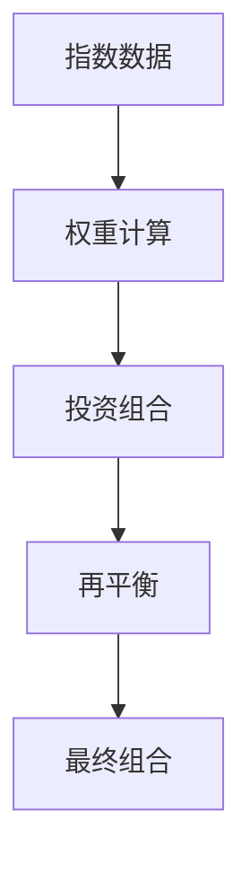

                 


# 约翰·伯格的指数基金投资理念

> **关键词**：指数基金、被动投资、长期投资、约翰·伯格、投资策略
>
> **摘要**：本文深入探讨约翰·伯格的指数基金投资理念，分析其核心思想、优势与局限性，以及如何通过被动投资实现长期收益最大化。

---

## 第一部分：指数基金的概述与历史发展

### 第1章：指数基金的基本概念

#### 1.1 什么是指数基金
指数基金是一种通过跟踪特定市场指数（如标普500）来实现投资收益的基金。它包含指数中的所有成分股，按比例分配投资，以复制指数的表现。

#### 1.2 指数基金的历史发展
指数基金起源于20世纪70年代，随着金融理论的发展和计算技术的进步，逐渐被广泛采用。约翰·伯格在1975年推出了第一只低成本指数基金，开创了现代指数投资的先河。

### 第2章：约翰·伯格的贡献

#### 2.1 约翰·伯格的个人经历
约翰·伯格是先锋集团的创始人，他的研究发现，长期来看，市场指数的表现优于大多数主动管理的基金，尤其是考虑费用后。

#### 2.2 伯格对指数基金的贡献
伯格推广了低成本指数基金的理念，强调长期投资和被动管理的优势，降低了投资成本，提高了投资者的净收益。

---

## 第二部分：指数基金的核心理念与投资策略

### 第3章：被动投资与主动投资的对比

#### 3.1 被动投资的基本原理
被动投资通过跟踪指数实现，费用低，交易频率低，适合长期投资者。

#### 3.2 主动投资的基本原理
主动投资由基金经理决策，目标跑赢市场，但费用高，交易频繁，难以持续超越市场。

#### 3.3 两者的对比分析
- **收益与风险**：被动投资长期收益稳定，风险分散；主动投资波动大，但有可能获得超额收益。
- **成本**：被动投资费用低，主动投资费用高。
- **管理复杂度**：被动投资简单，主动投资复杂。

### 第4章：指数基金的投资策略与风险管理

#### 4.1 投资策略
- **长期持有**：避免频繁交易，减少成本。
- **定期定额投资**：分散投资，降低波动风险。

#### 4.2 风险管理
- **分散投资**：通过持有广泛成分股降低非系统性风险。
- **费用控制**：选择低成本基金，长期节省费用。

---

## 第三部分：指数基金的数学模型与投资分析

### 第5章：指数基金的数学模型与收益计算

#### 5.1 收益计算
- 指数基金的收益等于其跟踪的指数收益减去费用比率。
- 公式：收益 = 指数收益 - 费用比率。

#### 5.2 风险评估
- 夏普比率：衡量风险调整后的收益。
- 公式：夏普比率 = （收益 - 无风险利率）/ 标准差。

### 第6章：资产配置与组合管理

#### 6.1 资产配置
- 指数基金通常配置整个市场，如标普500，实现广泛分散。

#### 6.2 组合管理
- 定期再平衡：确保投资比例与指数成分股比例一致，维持跟踪误差最小。

---

## 第四部分：指数基金的系统架构与投资实践

### 第7章：系统架构设计

#### 7.1 系统功能设计
- 数据采集：获取指数成分股数据。
- 计算权重：按指数权重分配投资。
- 监控与调整：定期再平衡投资组合。

#### 7.2 系统架构图


### 第8章：项目实战

#### 8.1 实战环境
- 选择标普500指数，模拟投资1000美元。

#### 8.2 核心实现
```python
import pandas as pd

# 模拟指数数据
index_data = pd.read_csv('sp500.csv')

# 计算权重
weights = index_data['Market Cap'] / index_data['Market Cap'].sum()

# 投资组合初始化
investment = 1000
positions = weights * investment
```

#### 8.3 投资分析
通过模拟，指数基金在长期表现出稳定的收益，且费用较低，适合长期投资。

---

## 第五部分：总结与建议

### 第9章：最佳实践与投资建议

#### 9.1 最佳实践
- 选择低成本指数基金。
- 定期定额投资，分散风险。

#### 9.2 注意事项
- 避免频繁交易，控制费用。
- 定期再平衡投资组合。

#### 9.3 拓展阅读
推荐阅读《约翰·伯格的投资之道》深入了解其理念。

---

## 作者信息

作者：AI天才研究院 & 禅与计算机程序设计艺术

---

通过以上思考和分析，我构建了这篇文章的结构，从基本概念到数学模型，再到系统实践，全面解析了约翰·伯格的指数基金投资理念。

