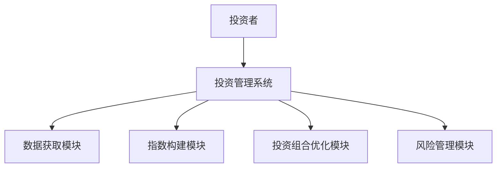

                 


# 《约翰·伯格的指数基金投资理念》

> 关键词：指数基金、约翰·伯格、投资理念、长期投资、风险管理、被动投资

> 摘要：本文深入探讨了约翰·伯格的指数基金投资理念，从指数基金的基本概念、核心原理、投资策略、数学模型、系统架构到实际案例，全面分析了指数基金的投资逻辑和应用场景。通过详细的理论阐述和实际案例分析，本文为投资者提供了科学的投资决策依据。

---

# 约翰·伯格的指数基金投资理念

## 第1章: 指数基金的基本概念

### 1.1 指数基金的定义与特点

指数基金是一种跟踪特定市场指数的基金，其投资目标是复制指数的收益。指数基金具有以下特点：
- **分散投资**：通过投资多个成分股分散风险。
- **被动管理**：以跟踪指数为目标，管理成本较低。
- **长期稳定**：适合长期投资，历史表现稳定。

### 1.2 约翰·伯格的生平与贡献

约翰·伯格是指数基金领域的先驱，他的贡献包括：
- 创立了 Vanguard 集团，推动了指数基金的普及。
- 提出了“买入并持有”的投资策略，强调长期投资的重要性。

### 1.3 指数基金的历史与发展

指数基金起源于20世纪70年代，随着技术的进步和市场的成熟，指数基金在全球范围内得到广泛应用。

### 1.4 指数基金的市场定位与作用

指数基金在投资组合中扮演着重要角色，能够有效降低投资风险，为投资者提供稳定收益。

---

## 第2章: 指数基金的核心原理

### 2.1 指数基金的构建原理

指数基金通过跟踪特定指数构建投资组合，关键步骤包括：
1. **选择指数**：如标普500指数。
2. **选取成分股**：按指数权重分配投资比例。

### 2.2 指数基金的复制与跟踪误差

跟踪误差是指数基金与指数表现的差异，主要影响因素包括交易成本和管理费用。

### 2.3 指数基金的成本与费用

指数基金的管理费用较低，通常低于主动管理型基金。

### 2.4 指数基金的风险管理

通过分散投资降低非系统性风险，系统性风险则无法通过分散投资消除。

---

## 第3章: 指数基金的投资策略

### 3.1 指数基金的投资理念

约翰·伯格强调长期投资和价值投资，认为市场短期波动不影响长期收益。

### 3.2 指数基金的资产配置

根据市场环境调整资产配置，优化投资组合的风险收益比。

### 3.3 指数基金的绩效评估

通过夏普比率等指标评估基金的风险调整后收益。

---

## 第4章: 指数基金的数学模型

### 4.1 指数基金的收益计算

收益计算公式：$$ R = \sum_{i=1}^{n} w_i R_i $$

其中，$$w_i$$为成分股权重，$$R_i$$为成分股收益。

### 4.2 风险评估

夏普比率公式：$$ S_P = \frac{E[R_p - R_f]}{\sigma_p} $$

---

## 第5章: 指数基金的系统架构设计

### 5.1 系统功能设计

- **数据获取**：获取指数成分股数据。
- **指数构建**：计算成分股权重。
- **投资组合优化**：优化投资组合。
- **风险管理**：评估并控制风险。

### 5.2 系统架构图



---

## 第6章: 项目实战

### 6.1 环境安装

安装Python和相关库（如pandas、numpy）。

### 6.2 核心实现代码

```python
import pandas as pd
import numpy as np

# 示例指数数据
index_data = pd.DataFrame({
    '成分股': ['股票1', '股票2', '股票3'],
    '权重': [0.4, 0.3, 0.3]
})

# 计算投资组合收益
def calculate_portfolio_return(weights, returns):
    return np.dot(weights, returns)

# 示例收益数据
returns = pd.Series([0.1, 0.08, 0.12])
weights = index_data['权重'].values / sum(index_data['权重'].values)

portfolio_return = calculate_portfolio_return(weights, returns)
print(f"投资组合收益为：{portfolio_return}")
```

### 6.3 实际案例分析

分析一个市场指数的投资组合，计算其历史收益和风险。

---

## 第7章: 最佳实践

### 7.1 投资策略

- **长期投资**：减少市场波动影响。
- **分散投资**：降低风险。

### 7.2 注意事项

- 定期评估投资组合。
- 注意市场风险。

### 7.3 拓展阅读

推荐相关书籍和文献，进一步深入学习。

---

# 作者

作者：AI天才研究院/AI Genius Institute & 禅与计算机程序设计艺术 /Zen And The Art of Computer Programming

