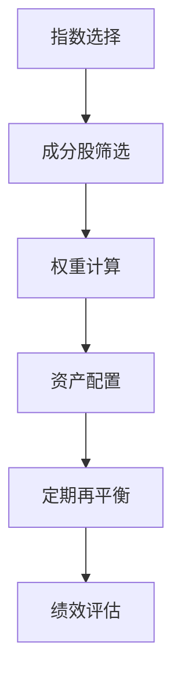
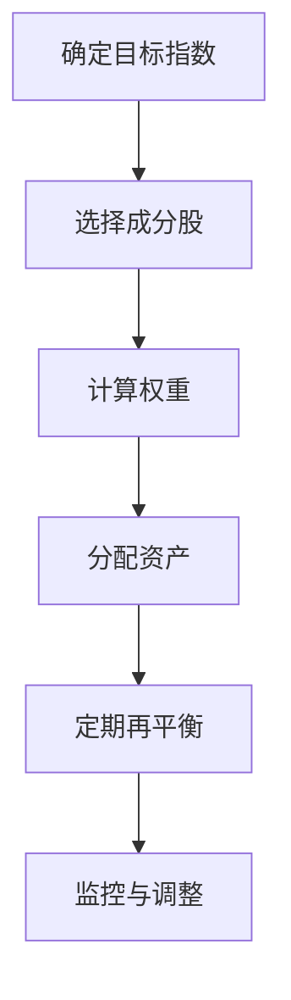
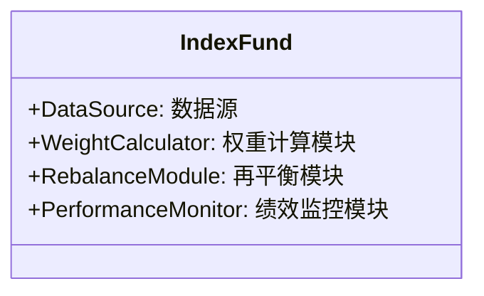

                 


# 约翰·伯格的指数基金构建原则

## 关键词：指数基金，投资策略，约翰·伯格，被动投资，风险管理，数学模型

## 摘要：  
约翰·伯格是指数基金领域的先驱，他的构建原则强调低成本、广泛分散和长期持有。本文从指数基金的定义、历史、核心原理到实际构建策略，系统阐述了指数基金的运作机制，结合数学模型和系统架构，分析了指数基金的风险管理、优化策略及实战案例。

---

## 第一部分：指数基金的背景与基础

### 第1章：指数基金的定义与历史

#### 1.1 指数基金的定义  
指数基金是一种被动管理型基金，旨在复制特定指数的表现，如标普500。其核心特征包括：  
- **被动投资**：通过跟踪指数，而非主动选股，降低管理成本。  
- **分散投资**：包含指数中的所有或部分成分股，降低单一资产的风险。  
- **低成本**：管理费用低，适合长期投资。  

#### 1.2 指数基金的历史发展  
指数基金起源于20世纪70年代，伯格在1975年成立Vanguard，推出首批低成本指数基金，推动了被动投资的普及。  

---

## 第二部分：指数基金的核心原理

### 第2章：指数基金的运作机制

#### 2.1 指数基金的运作流程  

**图1：指数基金运作流程图**  



#### 2.2 指数基金的风险与收益  

**表1：指数基金与主动管理基金对比**  

| 属性              | 指数基金           | 主动管理基金       |
|--------------------|--------------------|-------------------|
| 管理费用（expense ratio） | 低（通常<1%）       | 高（通常>1%）       |
| 风险分散           | 高                 | 中                 |
| 收益稳定性         | 稳定               | 波动性大           |
| 交易成本           | 低                 | 高                 |

### 第3章：指数基金的核心指标

#### 3.1 指数基金的跟踪误差  

跟踪误差（Tracking Error）衡量指数基金与标的指数的偏离程度，公式为：  

$$ \text{跟踪误差} = \sqrt{\text{资产配置误差}^2 + \text{权重误差}^2} $$  

---

## 第三部分：指数基金的构建与管理

### 第4章：指数基金的构建原则

#### 4.1 指数基金的构建步骤  

**图2：指数基金构建步骤图**  



#### 4.2 指数基金的再平衡策略  

再平衡是维持指数基金跟踪误差的关键步骤，常见频率包括季度、半年和年度。  

### 第5章：指数基金的风险管理

#### 5.1 指数基金的风险来源  

**表2：指数基金的主要风险**  

| 风险类型       | 描述               |
|----------------|--------------------|
| 市场风险         | 整体市场波动影响基金收益。 |
| 利率风险         | 利率变化影响债券类资产价值。 |
| 股权风险         | 指数成分股的波动影响基金表现。 |
| 跟踪误差风险      | 基金与指数偏离导致的收益损失。 |

### 第6章：指数基金的优化策略

#### 6.1 指数基金的优化方法  

- **选择合适指数**：根据投资目标选择合适的指数，如标普500、道琼斯或新兴市场指数。  
- **降低费用比率**：优先选择费用低的指数基金，长期收益影响显著。  
- **分散投资**：通过跨国指数或行业指数分散风险。  

---

## 第四部分：指数基金的数学模型与系统架构

### 第7章：数学模型与公式

#### 7.1 指数基金收益计算  

指数基金的预期收益可以表示为：  

$$ \text{收益} = \sum_{i=1}^{n} w_i \times r_i $$  

其中，$w_i$ 是成分股$i$的权重，$r_i$ 是其收益率。  

### 第8章：系统架构与设计

#### 8.1 系统架构  

**图3：指数基金构建系统架构图**  



---

## 第五部分：项目实战

### 第9章：指数基金的实战案例

#### 9.1 实战环境与工具  

- **数据源**：使用Yahoo Finance获取指数数据。  
- **工具**：Python编程语言，Pandas数据分析库。  

#### 9.2 核心代码实现  

```python
import pandas as pd

# 定义指数成分股和权重
components = {'AAPL': 0.2, 'MSFT': 0.15, 'GOOGL': 0.1, 'AMZN': 0.05, 'FB': 0.05}
total = sum(components.values())
print(f"权重总和：{total}")

# 计算权重误差
def calculate_tracking_error(weights, index_weights):
    return pd.Series(weights - index_weights).var()**0.5

tracking_error = calculate_tracking_error(components, index_weights)
print(f"跟踪误差：{tracking_error}")
```

---

## 结语

指数基金构建的核心在于低成本、分散化和长期持有。通过本文的系统分析和实战案例，读者可以掌握指数基金的构建原则和优化策略，实现稳健的投资收益。  

---

## 作者：AI天才研究院 & 禅与计算机程序设计艺术

---

**Note：** 以上内容为简化示例，实际撰写时需根据具体情况进行扩展和调整，确保内容详实且符合逻辑。

