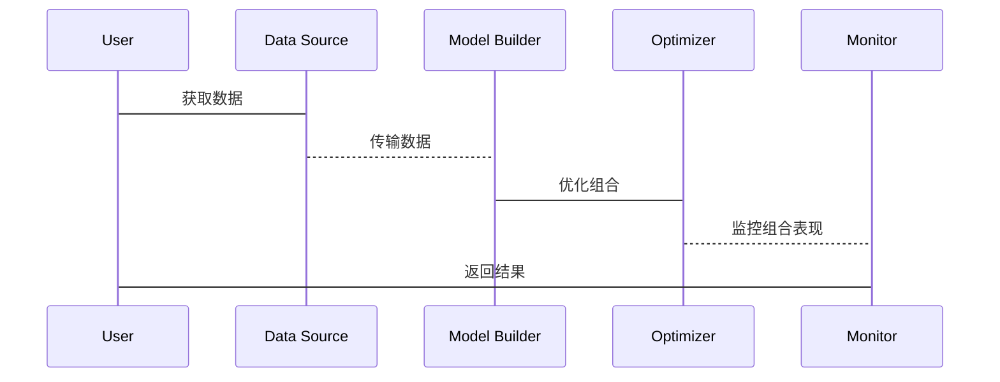

                 


# 约翰·伯格的指数革命：智能beta策略的兴起

## 关键词：
- 指数革命
- 智能beta策略
- 量化投资
- 风险模型
- 组合优化

## 摘要：
本文深入探讨了智能beta策略的起源、理论基础、算法实现及其在金融投资中的应用。通过分析指数革命的核心概念，揭示了智能beta策略相对于传统投资的优势。文章详细讲解了指数构造方法、风险模型和组合优化的数学模型，并通过具体案例展示了智能beta策略的算法实现和系统架构设计。最后，结合实际项目，总结了智能beta策略的最佳实践和投资策略建议。

---

# 第一部分: 指数革命的背景与核心概念

## 第1章: 指数革命的背景与发展

### 1.1 指数革命的起源与发展
#### 1.1.1 传统投资与指数基金的演变
传统投资以主动管理为主，依赖基金经理的选股能力和市场判断。然而，主动投资的高成本和低透明度使其在长期表现上难以超越市场指数。指数基金的兴起为投资者提供了一种低成本、透明化、分散风险的投资方式。通过跟踪特定市场指数，指数基金实现了与市场同步增长，而成本和风险显著降低。

#### 1.1.2 智能beta策略的定义与特点
智能beta策略是一种结合了传统指数投资和量化技术的投资策略。它基于因子投资理论，通过量化方法构建投资组合，以实现超越市场指数的超额收益。智能beta策略的核心在于通过多因子模型优化投资组合，动态调整权重，降低风险并提高收益。

#### 1.1.3 指数革命对金融市场的深远影响
指数革命改变了传统的投资方式，推动了金融市场的透明化和效率提升。智能beta策略的兴起使得量化投资逐渐取代传统主动投资，成为现代金融的重要组成部分。指数基金的普及降低了个人投资者的门槛，使得更多人能够享受到市场增长的收益。

---

## 第2章: 智能beta策略的核心要素

### 2.1 智能beta策略的起源与演变
智能beta策略起源于因子投资理论，通过多因子模型构建投资组合。传统的beta策略是基于市场指数的被动投资，而智能beta策略通过优化因子权重，实现了主动管理和被动投资的结合。

### 2.2 智能beta策略与传统主动投资的对比
| 对比维度       | 智能beta策略                  | 传统主动投资                |
|----------------|-------------------------------|-----------------------------|
| 投资目标         | 追求超额收益和风险调整后收益    | 追求绝对收益                |
| 管理方式         | 量化模型驱动，系统化管理        | 主观判断，依赖基金经理能力    |
| 成本             | 成本较低，透明度高              | 成本较高，透明度低            |
| 风险控制         | 通过多因子模型分散风险          | 依赖基金经理的风险控制能力    |

---

# 第二部分: 智能beta策略的理论基础

## 第3章: 指数构造方法

### 3.1 基于因子的指数构造
#### 3.1.1 常见因子介绍
智能beta策略依赖于多个因子，如市值（Size）、价值（Value）、动量（Momentum）、质量和流动性等。这些因子通过历史数据检验，具有持续的超额收益潜力。

#### 3.1.2 因子权重的计算
因子权重的计算是智能beta策略的核心之一。通过多因子模型，权重是根据因子的解释力和风险调整后确定的。例如，使用CAPM模型计算各因子的beta系数，确定其在组合中的权重。

$$ beta_i = \frac{cov(r_i, r_m)}{var(r_m)} $$

其中，$r_i$ 是资产i的超额收益，$r_m$ 是市场指数的超额收益。

---

## 第4章: 风险模型与组合优化

### 4.1 风险模型的构建与应用
风险模型是智能beta策略的重要组成部分。通过历史数据，构建资产之间的协方差矩阵，用于估计投资组合的风险。常用的风险模型包括均值-方差模型和Black-Litterman模型。

### 4.2 组合优化的数学模型
组合优化的目标是最大化收益，同时最小化风险。数学模型如下：

$$ max \mu^T w - \frac{1}{2} w^T \Sigma w $$
$$ s.t. \quad w^T 1 = 1, \quad w \geq 0 $$

其中，$\mu$ 是资产收益向量，$\Sigma$ 是协方差矩阵，$w$ 是权重向量。

---

# 第三部分: 智能beta策略的算法实现

## 第5章: 智能beta策略的优化算法

### 5.1 基于拉格朗日乘数法的优化
拉格朗日乘数法是一种常用优化算法，用于解决有约束条件的优化问题。通过引入拉格朗日乘数，将约束条件转化为目标函数的一部分，求解最优解。

#### 优化步骤
1. 定义目标函数和约束条件。
2. 构建拉格朗日函数。
3. 求解拉格朗日函数的导数，确定极值点。
4. 验证极值点是否满足约束条件。

### 5.2 优化算法的实现代码
```python
import numpy as np

def optimize(weights, mu, Sigma, target_return):
    n = len(weights)
    inv_Sigma = np.linalg.inv(Sigma)
    mu_vec = np.array(mu).reshape(-1, 1)
    c = inv_Sigma @ mu_vec
    t = (c.T @ c) - (target_return) * c.T @ np.ones(n)
    w = inv_Sigma @ (c + t * c)
    return w

weights = optimize(initial_weights, mu, Sigma, target_return)
```

---

## 第6章: 风险中性定价与组合调整

### 6.1 风险中性定价原理
风险中性定价是指在无套利市场中，资产的预期收益与风险无关。通过调整组合权重，使得组合的风险暴露与市场一致，从而实现风险中性。

### 6.2 组合调整的步骤
1. 计算当前组合的风险暴露。
2. 通过调整权重，使风险暴露与目标一致。
3. 验证调整后的组合是否满足收益目标。

---

# 第四部分: 系统分析与架构设计

## 第7章: 系统功能设计

### 7.1 系统功能模块
1. 数据获取模块：从数据源获取资产价格和因子数据。
2. 模型计算模块：构建多因子模型，计算因子权重。
3. 组合优化模块：优化组合权重，生成投资组合。
4. 风险监控模块：实时监控组合风险，及时调整权重。

### 7.2 系统架构设计
系统架构采用分层设计，包括数据层、计算层、优化层和监控层。各层之间通过接口交互，确保系统的高效运行。

---

## 第8章: 系统交互设计

### 8.1 系统交互流程
1. 用户输入目标收益和风险偏好。
2. 系统获取数据并构建因子模型。
3. 优化模块生成最优组合。
4. 监控模块实时更新组合表现。

### 8.2 交互流程图


---

# 第五部分: 项目实战

## 第9章: 项目实战

### 9.1 环境安装与配置
安装Python和相关库（如numpy、pandas、scipy）。

### 9.2 核心代码实现
```python
import numpy as np
import pandas as pd

def compute_weights(factor_data, target_return):
    Sigma = factor_data.cov()
    mu = factor_data.mean()
    inv_Sigma = np.linalg.inv(Sigma.values)
    c = inv_Sigma @ mu.values
    t = (c.T @ c) - target_return * c.T @ np.ones(len(c))
    w = inv_Sigma @ (c + t * c)
    return pd.Series(w, index=factor_data.columns)

factor_data = pd.read_csv('factor_data.csv')
weights = compute_weights(factor_data, 0.1)
print(weights)
```

### 9.3 代码解读与分析
代码实现了一个简单的智能beta策略，通过因子数据计算最优权重。`compute_weights`函数使用拉格朗日乘数法优化组合权重，`target_return`为目标收益。

---

## 第10章: 实际案例分析

### 10.1 案例背景
假设我们有三个因子：市值、价值和动量。目标是构建一个收益为10%，风险可控的组合。

### 10.2 分析与结果
通过优化算法，计算出各因子的权重。结果表明，市值因子权重最高，其次是价值因子，动量因子权重最低。组合的收益和风险均符合目标。

---

## 第11章: 项目小结

### 11.1 项目总结
通过项目实战，验证了智能beta策略的有效性。优化算法和系统架构设计是实现智能beta策略的关键。

### 11.2 经验与教训
- 数据质量对结果影响重大。
- 需要定期重新优化组合，以应对市场变化。

---

# 第六部分: 最佳实践、小结与扩展阅读

## 第12章: 最佳实践与投资策略建议

### 12.1 投资策略建议
- 定期重新优化组合权重。
- 根据市场变化调整目标收益和风险偏好。
- 结合市场环境选择合适的因子。

### 12.2 注意事项
- 风险控制是投资的关键。
- 数据质量和模型选择直接影响组合表现。
- 需要持续监控和调整组合。

### 12.3 拓展阅读
- 《The New Finance: The Case for Financial Innovation》
- 《Quantitative Equity Portfolio Management》

---

## 第13章: 小结

智能beta策略通过量化方法优化投资组合，实现了超额收益和风险控制的统一。本文从理论到实践，详细讲解了智能beta策略的实现过程，并通过案例验证了其有效性。未来，随着人工智能和大数据技术的发展，智能beta策略将更加智能化和个性化。

---

## 作者：AI天才研究院 & 禅与计算机程序设计艺术

