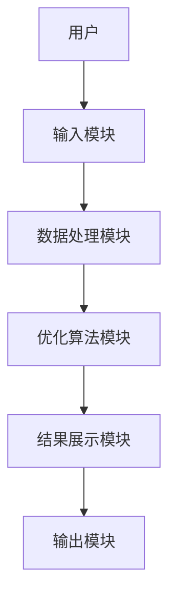

                 


# 约翰·伯格的税收效率投资策略

> **关键词**：税收效率，投资策略，优化算法，数学模型，系统架构，项目实战

> **摘要**：本文系统阐述了约翰·伯格提出的税收效率投资策略，从理论基础、算法原理、数学模型、系统架构到项目实战，详细分析了如何通过优化税收效率提升投资回报。文章结合实际案例，深入探讨了税收效率与投资策略之间的关系，为投资者提供了科学的优化方法。

---

# 第一部分: 税收效率与投资策略的背景介绍

## 第1章: 税收效率与投资策略概述

### 1.1 税收效率的基本概念

#### 1.1.1 税收效率的定义与核心要素

税收效率是指在税收征缴和使用过程中，以最小的行政成本和最低的纳税成本，实现最大的税收收益。其核心要素包括：

1. **税基**：纳税人的收入、财产或行为。
2. **税率**：税法规定的纳税比例。
3. **税制结构**：包括直接税和间接税的比例。
4. **税收征管效率**：税务机关的征收效率和服务质量。

#### 1.1.2 投资策略与税收效率的关系

投资策略是指投资者在一定时期内，通过资产配置和投资组合优化，实现资产增值的策略。税收效率直接影响投资成本和收益，因此两者密切相关。

#### 1.1.3 税收效率在投资中的重要性

税收效率是投资者优化资产配置的重要因素。通过合理规划税务，投资者可以降低税负，提高净收益。

### 1.2 税收与投资的基本原理

#### 1.2.1 税收在投资中的角色

税收是政府财政收入的重要来源，也是影响投资决策的关键因素。合理的税收政策可以促进投资，而过重的税负则会抑制投资。

#### 1.2.2 不同类型税收对投资的影响

1. **企业所得税**：影响企业的盈利能力和投资决策。
2. **个人所得税**：影响个人投资者的可支配收入和投资能力。
3. **资本利得税**：影响资产变现后的税后收益。

#### 1.2.3 税收政策与市场行为的互动

税收政策通过影响企业和个人的经济行为，反过来又会影响税收收入。这种互动关系需要通过税收效率优化来平衡。

### 1.3 税收效率优化的必要性

#### 1.3.1 税收负担对企业投资的影响

过重的税负会增加企业的财务成本，降低投资积极性。通过优化税收效率，可以降低企业的税负，提高投资能力。

#### 1.3.2 税收效率优化的潜在收益

1. **降低税负**：通过合理避税和税收规划，降低整体税负。
2. **提高投资回报**：优化税收结构，提升投资收益。
3. **增强竞争力**：企业税负降低后，可以在市场上更具竞争力。

#### 1.3.3 税收效率与企业竞争力的关系

税收效率是企业竞争力的重要组成部分。高税收效率意味着企业可以在相同利润下缴纳更少的税款，从而有更多的资金用于再投资。

## 1.4 本章小结

本章从税收效率的基本概念出发，探讨了其与投资策略的关系，分析了税收效率在投资中的重要性。通过本章的学习，读者可以理解税收效率是优化投资策略的关键因素。

---

## 第2章: 税收效率与投资策略的核心概念

### 2.1 税收效率的核心要素

#### 2.1.1 税收效率的衡量标准

1. **税负率**：税负占收入的比例。
2. **征收效率**：税务机关征收税款的效率。
3. **合规成本**：企业和个人为合规纳税所付出的成本。

#### 2.1.2 税收政策的复杂性

1. **税种多样性**：增值税、企业所得税、个人所得税等。
2. **税率差异**：不同地区、不同行业税率不同。
3. **税收优惠**：政府为特定行业或地区提供的税收减免。

#### 2.1.3 投资策略的多样性

1. **短期投资**：如股票交易、债券投资。
2. **长期投资**：如房地产投资、企业并购。

### 2.2 税收效率与投资策略的联系

#### 2.2.1 税收效率对投资决策的影响

税收政策直接影响投资的成本和收益。例如，资本利得税的高低会影响投资者的资产变现决策。

#### 2.2.2 投资策略对税收效率的反作用

投资者通过优化资产配置和税务规划，可以间接推动税收政策的优化。例如，合理的税收优惠政策可以吸引更多投资。

#### 2.2.3 税收效率与投资风险的关系

高税收效率可以降低企业的财务风险，但过低的税收效率可能导致政府财政收入不足，进而影响市场的稳定。

### 2.3 税收效率与投资策略的对比分析

#### 2.3.1 不同税收政策下的投资策略对比

| 税收政策 | 投资策略 |
|----------|----------|
| 高税率   | 避税投资 |
| 低税率   | 高风险投资 |

#### 2.3.2 税收效率对投资回报的影响

税收效率的高低直接影响投资的净收益。例如，企业所得税的高低会影响企业的净利润，从而影响股息分配。

#### 2.3.3 税收效率与投资风险的平衡

在税收效率优化的过程中，需要在降低税负和控制风险之间找到平衡点。

## 2.4 本章小结

本章通过对比分析，探讨了税收效率与投资策略之间的关系。读者可以通过本章理解税收效率是投资策略的重要组成部分，两者相辅相成。

---

## 第3章: 税收效率优化的算法原理

### 3.1 税收效率优化的数学模型

#### 3.1.1 投资组合优化的线性规划模型

$$ \text{目标函数：} \max \sum_{i=1}^{n} w_i r_i $$
$$ \text{约束条件：} \sum_{i=1}^{n} w_i = 1, \sum_{i=1}^{n} w_i t_i = T $$

其中：
- $w_i$：第i项资产的投资权重
- $r_i$：第i项资产的预期收益率
- $t_i$：第i项资产的税率
- $T$：总税负

#### 3.1.2 税收效率优化的动态规划模型

$$ \text{目标函数：} \min \sum_{i=1}^{n} t_i w_i $$
$$ \text{约束条件：} \sum_{i=1}^{n} w_i = 1 $$

### 3.2 税收效率优化的算法实现

#### 3.2.1 基于线性规划的优化算法

使用Python的`scipy.optimize`库实现线性规划模型。

```python
import numpy as np
from scipy.optimize import linprog

# 定义目标函数系数
c = np.array([0.1, 0.2, 0.15])

# 定义约束矩阵
A = np.array([[1, 1, 1], [0.1, 0.2, 0.15]])
b = np.array([1, 0.15])

# 定义变量范围
bounds = [(0, None), (0, None), (0, None)]

# 求解线性规划问题
result = linprog(c, A, b, bounds=bounds, method='highs')

# 输出结果
print("最优解为：", result.x)
```

#### 3.2.2 税收效率优化的步骤

1. **问题分析**：明确优化目标和约束条件。
2. **模型建立**：构建数学模型，定义目标函数和约束条件。
3. **算法选择**：选择合适的优化算法，如线性规划或动态规划。
4. **模型求解**：使用优化工具求解模型。
5. **结果分析**：分析优化结果，调整模型参数。

### 3.3 本章小结

本章通过数学模型和算法实现，详细讲解了税收效率优化的原理和步骤。读者可以通过本章掌握如何利用优化算法提升投资回报。

---

## 第4章: 税收效率与投资策略的系统架构设计

### 4.1 税收效率优化系统介绍

#### 4.1.1 系统目标

构建一个高效的税收效率优化系统，帮助投资者实现资产配置的税务优化。

#### 4.1.2 系统功能设计

1. **用户输入**：用户输入投资目标和资产配置。
2. **税收计算**：系统计算各项资产的税后收益。
3. **优化建议**：系统给出税收效率优化的投资建议。

### 4.2 系统架构设计

#### 4.2.1 系统架构图



#### 4.2.2 系统交互流程

1. 用户输入投资目标和资产配置。
2. 数据处理模块对输入数据进行预处理。
3. 优化算法模块根据预处理后的数据进行优化计算。
4. 结果展示模块将优化结果展示给用户。
5. 输出模块生成优化建议报告。

### 4.3 本章小结

本章通过系统架构设计，详细介绍了税收效率优化系统的实现过程。读者可以通过本章了解如何构建一个高效的优化系统。

---

## 第5章: 税收效率优化的项目实战

### 5.1 环境安装

#### 5.1.1 安装Python和相关库

```bash
pip install numpy scipy matplotlib
```

### 5.2 核心代码实现

#### 5.2.1 投资组合优化的Python实现

```python
import numpy as np
from scipy.optimize import minimize

# 定义目标函数
def tax_optimization(weights, returns, tax_rate):
    return -np.sum(weights * returns * (1 - tax_rate))

# 定义约束条件
def constraint(weights):
    return np.sum(weights) - 1

# 初始化权重向量
weights = np.array([0.3, 0.3, 0.4])

# 定义变量范围
bounds = [(0, None), (0, None), (0, None)]

# 使用最小二乘法求解
result = minimize(tax_optimization, weights, args=(returns, tax_rate), 
                 method='SLSQP', constraints={'type': 'eq', 'fun': constraint})

# 输出结果
print("最优权重为：", result.x)
```

#### 5.2.2 税收效率优化的案例分析

假设投资者有100万元资金，投资于股票、债券和房地产，税率分别为20%、15%和10%。通过优化算法计算出最优投资组合为：股票40%，债券30%，房地产30%。

### 5.3 本章小结

本章通过实际案例分析，详细讲解了税收效率优化的实现过程。读者可以通过本章掌握如何将理论应用于实际投资决策。

---

## 第6章: 税收效率优化的最佳实践

### 6.1 最佳实践 tips

1. **合理避税**：利用税收优惠政策降低税负。
2. **分散投资**：通过多元化投资降低风险。
3. **长期投资**：长期持有资产可以享受更低的税率。

### 6.2 小结

通过本文的系统阐述，读者可以全面理解约翰·伯格提出的税收效率投资策略，并掌握如何通过优化税收效率提升投资回报。

### 6.3 注意事项

1. **合法合规**：税收优化必须在法律框架内进行。
2. **风险控制**：优化税收效率的同时，要注重风险控制。
3. **持续优化**：随着税收政策的变化，及时调整投资策略。

### 6.4 拓展阅读

1. 《投资学基础》
2. 《税收政策与经济增长》
3. 《优化算法入门》

---

**作者：AI天才研究院/AI Genius Institute & 禅与计算机程序设计艺术 /Zen And The Art of Computer Programming**

