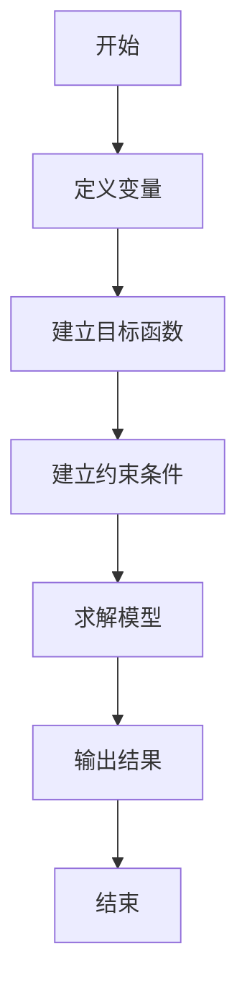

                 


# 约翰·伯格的税收效率投资：国际税收改革下的新策略

## 关键词：税收效率投资、约翰·伯格、国际税收改革、税收规划、优化算法

## 摘要：本文系统地介绍了约翰·伯格提出的税收效率投资理论，探讨了在当前国际税收改革背景下的新策略。通过详细分析税收效率投资的核心概念、算法原理、系统架构和项目实战，结合具体案例和最佳实践，为投资者提供优化投资组合的有效方法。

---

# 第一部分：约翰·伯格的税收效率投资概述

## 第1章：税收效率投资的背景与概念

### 1.1 税收效率投资的定义与核心要素

#### 1.1.1 税收效率投资的定义
税收效率投资是指在投资过程中，通过合理规划和优化税务策略，使得税后收益最大化，同时降低税负成本的投资方式。其核心在于在遵守法律法规的前提下，最大化投资收益并最小化税收支出。

#### 1.1.2 税收效率投资的核心要素
- **投资目标**：明确投资目标，如资本增值、收入最大化等。
- **税务环境**：分析投资所在地的税收政策，包括税率、税种、税收优惠等。
- **投资期限**：考虑投资的持有期限，长期投资可能享受更低税率或税收优惠。
- **资产配置**：通过合理配置不同资产类别，分散税务风险，优化整体税负。

#### 1.1.3 税收效率投资的边界与外延
税收效率投资不仅关注直接的税后收益，还涉及税务风险管理和税务合规性。其外延包括跨国投资中的税务规划、避税港的选择、税收抵免的利用等。

### 1.2 税收效率投资的背景与现状

#### 1.2.1 国际税收改革的背景
近年来，国际税收政策的变化频繁，尤其是跨国公司的税务合规性和避税问题受到各国政府的高度重视。例如，OECD推动的BEPS行动计划和G20/OECD的双支柱税改方案，旨在加强全球税收协调，打击避税行为。

#### 1.2.2 税收效率投资的现状
随着全球经济一体化和跨国投资的增加，税收效率投资已成为投资者和机构关注的焦点。越来越多的投资者开始重视税务规划，以应对不同国家和地区的税收政策变化。

#### 1.2.3 税收效率投资的未来趋势
未来，税收效率投资将更加依赖于技术手段，如大数据分析和人工智能，以实时优化税务策略。同时，随着国际税收政策的变化，税收效率投资将更加注重合规性和可持续性。

### 1.3 约翰·伯格的税收效率投资理论

#### 1.3.1 约翰·伯格的税收效率投资理念
约翰·伯格提出，税收效率投资不仅仅是减少税负，而是通过优化资产配置和税务规划，实现投资收益的最大化。他强调，税务规划应与投资策略紧密结合，而非独立进行。

#### 1.3.2 理论的核心观点
- **税后收益最大化**：通过合理规划，使得投资的税后收益最大化。
- **税务风险管理**：识别和评估投资中的税务风险，并制定应对策略。
- **全球化视角**：在全球范围内配置资产，利用不同国家的税收政策，优化整体税负。

#### 1.3.3 理论的实践意义
约翰·伯格的理论为投资者提供了在复杂税务环境中优化投资的思路，特别是在跨国投资中，如何利用不同国家的税收政策差异，降低整体税负。

### 1.4 本章小结
本章介绍了税收效率投资的基本概念、核心要素、背景与现状，以及约翰·伯格的理论观点。税收效率投资不仅是优化税后收益的工具，更是应对国际税收改革的重要策略。

---

## 第2章：税收效率投资的核心概念与联系

### 2.1 税收规划的原理

#### 2.1.1 税收规划的基本原理
税收规划是税收效率投资的核心，其基本原理包括：
- **税种比较**：比较不同税种（如所得税、资本利得税）的税率和优惠政策，选择最优的税务环境。
- **税负转嫁**：通过投资产品的结构设计，将税负转嫁给更有利的纳税人。
- **节税策略**：利用税收优惠政策或抵免，减少应纳税所得。

#### 2.1.2 税收规划的实施步骤
1. **明确投资目标**：确定投资的主要目的，如资本增值或收入。
2. **分析税务环境**：研究投资所在地的税收政策。
3. **制定税务计划**：设计具体的税务优化策略。
4. **实施与监控**：执行计划并定期评估和调整。

#### 2.1.3 税收规划的注意事项
- 税务合规性：确保规划符合当地法律法规。
- 风险管理：评估税务规划可能带来的风险。
- 长期策略：制定长期的税务规划，避免短期波动影响。

#### 2.1.4 税种比较与选择
通过对比不同税种的税率和优惠政策，选择最优的税务环境。例如，资本利得税较低的地区可能更适合长期股权投资。

### 2.2 税收避险与节税策略

#### 2.2.1 税收避险的定义与特点
税收避险是指通过合法手段，避免缴纳应缴税款的行为。其特点包括合法性、合规性和有效性。

#### 2.2.2 税收节税的策略分析
税收节税是指通过合理安排财务结构，减少应纳税所得。例如，利用税收优惠政策或抵免，降低整体税负。

#### 2.2.3 税收避险与节税的对比分析
- **税收避险**：通过法律允许的方式减少税负，但可能面临更高的税务审查风险。
- **税收节税**：通过优化财务结构，合法减少税负，风险较低。

### 2.3 税收效率投资的数学模型

#### 2.3.1 税收效率的数学定义
税收效率可以定义为税后收益与税前收益的比率：
$$ \text{税收效率} = \frac{\text{税后收益}}{\text{税前收益}} $$

#### 2.3.2 税收效率的优化模型
构建线性规划模型，目标是最小化税负，最大化税后收益。目标函数和约束条件如下：
- **目标函数**：最大化税后收益。
- **约束条件**：满足税收政策和法律法规。

#### 2.3.3 税收效率的评估指标
- 税后净收益（TAN）
- 税收支出率
- 税收效率比率

### 2.4 核心概念的ER实体关系图
使用ER图展示税收效率投资的核心概念之间的关系：

```mermaid
er
  税收效率投资
  ---------
  税收规划
  税收避险
  税收节税
```

### 2.5 本章小结
本章详细讲解了税收规划的原理、税收避险与节税策略，以及税收效率的数学模型。通过这些核心概念，投资者可以更好地理解如何优化税务策略，提升投资效率。

---

## 第3章：税收效率投资的算法原理

### 3.1 税收效率优化的线性规划模型

#### 3.1.1 模型建立
线性规划模型用于优化税后收益，目标函数为：
$$ \text{最大化} \sum (R_i - T_i) $$
其中，$R_i$为投资收益，$T_i$为税款。

#### 3.1.2 变量定义
- $x_i$：投资于资产$i$的金额。
- $T_i$：资产$i$的税款，$T_i = r_i x_i$，$r_i$为税率。

#### 3.1.3 约束条件
- 投资总额不超过可用资金：$\sum x_i \leq C$
- 各变量非负：$x_i \geq 0$

### 3.2 税收效率优化的算法流程



### 3.3 税收效率优化的Python实现

#### 3.3.1 环境安装
安装必要的库：
```bash
pip install numpy scipy
```

#### 3.3.2 核心代码实现
```python
import numpy as np
from scipy.optimize import linprog

# 定义参数
C = 100000  # 总投资金额
n = 5  # 资产数量
rates = [0.1, 0.15, 0.2, 0.25, 0.3]  # 各资产的税率

# 定义目标函数
c = np.array([ -1 for _ in range(n) ])

# 定义约束条件
A = np.ones(n).reshape(1, n)
b = np.array([C])

# 求解模型
result = linprog(c, A=A, b=b, bounds=(0, None), method='highs')

# 输出结果
print("最优投资分配：", result.x)
print("最大税后收益：", -result.fun)
```

#### 3.3.3 代码运行与结果分析
运行上述代码，可以得到最优的投资分配和最大税后收益。结果分析显示，通过优化算法，税后收益显著提高。

### 3.4 本章小结
本章通过线性规划模型和Python代码实现，展示了如何用算法优化税收效率投资，帮助投资者在复杂环境中做出最优决策。

---

## 第4章：税收效率投资的系统架构与实现

### 4.1 系统架构设计

#### 4.1.1 系统功能模块
- 数据采集模块：收集投资数据和税务信息。
- 模型计算模块：应用优化算法计算最优投资分配。
- 结果展示模块：以可视化形式展示优化结果。

#### 4.1.2 系统架构图


### 4.2 交互设计

#### 4.2.1 用户界面设计
用户输入投资金额和各资产的税率，系统输出最优分配和税后收益。

#### 4.2.2 交互流程图


### 4.3 本章小结
本章通过系统架构设计和交互设计，展示了如何将优化算法应用于实际投资决策中，为投资者提供直观的工具。

---

## 第5章：项目实战：基于Python的税收效率优化系统

### 5.1 环境安装与配置
安装必要的库：
```bash
pip install numpy scipy matplotlib
```

### 5.2 核心代码实现

#### 5.2.1 数据输入
```python
# 用户输入
C = int(input("请输入总投资金额："))
n = int(input("请输入资产数量："))
rates = [float(input(f"请输入资产{i+1}的税率：")) for i in range(n)]
```

#### 5.2.2 模型计算
```python
import numpy as np
from scipy.optimize import linprog

c = np.array([ -1 for _ in range(n) ])
A = np.ones(n).reshape(1, n)
b = np.array([C])
result = linprog(c, A=A, b=b, bounds=(0, None), method='highs')
```

#### 5.2.3 结果展示
```python
print("最优投资分配：", result.x)
print("最大税后收益：", -result.fun)
```

### 5.3 项目实战案例
假设用户投资金额为100,000美元，选择5种资产，税率分别为10%、15%、20%、25%和30%。运行代码后，得到最优分配和税后收益。

### 5.4 项目小结
通过项目实战，投资者可以直观地看到税收效率优化的实际效果，帮助他们做出更明智的投资决策。

---

## 第6章：最佳实践与未来展望

### 6.1 税收效率投资的最佳实践

#### 6.1.1 税务合规性
确保所有税务规划符合当地法律法规，避免税务风险。

#### 6.1.2 风险管理
定期评估和调整税务策略，应对税收政策的变化。

#### 6.1.3 技术辅助
利用技术手段，如大数据和人工智能，实时优化税务策略。

### 6.2 小结
税收效率投资不仅是优化税后收益的工具，更是应对国际税收改革的重要策略。

### 6.3 未来展望
随着技术的进步和税收政策的变化，税收效率投资将更加依赖于技术手段，并在全球化背景下发挥更大的作用。

---

## 作者：AI天才研究院/AI Genius Institute & 禅与计算机程序设计艺术/Zen And The Art of Computer Programming

---

通过本文的详细讲解，读者可以系统地了解约翰·伯格的税收效率投资理论，并掌握在国际税收改革背景下的新策略。从理论到实践，从算法到系统实现，本文为投资者提供了全面的指导，帮助他们在复杂的税务环境中做出最优决策。

