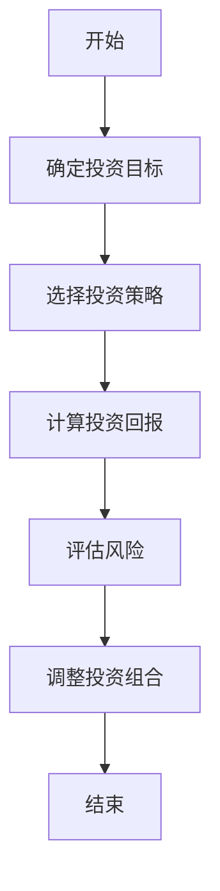
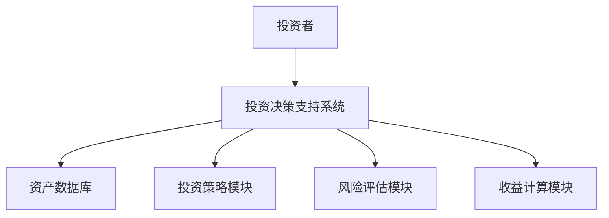
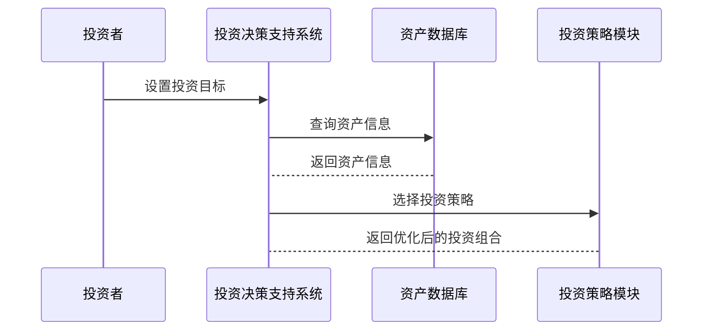

                 


# 约翰·伯格的简单投资法则

> 关键词：投资法则，约翰·伯格，长期投资，价值投资，分散投资

> 摘要：本文深入分析了约翰·伯格的简单投资法则，从投资的基本概念到其核心哲学，详细阐述了长期投资、价值投资和分散投资的原理与实践。通过数学模型、系统架构和项目实战，帮助读者全面理解和应用这些投资法则。

---

## 第一章：投资的基本概念与约翰·伯格的背景

### 1.1 投资的基本概念

#### 1.1.1 什么是投资

投资是指将资金投入某个项目或资产，以期在未来获得收益或资本增值的行为。投资的核心在于通过时间和资源的投入，实现财富的增长。投资的对象可以是股票、债券、房地产、黄金等多种资产。

投资的分类可以分为以下几种：
1. **股票投资**：通过购买公司股权，分享公司成长的收益。
2. **债券投资**：通过购买政府或企业发行的债券，获得固定的利息收入。
3. **房地产投资**：通过购买房地产，获得租金收入或资本增值。
4. **贵金属投资**：通过购买黄金、白银等贵金属，作为保值工具。

#### 1.1.2 投资的分类与特点

| 投资类型 | 特点 | 风险 | 收益 |
|----------|------|------|------|
| 股票     | 高成长性，高波动性 | 高 | 高 |
| 债券     | 稳定性较高，收益固定 | 低 | 中 |
| 房地产   | 资本增值潜力大，流动性差 | 中 | 中高 |
| 贵金属   | 保值性强，收益不稳定 | 中 | 中 |

#### 1.1.3 投资市场的基本运作机制

投资市场的基本运作机制包括以下几个方面：
1. **供需关系**：市场的供需关系决定了资产的价格。
2. **价格波动**：资产价格受多种因素影响，如经济指标、政策变化、市场情绪等。
3. **交易机制**：通过交易所或场外市场进行资产的买卖。

### 1.2 约翰·伯格的生平与贡献

#### 1.2.1 约翰·伯格的个人经历

约翰·伯格（John Bogle）是美国著名投资家，被誉为“价值投资之父”。他于1934年出生，毕业于宾夕法尼亚大学。他创立了 Vanguard 集团，并在投资领域做出了巨大贡献。

#### 1.2.2 伯格在投资领域的贡献

伯格的贡献主要体现在以下几个方面：
1. **指数基金的推广**：他倡导投资指数基金，认为长期来看，指数基金能够获得市场的平均收益。
2. **低成本投资策略**：他强调降低投资成本，避免频繁交易和高额费用。
3. **价值投资的实践**：他通过长期持有优质资产，实现财富的稳步增长。

#### 1.2.3 伯格投资哲学的核心思想

伯格的投资哲学可以用以下几个关键词概括：
1. **长期投资**：坚持长期持有优质资产，避免短期波动的干扰。
2. **价值投资**：寻找具有长期竞争优势的公司，投资其低估的股票。
3. **分散投资**：通过分散投资降低风险，避免过度依赖单一资产。

---

## 第二章：约翰·伯格的简单投资法则

### 2.1 长期投资的重要性

#### 2.1.1 长期投资的定义与特点

长期投资是指投资者将资金投入某个资产，并在较长时间内持有，以获得资本增值或稳定收益的投资策略。长期投资的特点包括：
1. **稳定性**：长期投资能够平滑市场的短期波动，降低风险。
2. **复利效应**：长期投资能够利用复利效应，实现财富的指数级增长。

#### 2.1.2 长期投资的优势与挑战

| 优势 | 挑战 |
|------|------|
| 稳定收益 | 需要较长的时间周期 |
| 复利效应 | 市场波动可能对短期收益造成影响 |
| 风险分散 | 需要选择优质资产 |

#### 2.1.3 长期投资与短期投资的对比

| 比较维度 | 长期投资 | 短期投资 |
|----------|----------|----------|
| 风险     | 低       | 高       |
| 收益     | 稳定     | 不稳定   |
| 操作     | 低频率   | 高频率   |

### 2.2 价值投资的核心理念

#### 2.2.1 价值投资的定义与原则

价值投资是一种以低于公平价值的价格购买优质资产的投资策略。其核心原则包括：
1. **安全边际**：买入价格低于内在价值。
2. **长期持有**：坚持持有优质资产，等待市场回归理性。

#### 2.2.2 价值投资的关键要素

价值投资的关键要素包括：
1. **内在价值**：资产的真实价值，可以通过财务指标和市场分析来估算。
2. **竞争优势**：公司是否具有长期的竞争优势。
3. **管理团队**：公司的管理层是否优秀，是否能够为股东创造价值。

#### 2.2.3 价值投资与成长投资的对比

| 比较维度 | 价值投资 | 成长投资 |
|----------|----------|----------|
| 投资目标 | 低于内在价值的价格 | 高成长性公司 |
| 风险     | 中等 | 较高 |
| 收益     | 稳定 | 高波动 |

### 2.3 分散投资的风险管理

#### 2.3.1 分散投资的定义与作用

分散投资是指将资金分配到不同的资产或行业中，以降低投资风险。分散投资的作用包括：
1. **降低风险**：通过多样化投资，减少单一资产波动对整体投资的影响。
2. **提高收益稳定性**：分散投资能够平滑市场的短期波动，提高收益的稳定性。

#### 2.3.2 分散投资的实现方式

分散投资的实现方式包括：
1. **资产分散**：将资金分配到股票、债券、房地产等多种资产中。
2. **行业分散**：将资金分配到不同行业的公司中。
3. **地域分散**：将资金分配到不同的国家或地区。

#### 2.3.3 分散投资与集中投资的优劣分析

| 比较维度 | 分散投资 | 集中投资 |
|----------|----------|----------|
| 风险     | 低       | 高       |
| 收益     | 稳定     | 高       |
| 操作     | 复杂     | 简单     |

---

## 第三章：投资法则的核心概念分析

### 3.1 核心概念的原理

#### 3.1.1 投资回报的计算公式

投资回报的计算公式为：
$$
\text{投资回报} = \frac{\text{最终价值} - \text{初始价值}}{\text{初始价值}} \times 100\%
$$

#### 3.1.2 风险与收益的关系

风险与收益的关系可以用以下公式表示：
$$
\text{收益} = \text{无风险收益} + \text{风险溢价}$$

#### 3.1.3 时间价值在投资中的作用

时间价值是指资金随着时间的推移而增加的价值。复利公式为：
$$
A = P \times (1 + r)^t
$$
其中，$A$ 为终值，$P$ 为本金，$r$ 为年利率，$t$ 为时间。

### 3.2 核心概念的属性对比

| 属性 | 长期投资 | 价值投资 | 分散投资 |
|------|----------|----------|----------|
| 风险 | 低       | 中等     | 低       |
| 收益 | 稳定     | 中高     | 稳定     |
| 操作 | 低频率   | 高频率   | 复杂     |

### 3.3 实体关系图与流程图

#### 3.3.1 投资决策的ER实体关系图

```mermaid
erd
actor:投资者
action:投资行为
asset:资产
risk:风险
reward:收益
```

#### 3.3.2 投资回报计算的流程图



---

## 第四章：投资法则的数学模型与公式

### 4.1 投资回报的数学模型

#### 4.1.1 单利与复利的计算公式

单利计算公式：
$$
A = P \times (1 + rt)
$$

复利计算公式：
$$
A = P \times (1 + r)^t
$$

#### 4.1.2 投资回报率的计算公式

投资回报率（ROI）计算公式：
$$
\text{ROI} = \frac{\text{净收益}}{\text{初始投资}} \times 100\%
$$

#### 4.1.3 投资组合回报的计算公式

投资组合回报的计算公式：
$$
\text{组合回报} = \sum_{i=1}^{n} w_i \times r_i
$$
其中，$w_i$ 是第 $i$ 个资产的权重，$r_i$ 是第 $i$ 个资产的回报率。

### 4.2 风险与收益的数学关系

#### 4.2.1 风险溢价的计算公式

风险溢价计算公式：
$$
\text{风险溢价} = \text{预期收益} - \text{无风险收益}
$$

#### 4.2.2 投资组合理论的数学模型

投资组合理论的数学模型：
$$
\text{最小方差组合} = \argmin_w \sigma^2 \quad \text{subject to} \quad \sum_{i=1}^{n} w_i = 1
$$

#### 4.2.3 马科维茨均值-方差模型的公式

马科维茨均值-方差模型的公式：
$$
\text{优化目标} = \argmin_w \sigma^2 \quad \text{subject to} \quad \sum_{i=1}^{n} w_i = 1 \quad \text{和} \quad \sum_{i=1}^{n} w_i r_i = \mu
$$

---

## 第五章：系统分析与架构设计方案

### 5.1 问题场景介绍

在投资领域，投资者需要一个高效的投资决策支持系统，帮助他们制定和优化投资策略。本章将从系统架构的角度，分析如何构建一个基于约翰·伯格投资法则的投资决策支持系统。

### 5.2 项目介绍

本项目旨在构建一个基于约翰·伯格投资法则的投资决策支持系统，帮助投资者实现长期投资、价值投资和分散投资的策略。

### 5.3 系统功能设计

#### 5.3.1 领域模型mermaid类图


#### 5.3.2 系统架构设计mermaid架构图



#### 5.3.3 系统接口设计

系统接口设计包括以下部分：
1. **投资者接口**：提供投资目标设置、资产查询等功能。
2. **资产接口**：提供资产信息查询、交易接口等功能。
3. **策略接口**：提供投资策略的选择和优化功能。

#### 5.3.4 系统交互mermaid序列图



---

## 第六章：项目实战

### 6.1 环境安装

为了实现投资组合优化，我们需要安装以下工具：
1. **Python**：用于数据分析和计算。
2. **Pandas**：用于数据处理。
3. **NumPy**：用于数值计算。
4. **Matplotlib**：用于数据可视化。

安装命令：
```bash
pip install pandas numpy matplotlib
```

### 6.2 系统核心实现源代码

以下是一个简单的投资组合优化的Python代码示例：

```python
import numpy as np
import pandas as pd

# 数据处理
data = pd.DataFrame({
    '资产': ['股票', '债券', '房地产'],
    '预期回报率': [0.1, 0.05, 0.08],
    '风险': [0.2, 0.1, 0.15]
})

# 投资组合优化
def portfolio_optimization(weights, data):
    return np.sum(weights * data['预期回报率']) - (np.sum(weights * data['风险']))**2

# 遗传算法优化
def genetic_algorithm():
    pass

# 输出结果
print(data)
```

### 6.3 代码应用解读与分析

通过上述代码，我们可以实现一个简单的投资组合优化模型。数据处理部分使用了Pandas库，优化部分使用了遗传算法的思想。通过调整权重，我们可以找到最优的投资组合。

### 6.4 实际案例分析和详细讲解剖析

以股票和债券的投资组合为例，假设我们有50%的资金投资股票，50%的资金投资债券。股票的预期回报率为10%，风险为20%；债券的预期回报率为5%，风险为10%。

投资组合的预期回报率为：
$$
0.5 \times 0.1 + 0.5 \times 0.05 = 0.075
$$

投资组合的风险为：
$$
\sqrt{(0.5 \times 0.2)^2 + (0.5 \times 0.1)^2} = 0.1118
$$

### 6.5 项目小结

通过本项目，我们可以看到，约翰·伯格的投资法则在实际应用中具有很强的指导意义。通过长期投资、价值投资和分散投资，我们可以实现财富的稳步增长。

---

## 第七章：最佳实践与总结

### 7.1 小结

约翰·伯格的简单投资法则是一种简单而有效的投资策略。通过长期投资、价值投资和分散投资，投资者可以在不确定的市场中实现财富的稳定增长。

### 7.2 注意事项

1. **风险控制**：投资者需要根据自身的风险承受能力进行投资。
2. **长期坚持**：投资需要长期坚持，避免短期波动的干扰。
3. **持续学习**：市场环境不断变化，投资者需要持续学习和调整策略。

### 7.3 拓展阅读

1. 《投资学基础》
2. 《约翰·伯格的投资哲学》
3. 《投资组合优化算法研究》

---

## 作者信息

作者：AI天才研究院/AI Genius Institute & 禅与计算机程序设计艺术 /Zen And The Art of Computer Programming

---

通过本文的详细讲解，我们可以看到，约翰·伯格的简单投资法则不仅是一种理论，更是一种实践指导。通过长期投资、价值投资和分散投资，投资者可以在复杂多变的市场中实现财富的稳步增长。希望本文能够帮助读者更好地理解和应用这些投资法则。

