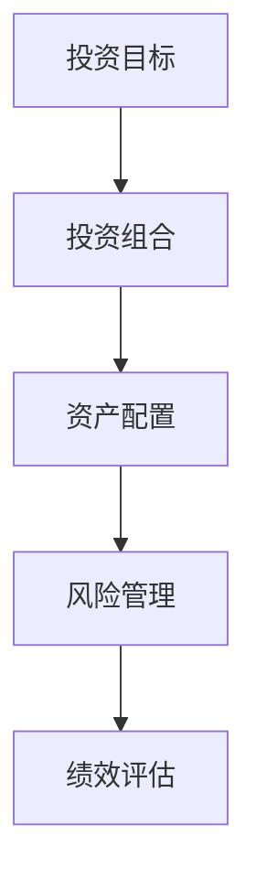

                 

# 约翰·伯格的被动投资策略优势

> 关键词：被动投资策略，约翰·伯格，指数基金，投资成本，长期收益

> 摘要：本文深入探讨了约翰·伯格提出的被动投资策略的优势，分析了其核心概念、数学模型和系统设计，结合实际案例，展示了被动投资在降低风险、提高收益和简化管理方面的显著优势。

---

## 第一部分: 被动投资策略的背景与基础

### 第1章: 被动投资策略概述

#### 1.1 被动投资的定义与特点

##### 1.1.1 什么是被动投资
被动投资是一种投资策略，强调模仿特定市场指数的表现，而不是主动选择个股或试图通过市场时机选择来获取超额收益。其核心理念是通过投资低成本的指数基金，追求市场平均收益。

##### 1.1.2 被动投资的核心特点
- **低成本**：被动投资通过投资指数基金，避免了主动管理的高费用。
- **分散风险**：指数基金投资于广泛市场，分散了个别股票的风险。
- **长期稳定**：被动投资注重长期持有，避免频繁交易带来的市场冲击和税收成本。

##### 1.1.3 被动投资与主动投资的区别
| 属性       | 被动投资                          | 主动投资                          |
|------------|-----------------------------------|-----------------------------------|
| 管理方式   | 跟踪指数                          | 主动选股、择时                  |
| 成本       | 低                                | 高                                |
| 风险       | 低                                | 高                                |
| 收益目标   | 追求市场平均收益                  | 追求超额收益                     |

#### 1.2 约翰·伯格的被动投资理念

##### 1.2.1 约翰·伯格的生平简介
约翰·伯格（John C. Bogle）是美国著名的投资家，被誉为“指数基金之父”。他是 Vanguard 集团的创始人，倡导低成本、被动投资的理念。

##### 1.2.2 伯格对被动投资的贡献
伯格创立了 Vanguard，推出了一系列低成本指数基金，改变了传统投资行业高费用、高风险的模式，使普通投资者也能以低成本投资市场。

##### 1.2.3 伯格投资理念的核心思想
- **成本最小化**：伯格认为，降低投资成本是提高收益的关键。
- **长期投资**：坚持长期投资，避免短期波动带来的损失。
- **分散风险**：通过广泛投资于指数基金，降低非系统性风险。

#### 1.3 被动投资的市场环境

##### 1.3.1 被动投资的兴起背景
20世纪70年代，随着金融市场的波动加剧，投资者开始寻找稳定的投资方式，被动投资应运而生。

##### 1.3.2 全球化与被动投资的发展
全球化推动了指数基金的普及，投资者可以投资全球市场，分散风险。

##### 1.3.3 被动投资的未来趋势
随着技术进步和成本降低，被动投资将继续占据重要地位。

---

## 第二部分: 被动投资策略的核心概念与数学模型

### 第2章: 被动投资策略的核心概念

#### 2.1 指数基金与被动投资

##### 2.1.1 指数基金的定义与特点
指数基金是被动投资的核心工具，它追踪特定市场指数，如标普500指数。

##### 2.1.2 指数基金的投资策略
- **定期定额投资**：分批买入，降低波动风险。
- **长期持有**：避免频繁交易。

##### 2.1.3 指数基金的成本优势
低成本是被动投资的核心优势，通常以 expense ratio 衡量。

#### 2.2 被动投资的数学模型

##### 2.2.1 指数基金的收益计算公式
$$ \text{收益} = \text{指数基金的收益率} \times \text{投资金额} $$

##### 2.2.2 指数基金的成本对收益的影响
$$ \text{净收益} = \text{总收益} - \text{管理费用} - \text{其他费用} $$

##### 2.2.3 风险与收益的平衡
$$ \text{夏普比率} = \frac{\text{超额收益}}{\text{收益的标准差}} $$

#### 2.3 被动投资与主动投资的对比分析

##### 2.3.1 从成本角度分析
被动投资的费用通常低于主动投资。

##### 2.3.2 从风险角度分析
被动投资的风险分散效果更好。

##### 2.3.3 从长期收益角度分析
长期来看，被动投资的收益更稳定。

---

## 第三部分: 被动投资策略的系统分析与架构设计

### 第3章: 被动投资策略的系统分析

#### 3.1 系统功能设计

##### 3.1.1 投资目标设定
- 设定投资目标，如资产保值、增值等。

##### 3.1.2 投资组合构建
- 根据目标选择指数基金。

##### 3.1.3 投资组合监控与调整
- 定期评估组合表现，进行调整。

#### 3.2 系统架构设计

##### 3.2.1 系统架构图（使用 Mermaid）

#### 3.3 系统接口设计
- API 接口用于数据获取和交易执行。

---

## 结论

约翰·伯格的被动投资策略以其低成本、分散风险和长期稳定的特点，成为投资领域的重要策略。通过指数基金和长期持有，投资者可以实现稳健的收益。

---

## 最佳实践 tips

- **选择低成本指数基金**：费用越低越好。
- **长期持有**：避免频繁交易。
- **分散投资**：选择广市场指数基金。

---

## 作者

作者：AI天才研究院/AI Genius Institute & 禅与计算机程序设计艺术 /Zen And The Art of Computer Programming

