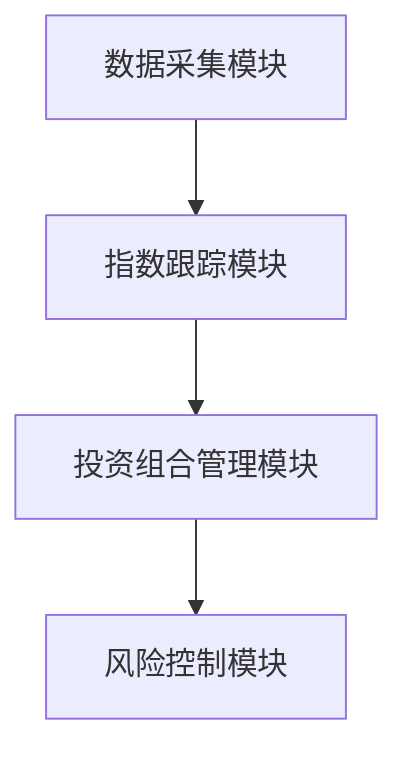

                 

# 约翰·伯格的被动投资策略：为什么简单常常胜过复杂

> 关键词：被动投资、指数基金、定投策略、简单胜过复杂、约翰·伯格

> 摘要：本文探讨了约翰·伯格的被动投资策略，分析了为什么简单常常胜过复杂。通过详细阐述被动投资的核心概念、策略、数学模型和系统设计，结合实际案例，展示了被动投资的优势和实现过程。

---

## 第一部分：被动投资的背景与核心概念

### 第1章：被动投资概述

#### 1.1 被动投资的定义与起源
- **被动投资的定义**：被动投资是一种投资策略，强调长期持有指数基金或其他广泛市场指数的投资组合，不频繁交易，以避免市场波动和交易成本。
- **被动投资的起源与发展**：被动投资的概念可以追溯到20世纪70年代，约翰·伯格（John C. Bogle）是这一领域的先驱。他创立了先锋集团（Vanguard Group），并推出了第一只指数基金。
- **被动投资的核心理念**：被动投资的核心理念是相信市场是有效的，长期来看，被动投资能够提供接近市场平均收益的结果，而无需主动选股或市场 timing。

#### 1.2 约翰·伯格的被动投资思想
- **约翰·伯格的生平简介**：约翰·伯格是被动投资的倡导者，他在1975年创立了先锋集团，并在同一年推出了第一只指数基金——Vanguard S&P 500指数基金。
- **伯格对被动投资的贡献**：伯格通过实践和理论研究，证明了被动投资策略的长期有效性，并强调了低成本的重要性。
- **被动投资的核心思想**：伯格认为，大多数投资者无法通过主动管理持续跑赢市场，而被动投资通过分散投资和低成本，能够为投资者提供稳定且合理的收益。

---

### 第2章：被动投资的核心策略

#### 2.1 指数基金投资策略
- **指数基金的定义与特点**：指数基金是一种跟踪特定市场指数的基金，其投资组合按照指数的成分股构成比例进行配置。
- **指数基金的投资策略**：被动投资者通过定期投资指数基金，实现对整个市场的分散投资，降低个股风险。
- **指数基金的优缺点分析**：优点包括分散风险、低成本、易于操作等；缺点包括无法跑赢市场的主动收益、可能受到市场整体波动的影响。

#### 2.2 定期定额投资策略
- **定期定额投资的定义与特点**：定期定额投资是一种投资方式，投资者按照固定的金额和固定的时间间隔投资于特定资产或基金。
- **定期定额投资的理论基础**：通过分散投资，定期定额投资能够在市场波动中降低风险，避免在市场高点一次性投入过多。
- **定期定额投资的优缺点分析**：优点包括平滑波动、降低择时风险、易于坚持投资纪律等；缺点包括在市场下跌时可能需要承担短期亏损。

---

### 第3章：被动投资的数学模型与算法

#### 3.1 指数基金的数学模型
- **指数基金的构建原理**：指数基金的投资组合按照特定指数的成分股权重构建，例如S&P 500指数。
- **指数基金的数学公式**：假设市场指数由n只股票组成，权重分别为w1, w2, ..., wn，指数基金的收益率等于市场指数的收益率。
- **指数基金的优化算法**：通过最小化跟踪误差（Tracking Error）来优化指数基金的投资组合，确保尽可能接近指数的表现。

#### 3.2 定期定额投资的算法实现
- **定期定额投资的计算公式**：假设每期投资金额为P，投资期数为N，每期收益率为r_i，则最终价值为P × (1 + r1) × (1 + r2) × ... × (1 + rN)。
- **定期定额投资的优化算法**：通过均值-方差优化，选择最优的投资组合，以最大化收益并最小化风险。
- **定期定额投资的模拟实现**：使用历史数据模拟定期定额投资的表现，并与一次性投资的表现进行对比。

#### 3.3 被动投资的风险控制模型
- **风险控制的定义与原理**：通过分散投资和选择低波动性资产，降低投资组合的整体风险。
- **风险控制的数学模型**：使用夏普比率（Sharpe Ratio）衡量投资组合的风险调整后收益。
- **风险控制的算法实现**：通过历史数据计算投资组合的波动率和相关风险指标，优化投资组合的风险收益比。

---

### 第4章：被动投资的系统设计与实现

#### 4.1 系统架构设计
- **系统功能模块划分**：包括数据采集模块、指数跟踪模块、投资组合管理模块和风险控制模块。
- **系统架构图（Mermaid）**：

- **系统实现细节**：数据采集模块负责获取市场数据，指数跟踪模块负责构建指数基金组合，投资组合管理模块负责定期定额投资的实现，风险控制模块负责监控和优化投资组合的风险。

---

## 第二部分：项目实战

### 第5章：构建被动投资组合

#### 5.1 环境搭建
- **工具选择**：使用Python编程语言和相关库（如Pandas、NumPy、Matplotlib）进行数据处理和可视化。
- **数据源**：获取历史市场数据，例如通过Yahoo Finance API获取S&P 500指数的历史数据。

#### 5.2 核心代码实现
- **指数基金组合实现**：通过Pandas库计算指数基金的收益率和波动率，使用Matplotlib绘制指数基金的收益率曲线。
- **定期定额投资实现**：通过循环实现定期定额投资的模拟，计算每期投资金额并记录投资组合的累计价值。

#### 5.3 实际案例分析
- **案例分析**：通过具体的历史数据，模拟被动投资策略的表现，并与市场平均收益进行对比。
- **结果解读**：分析被动投资策略在不同市场环境下的表现，验证其稳定性和有效性。

---

### 第6章：总结与展望

#### 6.1 总结
- **被动投资的优势**：简单、低成本、分散风险、长期有效。
- **约翰·伯格的贡献**：通过实践和理论研究，证明了被动投资策略的长期有效性。

#### 6.2 展望
- **被动投资的未来发展趋势**：随着技术的进步和市场的成熟，被动投资将更加普及，更多投资者将采用被动投资策略。

---

## 作者信息

作者：AI天才研究院/AI Genius Institute & 禅与计算机程序设计艺术 /Zen And The Art of Computer Programming

---

通过以上结构和内容，本文详细探讨了约翰·伯格的被动投资策略，分析了为什么简单常常胜过复杂，并结合实际案例展示了被动投资的优势和实现过程。

