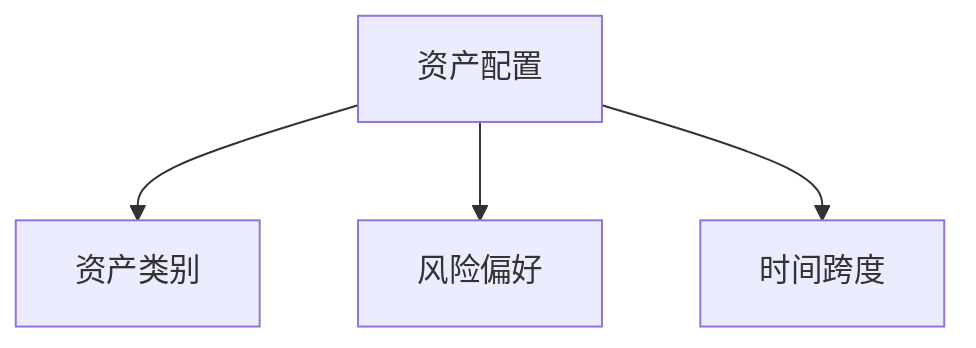
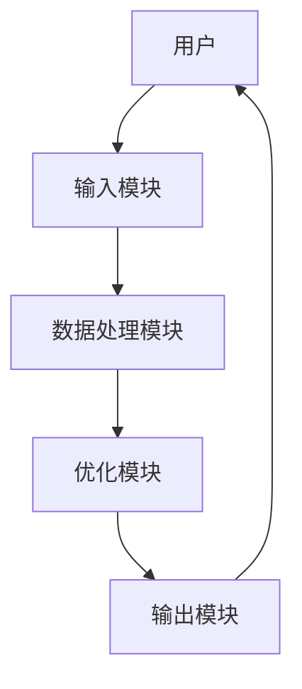

                 


# 约翰·伯格的资产配置理论

> **关键词**：约翰·伯格、资产配置理论、投资组合理论、指数基金、现代投资组合理论、风险管理  
> **摘要**：本文系统地介绍约翰·伯格的资产配置理论，涵盖其背景、核心概念、数学模型、系统设计与项目实战。通过理论与实践结合，深入分析其原理和应用，帮助读者掌握资产配置策略。

---

## 第一部分: 资产配置理论的背景与核心概念

### 第1章: 资产配置理论的背景介绍

#### 1.1 资产配置的核心概念

##### 1.1.1 资产配置的定义与问题背景
资产配置是投资组合管理中的核心策略，指按比例分配资金到不同资产类别（股票、债券、现金等），以实现风险与收益的平衡。问题背景在于，单一资产的风险较高，通过分散投资降低整体风险。

##### 1.1.2 资产配置的目标与问题描述
目标：最大化收益，最小化风险。问题：如何在不同资产间分配资金，平衡风险与收益。

##### 1.1.3 资产配置问题的解决思路
通过数学模型优化资产比例，实现收益-风险最优。

##### 1.1.4 资产配置的边界与外延
边界：资金分配比例约束。外延：扩展到风险管理、动态调整等。

##### 1.1.5 资产配置的核心要素组成
- 资产类别：股票、债券、现金。
- 风险偏好：影响配置比例。
- 时间跨度：长期或短期。

#### 1.2 约翰·伯格的资产配置理论概述

##### 1.2.1 约翰·伯格的生平简介
约翰·伯格（John Bogle）是指数基金之父， Vanguard集团创始人，倡导低成本、被动投资。

##### 1.2.2 伯格理论的演变与核心思想
核心思想：长期投资、分散投资、低成本。理论演变：从主动管理转向被动管理。

##### 1.2.3 伯格理论与其他资产配置理论的对比
与MPT对比：MPT强调优化风险，伯格强调低成本和长期持有。

---

### 第2章: 资产配置的核心概念与联系

#### 2.1 资产配置的核心原理

##### 2.1.1 资产配置的基本原理
通过分散投资降低风险，不同资产类别波动性不同，组合后整体风险低于单一资产。

##### 2.1.2 投资组合理论的数学模型
现代投资组合理论（MPT）：最大化收益，最小化风险。

##### 2.1.3 现代投资组合理论（MPT）的概述
马科维茨提出，通过优化选择资产组合，达到最优风险收益。

#### 2.2 核心概念的属性特征对比

##### 2.2.1 资产、负债、净资产的属性对比
- 资产：能产生收益。
- 负债：需承担义务。
- 净资产：资产减负债。

##### 2.2.2 风险、收益、流动性的特征分析
- 风险：波动性。
- 收益：预期回报。
- 流动性：变现能力。

##### 2.2.3 资产配置与投资组合的关系
资产配置决定投资组合结构，影响风险和收益。

#### 2.3 实体关系图与概念架构

##### 2.3.1 资产配置的ER实体关系图
```mermaid
erd
entity 资产配置 {
    [资产类别]
    [风险偏好]
    [时间跨度]
}
```

##### 2.3.2 资产配置的概念架构图


---

## 第二部分: 约翰·伯格资产配置理论的数学模型与算法

### 第3章: 约翰·伯格资产配置理论的数学模型与算法

#### 3.1 投资组合理论的数学模型

##### 3.1.1 资产配置的优化目标函数
$$ \text{最大化 } \mu \cdot w - 0.5 \cdot w^T \Sigma w $$

##### 3.1.2 风险与收益的数学表达
$$ \text{风险 } = w^T \Sigma w $$
$$ \text{收益 } = w^T \mu $$

#### 3.2 约翰·伯格的指数基金策略

##### 3.2.1 指数基金的数学模型
$$ \text{总收益 } = \sum_{i=1}^n w_i r_i $$

##### 3.2.2 成本最小化模型
$$ \text{总成本 } = \sum_{i=1}^n w_i c_i $$

#### 3.3 算法实现与代码示例

##### 3.3.1 投资组合优化的Python代码实现
```python
import numpy as np

# 示例数据
mu = np.array([0.1, 0.15])
Sigma = np.array([[0.05, 0.02], [0.02, 0.08]])

# 优化目标函数
def objective(w):
    return -w.T.dot(mu) + 0.5 * w.T.dot(Sigma).dot(w)

# 约束条件：w.sum() == 1
from scipy.optimize import minimize

w0 = np.array([0.5, 0.5])
cons = {'type': 'eq', 'fun': lambda w: sum(w) - 1}

result = minimize(objective, w0, constraints=cons)
print(result.x)
```

---

### 第4章: 资产配置系统的分析与设计

#### 4.1 系统分析

##### 4.1.1 资产配置系统的功能需求
- 数据输入：资产类别、风险偏好。
- 模型计算：优化配置。
- 结果输出：配置比例、风险收益分析。

#### 4.2 系统架构设计

##### 4.2.1 系统架构图


---

## 第三部分: 项目实战——基于约翰·伯格理论的资产配置系统实现

### 第5章: 项目实战

#### 5.1 环境安装与配置

##### 5.1.1 Python环境的搭建
安装Python 3.x。

##### 5.1.2 数据处理库的安装
安装Pandas、NumPy。

##### 5.1.3 可视化工具的安装
安装Matplotlib、Seaborn。

#### 5.2 系统核心实现

##### 5.2.1 数据清洗与预处理
```python
import pandas as pd

# 示例数据
data = {'资产类别': ['股票', '债券'], '预期收益': [0.1, 0.05], '风险': [0.05, 0.02]}
df = pd.DataFrame(data)
```

##### 5.2.2 资产配置模型
```python
# 计算优化权重
def optimize_portfolio(expected_returns, covariance_matrix):
    n = len(expected_returns)
    mu = np.array(expected_returns)
    Sigma = np.array(covariance_matrix)
    
    def objective(w):
        return -w.T.dot(mu) + 0.5 * w.T.dot(Sigma).dot(w)
    
    cons = {'type': 'eq', 'fun': lambda w: sum(w) - 1}
    w0 = np.array([1.0/n]*n)
    
    result = minimize(objective, w0, constraints=cons)
    return result.x

# 示例应用
expected_returns = [0.1, 0.05]
covariance_matrix = [[0.05, 0.02], [0.02, 0.08]]
weights = optimize_portfolio(expected_returns, covariance_matrix)
print(weights)
```

---

## 第四部分: 总结与展望

### 6.1 总结

约翰·伯格的资产配置理论强调长期投资、分散投资和低成本。通过数学模型优化配置，实现风险与收益的平衡。

### 6.2 最佳实践 tips

- 定期再平衡：每年调整配置比例。
- 选择低成本基金：降低费用。
- 长期持有：避免频繁交易。

### 6.3 注意事项

- 市场波动：定期监控调整。
- 税收影响：考虑税务因素。

### 6.4 拓展阅读

- 《投资最重要的事》——格雷厄姆
- 《机构投资的创新理念》——巴菲特

---

## 作者：AI天才研究院 & 禅与计算机程序设计艺术

通过系统地介绍约翰·伯格的理论，结合数学模型和代码示例，本文为读者提供了全面的资产配置策略。希望读者能将理论应用于实践，实现稳健投资。

