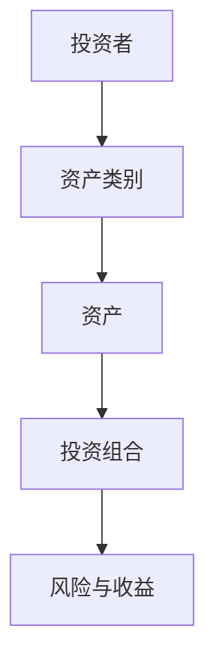
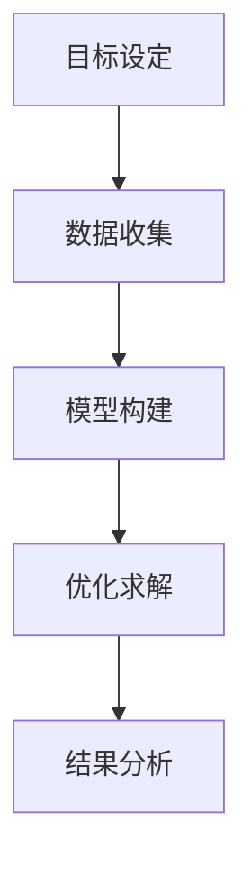
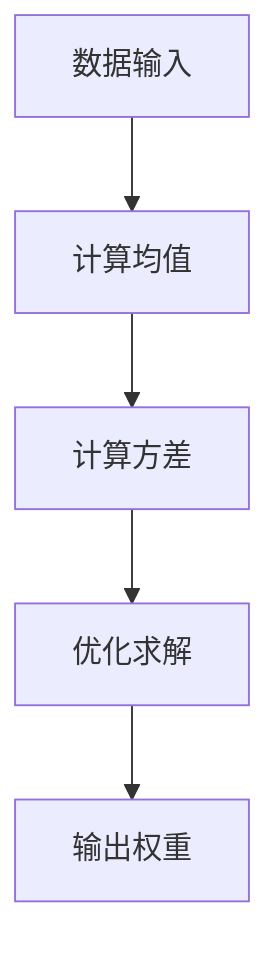
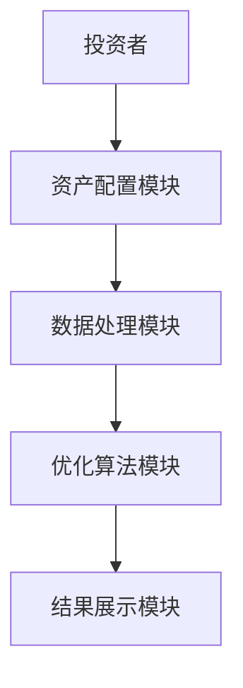
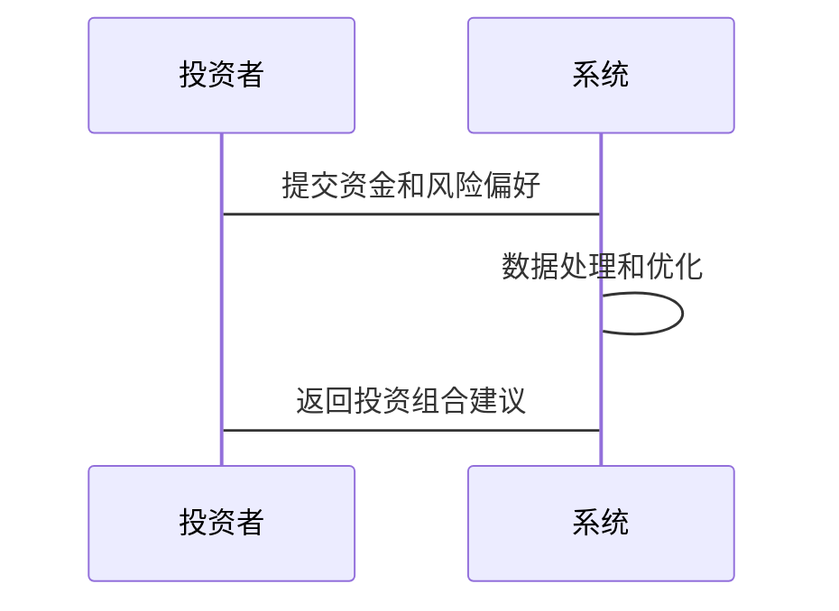

                 


# 约翰·伯格的资产配置理论

## 关键词：资产配置理论，投资组合管理，风险控制，现代投资组合理论，均值-方差优化，投资策略

## 摘要：本文深入探讨约翰·伯格的资产配置理论，分析其核心概念、数学模型及实际应用。从资产配置的基本概念到优化算法，再到系统架构设计和实战案例，全面解析该理论在投资管理中的重要性。

---

# 第1章: 资产配置理论的背景介绍

## 1.1 资产配置的基本概念

### 1.1.1 资产配置的定义与核心要素
资产配置是指将资金分配到不同的资产类别（如股票、债券、现金等）以实现特定投资目标的过程。其核心要素包括：目标设定、资产类别选择、权重分配和再平衡机制。

### 1.1.2 资产配置的背景与问题背景
资产配置的背景可以追溯到20世纪中期，随着金融市场的复杂化，投资者需要更科学的方法来分散风险和优化收益。问题背景包括市场波动、经济周期变化和投资者风险偏好差异。

### 1.1.3 资产配置的目标与边界
资产配置的目标是在风险可控的前提下实现最大收益。其边界包括投资期限、资金规模和监管限制等。

## 1.2 资产配置的核心概念与联系

### 1.2.1 资产配置的原理与机制
资产配置通过分散投资降低风险，不同资产类别之间的相关性影响整体风险收益。

### 1.2.2 资产类别与风险收益特征对比
使用表格对比股票、债券、现金等资产类别的风险和收益特征：

```mermaid
table
| 资产类别 | 风险特征 | 收益特征 |
|----------|----------|----------|
| 股票     | 高       | 高       |
| 债券     | 中       | 中       |
| 现金     | 低       | 低       |
```

### 1.2.3 资产配置的ER实体关系图


## 1.3 资产配置的重要性与应用场景

### 1.3.1 资产配置在投资组合中的作用
分散投资降低风险，提高收益稳定性。

### 1.3.2 资产配置在风险管理中的应用
通过合理分配资产类别，降低整体投资组合的波动性。

### 1.3.3 资产配置在不同市场环境下的表现
在牛市中优化收益，在熊市中降低损失。

## 1.4 本章小结

---

# 第2章: 资产配置的算法原理

## 2.1 现代投资组合理论（MPT）概述

### 2.1.1 马科维茨的有效前沿模型
有效前沿模型通过优化投资组合的风险和收益，找到最优配置。

### 2.1.2 均值-方差优化的数学模型
目标函数为最小化方差，约束条件为投资组合的期望收益。

$$ \text{目标函数：} \quad \min_w \sigma^2 \quad \text{subject to} \quad \mathbf{w}^T \mathbf{1} = 1 $$
$$ \text{约束条件：} \quad \mathbf{w}^T \mathbf{r} = \mu $$

### 2.1.3 资产配置的优化流程


## 2.2 均值-方差优化的Python实现

### 2.2.1 环境安装与数据准备
```python
import numpy as np
import pandas as pd
```

### 2.2.2 核心代码实现
```python
def mean_variance_optimization(returns, risk_aversion=1):
    n = returns.shape[1]
    cov_matrix = returns.cov()
    mu = returns.mean().values
    inv_cov = np.linalg.inv(cov_matrix)
    w = inv_cov.dot(mu) / (np.ones(n).dot(inv_cov).dot(mu))
    return w
```

### 2.2.3 数学公式与流程图
$$ \text{权重计算：} \quad \mathbf{w} = \frac{1}{\mathbf{1}^T \mathbf{w}} \mathbf{w} $$



## 2.3 其他资产配置策略

### 2.3.1 均值-方差优化
### 2.3.2 风险平价配置
### 2.3.3 等权配置

---

# 第3章: 资产配置的系统分析与架构设计

## 3.1 系统功能设计

### 3.1.1 领域模型类图


### 3.1.2 系统架构设计


## 3.2 接口与交互设计

### 3.2.1 系统接口


---

# 第4章: 资产配置的项目实战

## 4.1 环境安装与数据准备
```python
import numpy as np
import pandas as pd
```

## 4.2 核心代码实现

### 4.2.1 数据收集与预处理
```python
data = pd.read_csv('assets.csv')
returns = data.pct_change().dropna()
```

### 4.2.2 模型构建与优化
```python
from scipy.optimize import minimize

def objective_function(weights, returns):
    return np.dot(weights.T, np.dot(returns.cov(), weights))

weights = minimize(objective_function, np.array([1/3, 1/3, 1/3]), bounds=...).x
```

## 4.3 案例分析与解读
分析不同市场环境下资产配置的效果，解读代码实现。

## 4.4 项目小结

---

# 第5章: 资产配置的最佳实践

## 5.1 小结与总结
资产配置是投资管理的核心，需结合理论与实践。

## 5.2 注意事项
定期再平衡，避免过度优化，注意市场流动性。

## 5.3 拓展阅读
推荐相关书籍和文献，供读者深入学习。

---

# 结语

## 作者：AI天才研究院/AI Genius Institute & 禅与计算机程序设计艺术 /Zen And The Art of Computer Programming

