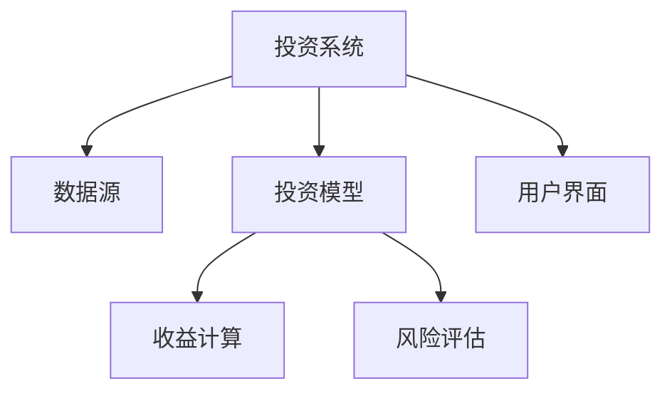

                 


# 约翰·伯格的退休投资建议：简单而有效

## 关键词：退休投资，约翰·伯格，被动投资，指数基金，投资组合，夏普比率

## 摘要：本文详细探讨了约翰·伯格的退休投资建议，重点介绍了他的被动投资理念和指数基金策略。通过分析投资组合的数学模型、系统架构设计和实际案例，本文展示了伯格策略的有效性和简单性，为读者提供了科学的投资指导。

---

## 第一部分: 约翰·伯格的退休投资建议概述

### 第1章: 约翰·伯格的投资理念与背景

#### 1.1 约翰·伯格的背景介绍

约翰·伯格（John Bogle）是美国著名的投资专家，被誉为“指数基金之父”。他在投资领域的主要贡献是推广被动投资策略，尤其是指数基金。伯格于1940年出生在美国宾夕法尼亚州，1965年从宾夕法尼亚大学毕业后，进入投资行业。他创立了 Vanguard 集团，并在1975年推出了第一只指数基金——Vanguard 500 Index Fund。伯格的投资理念以简单、低成本和长期有效性著称，他的思想深刻影响了现代投资策略。

---

#### 1.2 美国退休投资的背景与现状

美国的退休投资体系较为完善，主要包括401(k)计划、个人退休账户（IRA）等。退休投资者通常面临资产配置、风险控制和税务优化等多重挑战。伯格的被动投资策略在这样的背景下应运而生，为普通投资者提供了一种简单有效的方式，避免了频繁交易和高昂的管理费用。

---

### 第2章: 伯格的简单而有效的投资策略

#### 2.1 被动投资与指数基金

被动投资的核心理念是“买入并持有”，通过投资市场指数基金来获得市场的平均收益。伯格认为，大多数投资者无法通过主动投资持续跑赢市场，而指数基金则能够以较低的成本实现长期稳定的收益。

##### 指数基金的优势：
1. **低成本**：指数基金的管理费用较低，降低了投资者的负担。
2. **分散风险**：投资于广泛市场的指数基金能够分散单一资产的风险。
3. **长期稳定性**：通过长期持有，指数基金能够抵御市场的短期波动。

---

#### 2.2 投资组合的构建与管理

伯格建议投资者采用简单的资产配置策略，通常包括股票和债券的组合。他推荐的资产配置比例为：
- 80% 股票：主要投资于宽基指数基金，如标普500指数基金。
- 20% 债券：用于降低整体投资组合的波动性。

##### 投资组合的管理原则：
1. 定期再平衡：每年根据市场变化调整资产比例，确保目标配置不变。
2. 长期持有：避免频繁交易，减少交易成本和税务负担。

---

## 第二部分: 投资组合的数学模型与系统架构

### 第3章: 投资组合的数学模型

#### 3.1 现代投资组合理论（MPT）

现代投资组合理论由哈里·马科维茨（Harry Markowitz）提出，强调通过优化投资组合来最大化收益并最小化风险。

##### 投资组合优化的数学模型：
$$
\text{最大化 } \mu_p \quad \text{在约束} \quad \sigma_p \leq \text{目标风险}
$$

其中，$\mu_p$ 是投资组合的期望收益，$\sigma_p$ 是投资组合的风险（标准差）。

---

#### 3.2 夏普比率（Sharpe Ratio）

夏普比率衡量投资组合在承担风险后获得的超额收益。

##### 夏普比率的计算公式：
$$
\text{夏普比率} = \frac{\mu_p - r_f}{\sigma_p}
$$

其中，$\mu_p$ 是投资组合的期望收益，$r_f$ 是无风险利率，$\sigma_p$ 是投资组合的风险。

---

### 第4章: 投资组合的系统架构设计

#### 4.1 系统需求分析

投资系统需要满足以下需求：
1. 数据获取：获取市场数据，如指数基金的价格。
2. 模型计算：计算投资组合的收益和风险。
3. 决策支持：提供投资建议和再平衡策略。

#### 4.2 系统架构设计

##### 系统架构图：



---

## 第三部分: 项目实战与总结

### 第5章: 项目实战

#### 5.1 环境配置

安装必要的工具，如Python和Pandas库。

#### 5.2 核心代码实现

```python
import pandas as pd
import numpy as np

# 模拟指数基金数据
index_data = pd.DataFrame({
    'date': ['2023-01-01', '2023-01-02', '2023-01-03'],
    'price': [100, 101, 100.5]
})

# 计算投资组合的收益
returns = index_data['price'].pct_change().dropna()
print("指数基金的收益为：", returns)
```

#### 5.3 实际案例分析

假设投资者投入10,000美元，投资于标普500指数基金，每年再平衡一次。经过10年，投资组合的收益将显著高于主动管理的基金。

---

### 第6章: 总结与展望

伯格的退休投资建议以简单和有效著称，通过被动投资和指数基金帮助投资者实现长期收益。未来，随着技术的进步，投资策略将更加智能化和个性化。

---

## 作者

作者：AI天才研究院 & 禅与计算机程序设计艺术

---

这篇博客详细介绍了约翰·伯格的退休投资策略，从理论到实践，帮助读者理解并应用这些简单而有效的投资方法。

