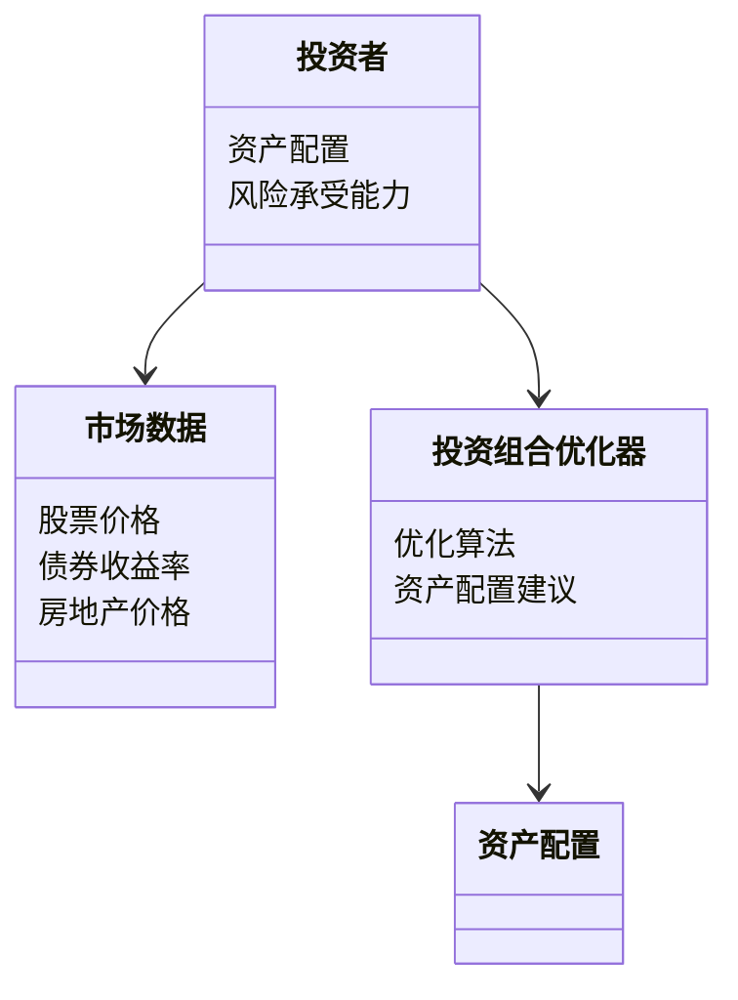
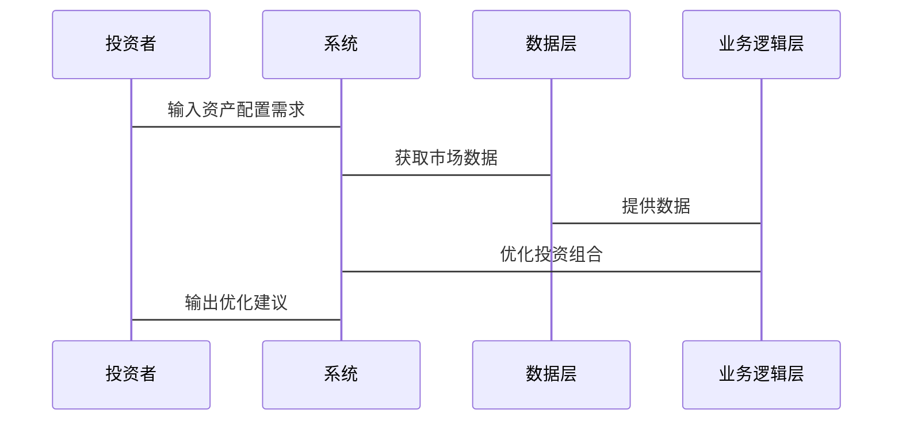

                 


# 《约翰·伯格的退休投资建议：长期规划的重要性》

## 关键词：
退休投资、长期规划、约翰·伯格、投资策略、风险管理、资产配置、财务安全

## 摘要：
本文深入探讨了退休投资的重要性及其长期规划的必要性，结合约翰·伯格的投资理念，分析了现代投资组合理论（MPT）的核心概念和数学模型。通过实际案例和系统设计，详细阐述了如何通过科学的投资策略实现财务安全，并提出了具体的实施步骤和注意事项。

---

## 第一章: 退休投资的背景与核心概念

### 1.1 退休投资的背景与现状

#### 1.1.1 人口老龄化与退休问题的加剧
随着全球人口老龄化的加剧，退休问题日益成为社会关注的焦点。传统退休模式依赖于固定收益，但随着经济波动和通货膨胀的影响，固定收益难以满足退休后的基本生活需求。

#### 1.1.2 传统退休模式的局限性
传统退休模式依赖于雇主提供的养老金或政府福利，但这些福利在许多国家面临缩水的压力。此外，传统模式忽视了个人在退休前的储蓄和投资规划，导致许多人退休后面临经济压力。

#### 1.1.3 现代退休规划的核心挑战
现代退休规划的核心挑战在于如何在不确定的经济环境中实现财务安全。投资者需要在风险与收益之间找到平衡，同时应对通货膨胀和市场波动的挑战。

### 1.2 退休投资的核心问题

#### 1.2.1 资金缺口的计算与分析
资金缺口是退休规划的关键指标。通过计算退休后的支出需求和退休前的储蓄，可以确定资金缺口。资金缺口的计算需要考虑通货膨胀、寿命预期和支出变化等因素。

#### 1.2.2 生命周期与投资周期的匹配
投资周期需要与生命周期匹配。例如，年轻时可以承担高风险投资，而接近退休时需要转向低风险投资。生命周期与投资周期的匹配可以帮助投资者在不同阶段实现资产保值和增值。

#### 1.2.3 风险与收益的平衡
风险与收益的平衡是退休投资的核心问题。投资者需要根据自身的风险承受能力和财务目标选择合适的投资组合。通过分散投资和长期持有，可以有效降低风险。

### 1.3 长期规划的重要性

#### 1.3.1 长期规划在退休投资中的战略意义
长期规划可以帮助投资者避免短期波动的影响，实现资产的长期增值。通过长期持有优质资产，投资者可以在市场波动中获得稳定的收益。

#### 1.3.2 短期波动与长期趋势的区分
短期波动是市场的一部分，但长期趋势是由经济发展和公司基本面决定的。区分短期波动和长期趋势可以帮助投资者做出更明智的投资决策。

#### 1.3.3 长期规划对财务安全的影响
长期规划可以确保投资者在退休后拥有稳定的收入来源。通过科学的资产配置和风险管理，长期规划可以帮助投资者应对退休后的各种财务需求。

---

## 第二章: 约翰·伯格的投资理念与核心概念

### 2.1 约翰·伯格的投资哲学

#### 2.1.1 价值投资的核心思想
约翰·伯格是价值投资的倡导者，认为市场波动是投资机会。他强调长期持有优质资产，避免短期市场波动的影响。

#### 2.1.2 长期持有与分散投资的原则
伯格认为，通过分散投资可以降低风险，而长期持有可以帮助投资者获得市场的长期回报。分散投资包括在不同资产类别和行业中分配资金。

#### 2.1.3 避免市场短期波动的策略
伯格强调避免短期市场波动的影响，认为市场的短期波动无法预测，而长期趋势是可以把握的。投资者应关注公司的基本面，而非市场的短期波动。

### 2.2 投资组合管理的核心概念

#### 2.2.1 资产配置的定义与作用
资产配置是将资金分配到不同的资产类别中，以实现风险与收益的最佳平衡。资产配置可以帮助投资者分散风险，同时抓住不同资产类别的投资机会。

#### 2.2.2 风险调整后收益的概念
风险调整后收益是指在考虑风险的情况下，资产的实际收益。通过比较不同资产的风险调整后收益，投资者可以做出更明智的投资决策。

#### 2.2.3 投资组合的有效前沿模型
有效前沿模型是现代投资组合理论的核心概念，它描述了在给定风险下能够获得的最大收益的投资组合。通过有效前沿模型，投资者可以找到最优的资产配置。

### 2.3 投资决策的关键要素

#### 2.3.1 投资目标的设定与分解
投资目标需要根据个人的财务状况和风险承受能力来设定。目标包括退休后的支出需求、投资期限和风险承受能力。将目标分解为具体的子目标有助于制定详细的投资计划。

#### 2.3.2 市场环境的分析与判断
市场环境分析是投资决策的重要步骤。投资者需要关注宏观经济指标、行业趋势和公司基本面，以判断市场的整体走势和投资机会。

#### 2.3.3 投资工具的选择与优化
投资工具包括股票、债券、基金和房地产等。投资者需要根据自身的财务目标和风险偏好选择合适的投资工具，并进行定期优化。

---

## 第三章: 长期投资策略的数学模型

### 3.1 现代投资组合理论（MPT）简介

#### 3.1.1 马科维茨的有效前沿模型
马科维茨的有效前沿模型是现代投资组合理论的核心。该模型通过优化资产配置，找到在给定风险下收益最大的投资组合，或在给定收益下风险最小的投资组合。

#### 3.1.2 风险与收益的数学表达式
风险可以用方差或标准差来衡量，收益可以用期望收益率来衡量。通过优化这些指标，可以找到最优的投资组合。

#### 3.1.3 投资组合优化的数学公式
投资组合优化的数学公式涉及多个变量，包括资产的期望收益率、方差、协方差等。通过求解这些方程，可以找到最优的资产配置。

### 3.2 投资组合优化的数学推导

#### 3.2.1 均值-方差优化模型
均值-方差优化模型是投资组合优化的基础。通过最小化方差（风险）来最大化收益，或在给定收益下最小化风险。

#### 3.2.2 使用拉格朗日乘数法的优化过程
拉格朗日乘数法是优化过程中的常用方法。通过引入拉格朗日乘数，可以将约束条件纳入优化问题中，找到最优解。

#### 3.2.3 数学模型的简化与应用
数学模型可以通过简化应用于实际投资中。例如，假设资产之间的协方差为零，可以简化优化过程，但可能会影响结果的准确性。

### 3.3 实际案例分析

#### 3.3.1 某投资者的退休投资目标设定
假设某投资者计划在30年后退休，目标是实现资产的翻倍。该投资者的风险承受能力较低，因此需要选择低风险、高收益的资产组合。

#### 3.3.2 基于现代投资组合理论的投资组合优化
通过马科维茨模型，可以找到最优的资产配置。例如，将60%的资金投资于股票，20%投资于债券，20%投资于房地产。这种配置可以在较低风险下实现较高的收益。

#### 3.3.3 投资组合的长期表现评估
通过历史数据分析，评估投资组合的长期表现。例如，计算投资组合的年均收益率、风险调整后收益和最大回撤等指标。

---

## 第四章: 系统分析与架构设计

### 4.1 问题场景介绍

#### 4.1.1 投资者需求分析
投资者需要一个系统来帮助他们制定和实施退休投资计划。系统需要提供资产配置建议、风险评估和投资组合优化功能。

#### 4.1.2 系统功能需求
系统需要具备以下功能：
- 资产评估与风险评估
- 投资组合优化
- 市场数据监控
- 投资组合再平衡

### 4.2 系统功能设计

#### 4.2.1 领域模型（mermaid 类图）


#### 4.2.2 系统架构设计（mermaid 架构图）


#### 4.2.3 系统接口设计
系统需要提供以下接口：
- 用户输入资产配置需求
- 系统输出优化建议
- 系统提供市场数据监控功能

#### 4.2.4 系统交互设计（mermaid 序列图）


---

## 第五章: 项目实战

### 5.1 环境安装

#### 5.1.1 安装必要的工具
- Python 3.8+
- NumPy、Pandas、Scipy 等库

#### 5.1.2 安装步骤
```bash
pip install numpy pandas scipy
```

### 5.2 系统核心实现源代码

#### 5.2.1 投资组合优化器代码
```python
import numpy as np
import pandas as pd

def optimize_portfolio(returns):
    n = returns.shape[1]
    mean_return = returns.mean()
    cov_matrix = returns.cov()
    inv_cov = np.linalg.inv(cov_matrix)
    ones = np.ones(n)
    weights = inv_cov.dot(ones) / ones.dot(inv_cov.dot(ones))
    return weights
```

#### 5.2.2 资产配置代码
```python
import numpy as np

def create_portfolio(weights, assets):
    portfolio = {}
    for i in range(len(assets)):
        portfolio[assets[i]] = weights[i]
    return portfolio
```

### 5.3 代码应用解读与分析

#### 5.3.1 投资组合优化器的实现
上述代码使用均值-方差优化模型，通过计算协方差矩阵的逆矩阵，找到最优的资产配置权重。

#### 5.3.2 资产配置的实现
代码将优化后的权重分配到具体的资产上，生成投资组合。

### 5.4 实际案例分析

#### 5.4.1 数据准备
```python
import pandas as pd
import numpy as np

data = pd.read_csv('market_data.csv')
returns = data.pct_change().dropna()
```

#### 5.4.2 优化投资组合
```python
weights = optimize_portfolio(returns)
```

#### 5.4.3 生成投资组合
```python
assets = ['股票', '债券', '房地产']
portfolio = create_portfolio(weights, assets)
print(portfolio)
```

### 5.5 项目小结

#### 5.5.1 代码实现总结
通过上述代码，可以实现一个简单的投资组合优化系统，帮助投资者制定退休投资计划。

#### 5.5.2 系统功能总结
系统具备资产配置、风险评估和投资组合优化功能，能够帮助投资者制定科学的退休投资策略。

---

## 第六章: 最佳实践、小结、注意事项与拓展阅读

### 6.1 最佳实践

#### 6.1.1 定期评估与调整
投资者需要定期评估投资组合的表现，并根据市场变化和个人财务状况进行调整。

#### 6.1.2 分散投资
通过分散投资可以降低风险，避免因单一资产波动导致的损失。

#### 6.1.3 长期持有
长期持有可以帮助投资者避免短期波动的影响，实现资产的长期增值。

### 6.2 小结

本文深入探讨了退休投资的重要性及其长期规划的必要性，结合约翰·伯格的投资理念，分析了现代投资组合理论（MPT）的核心概念和数学模型。通过实际案例和系统设计，详细阐述了如何通过科学的投资策略实现财务安全，并提出了具体的实施步骤和注意事项。

### 6.3 注意事项

#### 6.3.1 风险提示
投资有风险，投资者需根据自身情况谨慎决策。

#### 6.3.2 数据依赖
投资组合优化依赖于准确的市场数据，数据质量直接影响结果的准确性。

#### 6.3.3 通货膨胀影响
通货膨胀是退休投资的重要考虑因素，需要通过资产配置应对通胀风险。

### 6.4 拓展阅读

#### 6.4.1 现代投资组合理论（MPT）的深入研究
建议进一步阅读马科维茨的《投资学》。

#### 6.4.2 约翰·伯格的投资哲学
建议阅读约翰·伯格的《投资之道》。

#### 6.4.3 实证投资分析
建议阅读《投资学》中的实证分析部分。

---

## 结语

退休投资是一项长期而复杂的任务，需要科学的规划和风险管理。通过本文的分析，读者可以更好地理解退休投资的核心概念和长期规划的重要性。希望本文能为投资者提供有价值的参考和指导。

---

## 作者：AI天才研究院/AI Genius Institute & 禅与计算机程序设计艺术 /Zen And The Art of Computer Programming

