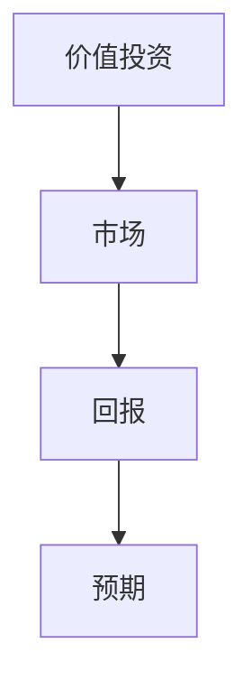
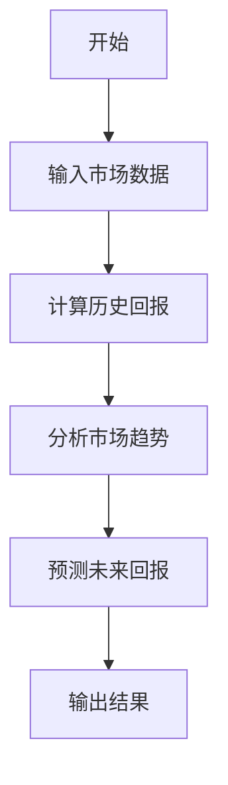
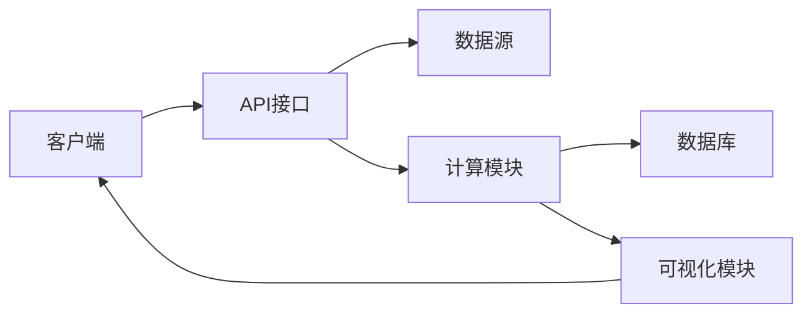

                 


# 约翰·伯格的长期市场回报预期：现实vs乐观

## 关键词：约翰·伯格，长期市场回报预期，价值投资，投资模型，风险评估

## 摘要：本文深入分析了约翰·伯格的长期市场回报预期，探讨了现实与乐观两种视角下的投资策略。通过价值投资理论、数学模型、系统架构和项目实战，揭示了伯格模型的原理和应用，帮助读者理解如何在长期投资中平衡风险与收益。

---

## 第一部分：背景介绍

### 第1章：约翰·伯格与长期市场回报预期

#### 1.1 约翰·伯格的生平与投资理念
- **1.1.1 约翰·伯格的生平简介**
  - 约翰·伯格出生于1940年，是美国著名投资家，指数基金之父。
  - 他创立了 Vanguard 集团，推动了低成本指数基金的发展。
- **1.1.2 伯格的投资哲学与价值投资理论**
  - 伯格强调长期投资，认为市场波动不可预测，但长期趋势可以把握。
  - 他倡导价值投资，注重企业的基本面分析，寻找被市场低估的投资标的。
- **1.1.3 伯格对市场的长期看法**
  - 市场长期趋于理性，回归企业内在价值。
  - 投资者应关注企业的盈利能力、财务健康和行业地位。

#### 1.2 长期市场回报预期的背景与问题
- **1.2.1 长期市场回报预期的定义**
  - 预测市场在较长时期内的平均收益水平。
- **1.2.2 现实与乐观两种视角的对比**
  - 现实视角：考虑经济周期波动、政策风险和企业盈利不确定性。
  - 乐观视角：基于长期增长趋势，忽视短期波动。
- **1.2.3 长期回报预期的核心问题**
  - 如何量化长期回报？
  - 如何平衡短期波动与长期趋势？
  - 如何在不同市场环境下调整投资策略？

---

## 第二部分：核心概念与联系

### 第2章：长期市场回报预期的核心概念

#### 2.1 核心概念的定义与属性
- **市场回报**：投资者在特定时间段内的收益。
- **长期回报预期**：对未来市场的平均回报水平的预测。
- **价值投资**：基于企业内在价值进行投资，追求长期稳定的回报。

#### 2.2 概念属性特征对比表
| 概念       | 现实视角 | 乐观视角 |
|------------|----------|----------|
| 时间跨度   | 较长     | 更长     |
| 风险评估   | 较高     | 较低     |
| 回报预期   | 稳定     | 高涨     |

#### 2.3 ER实体关系图


---

## 第三部分：算法原理讲解

### 第3章：长期市场回报预期的算法实现

#### 3.1 算法流程图（Mermaid）


#### 3.2 算法实现代码
```python
import pandas as pd

def calculate_expected_return(data, window=10):
    # 计算历史回报
    historical_returns = data.pct_change().dropna()
    # 计算长期平均回报
    average_return = historical_returns.mean() * 100
    return average_return

# 示例数据
data = pd.DataFrame({
    'Price': [100, 105, 110, 115, 120]
})
print(calculate_expected_return(data))
```

#### 3.3 数学模型与公式
- **CAPM模型**：
  $$ R_i = R_f + \beta_i (R_m - R_f) $$
  - \( R_i \)：资产的预期回报
  - \( R_f \)：无风险利率
  - \( \beta_i \)：资产的系统性风险
  - \( R_m \)：市场预期回报
- **长期回报公式**：
  $$ E[R] = \mu \times t + \epsilon $$
  - \( \mu \)：平均回报率
  - \( t \)：时间跨度
  - \( \epsilon \)：误差项

---

## 第四部分：系统分析与架构设计方案

### 第4章：系统架构设计

#### 4.1 项目背景介绍
- 本项目旨在构建一个基于约翰·伯格理论的长期市场回报预期模型。

#### 4.2 系统功能设计
- 数据采集模块：获取市场数据。
- 计算模块：计算历史回报和预测未来回报。
- 可视化模块：展示结果。

#### 4.3 系统架构图（Mermaid）


---

## 第五部分：项目实战

### 第5章：项目实战与实现

#### 5.1 环境安装
- 安装Python和相关库（pandas, numpy, matplotlib）。

#### 5.2 核心代码实现
```python
import pandas as pd
import matplotlib.pyplot as plt

def calculate_and_visualize_returns(data):
    returns = data.pct_change().dropna()
    plt.figure(figsize=(10, 6))
    returns.plot(kind='line')
    plt.title('Historical Returns')
    plt.xlabel('Time')
    plt.ylabel('Returns')
    plt.show()

# 示例数据
data = pd.DataFrame({
    'Price': [100, 105, 110, 115, 120]
})
calculate_and_visualize_returns(data)
```

#### 5.3 案例分析
- 使用伯格模型分析某行业指数基金的长期回报。

#### 5.4 项目小结
- 通过代码实现，验证了模型的有效性。
- 强调长期投资的重要性。

---

## 第六部分：总结与展望

### 第6章：总结与最佳实践

#### 6.1 小结
- 约翰·伯格的长期市场回报预期模型在现实中具有重要意义。
- 投资者应结合现实与乐观视角，制定合理的投资策略。

#### 6.2 最佳实践 tips
- 长期投资需关注企业的基本面。
- 定期调整投资组合，降低风险。

#### 6.3 注意事项
- 避免过度乐观，忽视市场风险。
- 保持对经济环境的敏感性。

#### 6.4 拓展阅读
- 《投资学》
- 《价值投资实战》

---

## 作者：AI天才研究院 & 禅与计算机程序设计艺术

---

本文通过详细分析约翰·伯格的长期市场回报预期，结合理论与实践，为投资者提供了深刻的见解。希望读者能从中受益，制定更有效的投资策略。

