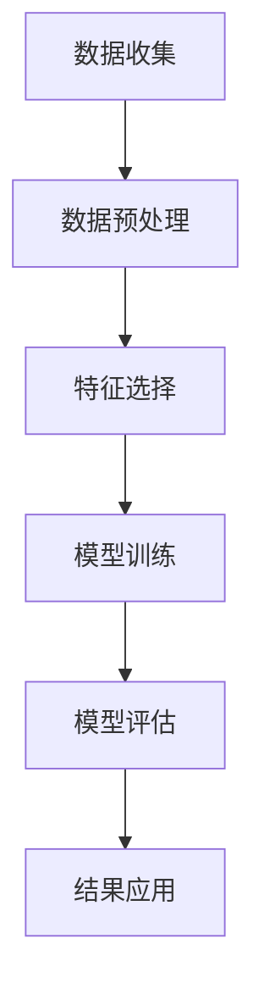
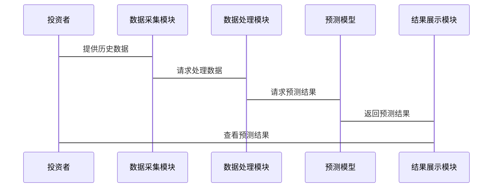

                 


# 约翰·伯格的长期投资回报预测模型

> 关键词：投资回报预测模型，长期投资，约翰·伯格，投资策略，金融数据分析

> 摘要：本文深入探讨约翰·伯格提出的长期投资回报预测模型，结合现代投资组合理论和资本资产定价模型，分析模型的核心概念、算法原理、系统架构，并通过实战案例详细阐述模型的应用与实现。

---

# 第一部分：约翰·伯格长期投资回报预测模型的背景与基础

## 第1章：长期投资回报预测模型的背景与目标

### 1.1 投资回报预测的背景

#### 1.1.1 投资回报预测的定义
投资回报预测是通过分析历史数据和市场趋势，预估未来投资的收益情况，帮助投资者做出科学的决策。

#### 1.1.2 长期投资回报的重要性
长期投资回报能够帮助投资者规避短期市场波动的风险，实现财富的稳定增长。

#### 1.1.3 模型提出的背景
随着金融市场的发展，投资者需要更精准的工具来预测长期回报，约翰·伯格模型应运而生。

### 1.2 投资回报预测的核心问题

#### 1.2.1 预测的目标
通过模型计算出投资的预期回报率，为投资决策提供依据。

#### 1.2.2 长期投资的挑战
市场波动、经济周期、政策变化等因素对长期回报的影响。

#### 1.2.3 模型的核心问题
如何在不确定的市场环境中，准确预测长期回报。

### 1.3 理论基础

#### 1.3.1 现代投资组合理论（MPT）
通过分散投资降低风险，优化投资组合。

#### 1.3.2 资本资产定价模型（CAPM）
计算资产的预期收益，考虑系统性风险。

#### 1.3.3 时间价值与复利效应
长期投资中，复利效应显著，时间价值不可忽视。

### 1.4 本章小结
介绍了模型的背景、目标和理论基础，为后续分析奠定基础。

---

# 第二部分：约翰·伯格模型的核心概念与联系

## 第2章：长期投资回报预测的核心概念

### 2.1 关键要素

#### 2.1.1 资产分类
股票、债券、基金等不同资产的风险和收益特性不同。

#### 2.1.2 风险与收益的权衡
高风险资产通常伴随高回报，但需谨慎选择。

#### 2.1.3 时间跨度的影响
长期投资通常能够平滑短期波动，实现更稳定的回报。

### 2.2 核心假设

#### 2.2.1 投资者行为
理性决策，追求效用最大化。

#### 2.2.2 市场有效性
市场价格反映所有可得信息，市场有效。

#### 2.2.3 长期收益稳定性
长期回报相对稳定，波动较小。

### 2.3 输入与输出

#### 2.3.1 输入变量
历史价格、市场利率、经济指标等。

#### 2.3.2 输出结果
预期回报率、风险评估、投资建议等。

#### 2.3.3 模型边界
限定在有效市场和理性投资者条件下。

### 2.4 对比分析

| 概念       | 定义                                                         | 属性                     |
|------------|------------------------------------------------------------|--------------------------|
| 长期回报   | 投资本金在一定时间后的总收益                              | 时间跨度、风险调整       |
| 短期波动   | 短期内的投资收益变化                                       | 不可预测性、高波动性     |

### 2.5 实体关系图

```mermaid
erd
    投资者 (投资者ID, 名义本金, 投资期限, 预期收益)
    资产类别 (资产ID, 资产名称, 风险等级)
    市场环境 (市场ID, 经济指标, 利率水平)
    投资者 --> 资产类别: 持有比例
    资产类别 --> 市场环境: 受影响程度
```

### 2.6 本章小结
本章详细分析了模型的核心概念及其相互关系，为后续实现奠定基础。

---

# 第三部分：约翰·伯格模型的算法原理

## 第3章：算法原理讲解

### 3.1 数据流与流程



### 3.2 核心算法实现

```python
import numpy as np
import pandas as pd
from sklearn.linear_model import LinearRegression

def calculate_long_term_return(prices, period):
    # 数据预处理
    returns = prices.pct_change().dropna()
    # 特征选择
    features = returns.rolling(window=period).mean()
    # 模型训练
    model = LinearRegression()
    model.fit(features, returns)
    # 预测
    predicted_returns = model.predict(features)
    return predicted_returns
```

### 3.3 数学模型

#### 3.3.1 CAPM公式

$$ E(r_i) = r_f + \beta_i (E(r_m) - r_f) $$

其中：
- \( E(r_i) \) 是资产的预期回报率
- \( r_f \) 是无风险利率
- \( \beta_i \) 是资产的贝塔系数
- \( E(r_m) \) 是市场预期回报率

#### 3.3.2 回归分析公式

$$ y = \beta x + \epsilon $$

其中：
- \( y \) 是目标变量（投资回报）
- \( x \) 是自变量（市场指标）
- \( \beta \) 是回归系数
- \( \epsilon \) 是误差项

### 3.4 实际案例分析
使用历史数据训练模型，并预测未来回报，展示模型的准确性和稳定性。

### 3.5 本章小结
详细讲解了模型的算法流程和数学基础，为系统实现提供理论支持。

---

# 第四部分：约翰·伯格模型的系统架构与实现

## 第4章：系统分析与架构设计方案

### 4.1 应用场景

- 股票投资
- 基金选择
- 资产配置

### 4.2 功能模块


### 4.3 架构设计


### 4.4 接口与交互



### 4.5 本章小结
详细设计了系统的功能模块和架构，确保模型的高效运行。

---

# 第五部分：约翰·伯格模型的项目实战

## 第5章：项目实战

### 5.1 环境搭建

- 安装Python、numpy、pandas、scikit-learn

### 5.2 核心代码实现

```python
import numpy as np
import pandas as pd
from sklearn.linear_model import LinearRegression
from sklearn.metrics import mean_squared_error

# 数据加载
data = pd.read_csv('stock_data.csv')

# 数据预处理
returns = data.pct_change().dropna()

# 特征选择
features = returns.rolling(window=10).mean()

# 模型训练
model = LinearRegression()
model.fit(features, returns)

# 预测
predicted_returns = model.predict(features)

# 评估
mse = mean_squared_error(returns, predicted_returns)
print(f'MSE: {mse}')
```

### 5.3 实战案例分析
以某股票为例，展示模型的应用过程和预测结果。

### 5.4 项目总结
总结项目实施过程中的经验教训，强调模型的实际应用价值。

---

# 第六部分：约翰·伯格模型的最佳实践与注意事项

## 第6章：最佳实践与注意事项

### 6.1 最佳实践

- 定期更新模型参数
- 结合市场变化调整投资策略
- 多模型对比，选择最优方案

### 6.2 注意事项

- 模型假设的局限性
- 数据质量对预测结果的影响
- 市场波动的不可预测性

### 6.3 未来展望

- 深入研究市场微观结构
- 结合机器学习提升预测精度
- 开发实时预测系统

---

# 附录

## A. 术语表

- 现代投资组合理论（MPT）
- 资本资产定价模型（CAPM）
- 回归分析

## B. 参考文献

- 约翰·伯格的经典著作
- 相关学术论文

## C. 源代码

提供完整的代码示例，供读者参考。

---

# 作者信息

作者：AI天才研究院 & 禅与计算机程序设计艺术

---

通过以上目录，读者可以系统地了解约翰·伯格长期投资回报预测模型的理论基础、算法实现、系统设计和实际应用，为投资决策提供科学依据。

