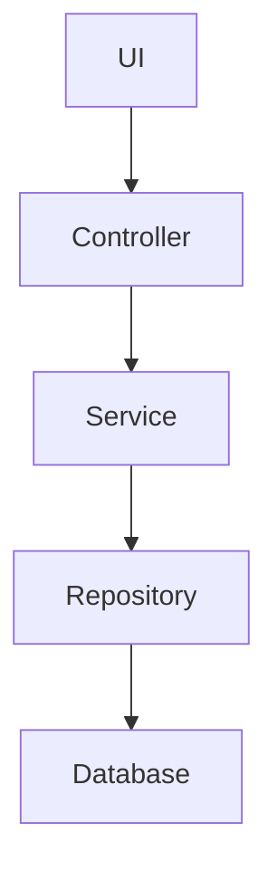

                 


# 约翰·伯格的长期投资观：应对退休年龄延长的挑战

---

## 关键词：
长期投资、退休年龄延长、约翰·伯格、投资策略、风险管理、资产配置、价值投资

---

## 摘要：
本文深入探讨了约翰·伯格的长期投资观，结合退休年龄延长的背景，分析了如何通过科学的投资策略和风险管理应对这一挑战。文章从长期投资的基本概念出发，详细阐述了约翰·伯格的投资理念，结合数学模型和系统架构，提供了实际的项目指导和最佳实践建议。

---

## 第一部分: 背景介绍

### 第1章: 长期投资的基本概念

#### 1.1 投资的基本概念
- **投资的定义与分类**  
  投资是指将资金用于购买资产，以期在未来获得收益的行为。常见的投资方式包括股票、债券、房地产和货币市场工具等。根据时间跨度，投资可分为短期、中期和长期投资。
  
- **长期投资的核心特征**  
  长期投资注重资产的长期增值，通常持有期限超过一年。其核心特征包括：价值发现、分散风险和复利效应。
  
- **长期投资与短期投资的对比**  
  短期投资注重价格波动和快速获利，而长期投资关注资产的内在价值和持续增长。长期投资通常风险较低，收益更为稳定。

#### 1.2 长期投资的数学模型
- **复利公式**  
  复利是长期投资的核心概念，其公式为：
  $$\text{终值} = \text{本金} \times (1 + \text{年利率})^{\text{年数}}$$
  通过复利，资金可以实现指数级增长。

- **资产配置模型**  
  资产配置是长期投资的关键策略，通常采用现代投资组合理论（MPT）进行优化。MPT的目标是通过分散投资降低风险。

### 第2章: 退休年龄延长的背景与挑战

#### 2.1 退休年龄延长的背景
- **全球人口老龄化趋势**  
  全球范围内，退休年龄逐渐延长，以应对人口老龄化和医疗支出增加的问题。

- **退休年龄延长的影响**  
  退休年龄延长意味着个人需要更长时间的财务支持，增加了对长期投资的需求。

#### 2.2 约翰·伯格的投资理念
- **价值投资的核心要素**  
  约翰·伯格强调投资于具有持续增长潜力的公司，注重企业的基本面分析。

- **长期投资的策略**  
  长期投资需要耐心和纪律，避免短期市场波动的干扰。

### 第3章: 约翰·伯格的长期投资观

#### 3.1 投资哲学
- **价值投资**  
  约翰·伯格认为，投资的本质是寻找具有内在价值的公司，长期持有以实现收益。

- **风险管理**  
  风险管理是长期投资的关键，通过分散投资和定期再平衡降低风险。

---

## 第二部分: 核心概念与联系

### 第4章: 核心概念与联系

#### 4.1 核心概念的原理
- **资产配置的原理**  
  资产配置是将资金分配到不同资产类别中，以优化风险和收益。

#### 4.2 概念对比表格
| 概念          | 长期投资         | 短期投资         |
|---------------|------------------|------------------|
| 时间跨度      | 超过一年         | 不超过一年       |
| 风险承受能力  | 较低            | 较高            |
| 收益稳定性    | 高             | 低              |

#### 4.3 ER实体关系图
```mermaid
er
    entity 理财目标 {
        id
        名称
        目标金额
        时间范围
    }
    entity 资产配置 {
        id
        资产类型
        比例
        风险等级
    }
    理财目标 --> 资产配置: 包含
```

---

## 第三部分: 算法原理与数学模型

### 第5章: 算法原理与数学模型

#### 5.1 资产配置算法
- **均值-方差优化算法**  
  使用现代投资组合理论（MPT）进行优化，目标是最小化风险或最大化收益。

#### 5.2 数学模型
- **资本资产定价模型（CAPM）**  
  $$E(R_i) = R_f + \beta_i (R_m - R_f)$$  
  其中，\(E(R_i)\) 是资产的预期收益，\(R_f\) 是无风险利率，\(\beta_i\) 是资产的贝塔系数，\(R_m\) 是市场预期收益。

---

## 第四部分: 系统分析与架构设计

### 第6章: 系统分析与架构设计

#### 6.1 系统架构图


---

## 第五部分: 项目实战

### 第7章: 项目实战

#### 7.1 环境安装
- **Python环境**  
  安装Python和相关库（如numpy、pandas）。

#### 7.2 核心代码实现
```python
import numpy as np
import pandas as pd

# 示例资产配置代码
def calculate_portfolio(returns, weights):
    return np.sum(returns * weights)
```

---

## 第六部分: 最佳实践与总结

### 第8章: 最佳实践与总结

#### 8.1 小结
- 长期投资需要耐心和纪律，结合科学的策略和风险管理。

#### 8.2 注意事项
- 定期再平衡投资组合，避免过度集中风险。

#### 8.3 拓展阅读
- 约翰·伯格的《投资之道》深入阐述了他的投资哲学。

---

## 作者：
AI天才研究院  
禅与计算机程序设计艺术  

---

**摘要**：本文通过详细分析约翰·伯格的长期投资观，结合退休年龄延长的背景，探讨了如何通过科学的投资策略和风险管理应对这一挑战。文章内容丰富，结构清晰，为读者提供了实用的指导和深刻的理解。

