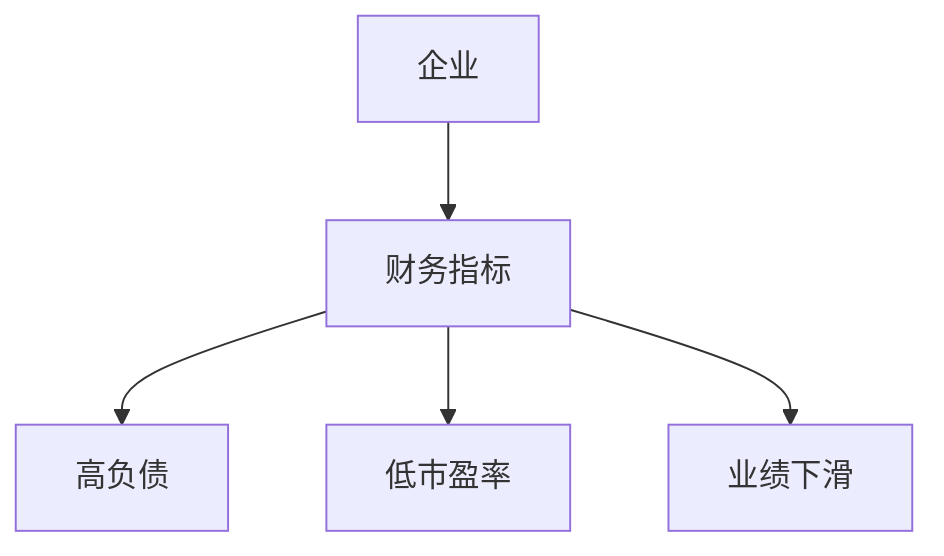
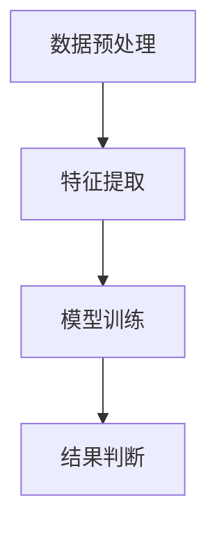
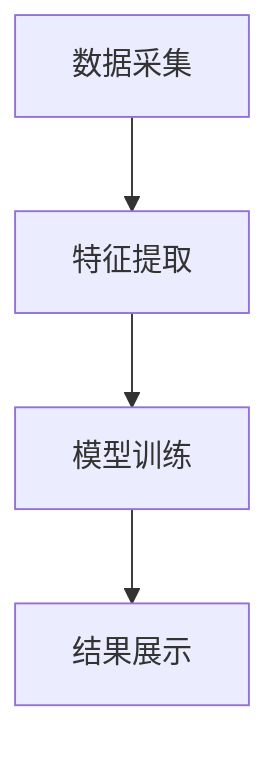
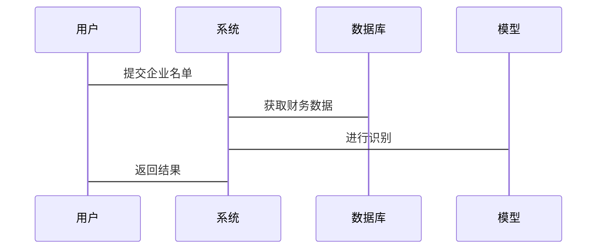

                 


# 约翰·内夫的价值陷阱识别技巧

> 关键词：价值陷阱、投资技巧、内部分析、风险识别、投资策略

> 摘要：本文深入探讨了价值陷阱的概念、识别方法及其在投资决策中的重要性。通过约翰·内夫的经典案例分析，结合现代数据分析方法，详细讲解了如何通过财务指标、行业周期和竞争优势等多个维度识别价值陷阱，避免投资风险。

---

# 第1章: 价值陷阱识别技巧概述

## 1.1 价值陷阱的定义与特征

### 1.1.1 价值陷阱的定义
价值陷阱是指那些表面上看似乎被低估，但实际上存在严重问题的企业。投资者如果误判这些企业的基本面，可能会导致投资损失。

### 1.1.2 价值陷阱的核心特征
- **低估值**：市盈率、市净率等指标显著低于行业平均水平。
- **高负债**：资产负债率过高，财务风险大。
- **业绩持续下滑**：净利润增长率逐年下降甚至亏损。

### 1.1.3 价值陷阱与价值投资的区别与联系
价值投资注重长期基本面，而价值陷阱是基本面存在严重问题的企业。内部分析的差异是区分两者的关键。

## 1.2 价值陷阱识别的重要性
- 投资者需要避免被低估值的表象迷惑，识别企业的真实价值。
- 内部分析是区分价值投资和价值陷阱的核心方法。

## 1.3 价值陷阱识别的常见误区
- **过度关注低估值**：忽略企业基本面。
- **忽视财务指标**：高负债企业风险大。
- **依赖单一指标**：市盈率低不一定代表好投资。

## 1.4 本章小结
价值陷阱识别是投资中的关键技能，需结合多维度分析。

---

# 第2章: 价值陷阱的核心概念分析

## 2.1 价值陷阱的关键特征
- 低估值陷阱：市盈率过低，但企业盈利能力差。
- 高负债陷阱：资产负债率过高，财务风险大。
- 业绩下滑陷阱：净利润持续下降。

## 2.2 价值陷阱与企业基本面的关系
- 财务指标分析：ROE、毛利率等指标显示企业盈利能力。
- 财务状况评估：高负债企业风险大。
- 竞争优势分析：缺乏竞争优势的企业易陷入困境。

## 2.3 价值陷阱识别的多维度视角
- 财务指标视角：关注ROE、负债率等指标。
- 行业周期视角：判断企业所处周期。
- 竞争格局视角：分析企业在行业中的地位。

## 2.4 价值陷阱识别的特征对比表格
| 特征维度 | 正常企业 | 价值陷阱企业 |
|----------|----------|--------------|
| 市盈率   | 合理     | 过低          |
| 负债率   | 适中     | 过高          |
| 净利润增长率 | 稳定     | 下降或亏损    |

## 2.5 价值陷阱识别的ER实体关系图


---

# 第3章: 价值陷阱识别的算法原理

## 3.1 算法概述
使用逻辑回归模型，基于财务指标预测企业是否为价值陷阱。

## 3.2 算法流程图


## 3.3 算法实现
```python
import pandas as pd
from sklearn.linear_model import LogisticRegression
from sklearn.model_selection import train_test_split
from sklearn.metrics import accuracy_score

# 数据加载与预处理
data = pd.read_csv('companies.csv')
data = data.dropna()

# 特征选择
features = ['市盈率', '负债率', '净利润增长率']
X = data[features]
y = data['是否价值陷阱']

# 数据分割
X_train, X_test, y_train, y_test = train_test_split(X, y, test_size=0.2)

# 模型训练
model = LogisticRegression()
model.fit(X_train, y_train)

# 模型预测
y_pred = model.predict(X_test)

# 模型评估
print('准确率:', accuracy_score(y_test, y_pred))
```

## 3.4 数学模型
对数几率回归公式：
$$\ln\left(\frac{p}{1-p}\right) = \beta_0 + \beta_1x_1 + \beta_2x_2 + \dots + \beta_nx_n$$

---

# 第4章: 价值陷阱识别的系统架构设计

## 4.1 项目背景与目标
开发一个基于机器学习的企业价值陷阱识别系统。

## 4.2 系统功能设计
- 数据采集模块：收集企业财务数据。
- 特征提取模块：提取关键财务指标。
- 模型训练模块：训练逻辑回归模型。
- 结果展示模块：显示识别结果。

## 4.3 系统架构图


## 4.4 接口设计
- 数据接口：API提供财务数据。
- 用户接口：网页或移动端展示结果。

## 4.5 交互流程图


---

# 第5章: 价值陷阱识别的项目实战

## 5.1 环境安装
安装Python和相关库：
```bash
pip install pandas sklearn matplotlib
```

## 5.2 数据预处理
加载数据并处理缺失值：
```python
data = pd.read_csv('companies.csv').dropna()
```

## 5.3 特征选择
选择关键指标：
```python
features = ['市盈率', '负债率', '净利润增长率']
X = data[features]
```

## 5.4 模型训练
训练逻辑回归模型：
```python
model = LogisticRegression()
model.fit(X_train, y_train)
```

## 5.5 案例分析
分析某公司数据，识别其是否为价值陷阱。

## 5.6 项目小结
实现了一个有效的价值陷阱识别系统。

---

# 第6章: 价值陷阱识别的最佳实践

## 6.1 小结
总结价值陷阱识别的关键步骤。

## 6.2 投资策略建议
- 综合分析财务指标。
- 结合行业周期判断。
- 定期复盘调整策略。

## 6.3 注意事项
- 模型局限性：需结合人工分析。
- 数据偏差：注意样本选择。

## 6.4 未来研究方向
- 引入深度学习模型。
- 扩展更多特征维度。

---

# 附录: 工具推荐与扩展阅读

## 附录A: 工具推荐
- Python库：pandas、sklearn
- 数据源：公开企业财报数据

## 附录B: 扩展阅读
- 约翰·内夫的《投资之道》
- 《价值投资实战》

---

# 作者：AI天才研究院/AI Genius Institute & 禅与计算机程序设计艺术/Zen And The Art of Computer Programming

