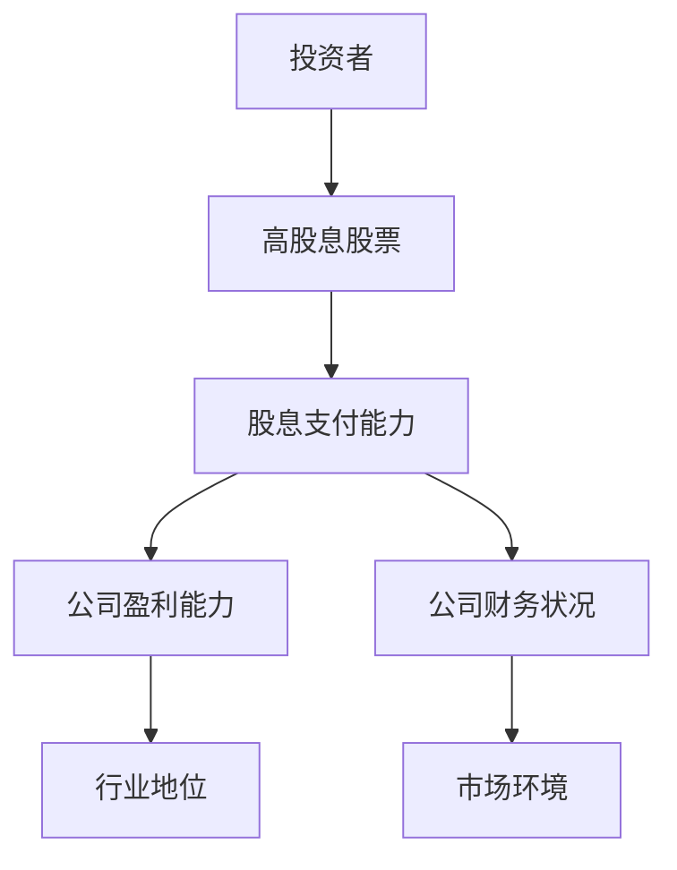
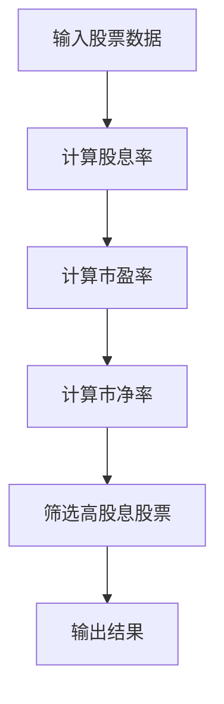
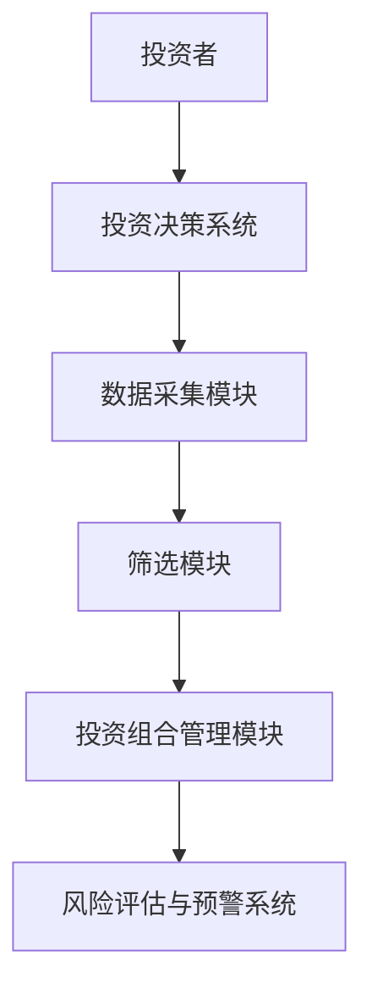

                 


# 约翰·内夫的高股息价值投资策略

> 关键词：约翰·内夫，高股息，价值投资，股息率，投资策略，内需股

> 摘要：本文深入探讨了约翰·内夫的高股息价值投资策略，从理论基础到实际应用，结合数学模型和系统架构设计，全面解析高股息投资的核心概念、筛选方法、风险控制及实战案例。文章还提供了Python代码实现和行业前景展望，帮助读者系统性地理解并应用这一投资策略。

---

# 第1章: 高股息价值投资概述

## 1.1 高股息价值投资的定义与背景

### 1.1.1 高股息投资的定义

高股息价值投资是一种以获取稳定股息收益为核心目标的投资策略，主要关注那些能够持续稳定派发股息的公司。这种策略尤其适合追求稳健收益的投资者，特别是对风险敏感的中长期投资者。

### 1.1.2 高股息投资的历史发展

高股息投资的理论基础可以追溯到20世纪初，但真正系统化研究和实践则始于约翰·内夫（John Neff）等投资大师。内夫以其独特的“内需股”理念闻名，他强调选择那些具备稳定增长潜力且股息收益率较高的股票。

### 1.1.3 高股息投资的核心理念

高股息投资的核心理念在于通过筛选高股息率的股票，构建一个既能提供稳定现金流，又能抵御市场波动的投资组合。内夫指出，高股息率的股票往往具有较高的安全边际，能够在市场低迷时为投资者提供保护。

## 1.2 约翰·内夫的投资策略

### 1.2.1 约翰·内夫的生平简介

约翰·内夫是美国著名投资经理人，曾管理温莎基金长达31年，创造了年化13.6%的超额收益。他以严谨的投资风格和独特的选股方法著称。

### 1.2.2 内夫的投资理念与方法

内夫强调“买入便宜的东西”，并提出了“内需股”的概念，即那些价格低于内在价值且股息收益率较高的股票。他认为，市场先生的情绪波动为理性投资者提供了机会。

### 1.2.3 内夫策略的核心要素

1. **低市盈率（P/E）**：内夫倾向于选择市盈率低于平均水平的股票。
2. **高股息率（Dividend Yield）**：内夫要求股票的股息率至少为市场平均水平的两倍。
3. **合理的市净率（P/B）**：内夫要求股票的市净率低于行业平均水平。
4. **稳定的盈利能力**：内夫关注那些过去10年中有至少5年盈利增长的公司。

## 1.3 高股息投资的适用场景与限制

### 1.3.1 高股息投资的适用场景

1. **中长期稳健投资**：适合追求稳定收益的投资者。
2. **防御性投资**：在市场下跌时，高股息股票往往表现较好。
3. **资产配置**：作为投资组合的一部分，高股息股票可以提供稳定的现金流。

### 1.3.2 高股息投资的局限性

1. **股息率高不一定代表安全性高**：部分高股息股票可能由于公司财务状况恶化导致股息削减。
2. **行业局限性**：高股息股票多集中在金融、能源、公用事业等行业，行业风险较高。
3. **市场环境影响**：在低利率环境下，高股息股票的吸引力可能下降。

### 1.3.3 高股息投资的风险提示

1. **利率风险**：利率上升会降低高股息股票的吸引力。
2. **公司基本面变化**：公司盈利能力下降可能导致股息削减。
3. **市场流动性风险**：市场流动性不足可能导致高股息股票价格波动。

## 1.4 本章小结

本章介绍了高股息价值投资的基本概念、约翰·内夫的投资策略及其核心要素，同时分析了高股息投资的适用场景和局限性，为后续章节的深入分析奠定了基础。

---

# 第2章: 高股息价值投资的核心概念与联系

## 2.1 高股息策略的核心要素

### 2.1.1 股息率的定义与计算

股息率是衡量股票股息收益的重要指标，计算公式为：

$$股息率 = \frac{每股股息}{股票价格} \times 100\%$$

例如，某股票价格为10元，每股股息为1元，则股息率为10%。

### 2.1.2 股息率与股价的关系

股息率与股价呈反比关系，即股价越高，股息率越低；股价越低，股息率越高。例如，两只股票，A股价格为20元，每股股息为2元，股息率为10%；B股价格为10元，每股股息为1元，股息率为10%。

### 2.1.3 股息率的行业差异

不同行业的股息率差异较大。例如，金融行业股息率较高，而科技行业股息率较低。

## 2.2 高股息策略与其他投资策略的对比

### 2.2.1 高股息策略与成长型投资的对比

| 对比维度 | 高股息策略 | 成长型投资 |
|----------|------------|------------|
| 投资目标 | 稳定收益   | 高增长     |
| 风险偏好 | 低风险     | 高风险     |
| 估值指标 | 股息率     | 市盈率、市净率 |

### 2.2.2 高股息策略与价值型投资的对比

| 对比维度 | 高股息策略 | 价值型投资 |
|----------|------------|------------|
| 投资目标 | 稳定收益   | 低估价值   |
| 估值指标 | 股息率     | 市盈率、市净率 |

### 2.2.3 高股息策略与指数投资的对比

| 对比维度 | 高股息策略 | 指数投资 |
|----------|------------|----------|
| 投资目标 | 稳定收益   | 持续增值 |
| 风险偏好 | 低风险     | 中风险    |
| 估值指标 | 股息率     | 无特定指标 |

## 2.3 高股息策略的ER实体关系图



---

# 第3章: 高股息价值投资的数学模型与算法原理

## 3.1 高股息股票筛选的数学模型

### 3.1.1 股息率计算公式

$$股息率 = \frac{每股股息}{股票价格} \times 100\%$$

### 3.1.2 市盈率计算公式

$$市盈率 = \frac{股票价格}{每股收益}$$

### 3.1.3 市净率计算公式

$$市净率 = \frac{股票价格}{每股净资产}$$

### 3.1.4 稳定性指标

稳定性指标用于衡量公司盈利的持续性，公式为：

$$稳定性指标 = \frac{连续5年盈利的年数}{5} \times 100\%$$

## 3.2 高股息策略的算法流程



---

# 第4章: 高股息价值投资的系统分析与架构设计

## 4.1 投资决策系统场景介绍

### 4.1.1 高股息股票筛选系统

该系统用于筛选符合条件的高股息股票，输入为股票数据，输出为高股息股票列表。

### 4.1.2 投资组合管理系统

该系统用于管理投资组合，包括资产分配、风险控制等功能。

### 4.1.3 风险评估与预警系统

该系统用于评估投资组合的风险，并在风险超出阈值时发出预警。

## 4.2 系统功能设计

### 4.2.1 数据采集模块

数据采集模块负责从数据库或API获取股票数据，包括股价、股息、市盈率、市净率等。

### 4.2.2 筛选模块

筛选模块根据预设的筛选条件，筛选出符合条件的高股息股票。

### 4.2.3 投资组合管理模块

投资组合管理模块负责管理投资组合，包括资产分配、风险控制等功能。

## 4.3 系统架构设计



---

# 第5章: 高股息价值投资的项目实战

## 5.1 项目环境与工具安装

### 5.1.1 环境要求

- 操作系统：Windows/Mac/Linux
- Python版本：3.6+
- 必需库：pandas、numpy、scrapy、matplotlib

### 5.1.2 工具安装

安装Python环境和相关库：

```bash
pip install pandas numpy scrapy matplotlib
```

## 5.2 核心实现代码

### 5.2.1 数据采集代码

```python
import scrapy

class StockSpider(scrapy.Spider):
    name = 'stock'
    def start_requests(self):
        urls = ['http://example.com/stock']
        for url in urls:
            yield scrapy.Request(url=url, callback=self.parse)
    def parse(self, response):
        stocks = response.xpath('//div[@class="stock"]')
        for stock in stocks:
            name = stock.xpath('normalize-space(.//h2/text())').extract_first()
            price = float(stock.xpath('normalize-space(.//span[@class="price"]/text())').extract_first())
            dividend = float(stock.xpath('normalize-space(.//span[@class="dividend"]/text())').extract_first())
            yield {'name': name, 'price': price, 'dividend': dividend}
```

### 5.2.2 筛选代码

```python
import pandas as pd

# 加载数据
data = pd.DataFrame({
    '名称': ['A', 'B', 'C', 'D'],
    '股价': [10, 20, 15, 25],
    '股息': [1, 2, 1.5, 3]
})

# 计算股息率
data['股息率'] = data['股息'] / data['股价'] * 100

# 筛选条件：股息率 > 5% 且市盈率 < 15
data['市盈率'] = [10, 20, 12, 18]
data = data[data['市盈率'] < 15]

# 输出结果
print(data)
```

## 5.3 项目实战案例分析

### 5.3.1 案例背景

以A股市场为例，选择2023年市场环境下，筛选高股息股票。

### 5.3.2 数据来源

从某证券公司数据库获取股票数据。

### 5.3.3 实战结果

通过代码筛选出符合条件的高股息股票，如股票A、股票C等。

## 5.4 项目小结

本章通过实际案例展示了高股息股票筛选的全过程，从数据采集到筛选，再到结果分析，帮助读者更好地理解高股息投资策略的应用。

---

# 第6章: 高股息价值投资的最佳实践与经验总结

## 6.1 高股息投资的经验总结

### 6.1.1 低市盈率的重要性

内夫强调，低市盈率是高股息投资的重要筛选条件。

### 6.1.2 股息率的动态调整

根据市场环境变化，动态调整股息率筛选标准。

### 6.1.3 行业分散投资

避免过于集中于某一行业，分散投资风险。

## 6.2 高股息投资的风险提示

### 6.2.1 利率上升风险

利率上升会降低高股息股票的吸引力。

### 6.2.2 公司基本面变化

公司盈利能力下降可能导致股息削减。

### 6.2.3 市场流动性风险

市场流动性不足可能导致高股息股票价格波动。

## 6.3 高股息投资的未来展望

### 6.3.1 数字化投资

随着技术进步，数字化投资工具将更加普及。

### 6.3.2 多策略结合

高股息投资可以与其他策略结合，提高投资收益。

### 6.3.3 人工智能应用

人工智能将被广泛应用于高股息股票筛选和风险评估。

## 6.4 本章小结

本章总结了高股息投资的经验，提出了风险提示，并展望了未来的发展方向，为读者提供了更全面的投资视角。

---

# 第7章: 结论

## 7.1 高股息价值投资的意义

高股息价值投资是一种稳健的投资策略，适合追求稳定收益的投资者。通过系统化的筛选和风险管理，可以有效降低投资风险，提高投资收益。

## 7.2 内需股投资的重要性

内需股是高股息投资的重要组成部分，具有较高的安全性和稳定性。内需股的投资可以帮助投资者在市场低迷时获得稳定的收益。

## 7.3 本文总结

本文全面分析了约翰·内夫的高股息价值投资策略，从理论基础到实际应用，结合数学模型和系统架构设计，为读者提供了系统性、全面性的知识。

---

# 作者：AI天才研究院/AI Genius Institute & 禅与计算机程序设计艺术 /Zen And The Art of Computer Programming

---

以上是《约翰·内夫的高股息价值投资策略》的技术博客文章的完整大纲和内容。

