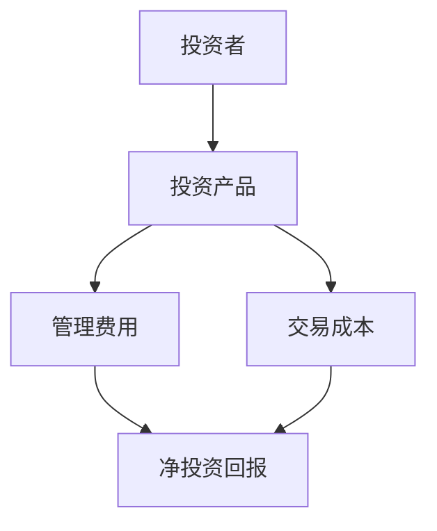
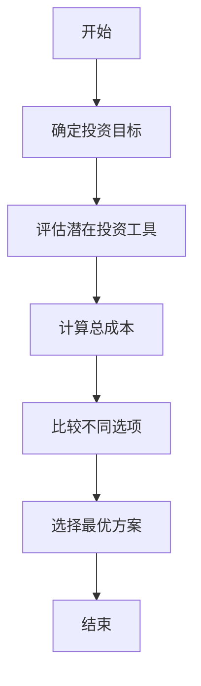
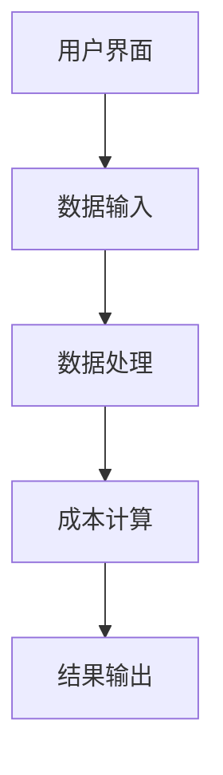

                 

# 约翰·博格尔的成本意识：长期投资成功的关键

---

## 关键词：
约翰·博格尔, 成本意识, 长期投资, 投资成功, 投资成本, 费用率, 投资回报

---

## 摘要：
本文深入探讨了约翰·博格尔的成本意识理念，分析了成本意识如何成为长期投资成功的关键因素。通过理论分析、数学建模、系统设计和实际案例，本文揭示了成本在投资决策中的重要性，展示了如何通过低成本策略实现投资收益最大化。文章还提供了具体的算法模型和系统架构，帮助读者理解成本意识的实际应用。

---

## 第一部分：成本意识的背景与重要性

### 第1章：成本意识的核心概念

#### 1.1 成本意识的定义与背景
- 1.1.1 成本意识的定义
  成本意识是指在投资过程中对各种费用的敏感性和关注度，包括管理费、交易费、税收等。它强调通过降低成本来提高净回报率。
- 1.1.2 成本意识在投资中的重要性
  成本是投资回报的主要侵蚀因素之一，尤其是在长期投资中，成本的累积效应会显著影响最终收益。
- 1.1.3 成本意识与长期投资成功的关系
  低成本策略是实现长期投资成功的关键，因为它能够最大化投资组合的复利效应。

#### 1.2 成本意识的核心要素
- 1.2.1 成本在投资决策中的作用
  成本直接影响投资组合的净回报率，高成本会降低投资的实际收益。
- 1.2.2 成本与投资回报的关联
  高成本投资工具通常会侵蚀复利效应，而低成本工具能够更好地实现财富增长。
- 1.2.3 成本意识与风险管理
  成本意识不仅关注收益，还关注风险控制，低成本策略有助于降低投资组合的整体风险。

#### 1.3 成本意识的边界与外延
- 1.3.1 成本意识的适用范围
  成本意识适用于所有类型的投资，包括股票、债券、基金和房地产等。
- 1.3.2 成本意识与其他投资原则的关系
  成本意识与价值投资、长期投资等原则相辅相成，共同构成成功的投资策略。
- 1.3.3 成本意识的局限性
  成本意识并不是万能的，它需要结合市场环境和投资目标灵活运用。

---

## 第二部分：成本意识的核心概念与联系

### 第2章：成本意识的原理与特征

#### 2.1 成本意识的原理
- 2.1.1 成本如何影响投资回报
  成本会直接从投资回报中扣除，高成本会导致净回报率下降，从而影响复利效应。
- 2.1.2 成本与投资风险的相互作用
  高成本投资工具通常具有较高的波动性和风险，而低成本工具则更稳定。
- 2.1.3 成本在不同资产类别中的表现
  不同资产类别的成本结构不同，例如股票交易成本较高，而债券交易成本较低。

#### 2.2 成本意识的特征对比
- 2.2.1 成本的可变性与固定性
  成本可以分为可变成本（如交易费用）和固定成本（如管理费用）。
- 2.2.2 成本的显性与隐性
  显性成本是直接可见的费用，隐性成本包括税收和机会成本。
- 2.2.3 成本的时间价值与机会成本
  成本的时间价值是指资金因支付成本而失去的再投资机会，机会成本是未投资于更高回报项目的损失。

#### 2.3 成本意识的ER实体关系图

---

## 第三部分：成本意识的算法原理

### 第3章：成本影响的数学模型

#### 3.1 成本对投资回报的数学公式
- 3.1.1 投资回报公式
  $$回报 = 资产增值 - 成本$$
- 3.1.2 成本对复利的影响
  $$最终回报 = (初始金额 \times (1 + 净回报率)^n) - 总成本$$

#### 3.2 成本优化的算法流程

---

## 第四部分：成本意识的系统分析与架构

### 第4章：投资成本分析系统

#### 4.1 系统功能设计
- 4.1.1 数据收集模块
  - 收集投资产品的费用率、税收成本等数据。
- 4.1.2 成本计算模块
  - 计算总成本和净回报。
- 4.1.3 比较分析模块
  - 生成成本对比报告。

#### 4.2 系统架构设计

---

## 第五部分：低成本投资策略与实践

### 第5章：低成本投资组合构建

#### 5.1 资产配置策略
- 5.1.1 分散投资以降低风险
  - 通过分散投资降低单一资产的风险。
- 5.1.2 选择低成本指数基金
  - 指数基金通常具有较低的管理费用和交易费用。
- 5.1.3 定期再平衡投资组合
  - 定期调整投资组合以保持目标配置比例。

#### 5.2 成本优化工具
- 5.2.1 使用在线计算器评估成本
  - 使用投资成本计算器估算不同投资工具的总成本。
- 5.2.2 比较不同基金的费用比率
  - 选择费用比率低的基金。
- 5.2.3 利用税收优惠降低成本
  - 利用税收优惠政策降低投资成本。

---

## 第六部分：案例分析与实际应用

### 第6章：成本意识的实际案例

#### 6.1 案例分析
- 案例背景：投资者A计划投资100万元，选择两种不同的投资工具。
- 投资工具1：费用率为1.5%，年回报率8%。
- 投资工具2：费用率为0.5%，年回报率7%。
- 计算结果：
  - 投资工具1的净回报率为6.5%，最终回报为$100万 \times (1 + 0.065)^{10} - 总成本$。
  - 投资工具2的净回报率为6.5%，最终回报为$100万 \times (1 + 0.065)^{10} - 总成本$。
- 结论：低成本工具在长期投资中表现更优。

---

## 小结

本文通过理论分析、数学建模、系统设计和案例分析，全面探讨了约翰·博格尔的成本意识理念。成本意识不仅是长期投资成功的关键，也是实现财富增长的重要策略。通过低成本投资组合构建和优化，投资者可以最大化投资回报，实现财务自由。

---

## 作者：AI天才研究院/AI Genius Institute & 禅与计算机程序设计艺术 /Zen And The Art of Computer Programming

