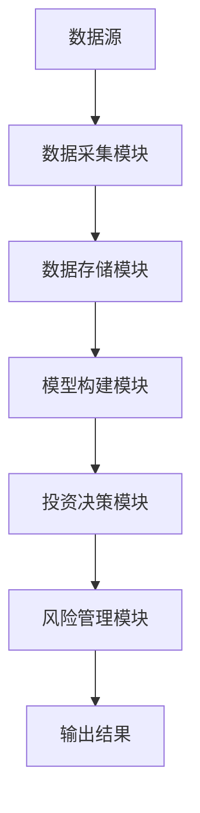

                 


# 约翰·博格尔的成本敏感型价值投资：长期回报的关键

> 关键词：价值投资、长期回报、成本敏感、市场分析、风险管理、投资策略

> 摘要：本文深入探讨了约翰·博格尔的成本敏感型价值投资策略，分析其核心概念、数学模型、系统架构及实际应用。通过系统分析和案例研究，揭示了成本敏感型价值投资在现代投资中的重要性及其对长期回报的影响。

---

# 第一部分: 价值投资的背景与基础

# 第1章: 价值投资的定义与核心理念

## 1.1 投资的基本概念

### 1.1.1 投资的定义与分类

投资是指将资金投入某个项目或资产，以期获得未来收益的行为。根据投资对象的不同，可以分为股票、债券、房地产等多种类型。股票投资是最常见的形式之一，也是本文的核心关注点。

### 1.1.2 价值投资的起源与发展

价值投资由本杰明·格雷厄姆和戴维·多德提出，强调以低于内在价值的价格购买股票。约翰·博格尔继承并发展了这一理念，提出了成本敏感型价值投资，更加注重交易成本和市场效率对投资回报的影响。

### 1.1.3 价值投资的核心理念

价值投资的核心理念是寻找市场价格低于内在价值的股票，通过长期持有实现超额收益。其成功的关键在于对市场短期波动的忽视和对长期基本面的关注。

## 1.2 价值投资的哲学基础

### 1.2.1 市场的有效性与非有效性

市场有效性假说认为市场价格反映所有可获得信息，但现实中市场常常存在非理性波动，为价值投资者提供了机会。

### 1.2.2 投资者的心态与行为

投资者的心理偏差（如过度自信、从众心理）可能导致市场波动，价值投资者需克服这些偏差，坚持理性决策。

### 1.2.3 长期投资与价值发现

长期投资是价值投资的核心策略，通过时间的积累，内在价值的增长将转化为股价的上涨，为投资者带来收益。

## 1.3 价值投资的关键原则

### 1.3.1 安全边际的概念

安全边际是指市场价格低于内在价值的程度，是价值投资的重要指标。通过安全边际，投资者可以降低市场波动带来的风险。

### 1.3.2 股价与内在价值的关系

股价围绕内在价值波动，内在价值是决定长期收益的关键因素。价值投资者关注内在价值的计算和评估。

### 1.3.3 股票市场的短期波动与长期趋势

市场短期波动由情绪和噪声驱动，而长期趋势则由企业基本面决定。价值投资者需区分短期波动和长期趋势。

## 1.4 本章小结

价值投资是一种基于基本面分析的长期投资策略，强调安全边际和内在价值。其成功依赖于市场非有效性和投资者心理偏差的利用。

---

# 第二部分: 成本敏感型价值投资的理论与方法

# 第2章: 成本敏感型价值投资的定义与特点

## 2.1 成本敏感型投资的定义

### 2.1.1 成本敏感型投资的定义

成本敏感型价值投资是价值投资的一种变体，强调在投资决策中考虑交易成本和市场效率，以优化投资组合的回报。

### 2.1.2 成本敏感型投资与传统价值投资的区别

传统价值投资侧重于寻找市场价格低于内在价值的股票，而成本敏感型投资则进一步考虑交易成本、税收和市场冲击等因素，以优化投资成本。

### 2.1.3 成本敏感型投资的核心要素

- 交易成本：包括佣金、税费和市场冲击。
- 市场效率：市场信息流动的速度和成本。
- 投资组合优化：通过降低总成本提高净收益。

## 2.2 成本敏感型投资的理论基础

### 2.2.1 成本敏感型投资的经济学原理

交易成本是经济学中的一个重要概念，影响资产定价和投资决策。成本敏感型投资将交易成本纳入资产定价模型，以优化投资组合。

### 2.2.2 成本敏感型投资的数学模型

#### 2.2.2.1 成本敏感型资产定价模型

$$ P = V - C $$

其中，P为市场价格，V为内在价值，C为交易成本。

#### 2.2.2.2 投资组合成本优化模型

$$ \text{Minimize} \sum_{i=1}^n w_i c_i $$

其中，$w_i$为第i个资产的权重，$c_i$为第i个资产的交易成本。

### 2.2.3 成本敏感型投资与市场周期的关系

市场周期影响交易成本和投资机会。在熊市中，交易成本相对较低，但在牛市中，交易成本可能上升。

## 2.3 成本敏感型投资的关键指标

### 2.3.1 市盈率（P/E）分析

市盈率是股票价格与每股收益的比率，用于评估股票的估值。

$$ P/E = \frac{P}{E} $$

### 2.3.2 市净率（P/B）分析

市净率是股票价格与每股净资产的比率，用于评估股票的估值。

$$ P/B = \frac{P}{B} $$

### 2.3.3 股息率与股息增长分析

股息率是股票的股息与股价的比率，用于评估股票的收益能力。

$$ \text{Dividend Yield} = \frac{D}{P} $$

## 2.4 本章小结

成本敏感型价值投资在传统价值投资的基础上，加入了交易成本和市场效率的考量，优化了投资组合的回报。

---

# 第三部分: 成本敏感型价值投资的系统分析与架构设计

# 第3章: 投资系统的架构与功能设计

## 3.1 投资系统的需求分析

### 3.1.1 系统目标与范围

系统目标：实现成本敏感型价值投资的分析和决策支持。

系统范围：包括数据采集、模型构建、投资决策和风险管理。

### 3.1.2 系统功能模块划分

- 数据采集模块：收集市场数据。
- 模型构建模块：评估内在价值和交易成本。
- 投资决策模块：生成投资组合。
- 风险管理模块：监控和调整投资组合。

### 3.1.3 系统性能需求

- 数据处理速度：实时或准实时处理。
- 计算精度：高精度计算。
- 可扩展性：支持大规模数据处理。

## 3.2 投资系统的架构设计

### 3.2.1 系统架构图



### 3.2.2 模块功能描述

- 数据采集模块：从市场数据源获取数据。
- 数据存储模块：存储和管理数据。
- 模型构建模块：计算内在价值和交易成本。
- 投资决策模块：生成投资组合。
- 风险管理模块：监控和调整投资组合。

## 3.3 投资系统的功能实现

### 3.3.1 数据采集与处理

数据采集模块通过API接口获取市场数据，包括股票价格、财务数据等。

### 3.3.2 模型构建与分析

模型构建模块使用成本敏感型价值投资模型计算内在价值和交易成本，生成投资决策建议。

### 3.3.3 系统输出与反馈

系统输出投资组合建议，并根据市场变化动态调整。

## 3.4 本章小结

投资系统的架构设计为成本敏感型价值投资提供了技术支持，优化了投资决策过程。

---

# 第四部分: 成本敏感型价值投资的数学模型与算法原理

# 第4章: 成本敏感型价值投资的数学模型

## 4.1 市盈率模型

### 4.1.1 市盈率公式

$$ P/E = \frac{P}{E} $$

其中，P为股价，E为每股收益。

### 4.1.2 市盈率的应用与限制

市盈率适用于盈利稳定的公司，但在亏损公司中可能无效。

## 4.2 市净率模型

### 4.2.1 市净率公式

$$ P/B = \frac{P}{B} $$

其中，P为股价，B为每股净资产。

### 4.2.2 市净率的适用场景

市净率适用于净资产驱动的公司，如银行和房地产公司。

## 4.3 股息率模型

### 4.3.1 股息率公式

$$ \text{Dividend Yield} = \frac{D}{P} $$

其中，D为股息，P为股价。

### 4.3.2 股息率的计算与应用

股息率用于评估股票的收益能力，适用于稳定分红的公司。

## 4.4 投资组合优化模型

### 4.4.1 投资组合优化公式

$$ \text{Maximize} \sum_{i=1}^n w_i r_i $$

$$ \text{Subject to} \sum_{i=1}^n w_i = 1 $$

其中，$w_i$为第i个资产的权重，$r_i$为第i个资产的预期收益。

### 4.4.2 成本敏感型投资组合优化

$$ \text{Minimize} \sum_{i=1}^n w_i c_i $$

其中，$c_i$为第i个资产的交易成本。

## 4.5 本章小结

数学模型为成本敏感型价值投资提供了理论支持，优化了投资组合的回报。

---

# 第五部分: 成本敏感型价值投资的项目实战

# 第5章: 成本敏感型价值投资的实战分析

## 5.1 环境安装与配置

### 5.1.1 系统环境

- 操作系统：Linux/Windows/macOS
- 编程语言：Python 3.8+
- 开发工具：Jupyter Notebook
- 数据源：Yahoo Finance API

### 5.1.2 安装依赖库

```bash
pip install pandas numpy matplotlib yfinance
```

## 5.2 系统核心实现源代码

### 5.2.1 数据采集代码

```python
import yfinance as yf
import pandas as pd

# 下载数据
data = yf.download('AAPL', start='2020-01-01', end='2023-12-31')

# 数据预处理
data['MA_20'] = data['Close'].rolling(20).mean()
```

### 5.2.2 模型构建代码

```python
def calculate_intrinsic_value(stock_data, growth_rate=0.05):
    # 计算内在价值
    return stock_data['Earnings'].iloc[-1] / (0.1 - growth_rate)
```

### 5.2.3 投资决策代码

```python
def cost_sensitive_investment(data, threshold=0.2):
    # 计算安全边际
    margin_of_safety = data['Intrinsic Value'] * (1 - threshold)
    return data[data['Price'] < margin_of_safety]
```

## 5.3 代码应用解读与分析

### 5.3.1 数据采集与预处理

通过Yahoo Finance API获取股票数据，并计算20日移动平均线。

### 5.3.2 内在价值计算

使用简化模型计算股票的内在价值，考虑了收益增长率和贴现率。

### 5.3.3 投资决策

通过安全边际筛选出值得投资的股票，优化了交易成本。

## 5.4 实际案例分析

### 5.4.1 案例背景

以苹果公司（AAPL）为例，分析其股价与内在价值的关系。

### 5.4.2 数据分析与计算

通过代码计算AAPL的内在价值和安全边际，判断是否值得投资。

### 5.4.3 投资决策

根据计算结果，决定是否买入AAPL股票。

## 5.5 项目小结

通过实战分析，验证了成本敏感型价值投资的可行性，优化了投资决策过程。

---

# 第六部分: 成本敏感型价值投资的总结与展望

# 第6章: 总结与展望

## 6.1 本章小结

成本敏感型价值投资通过考虑交易成本和市场效率，优化了投资组合的回报，是一种有效的长期投资策略。

## 6.2 最佳实践 tips

- 考虑交易成本和市场效率。
- 长期持有优质资产。
- 定期评估和调整投资组合。

## 6.3 小结与注意事项

- 投资需谨慎，避免过度交易。
- 保持长期视角，关注基本面。
- 定期复盘，优化策略。

## 6.4 拓展阅读

推荐书籍：
- 《投资最重要的事》—— 巴比伦的傻瓜们
- 《证券分析》—— 本杰明·格雷厄姆

---

# 作者：AI天才研究院/AI Genius Institute & 禅与计算机程序设计艺术 /Zen And The Art of Computer Programming

