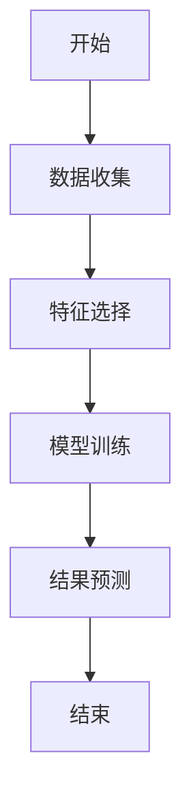
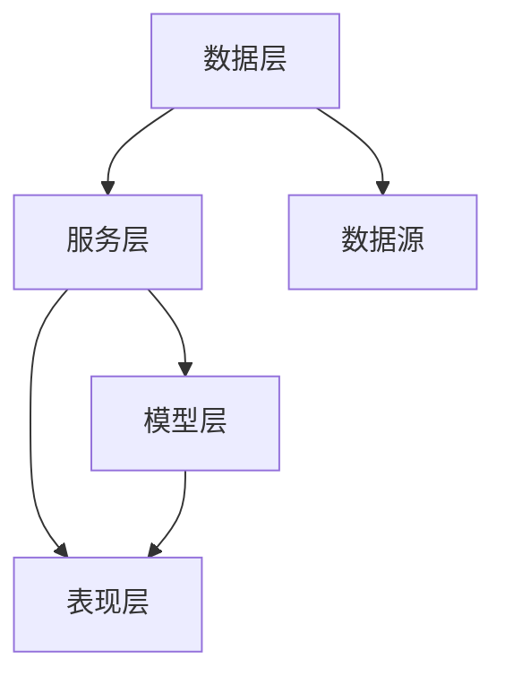

                 


# 约翰·博格尔的长期投资回报预测模型

> 关键词：长期投资回报预测模型，约翰·博格尔，投资预测，时间序列分析，多元回归分析，系统架构设计

> 摘要：本文深入探讨约翰·博格尔的长期投资回报预测模型，从背景到数学基础，从算法实现到系统设计，全面分析该模型的核心概念、理论基础和实际应用，为投资者和数据科学家提供理论支持和实践指导。

---

## 第1章：长期投资回报预测模型的背景与意义

### 1.1 投资回报预测的重要性

#### 1.1.1 投资回报预测的基本概念
投资回报预测是指通过分析历史数据和当前市场状况，预测未来投资的收益情况。长期投资回报预测则关注未来数年甚至数十年的收益趋势，为投资者提供长期投资决策的依据。

#### 1.1.2 长期投资回报预测的必要性
长期投资回报预测有助于投资者制定稳健的投资策略，尤其是在市场波动剧烈的情况下。通过预测长期回报，投资者可以更好地应对市场变化，优化资产配置。

#### 1.1.3 约翰·博格尔的贡献与影响
约翰·博格尔是投资领域的权威，他的研究成果和模型对长期投资回报预测领域产生了深远影响。他的模型结合了市场分析和统计学方法，为投资者提供了可靠的预测工具。

### 1.2 约翰·博格尔的学术背景与投资理念

#### 1.2.1 约翰·博格尔的学术成就
博格尔在金融学领域有着深厚的学术背景，他的研究成果多次被引用，尤其是在长期投资回报预测方面。

#### 1.2.2 长期投资的价值观与策略
博格尔强调长期投资的重要性，认为长期持有优质资产能够实现稳健的回报。他的投资策略注重风险控制和资产配置，为模型的设计奠定了基础。

#### 1.2.3 博格尔的投资哲学对模型的影响
博格尔的投资哲学强调价值投资和长期持有，这直接影响了模型的输入变量和预测目标。

### 1.3 长期投资回报预测模型的现状与挑战

#### 1.3.1 当前投资预测模型的多样性
当前市场中有多种投资预测模型，包括技术分析模型和基本面分析模型。博格尔的模型在这些模型中独树一帜，专注于长期回报预测。

#### 1.3.2 长期预测的独特挑战
长期预测需要考虑更多不确定性因素，如经济周期、政策变化等。这些因素增加了预测的难度，但也为模型提供了更多的分析维度。

#### 1.3.3 博格尔模型的创新点
博格尔模型通过引入宏观经济指标和公司基本面数据，提高了预测的准确性。同时，模型采用了时间序列分析的方法，有效捕捉长期趋势。

---

## 第2章：模型的核心概念与理论基础

### 2.1 长期投资回报预测模型的基本原理

#### 2.1.1 投资回报的定义与计算
投资回报通常以收益率来衡量，包括资本收益和分红收益。模型通过分析历史收益率，预测未来长期回报。

#### 2.1.2 长期回报的多因素分析
博格尔模型认为，长期回报受多种因素影响，包括市场整体表现、通货膨胀率、利率变化等。模型通过多因素分析，综合考虑这些因素的影响。

#### 2.1.3 博格尔模型的独特视角
博格尔模型强调资产配置的重要性，认为合理的资产配置是实现长期回报的关键。模型通过分析不同资产类别的表现，优化投资组合。

### 2.2 核心概念的属性与特征对比

#### 2.2.1 输入变量的分类与特征
- 市场因素：包括指数收益率、市场波动率等。
- 经济指标：包括GDP增长率、失业率、通货膨胀率等。
- 公司基本面：包括市盈率、股息率、ROE等。

#### 2.2.2 输出结果的结构与特征
- 预测回报率：模型输出未来某段时间的预期回报率。
- 投资组合建议：基于预测结果，模型提供资产配置建议。

#### 2.2.3 模型参数的属性对比
- 时间跨度：长期预测通常以5年、10年为单位。
- 数据来源：包括历史市场数据、宏观经济数据等。
- 预测精度：模型通过历史数据验证，确保预测的准确性。

### 2.3 ER实体关系图架构


---

## 第3章：模型的数学基础与公式推导

### 3.1 投资回报预测的数学模型

#### 3.1.1 时间序列分析模型
时间序列分析用于分析历史回报数据，捕捉趋势和周期性变化。常用的方法包括ARIMA模型和GARCH模型。

#### 3.1.2 多元回归分析模型
多元回归分析用于分析多个自变量对因变量的影响。在投资回报预测中，多个经济指标和市场因素作为自变量，预测投资回报率。

#### 3.1.3 风险调整后的回报模型
风险调整后的回报模型考虑了投资的风险因素，如波动率和最大回撤。模型通过调整风险，提供更准确的回报预测。

### 3.2 博格尔模型的数学公式

#### 3.2.1 基本公式推导
博格尔模型的基本公式如下：

$$ R_{\text{预测}} = \beta_0 + \beta_1 R_{\text{市场}} + \beta_2 R_{\text{经济}} + \beta_3 R_{\text{公司}} + \epsilon $$

其中，$R_{\text{预测}}$ 是预测的回报率，$R_{\text{市场}}$ 是市场回报率，$R_{\text{经济}}$ 是经济指标回报率，$R_{\text{公司}}$ 是公司基本面回报率，$\epsilon$ 是误差项。

#### 3.2.2 公式中的变量解释
- $\beta_0$：截距项，表示基准回报率。
- $\beta_1$：市场回报率的回归系数。
- $\beta_2$：经济指标回报率的回归系数。
- $\beta_3$：公司基本面回报率的回归系数。
- $\epsilon$：误差项，表示模型无法解释的部分。

#### 3.2.3 数学模型的验证与优化
通过历史数据验证模型的准确性，调整回归系数，优化模型性能。常用的方法包括最小二乘法和最大似然估计。

---

## 第4章：算法原理与实现步骤

### 4.1 算法流程图



### 4.2 算法实现步骤

#### 4.2.1 数据预处理
- 数据清洗：处理缺失值和异常值。
- 数据标准化：对数据进行标准化处理，确保模型的收敛性。

#### 4.2.2 模型训练
- 数据分割：将数据分为训练集和测试集。
- 模型训练：使用训练数据训练回归模型，调整回归系数。

#### 4.2.3 结果验证与优化
- 模型验证：使用测试数据验证模型的准确性。
- 模型优化：通过调整参数和优化算法，提高模型的预测精度。

---

## 第5章：系统分析与架构设计

### 5.1 问题场景介绍

#### 5.1.1 系统目标
系统目标是实现博格尔模型的投资回报预测功能，为投资者提供长期投资决策支持。

#### 5.1.2 系统范围
系统范围包括数据采集、模型训练、结果预测和用户界面展示。

#### 5.1.3 系统约束
系统需要处理大量数据，保证数据安全和用户隐私。

### 5.2 系统架构设计



---

## 第6章：项目实战与案例分析

### 6.1 环境安装与配置

#### 6.1.1 开发环境的选择
推荐使用Python作为开发语言，安装Jupyter Notebook和相关库（如pandas、numpy、scikit-learn）。

#### 6.1.2 必需软件的安装
安装Python、Jupyter Notebook、pandas、numpy、scikit-learn等软件。

#### 6.1.3 数据库的配置
配置MySQL或PostgreSQL数据库，存储历史数据和预测结果。

### 6.2 核心代码实现

#### 6.2.1 数据预处理代码
```python
import pandas as pd
import numpy as np

# 数据加载
data = pd.read_csv('data.csv')

# 数据清洗
data.dropna(inplace=True)
data = data[~data['value'].isin([np.nan, np.inf, -np.inf])]

# 数据标准化
from sklearn.preprocessing import StandardScaler
scaler = StandardScaler()
scaled_data = scaler.fit_transform(data[['feature1', 'feature2', 'feature3']])
```

#### 6.2.2 模型训练代码
```python
from sklearn.linear_model import LinearRegression
from sklearn.metrics import mean_squared_error

# 数据分割
X = scaled_data
y = data['target']

# 模型训练
model = LinearRegression()
model.fit(X, y)

# 模型预测
predicted = model.predict(X)
print('预测误差:', mean_squared_error(y, predicted))
```

#### 6.2.3 结果预测代码
```python
# 使用新数据进行预测
new_data = pd.read_csv('new_data.csv')
new_data.dropna(inplace=True)
new_scaled = scaler.transform(new_data[['feature1', 'feature2', 'feature3']])
predictions = model.predict(new_scaled)

# 输出预测结果
print('预测回报率:', predictions)
```

### 6.3 实际案例分析

#### 6.3.1 数据来源与分析
以过去10年的市场数据为例，分析市场趋势和经济指标对投资回报的影响。

#### 6.3.2 模型训练与优化
通过历史数据训练模型，调整回归系数，优化预测精度。

#### 6.3.3 结果展示与解读
展示预测结果，并解读结果的意义，为投资者提供投资建议。

---

## 第7章：最佳实践与小结

### 7.1 最佳实践 tips

#### 7.1.1 数据质量的重要性
确保数据的准确性和完整性，选择合适的数据预处理方法。

#### 7.1.2 模型选择的策略
根据具体情况选择合适的模型，避免过度拟合。

#### 7.1.3 结果验证的技巧
通过交叉验证和回测，验证模型的稳定性和准确性。

### 7.2 小结与展望

#### 7.2.1 本书的核心内容回顾
总结博格尔模型的核心概念、理论基础和实现步骤。

#### 7.2.2 模型的未来发展方向
探讨模型的改进方向，如引入机器学习算法和实时数据流。

#### 7.2.3 投资者如何应用该模型
为投资者提供实际操作建议，帮助他们更好地应用模型进行投资决策。

---

## 作者

作者：AI天才研究院/AI Genius Institute & 禅与计算机程序设计艺术 /Zen And The Art of Computer Programming

---

以上是《约翰·博格尔的长期投资回报预测模型》的技术博客文章，内容涵盖了模型的背景、核心概念、数学基础、算法实现、系统设计和项目实战，为投资者和数据科学家提供了全面的理论支持和实践指导。

