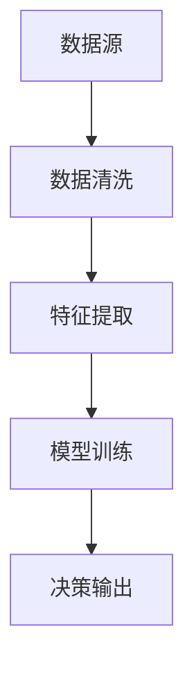

                 


# 约翰·奈夫的低市盈率投资法：简单而有效的价值策略

> **关键词**：低市盈率、约翰·奈夫、价值投资、投资策略、投资模型、股票分析、风险管理

> **摘要**：本文深入探讨了约翰·奈夫的低市盈率投资法，从其理论基础、数学模型、系统架构到实际案例分析，全面解析了这一简单而有效的价值投资策略。通过详细的算法原理和系统设计，结合实际操作的代码实现，为投资者提供了从理论到实践的完整指南。

---

# 第一部分: 低市盈率投资法的背景与基础

## 第1章: 投资的基本概念

### 1.1 投资的基本原理

#### 1.1.1 资产与投资的定义

投资是将资金投入到能够产生收益的资产中，如股票、债券、房地产等。资产的核心价值在于其未来现金流的折现值。

#### 1.1.2 投资的分类与特点

投资可以分为短期投资和长期投资。短期投资注重市场的波动性，而长期投资关注企业的内在价值。低市盈率投资法属于长期投资策略。

#### 1.1.3 投资的目标与风险

投资的目标是通过资产配置和风险管理实现财富的保值与增值。投资风险包括市场风险、流动性风险和信用风险。

### 1.2 市场与价格的关系

#### 1.2.1 股票市场的基本运作

股票市场是企业股权交易的场所，股票价格受供需关系、公司业绩和宏观经济因素的影响。

#### 1.2.2 股票价格的决定因素

股票价格由市场参与者的预期、公司盈利能力和市场流动性共同决定。

#### 1.2.3 市盈率的定义与意义

市盈率（P/E Ratio）是股票价格与每股净利润的比值，用于衡量股票的估值水平。

---

## 第2章: 低市盈率投资法的背景

### 2.1 低市盈率策略的起源

#### 2.1.1 价值投资的兴起

价值投资强调以低于内在价值的价格买入优质资产，巴菲特是该策略的代表人物之一。

#### 2.1.2 约翰·奈夫的贡献

约翰·奈夫通过研究发现，低市盈率股票往往具有较高的潜在回报，且风险较低。

#### 2.1.3 低市盈率策略的核心思想

低市盈率策略的核心是寻找被市场低估的股票，通过长期持有实现超额收益。

### 2.2 低市盈率策略的适用场景

#### 2.2.1 市场周期与策略选择

低市盈率策略在市场低迷或震荡期表现尤为突出。

#### 2.2.2 不同行业与市场的适用性

低市盈率策略适用于盈利稳定、增长潜力大的行业，如公用事业和消费品行业。

#### 2.2.3 经济环境对策略的影响

低市盈率策略在通货膨胀或经济衰退期更具防御性。

---

# 第二部分: 约翰·奈夫的低市盈率投资法

## 第3章: 约翰·奈夫的投资哲学

### 3.1 价值投资的核心理念

#### 3.1.1 企业内在价值的定义

内在价值是企业未来现金流的现值，是衡量股票估值的核心指标。

#### 3.1.2 投资的长期视角

价值投资强调长期持有优质资产，避免短期市场波动的干扰。

#### 3.1.3 安全边际的重要性

安全边际是股票市场价格与内在价值之间的差距，确保投资的安全性。

### 3.2 低市盈率策略的理论基础

#### 3.2.1 市盈率与企业价值的关系

低市盈率股票通常具有较高的分红率和较低的估值，适合长期投资者。

#### 3.2.2 市盈率低于行业平均水平的意义

市盈率低于行业平均水平表明股票可能被市场低估，具有较大的增值空间。

#### 3.2.3 低市盈率股票的潜在回报

低市盈率股票通过价值回归或公司业绩增长，能够实现超额回报。

---

## 第4章: 约翰·奈夫的选股模型

### 4.1 选股模型的构成

#### 4.1.1 市盈率筛选

通过计算市盈率，筛选出低于行业平均水平的股票。

#### 4.1.2 盈利能力分析

分析企业的净利润率、ROE等指标，评估公司的盈利能力。

#### 4.1.3 财务健康状况评估

通过资产负债表和现金流量表，评估企业的财务健康状况。

### 4.2 模型的数学表达

#### 4.2.1 市盈率计算公式

$$ \text{市盈率} = \frac{\text{股价}}{\text{每股净利润}} $$

#### 4.2.2 内在价值的估算公式

$$ \text{内在价值} = \frac{\text{净利润} \times (1 + g)}{\text{资本成本}} $$

#### 4.2.3 模型的优化与调整

通过引入ROE、分红率等指标，优化选股模型的准确性。

---

# 第三部分: 低市盈率投资法的系统分析与架构

## 第5章: 投资系统的构建

### 5.1 系统目标与功能

#### 5.1.1 系统目标

构建一个能够自动筛选低市盈率股票的系统，实现投资策略的自动化。

#### 5.1.2 系统功能模块

- 数据收集模块：获取股票的实时数据。
- 筛选模块：计算市盈率，筛选符合条件的股票。
- 分析模块：评估股票的内在价值和风险。
- 决策模块：生成投资建议。

### 5.2 系统架构设计

#### 5.2.1 数据流图



#### 5.2.2 实体关系图

```mermaid
erd
    股票
    投资者
    市场数据
    筛选规则
    投资决策
    股票 <--1..n--> 筛选规则
    投资者 <--1..n--> 投资决策
    市场数据 <--1..n--> 股票
```

---

## 第6章: 系统的实现与代码

### 6.1 系统实现

#### 6.1.1 数据收集

使用API获取股票的实时数据，包括股价、净利润等。

#### 6.1.2 数据清洗

对数据进行标准化处理，剔除异常值。

#### 6.1.3 特征提取

提取市盈率、ROE等关键指标。

#### 6.1.4 模型训练

通过回归分析评估股票的内在价值。

### 6.2 代码实现

#### 6.2.1 数据获取

```python
import pandas as pd
import requests

url = "https://api.example.com/stock_data"
data = requests.get(url).json()
df = pd.DataFrame(data)
```

#### 6.2.2 市盈率计算

```python
def calculate_pe(df):
    df['PE'] = df['股价'] / df['每股净利润']
    return df

df = calculate_pe(df)
```

#### 6.2.3 低市盈率筛选

```python
low_pe_stocks = df[df['PE'] < df['PE'].mean()]
```

---

# 第四部分: 项目实战与案例分析

## 第7章: 项目实战

### 7.1 项目介绍

选择一个具体的案例，如苹果公司，分析其市盈率和投资价值。

### 7.2 案例分析

#### 7.2.1 数据分析

计算苹果公司的市盈率，对比行业平均水平。

#### 7.2.2 投资决策

根据模型结果，判断是否适合投资。

### 7.3 代码实现

#### 7.3.1 数据获取

```python
import pandas as pd
import requests

url = "https://api.example.com/apple_data"
data = requests.get(url).json()
df = pd.DataFrame(data)
```

#### 7.3.2 市盈率计算与筛选

```python
def calculate_pe(df):
    df['PE'] = df['股价'] / df['每股净利润']
    return df

df = calculate_pe(df)
low_pe_stocks = df[df['PE'] < df['PE'].mean()]
```

---

## 第8章: 总结与展望

### 8.1 总结

低市盈率投资法是一种简单而有效的价值策略，通过寻找被低估的股票实现长期收益。

### 8.2 展望

未来，随着技术的进步，低市盈率投资法可以通过大数据和人工智能进一步优化。

---

# 作者：AI天才研究院/AI Genius Institute & 禅与计算机程序设计艺术 /Zen And The Art of Computer Programming

