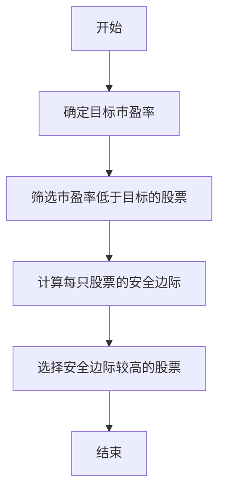
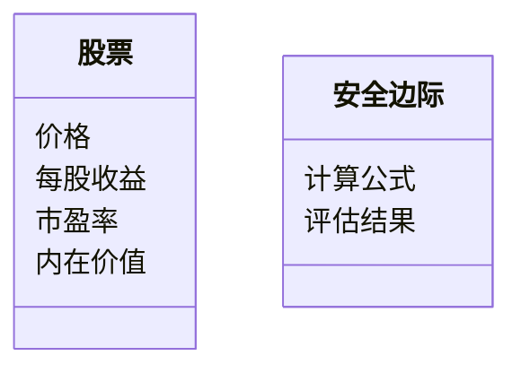
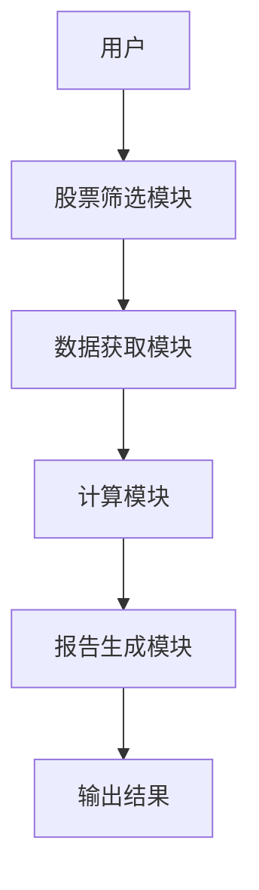

                 


# 约翰·奈夫的低市盈率投资策略

> 关键词：低市盈率，投资策略，约翰·奈夫，股票估值，安全边际

> 摘要：本文深入探讨了约翰·奈夫提出的低市盈率投资策略，分析其理论基础、实施方法和实际应用。通过详细的数学模型和实例分析，揭示了该策略的有效性和局限性，为投资者提供实用的指导。

---

# 目录

## 第一章：低市盈率投资策略的背景介绍

### 1.1 低市盈率策略的起源与发展
#### 1.1.1 投资学的基本概念
- 股票投资的基本原理
- 市场价值与内在价值的区分

#### 1.1.2 低市盈率策略的历史背景
- 约翰·奈夫的贡献与影响
- 低市盈率策略的兴起与演变

#### 1.1.3 约翰·奈夫的投资理念
- 价值投资的核心思想
- 长期投资与安全边际的重要性

### 1.2 低市盈率策略的核心概念
#### 1.2.1 市盈率的定义与计算
$$\text{市盈率} = \frac{\text{股价}}{\text{每股收益}}$$
- 市盈率的计算方法
- 低市盈率的标准与分类

#### 1.2.2 内在价值的评估
- 市盈率与内在价值的关系
- 低市盈率股票的潜在价值

#### 1.2.3 低市盈率策略的关键要素
- 低估股票的特征
- 安全边际的概念与计算

## 第二章：低市盈率策略的核心原理与算法

### 2.1 核心原理的数学模型
#### 2.1.1 市盈率与股价的关系
$$\text{股价} = \text{市盈率} \times \text{每股收益}$$
- 如何通过市盈率判断股票的价值

#### 2.1.2 内在价值的评估公式
$$\text{内在价值} = \frac{\text{净利润}}{\text{资本成本}}$$
- 净利润与资本成本的关系
- 内在价值与市盈率的关系

### 2.2 低市盈率策略的算法流程
#### 2.2.1 算法流程图


#### 2.2.2 算法实现代码
```python
def calculate_pe_ratio(stock_price, earnings_per_share):
    return stock_price / earnings_per_share

def screen_low_pe_stocks(stocks, max_pe_ratio):
    return [stock for stock in stocks if calculate_pe_ratio(stock['price'], stock['eps']) < max_pe_ratio]

def calculate_margin_of_safety(stock_price, intrinsic_value):
    return (intrinsic_value - stock_price) / intrinsic_value * 100

# 示例
stocks = [
    {'price': 50, 'eps': 10},
    {'price': 40, 'eps': 10},
    {'price': 30, 'eps': 15}
]
max_pe_ratio = 15

low_pe_stocks = screen_low_pe_stocks(stocks, max_pe_ratio)
print(low_pe_stocks)
```

### 2.3 核心概念的对比分析
#### 2.3.1 市盈率与市净率的对比
| 指标       | 定义                               | 适用场景                     |
|------------|------------------------------------|------------------------------|
| 市盈率     | 股价与每股收益的比率               | 适用于盈利稳定的公司         |
| 市净率     | 股价与每股净资产的比率             | 适用于资产密集型企业         |

#### 2.3.2 内在价值与市场价值的对比
| 指标       | 定义                               | 影响因素                     |
|------------|------------------------------------|------------------------------|
| 内在价值   | 股票的理论价值                     | 盈利能力、风险偏好           |
| 市场价值   | 股票的实际交易价格                 | 市场情绪、投资者预期           |

## 第三章：低市盈率策略的系统分析与架构设计

### 3.1 系统分析
#### 3.1.1 问题场景介绍
- 投资者如何选择低市盈率股票
- 如何评估股票的安全边际

#### 3.1.2 系统功能需求
- 筛选低市盈率股票
- 计算内在价值和安全边际
- 生成投资报告

### 3.2 系统架构设计
#### 3.2.1 领域模型


#### 3.2.2 系统架构图


### 3.3 系统接口设计
#### 3.3.1 输入接口
- 股票列表
- 目标市盈率

#### 3.3.2 输出接口
- 符合条件的股票列表
- 每只股票的安全边际

## 第四章：低市盈率策略的项目实战

### 4.1 项目环境与工具安装
- Python编程环境的搭建
- 数据获取工具的安装（如pandas库）

### 4.2 核心代码实现
#### 4.2.1 数据获取与处理
```python
import pandas as pd

# 获取股票数据
data = pd.DataFrame({
    '股票名称': ['A', 'B', 'C'],
    '股价': [50, 40, 30],
    '每股收益': [10, 10, 15]
})

# 计算市盈率
data['市盈率'] = data['股价'] / data['每股收益']
```

#### 4.2.2 筛选低市盈率股票
```python
# 设置目标市盈率
target_pe = 15

# 筛选股票
low_pe_stocks = data[data['市盈率'] < target_pe]
print(low_pe_stocks)
```

### 4.3 代码解读与实际应用
#### 4.3.1 筛选结果分析
- 通过代码筛选出市盈率低于目标的股票
- 计算每只股票的安全边际

#### 4.3.2 实际案例分析
- 以某只股票为例，详细分析其市盈率、内在价值和安全边际
- 对比市盈率与股价的关系，解释低市盈率股票的投资价值

### 4.4 项目总结
#### 4.4.1 项目成果
- 成功筛选出符合条件的股票
- 计算出每只股票的安全边际

#### 4.4.2 经验与教训
- 数据获取的困难
- 计算过程中需要注意的因素

## 第五章：低市盈率策略的最佳实践与注意事项

### 5.1 最佳实践
#### 5.1.1 分散投资的重要性
- 不将所有资金投入一只股票
- 选择多个低市盈率股票进行组合投资

#### 5.1.2 长期持有与持续监控
- 定期检查股票的市盈率和内在价值
- 调整投资组合以应对市场变化

### 5.2 小结与展望
#### 5.2.1 小结
- 低市盈率策略的优势与局限
- 约翰·奈夫投资理念的现代应用

#### 5.2.2 展望
- 结合其他策略如股息率分析
- 利用技术手段优化投资决策

### 5.3 注意事项
#### 5.3.1 市场波动的风险
- 如何应对市场的短期波动
- 低市盈率股票的长期表现

#### 5.3.2 数据的准确性和及时性
- 数据来源的可靠性
- 数据更新的频率

## 第六章：总结与拓展阅读

### 6.1 总结
- 低市盈率策略的核心思想
- 如何在实际投资中应用该策略

### 6.2 拓展阅读
#### 6.2.1 推荐书籍
- 《价值投资入门》
- 《投资学原理》

#### 6.2.2 在线资源
- 投资论坛与社区
- 专业投资网站

### 6.3 作者信息
作者：AI天才研究院/AI Genius Institute & 禅与计算机程序设计艺术 /Zen And The Art of Computer Programming

---

# 结语
通过本文的详细讲解，读者可以全面理解约翰·奈夫的低市盈率投资策略，从理论到实践，掌握如何在实际投资中应用这一策略。希望本文能为投资者提供有价值的指导和启示。

