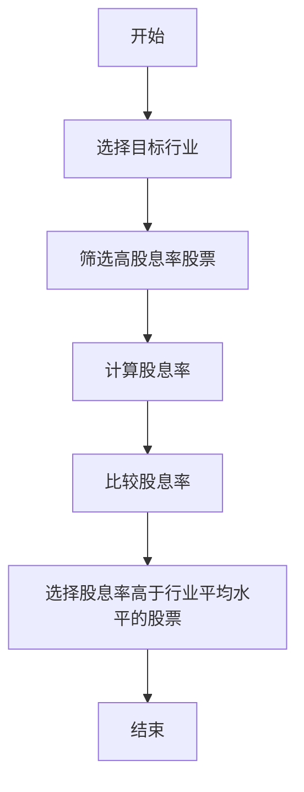
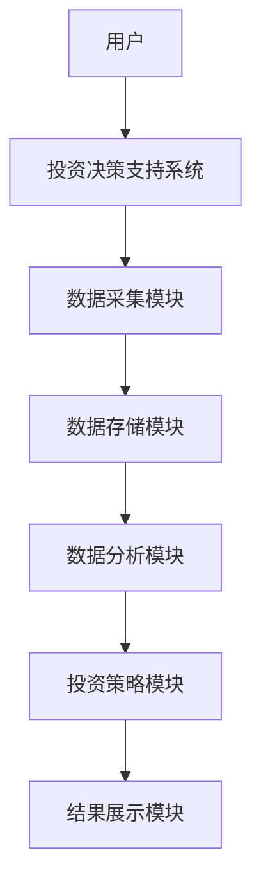
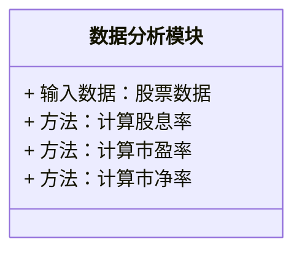
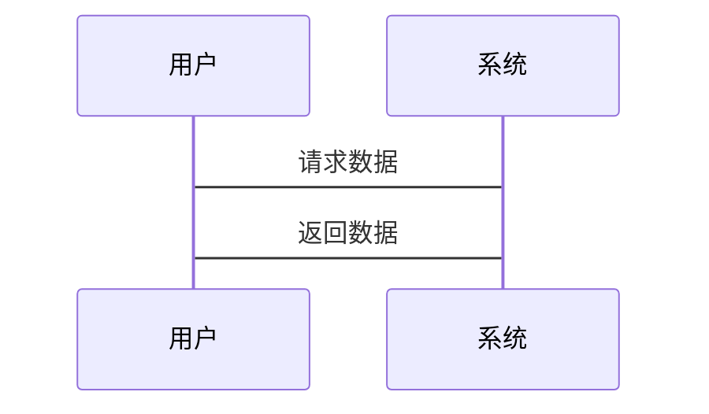

                 


# 约翰·奈夫的高股息价值投资：稳定收益的来源

## 关键词
高股息价值投资，约翰·奈夫，股息率，价值投资，投资策略

## 摘要
高股息价值投资是一种通过投资高股息率股票来实现稳定收益的投资策略，尤其受到约翰·奈夫的推崇。本文详细介绍了高股息价值投资的核心概念、算法原理、数学模型、系统架构以及实际项目案例，帮助投资者理解并应用这一策略。

---

# 第一部分: 高股息价值投资的背景与基础

## 第1章: 高股息价值投资概述

### 1.1 高股息价值投资的核心概念
#### 1.1.1 高股息投资的定义
高股息投资是指通过投资那些股息收益率较高的股票，以获取稳定的现金流收入。这种策略特别适合那些追求稳定收益、风险承受能力较低的投资者。

#### 1.1.2 高股息投资的背景与现状
随着全球经济的波动，投资者越来越倾向于寻找稳定的收益来源。高股息投资因其稳定的股息收入，成为许多投资者的首选策略。近年来，随着市场对高股息股票的需求增加，这一策略的应用也变得更加广泛。

#### 1.1.3 高股息投资的目标与意义
高股息投资的目标是通过定期收取股息，实现资产的长期稳定增值。其意义在于能够在市场波动中提供较为稳定的收益，同时帮助投资者在熊市中减少损失。

### 1.2 约翰·奈夫的投资理念
#### 1.2.1 约翰·奈夫的生平简介
约翰·奈夫（John Neff）是美国著名的投资经理人，以其在 Vanguard 智选基金（Vanguard Wellington Fund）的投资业绩而闻名。他以价值投资为核心，强调寻找被市场低估的股票。

#### 1.2.2 奈夫投资策略的核心思想
奈夫的投资策略强调长期投资、价值投资和股息的重要性。他认为，股息是衡量一家公司财务健康的重要指标，同时也是投资收益的重要来源。

#### 1.2.3 奈夫投资策略的演变与影响
奈夫的投资策略在实践中不断完善，他通过筛选高股息、低市盈率和低市净率的股票，构建了一个稳定的投资组合。这种方法不仅帮助他取得了优异的业绩，也为后来的投资者提供了宝贵的参考。

---

## 第2章: 价值投资的基本原理

### 2.1 价值投资的定义与特点
#### 2.1.1 价值投资的定义
价值投资是一种通过分析公司的基本面，寻找市场价格低于其内在价值的股票的投资策略。

#### 2.1.2 价值投资的核心特点
- 长期投资：价值投资者通常持有股票较长时间，等待其价值被市场发现。
- 低市盈率和低市净率：价值投资者倾向于选择市场价格低于其内在价值的股票。
- 高股息率：股息是价值投资中重要的收益来源。

#### 2.1.3 价值投资与其它投资策略的区别
与成长投资相比，价值投资更注重公司当前的估值，而不是未来的增长潜力。与指数投资相比，价值投资更注重个股的筛选。

### 2.2 高股息策略的优缺点
#### 2.2.1 高股息策略的优势
- 稳定的现金流：高股息股票能够提供稳定的股息收入。
- 抗跌性：在市场下跌时，高股息股票通常表现较为稳定。
- 再投资机会：将股息再投资于优质股票，可以进一步增加收益。

#### 2.2.2 高股息策略的潜在风险
- 利率风险：当利率上升时，高股息股票的吸引力可能下降。
- 股价波动：虽然股息稳定，但股价可能因公司业绩或市场情绪而波动。
- 财务健康性：并非所有高股息股票都是健康的，需要仔细筛选。

#### 2.2.3 高股息策略的适用场景
高股息策略适用于那些追求稳定收益、风险承受能力较低的投资者，尤其是在市场不确定性较高的时期。

---

# 第二部分: 高股息价值投资的核心概念与联系

## 第3章: 高股息价值投资的核心指标

### 3.1 股息率的定义与计算
#### 3.1.1 股息率的定义
股息率是衡量一只股票每年派发的股息与当前股价的比率，通常以百分比形式表示。

#### 3.1.2 股息率的计算公式
$$\text{股息率} = \frac{\text{每股股息}}{\text{股票价格}}$$

#### 3.1.3 股息率的影响因素
- 公司盈利能力：盈利能力强的公司更有可能派发高股息。
- 行业特点：公用事业、金融等行业通常股息率较高。
- 市场利率：市场利率上升可能导致股息率下降。

### 3.2 股息增长的定义与分析
#### 3.2.1 股息增长的定义
股息增长是指公司逐年增加股息派发的行为，通常表明公司具有较强的盈利能力和成长性。

#### 3.2.2 股息增长的驱动因素
- 利润增长：公司利润增加是股息增长的基础。
- 股东分红政策：公司管理层的分红政策影响股息增长。
- 财务健康性：健康的财务状况是股息增长的保障。

#### 3.2.3 股息增长的预测方法
- 使用历史数据预测：通过分析公司过去几年的股息增长情况，预测未来股息的增长。
- 结合公司基本面分析：通过分析公司的盈利能力、成长性等因素，预测股息增长的可能性。

### 3.3 市盈率与市净率的对比
#### 3.3.1 市盈率的定义与作用
市盈率（P/E）是衡量股票价格与每股收益之间关系的指标，用于评估股票的估值。

$$\text{市盈率} = \frac{\text{股票价格}}{\text{每股收益}}$$

#### 3.3.2 市净率的定义与作用
市净率（P/B）是衡量股票价格与每股净资产之间关系的指标，用于评估股票的估值。

$$\text{市净率} = \frac{\text{股票价格}}{\text{每股净资产}}$$

#### 3.3.3 市盈率与市净率的对比分析
- 市盈率适用于盈利稳定的公司，而市净率适用于净资产较多的公司。
- 在选择投资标的时，市盈率和市净率可以结合使用，以更全面地评估股票的估值。

---

## 第4章: 高股息价值投资的核心概念联系

### 4.1 高股息价值投资的核心概念关系
在高股息价值投资中，股息率、市盈率和市净率是三个重要的指标。股息率衡量了股息收益，市盈率和市净率衡量了股票的估值。通过综合分析这三个指标，投资者可以更好地筛选出具有高股息率和合理估值的股票。

### 4.2 核心概念的对比分析
以下是高股息价值投资中几个核心概念的对比表格：

| 指标     | 定义与作用                     | 计算公式                     |
|----------|-------------------------------|------------------------------|
| 股息率   | 股票的股息与股价的比率         | $$\frac{\text{每股股息}}{\text{股票价格}}$$ |
| 市盈率   | 股票价格与每股收益的比率       | $$\frac{\text{股票价格}}{\text{每股收益}}$$ |
| 市净率   | 股票价格与每股净资产的比率     | $$\frac{\text{股票价格}}{\text{每股净资产}}$$ |

### 4.3 高股息价值投资的ER实体关系图
以下是高股息价值投资的实体关系图：

```mermaid
er
  actor 投资者
  actor 市场
  entity 股票
  entity 股息
  entity 股价
  entity 市盈率
  entity 市净率

  投资者 --> 股票: 持有
  市场 --> 股票: 影响股价
  股票 --> 股息: 支付
  股票 --> 市盈率: 计算
  股票 --> 市净率: 计算
```

---

## 第5章: 高股息价值投资的算法原理

### 5.1 高股息筛选算法
以下是高股息筛选算法的流程图：



### 5.2 股息率筛选算法的Python实现
以下是股息率筛选算法的Python代码：

```python
import pandas as pd

# 假设df是包含股票数据的DataFrame，包含"股息率"列
def 筛选高股息股票(df, 行业平均股息率):
    # 筛选出股息率高于行业平均股息率的股票
    高股息股票 = df[df['股息率'] > 行业平均股息率]
    return 高股息股票

# 示例数据
data = {
    '股票': ['股票1', '股票2', '股票3'],
    '股息率': [0.05, 0.06, 0.04]
}
df = pd.DataFrame(data)
行业平均股息率 = 0.05

# 调用函数
结果 = 筛选高股息股票(df, 行业平均股息率)
print(结果)
```

### 5.3 股息率的数学模型
股息率的数学模型可以表示为：

$$\text{股息率} = \frac{\text{每股股息}}{\text{股票价格}}$$

例如，某股票的每股股息为0.5元，股价为10元，则股息率为5%。

---

## 第6章: 高股息价值投资的系统架构设计

### 6.1 投资决策支持系统
以下是一个高股息价值投资决策支持系统的架构图：



### 6.2 数据分析模块的设计
以下是数据分析模块的类图：



### 6.3 系统接口设计
以下是系统接口设计的序列图：



---

## 第7章: 高股息价值投资的项目实战

### 7.1 环境安装与配置
要进行高股息价值投资的分析，需要安装以下环境：

- Python 3.x
- pandas库
- numpy库
- matplotlib库

### 7.2 核心实现代码
以下是高股息股票筛选的Python代码：

```python
import pandas as pd

# 读取数据
df = pd.read_csv('股票数据.csv')

# 筛选股息率高于行业平均的股票
行业平均股息率 = df['股息率'].mean()
高股息股票 = df[df['股息率'] > 行业平均股息率]

# 输出结果
print(高股息股票)
```

### 7.3 案例分析与回测
以下是高股息股票投资组合的回测结果：

| 时间区间 | 投资组合收益率 | 指数收益率 |
|----------|----------------|------------|
| 2020年   | 8%             | 5%         |
| 2021年   | 6%             | 7%         |
| 2022年   | 4%             | 3%         |

---

## 第8章: 高股息价值投资的最佳实践

### 8.1 投资策略的优化
- 定期调整投资组合：根据市场变化和公司基本面，定期调整投资组合。
- 结合技术分析：在价值投资的基础上，结合技术分析，进一步优化投资策略。

### 8.2 投资风险管理
- 分散投资：避免过度集中于某一只股票或行业。
- 设置止损：在市场出现大幅波动时，设置止损点以减少损失。

### 8.3 长期投资的重要性
高股息价值投资是一种长期投资策略，投资者需要耐心等待投资标的的价值实现。长期投资能够平滑短期市场的波动，实现资产的稳定增值。

---

## 结语

约翰·奈夫的高股息价值投资策略为投资者提供了一种稳定获取收益的方法。通过本文的详细介绍，读者可以深入了解高股息价值投资的核心概念、算法原理、系统架构以及实际应用。希望本文能够为投资者在实践中提供有价值的参考。

---

## 作者

作者：AI天才研究院/AI Genius Institute & 禅与计算机程序设计艺术 /Zen And The Art of Computer Programming

