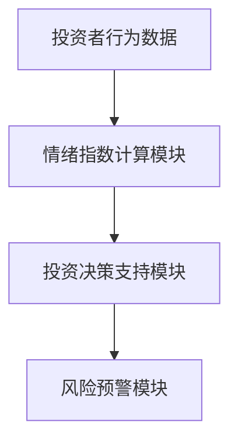
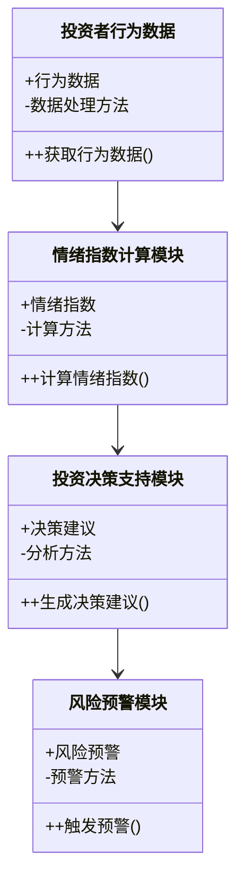

                 


# 约翰·聂夫的价值投资者情绪管理

## 关键词：约翰·聂夫、价值投资、情绪管理、投资心理学、投资决策、风险管理

## 摘要：本文深入探讨了价值投资者约翰·聂夫如何通过情绪管理在投资领域取得成功。文章从价值投资的定义、情绪管理的重要性，到情绪指数模型的构建和应用，详细分析了情绪波动对投资决策的影响，并提供了一个基于情绪指数的投资决策支持系统设计方案。通过实际案例分析和Python代码实现，本文展示了如何将情绪管理应用于实际投资中，帮助投资者优化决策过程，提升投资绩效。

---

# 第1章：价值投资与情绪管理概述

## 1.1 价值投资的核心理念

### 1.1.1 价值投资的定义

价值投资是一种投资策略，强调以低于内在价值的价格购买优质资产。约翰·聂夫是这一策略的杰出代表，他通过深入分析企业的基本面，寻找那些被市场低估的股票进行长期投资。

### 1.1.2 价值投资的核心原则

- **安全边际**：购买价格低于内在价值，以降低风险。
- **长期视角**：关注企业的长期价值，而非短期波动。
- **逆向思维**：在市场恐慌时寻找机会，避免随市场情绪盲目操作。

### 1.1.3 约翰·聂夫的价值投资方法

约翰·聂夫通过分析公司的财务数据、行业地位和管理团队，寻找那些具有持续竞争优势且估值合理的公司。他强调耐心和纪律，避免频繁交易。

---

## 1.2 情绪管理的重要性

### 1.2.1 投资中的情绪波动

投资者在面对市场波动时，常常会经历贪婪和恐惧的情绪变化。贪婪可能导致高位买入，而恐惧则可能导致低位卖出，这两种情绪都会影响投资决策。

### 1.2.2 情绪对投资决策的影响

情绪波动会导致非理性决策，使投资者偏离既定的投资策略。例如，在市场下跌时，投资者可能会恐慌性抛售，导致投资组合的重大损失。

### 1.2.3 约翰·聂夫的情绪管理策略

约翰·聂夫强调保持冷静，避免被市场情绪左右。他通过严格的纪律和长期的视角，有效管理了情绪波动，从而在市场波动中保持了稳定的投资决策。

---

## 1.3 价值投资者的特质

### 1.3.1 理性与耐心

价值投资者需要具备理性分析能力，避免被市场情绪影响。同时，耐心是价值投资的重要特质，优质资产的价值通常需要时间来体现。

### 1.3.2 风险控制

通过严格的风险评估和安全边际策略，价值投资者能够在市场波动中有效控制风险，避免重大损失。

### 1.3.3 长期视角

价值投资者关注企业的长期价值，而非短期市场波动。这种长期视角帮助他们在市场低迷时坚持投资，最终实现收益。

---

# 第2章：情绪管理的核心概念与联系

## 2.1 投资者情绪的分类

### 2.1.1 过度乐观

投资者在市场繁荣时往往过于乐观，导致高位买入，忽视潜在风险。

### 2.1.2 过度悲观

市场低迷时，投资者可能过于悲观，错失买入优质资产的机会。

### 2.1.3 恐惧与贪婪

贪婪和恐惧是投资者最常见的两种情绪，它们往往导致非理性决策。

---

## 2.2 情绪与决策的关系

### 2.2.1 情绪波动对决策的影响

情绪波动会影响投资者的决策质量，导致错误的投资选择。例如，在市场下跌时，投资者可能因恐惧而卖出优质资产，错失后续上涨机会。

### 2.2.2 理性与感性的平衡

投资者需要在理性分析和情绪反应之间找到平衡点，避免情绪主导决策。

---

## 2.3 情绪管理的核心要素

### 2.3.1 自我认知

了解自己的情绪倾向，识别可能导致错误决策的情绪因素。

### 2.3.2 目标设定

明确投资目标，制定合理的投资计划，避免因情绪波动而偏离目标。

### 2.3.3 行为规范

建立严格的投资纪律，避免情绪化交易，坚持长期投资策略。

---

# 第3章：情绪指数模型

## 3.1 情绪指数的定义

### 3.1.1 情绪指数的作用

情绪指数用于量化投资者的整体情绪状态，帮助投资者识别市场情绪波动，优化投资决策。

### 3.1.2 情绪指数的计算方法

情绪指数模型通过分析市场数据和投资者行为，量化市场情绪。例如，情绪指数公式为：

$$EI = \frac{S + P}{D}$$

其中，S为情绪评分，P为投资表现，D为时间跨度。

---

## 3.2 情绪指数的数学模型

### 3.2.1 情绪指数公式

$$EI = \frac{S + P}{D}$$

### 3.2.2 情绪指数的应用

情绪指数可以用于投资决策支持，帮助投资者识别市场情绪拐点，优化投资组合配置。

---

## 3.3 情绪指数的应用

### 3.3.1 投资决策优化

通过分析情绪指数，投资者可以更好地判断市场情绪，避免非理性决策。

### 3.3.2 风险控制

情绪指数可以帮助投资者识别潜在风险，提前采取风险管理措施。

---

# 第4章：情绪管理系统的构建

## 4.1 系统功能设计

### 4.1.1 情绪指数计算模块

该模块用于计算当前市场的情绪指数，帮助投资者了解市场情绪状态。

### 4.1.2 投资决策支持模块

该模块基于情绪指数，提供投资决策支持，优化投资组合配置。

### 4.1.3 风险预警模块

该模块用于监控市场风险，提前预警潜在风险，帮助投资者采取风险管理措施。

---

## 4.2 系统架构设计

### 4.2.1 数据流图



### 4.2.2 模块划分与交互



---

## 4.3 接口与交互设计

### 4.3.1 用户界面

用户可以通过图形界面输入投资数据，查看情绪指数和投资建议。

### 4.3.2 数据接口

系统通过API接口与其他投资平台进行数据交互，获取实时市场数据和投资者行为数据。

---

# 第5章：情绪管理在投资组合中的应用

## 5.1 项目实战

### 5.1.1 环境安装

需要安装Python和相关库，如Pandas、NumPy和Matplotlib。

### 5.1.2 核心代码实现

以下为情绪指数计算的Python代码示例：

```python
import pandas as pd
import numpy as np

# 示例数据
data = {
    'price': [100, 105, 98, 102, 101],
    'volume': [1000, 800, 1200, 900, 1100]
}
df = pd.DataFrame(data)

# 计算情绪指数
def calculate_emotion_index(price, volume):
    return (price.mean() + volume.mean()) / len(price)

emotion_index = calculate_emotion_index(df['price'], df['volume'])
print(f"情绪指数: {emotion_index}")
```

### 5.1.3 案例分析

假设某投资者的投资组合中包含多只股票，通过计算每只股票的情绪指数，优化投资组合配置。

---

## 5.2 案例分析与结果解读

通过实际数据计算情绪指数，分析市场情绪，并根据情绪指数优化投资组合配置，实现风险控制和收益最大化。

---

# 第6章：最佳实践与总结

## 6.1 最佳实践

- 定期回顾投资组合，评估情绪指数的变化。
- 坚持长期投资，避免短期情绪波动影响决策。
- 建立严格的投资纪律，避免情绪化交易。

---

## 6.2 小结

本文通过分析约翰·聂夫的价值投资策略，探讨了情绪管理在投资中的重要性，并提出了基于情绪指数的投资决策支持系统设计方案。通过实际案例分析和Python代码实现，展示了如何将情绪管理应用于实际投资中，帮助投资者优化决策过程，提升投资绩效。

---

## 6.3 注意事项

- 情绪指数模型仅供参考，实际投资需结合市场实际情况。
- 投资者应根据自身风险承受能力调整投资策略。

---

## 6.4 拓展阅读

- 《约翰·聂夫的投资哲学》
- 《投资心理学》
- 《风险管理的艺术》

---

# 作者：AI天才研究院/AI Genius Institute & 禅与计算机程序设计艺术/Zen And The Art of Computer Programming

