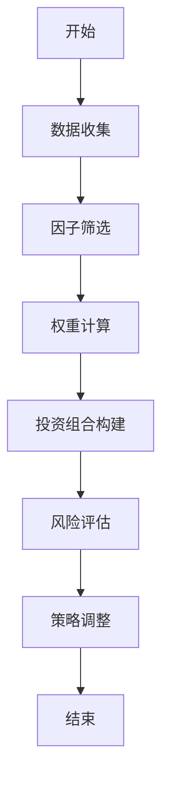
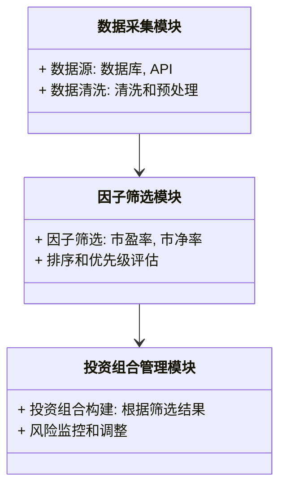

                 

# 约翰·聂夫的小盘股研究方法论

> 关键词：约翰·聂夫，小盘股投资，投资方法论，选股标准，投资系统架构

> 摘要：本文详细探讨了约翰·聂夫的小盘股研究方法论，从其核心理念、选股标准、系统架构到数学模型进行了全面分析。通过实际案例和系统设计，展示了如何将理论应用于投资实践，帮助读者理解小盘股投资的策略与技巧。

---

## 第一部分: 约翰·聂夫的小盘股研究方法论概述

### 第1章: 小盘股投资的背景与重要性

#### 1.1 小盘股市场的特点与优势

##### 1.1.1 小盘股市场的定义与特征
小盘股市场指的是市值较小的公司股票交易市场。与大盘股相比，小盘股具有更高的增长潜力和灵活性，但也伴随着更高的风险。小盘股市场的特点包括交易量较小、公司规模较小、行业分布广泛等。

##### 1.1.2 小盘股市场的投资机会
小盘股市场的投资机会主要体现在其高增长潜力和低估的股票估值上。许多小盘股公司由于市场关注较少，其股票可能被低估，为投资者提供了较大的增值空间。

##### 1.1.3 小盘股市场的风险与挑战
小盘股市场的风险主要来自于市场的波动性较大、流动性较低以及公司基本面不稳定。此外，小盘股公司往往面临更高的经营风险和市场竞争压力。

#### 1.2 约翰·聂夫的投资理念与方法论

##### 1.2.1 约翰·聂夫的生平与投资成就
约翰·聂夫是美国著名的小盘股投资经理，以其长期的优异业绩闻名。他管理的温莎基金长期跑赢市场，其投资理念强调低市盈率和高质量企业的选择。

##### 1.2.2 小盘股投资的核心理念
约翰·聂夫的核心理念是寻找那些具有优秀基本面、低估估值和良好管理的小盘股公司。他强调长期投资和价值发现，避免短期市场波动的干扰。

##### 1.2.3 约翰·聂夫方法论的创新性与独特性
约翰·聂夫的方法论创新在于其系统化的选股标准和长期投资策略。他通过严格的财务指标筛选和深入的企业分析，构建了一个稳定且具有高回报潜力的投资组合。

---

### 第2章: 小盘股研究的核心概念与框架

#### 2.1 小盘股研究的基本要素

##### 2.1.1 企业基本面分析
企业基本面分析是小盘股研究的核心，主要包括对公司财务状况、盈利能力、成长性和竞争力的全面评估。

##### 2.1.2 财务指标与估值方法
关键的财务指标包括市盈率（P/E）、市净率（P/B）、股息率等。估值方法则包括相对估值和绝对估值，帮助投资者判断股票的合理价格区间。

##### 2.1.3 行业分析与竞争优势
行业分析帮助投资者识别具有增长潜力的行业，竞争优势分析则评估公司在行业中的地位和竞争优势。

#### 2.2 约翰·聂夫的选股标准

##### 2.2.1 低市盈率策略
约翰·聂夫偏好低市盈率的股票，认为这些股票具有更大的增值空间。他通常选择市盈率低于市场平均水平的公司。

##### 2.2.2 高质量企业筛选标准
高质量企业的筛选标准包括稳定的盈利能力、健康的财务状况、良好的管理团队和持续的创新能力。

##### 2.2.3 估值与成长性的平衡
约翰·聂夫强调在估值和成长性之间找到平衡，避免仅关注低估值而忽视成长潜力，或只关注高成长而忽视估值风险。

---

### 第3章: 小盘股研究的系统性方法

#### 3.1 系统化投资流程

##### 3.1.1 数据收集与整理
投资流程的第一步是收集和整理相关的市场数据，包括财务报表、行业报告、市场趋势等。

##### 3.1.2 股票筛选与初步评估
通过设定筛选标准，如市盈率、市净率等，初步筛选出符合条件的股票，并进行初步评估。

##### 3.1.3 深入研究与投资决策
对筛选出的股票进行深入研究，包括公司基本面、行业地位、管理团队等，最终做出投资决策。

#### 3.2 投资组合构建与管理

##### 3.2.1 投资组合的分散化策略
通过分散投资降低风险，避免过度集中于某一只股票或行业。

##### 3.2.2 风险控制与仓位管理
根据市场变化和个人风险承受能力，动态调整投资组合的仓位和结构。

##### 3.2.3 定期复盘与策略调整
定期回顾投资组合的表现，分析市场变化，及时调整投资策略和组合结构。

---

### 第4章: 约翰·聂夫方法论的数学模型与算法

#### 4.1 基于多因子模型的投资决策

##### 4.1.1 多因子模型的构建
多因子模型通过多个因素（如价值、成长、动量等）来评估股票的投资价值。

##### 4.1.2 因子权重的确定
根据历史数据和投资目标，确定各因子的权重，构建投资组合。

##### 4.1.3 模型的验证与优化
通过回测和实证分析，验证模型的有效性，并根据市场变化进行优化。

#### 4.2 算法流程图（使用 Mermaid）

#### 4.3 数学模型与公式

##### 4.3.1 市盈率计算公式
$$市盈率 = \frac{股价}{每股收益}$$

##### 4.3.2 投资组合收益计算
$$收益 = \sum (权重_i \times 股票_i 收益)$$

---

### 第5章: 投资系统架构与实现

#### 5.1 系统功能模块设计

##### 5.1.1 数据采集模块
- 从多个数据源（如数据库、API）获取实时市场数据和历史数据。
- 数据清洗和预处理，确保数据的准确性和完整性。

##### 5.1.2 因子筛选模块
- 根据设定的因子（如市盈率、市净率）筛选符合条件的股票。
- 对筛选出的股票进行排序和优先级评估。

##### 5.1.3 投资组合管理模块
- 根据筛选结果和风险控制策略，构建投资组合。
- 定期监控和调整投资组合，确保与市场变化保持一致。

#### 5.2 系统架构设计（使用 Mermaid）

---

## 结论

约翰·聂夫的小盘股研究方法论通过系统化的选股标准和长期投资策略，帮助投资者在小盘股市场中发现价值和潜力。本文从理论到实践，详细阐述了其方法论的核心概念、系统架构和数学模型，为投资者提供了实用的指导。

---

## 作者

作者：AI天才研究院/AI Genius Institute & 禅与计算机程序设计艺术 /Zen And The Art of Computer Programming

---

## 注意事项

1. 本文内容仅供参考，不构成具体的投资建议。
2. 投资有风险，投资者需谨慎决策。
3. 如需进一步了解，请参考相关专业书籍和文献。

---

## 拓展阅读

1. 《约翰·聂夫投资之道》
2. 《小盘股投资策略与案例分析》
3. 《系统化投资方法论》

---

以上是完整的文章内容，涵盖了从理论到实践的各个方面，帮助读者全面理解约翰·聂夫的小盘股研究方法论。

