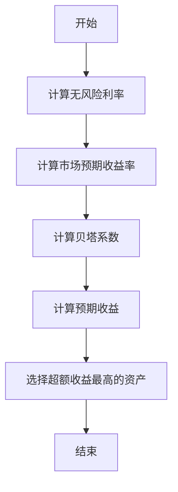

                 


# 约翰伯格对主动投资的批评

> 关键词：主动投资、约翰·伯格、投资策略、数学模型、风险管理

> 摘要：本文深入分析了约翰·伯格对主动投资的批评，探讨了主动投资的理论基础、核心概念、数学模型以及实际应用。通过对比主动与被动投资，结合伯格的实证研究，揭示了主动投资的优缺点，并提出了优化投资策略的建议。

---

## 第一部分：主动投资的背景与概念

### 第1章：主动投资的基本定义

#### 1.1 投资的定义与分类
投资是将资源（如资金）投入到特定项目或资产中，以期获得未来收益的行为。根据投资策略的不同，可以分为**主动投资**和**被动投资**。

- **主动投资**：投资者主动选择资产，通过分析市场趋势和公司基本面来优化投资组合，追求超越市场平均收益。
- **被动投资**：投资者遵循固定规则，如指数基金投资，追求与市场持平的收益。

#### 1.2 约翰·伯格的学术背景与投资理念
约翰·伯格是投资领域的权威，以其对指数基金的研究闻名。他于1973年提出了著名的**伯格公式**，并强调长期投资的重要性。

- **伯格公式**：$$ \text{预期收益} = \text{无风险利率} + \beta \times (\text{市场收益} - \text{无风险利率}) $$
- 伯格的投资理念：长期持有优质资产，避免频繁交易。

#### 1.3 主动投资的核心概念
主动投资的核心在于通过精选个股或特定资产，超越市场指数的表现。其成功依赖于投资者的分析能力和市场判断力。

---

### 第2章：主动投资与被动投资的对比

#### 2.1 主动投资的优缺点
- **优点**：可能获得超额收益，适合市场机会捕捉。
- **缺点**：交易成本高，市场波动风险大。

#### 2.2 约翰·伯格对主动投资的批评
伯格认为，大多数主动投资者无法长期跑赢市场，主要原因包括：
1. **交易成本**：频繁交易增加了佣金和税费。
2. **市场预测难度**：主动投资依赖于准确的市场预测，而市场具有不确定性。
3. **情绪干扰**：投资者容易受到市场情绪影响，做出非理性决策。

#### 2.3 被动投资的优势
伯格推荐被动投资，尤其是指数基金，因为其费用低、风险分散、长期收益稳定。

---

## 第二部分：主动投资的核心概念与原理

### 第3章：主动投资的数学模型

#### 3.1 资本资产定价模型（CAPM）
CAPM是主动投资的重要理论基础，用于计算资产的预期收益：
$$ E(r_i) = r_f + \beta_i (E(r_m) - r_f) $$
其中：
- \( E(r_i) \)：资产i的预期收益率
- \( r_f \)：无风险利率
- \( \beta_i \)：资产i的贝塔系数（衡量波动性）
- \( E(r_m) \)：市场预期收益率

#### 3.2 约翰·伯格的实证研究
伯格通过大量数据分析发现，主动投资的超额收益难以持续，且费用过高。

---

## 第三部分：主动投资的数学模型与算法原理

### 第4章：主动投资的算法实现

#### 4.1 算法流程图


#### 4.2 代码实现
```python
import numpy as np

def expected_return(risk_free_rate, beta, market_return):
    return risk_free_rate + beta * (market_return - risk_free_rate)

# 示例数据
risk_free_rate = 0.05
beta = 1.2
market_return = 0.10

print(expected_return(risk_free_rate, beta, market_return))
```

#### 4.3 实例分析
假设市场预期收益率为10%，无风险利率为5%，某资产贝塔系数为1.2，其预期收益率为：
$$ 0.05 + 1.2 \times (0.10 - 0.05) = 0.11 \text{或} 11\% $$

---

## 第四部分：系统分析与架构设计

### 第5章：主动投资的系统架构

#### 5.1 系统架构图


#### 5.2 功能模块
- **投资决策**：分析市场趋势，选择投资标的。
- **风险管理**：监控投资组合的风险，调整持仓。
- **收益计算**：定期评估投资组合的收益。

---

## 第五部分：项目实战

### 第6章：主动投资组合管理

#### 6.1 环境安装
安装必要的库：
```bash
pip install numpy pandas matplotlib
```

#### 6.2 核心代码实现
```python
import pandas as pd

# 示例数据
data = {'资产A': [0.05, 0.06, 0.04], 
        '资产B': [0.04, 0.05, 0.06]}
df = pd.DataFrame(data)

# 计算组合收益
portfolio_return = df.mean().mean()

print(f"组合预期收益率：{portfolio_return}")
```

#### 6.3 案例分析
通过分析两个资产的预期收益率，优化投资组合的配置。

---

## 第六部分：最佳实践与总结

### 第7章：投资策略优化

#### 7.1 最佳实践
- 长期投资优于短期交易。
- 分散投资以降低风险。
- 定期评估投资组合。

#### 7.2 小结
约翰·伯格的批评提醒我们，主动投资并非万能，被动投资在某些情况下更具优势。投资者需根据自身情况选择合适策略。

---

## 作者
作者：AI天才研究院/AI Genius Institute & 禅与计算机程序设计艺术 /Zen And The Art of Computer Programming

