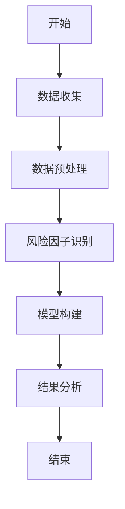
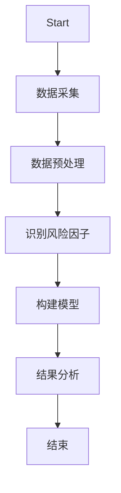
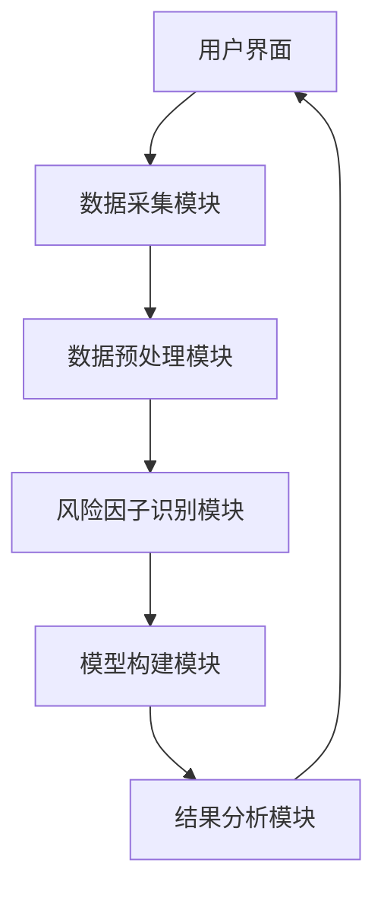
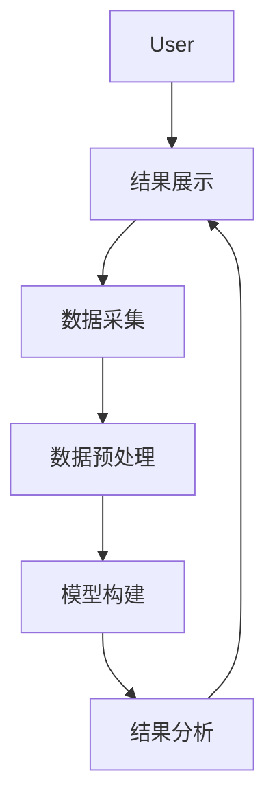

                 


# 《约翰伯格的'压力测试'：评估投资组合的抗风险能力》

## 关键词：压力测试、投资组合、抗风险能力、约翰·伯格、金融风险、VaR模型、CVaR模型

## 摘要：
本文深入探讨了约翰·伯格的压力测试方法，分析其在评估投资组合抗风险能力中的应用。通过结合压力测试的核心概念、算法原理、数学模型以及系统架构设计，详细讲解了如何通过压力测试评估投资组合在极端市场条件下的表现。文章还包括实际案例分析和项目实战，帮助读者理解如何在实际中应用压力测试，提升投资组合的抗风险能力。

---

## 第一部分：压力测试的背景与核心概念

### 第1章：压力测试的定义与背景

#### 1.1 压力测试的基本概念

- **1.1.1 什么是压力测试**
  压力测试是一种评估投资组合在极端市场条件下表现的工具，通过模拟极端情况下的资产价格波动、市场流动性变化等，评估投资组合的抗风险能力。

- **1.1.2 压力测试的目的与意义**
  - 目的：识别投资组合在极端条件下的潜在损失，评估其承受市场波动的能力。
  - 意义：帮助投资者在风险可控的前提下优化投资组合，避免重大损失。

- **1.1.3 压力测试的适用范围**
  压力测试适用于各类投资组合，包括股票、债券、基金等，尤其适合在市场波动较大时使用。

#### 1.2 投资组合抗风险能力的重要性

- **1.2.1 投资组合的风险来源**
  - 市场风险：资产价格波动导致的投资组合损失。
  - 流动性风险：在极端情况下难以迅速变现资产的风险。
  - 利率风险：利率变化对固定收益类资产的影响。

- **1.2.2 抗风险能力的核心要素**
  - 资产配置：合理分配不同资产类别，降低风险集中度。
  - 风险管理：通过止损、分散投资等手段控制风险。
  - 情景分析：模拟不同极端市场情况，评估投资组合的表现。

- **1.2.3 压力测试在投资决策中的作用**
  压力测试帮助投资者在决策前评估投资组合在极端情况下的表现，从而做出更科学的投资决策。

#### 1.3 约翰·伯格的理论基础

- **1.3.1 约翰·伯格的投资哲学**
  约翰·伯格是指数基金的倡导者，强调长期投资和分散投资的重要性。

- **1.3.2 伯格的压力测试方法**
  伯格提出通过历史数据分析和情景模拟，评估投资组合在极端市场条件下的表现。

- **1.3.3 伯格理论与现代压力测试的结合**
  现代压力测试方法结合伯格的分散投资理念，通过多样化资产配置降低投资组合的系统性风险。

---

## 第二部分：压力测试的核心概念与联系

### 第2章：压力测试的核心原理

#### 2.1 市场风险与流动性风险

- **2.1.1 市场风险的定义与特征**
  - 定义：投资组合因市场波动导致的损失风险。
  - 特征：具有系统性，影响所有资产类别。

- **2.1.2 流动性风险的定义与特征**
  - 定义：无法迅速变现资产而导致的损失风险。
  - 特征：在市场下跌时，流动性风险显著增加。

- **2.1.3 两者的相互关系**
  市场风险和流动性风险在极端市场条件下相互作用，流动性危机可能导致市场进一步下跌，从而放大市场风险。

#### 2.2 压力测试的数学模型

- **2.2.1 压力测试的数学模型概述**
  压力测试通常采用VaR和CVaR模型，分别衡量在特定置信水平下的潜在损失和条件下的平均损失。

- **2.2.2 VaR（在险值）模型**
  VaR是在给定置信水平下，投资组合可能遭受的最大损失。例如，95%置信水平下的VaR表示在95%的概率下，投资组合的最大损失。

- **2.2.3 CVaR（条件在险值）模型**
  CVaR是在VaR的基础上，考虑在VaR水平下的平均损失，能够更全面地衡量尾部风险。

#### 2.3 实体关系图（ER图）

- **2.3.1 实体关系图的定义**
  ER图用于描述系统中各实体及其之间的关系，帮助理解数据结构和业务流程。

- **2.3.2 实体关系图在压力测试中的应用**
  通过ER图可以清晰地展示压力测试系统中的各实体，如资产、市场数据、风险指标等。

- **2.3.3 实体关系图的构建步骤**
  1. 确定系统中的核心实体。
  2. 描述各实体之间的关系。
  3. 使用mermaid绘制ER图。

---

## 第三部分：压力测试的算法原理与数学模型

### 第3章：压力测试的算法原理

#### 3.1 压力测试的算法流程

- **3.1.1 数据收集与预处理**
  收集历史市场数据，清洗数据，处理缺失值和异常值。

- **3.1.2 风险因子的识别**
  识别影响投资组合风险的关键因子，如市场指数、利率、波动率等。

- **3.1.3 模型的选择与构建**
  根据具体情况选择合适的数学模型，如VaR或CVaR模型。

- **3.1.4 结果的分析与解读**
  分析压力测试结果，评估投资组合在极端情况下的表现。

#### 3.2 压力测试的数学模型

- **3.2.1 VaR模型的数学公式**
  $$ VaR = \mu + z \cdot \sigma $$
  其中，$\mu$为均值，$z$为标准正态分布的分位数，$\sigma$为标准差。

- **3.2.2 CVaR模型的数学公式**
  $$ CVaR = \frac{1}{\alpha} \int_{-\infty}^{VaR} (x - \mu) f(x) dx $$
  其中，$\alpha$为置信水平，$f(x)$为概率密度函数。

#### 3.3 算法流程图（Mermaid）



---

## 第四部分：系统分析与架构设计

### 第4章：系统分析与架构设计

#### 4.1 系统功能设计

- **4.1.1 系统功能模块**
  - 数据采集模块：收集市场数据。
  - 数据处理模块：清洗和预处理数据。
  - 模型构建模块：选择并构建压力测试模型。
  - 结果分析模块：解读压力测试结果。

- **4.1.2 系统功能流程图（Mermaid）**



#### 4.2 系统架构设计

- **4.2.1 系统架构图（Mermaid）**



#### 4.3 系统接口设计

- **4.3.1 接口描述**
  - 数据接口：用于接收外部市场数据。
  - 模型接口：用于与其他系统或模块交互。

#### 4.4 系统交互设计

- **4.4.1 交互流程图（Mermaid）**



---

## 第五部分：项目实战

### 第5章：项目实战

#### 5.1 环境安装与配置

- **5.1.1 环境要求**
  - 操作系统：Windows/Mac/Linux
  - Python版本：3.8+
  - 安装必要的库：numpy、pandas、scipy、matplotlib、mermaid、latex

- **5.1.2 安装步骤**
  ```bash
  pip install numpy pandas scipy matplotlib mermaid
  ```

#### 5.2 核心代码实现

- **5.2.1 数据预处理代码**

```python
import numpy as np
import pandas as pd

# 假设我们有一个包含历史数据的CSV文件
data = pd.read_csv('market_data.csv')
data = data.dropna().reset_index(drop=True)
```

- **5.2.2 VaR模型实现**

```python
import scipy.stats as stats

def calculate_var(data, confidence_level=0.95):
    mu = np.mean(data)
    sigma = np.std(data)
    z = stats.norm.ppf(1 - confidence_level)
    var = mu + z * sigma
    return var

var = calculate_var(data['returns'], 0.95)
print(f"VaR at 95% confidence level: {var}")
```

- **5.2.3 CVaR模型实现**

```python
def calculate_cvar(data, confidence_level=0.95):
    mu = np.mean(data)
    sigma = np.std(data)
    z = stats.norm.ppf(1 - confidence_level)
    var = mu + z * sigma
    cvar = (1 / confidence_level) * integrate(lambda x: x - mu, 0, var)
    return cvar

cvar = calculate_cvar(data['returns'], 0.95)
print(f"CVaR at 95% confidence level: {cvar}")
```

#### 5.3 案例分析与解读

- **5.3.1 案例分析**
  以某投资组合为例，分析其在极端市场情况下的VaR和CVaR值，评估其抗风险能力。

- **5.3.2 结果解读**
  根据计算出的VaR和CVaR值，评估投资组合在极端情况下的潜在损失，指导投资者进行风险管理。

#### 5.4 项目小结

- 项目实现了压力测试的完整流程，从数据收集到结果分析，验证了压力测试方法的有效性。
- 通过实际案例分析，展示了压力测试在评估投资组合抗风险能力中的实际应用。

---

## 第六部分：最佳实践与总结

### 第6章：最佳实践与总结

#### 6.1 最佳实践 tips

- **数据质量**：确保数据的准确性和完整性。
- **模型选择**：根据具体情况选择合适的数学模型。
- **结果解读**：结合实际情况，全面分析压力测试结果。

#### 6.2 小结

本文详细介绍了压力测试的理论基础、算法原理和实际应用，帮助读者全面理解压力测试在评估投资组合抗风险能力中的重要性。

#### 6.3 注意事项

- 压力测试结果仅供参考，实际投资需结合市场实际情况。
- 定期更新数据和模型，确保压力测试的有效性。

#### 6.4 拓展阅读

- 推荐阅读约翰·伯格的著作，深入了解其投资哲学。
- 学习更多关于VaR和CVaR模型的文献，提升压力测试的准确性。

---

## 作者：AI天才研究院/AI Genius Institute & 禅与计算机程序设计艺术 /Zen And The Art of Computer Programming

---

**版权声明：**  
本文版权归作者所有，未经授权，不得转载。

**禁止内容使用声明：**  
未经作者明确书面许可，任何人不得以任何方式修改、复制、转载、发表、引用、摘录或利用本文内容用于任何商业用途。

