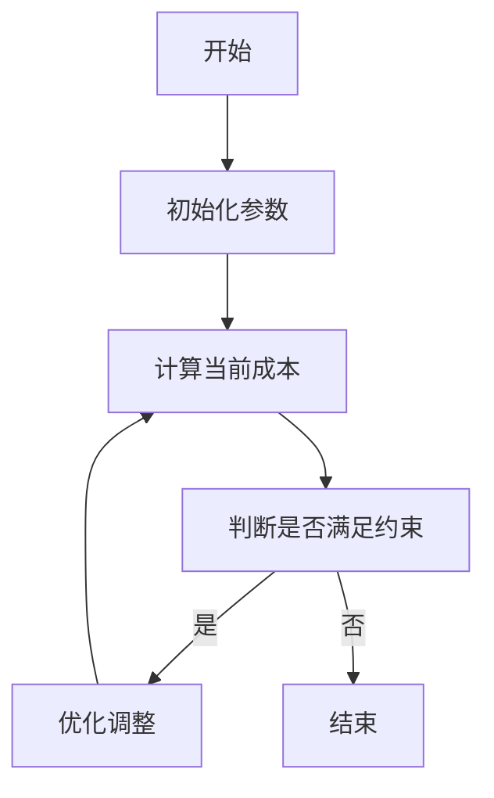
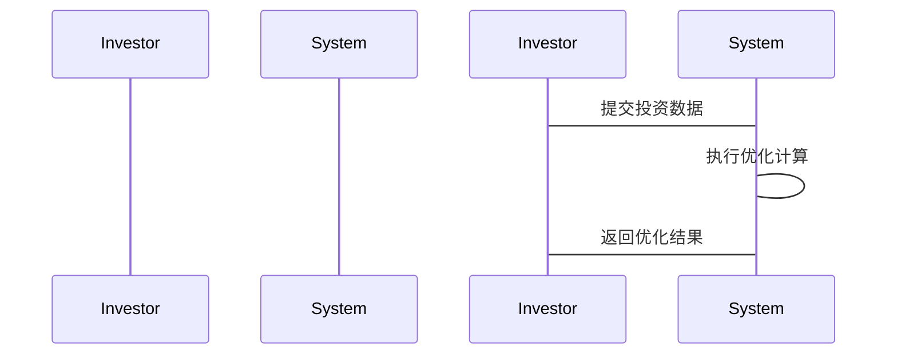

                 


# 约翰伯格的'成本意识'：为什么每一分投资费用都重要

## 关键词：投资成本，成本意识，投资收益，优化策略，算法模型，系统架构，项目实战

## 摘要：本文深入探讨了约翰伯格的成本意识理念，分析了投资成本对收益的影响，结合算法模型和系统架构，提供了实战案例和最佳实践，强调了每一分投资费用的重要性。

---

## 第一部分：成本意识的背景与核心概念

### 第1章：成本意识的定义与重要性

#### 1.1 成本意识的核心概念
- **成本意识的定义**：成本意识是指在投资决策中，对每一分费用的敏感性和优化能力。
- **成本意识的重要性**：在投资中，成本直接影响收益，降低无效成本可显著提升回报率。
- **成本意识与投资行为的关系**：成本意识是投资决策中的关键因素，直接影响投资组合的表现。

#### 1.2 成本意识的背景与现状
- **投资成本的构成要素**：交易费用、管理费用、税费等。
- **成本意识的现状**：当前市场中，许多投资者忽视了小成本的累积效应。
- **成本意识的重要性与趋势**：随着市场竞争加剧，成本优化成为制胜关键。

#### 1.3 成本意识的核心要素
- **投资成本的分类**：固定成本与可变成本。
- **成本与收益的平衡**：通过优化成本结构提升收益。
- **成本意识的动态性**：成本与市场环境的互动关系。

### 第2章：成本意识的核心概念与联系

#### 2.1 成本意识的核心原理
- **成本控制的基本原理**：通过优化成本结构提升投资效率。
- **成本与收益的动态平衡**：降低成本不一定意味着降低收益，而是优化资源配置。
- **成本优化的数学模型**：构建成本与收益的关系模型，进行优化计算。

#### 2.2 成本意识的属性特征对比
- **成本的可变性与固定性对比**：可变成本随投资规模变化，固定成本不变。
- **短期成本与长期成本的差异**：短期成本波动大，长期成本更具稳定性。
- **显性成本与隐性成本的区分**：显性成本可直接计算，隐性成本需综合评估。

#### 2.3 成本意识的ER实体关系图
```mermaid
er
  投资者: Investor
  投资行为: InvestmentAction
  投资成本: InvestmentCost
  投资收益: InvestmentReturn
  约束条件: InvestmentConstraints
  Investor --> InvestmentAction
  InvestmentAction --> InvestmentCost
  InvestmentAction --> InvestmentReturn
  InvestmentCost --> InvestmentReturn
```

---

## 第二部分：算法原理与数学模型

### 第3章：成本意识的算法原理

#### 3.1 成本优化算法概述
- **优化目标**：最小化投资成本，最大化净收益。
- **约束条件**：资金限制、风险承受能力等。
- **算法选择**：使用线性规划或动态规划模型。

#### 3.2 成本优化模型的构建
- **模型假设**：市场有效、理性投资者等。
- **变量定义**：投资金额、成本系数等。
- **目标函数**：最大化净收益，即收益减去成本。

#### 3.3 成本优化算法流程


#### 3.4 成本优化的Python实现
```python
import numpy as np
from scipy.optimize import minimize

# 定义目标函数
def cost_minimization(x, costs):
    return np.dot(x, costs)

# 定义约束条件
def constraint(x, return_vector, min_return):
    return np.dot(x, return_vector) - min_return >= 0

# 初始化参数
x0 = np.array([1, 1, 1])
costs = np.array([0.01, 0.02, 0.015])

# 使用最小二乘法优化
result = minimize(cost_minimization, x0, args=(costs,), 
                 constraints={'type': 'ineq', 'fun': lambda x: constraint(x, return_vector, min_return)})

print("最优解为:", result.x)
```

#### 3.5 数学模型与公式
- **目标函数**：$$\text{min} \sum_{i=1}^{n} c_i x_i$$
- **约束条件**：$$\sum_{i=1}^{n} r_i x_i \geq R_{\text{min}}$$
  其中，$$c_i$$为投资成本，$$r_i$$为投资回报率，$$R_{\text{min}}$$为最低回报要求。

---

## 第三部分：系统分析与架构设计

### 第4章：投资成本分析系统的构建

#### 4.1 系统功能模块
- **数据输入模块**：接收投资成本和回报数据。
- **优化计算模块**：执行成本优化算法。
- **结果展示模块**：呈现优化结果和分析报告。

#### 4.2 系统架构设计


#### 4.3 系统接口设计
- **输入接口**：接受投资成本和回报数据。
- **输出接口**：展示优化后的投资组合和成本分析报告。

#### 4.4 系统交互流程


---

## 第四部分：项目实战与案例分析

### 第5章：成本意识的项目实战

#### 5.1 环境安装与数据准备
- **环境要求**：安装Python、numpy、scipy等库。
- **数据准备**：收集投资成本和回报数据。

#### 5.2 系统核心实现
```python
import numpy as np
from scipy.optimize import minimize

def optimize_portfolio(returns, costs, initial_amount=1000):
    n = len(returns)
    # 定义目标函数
    def objective(x):
        return np.dot(x, costs)
    # 定义约束条件：总回报至少为某个值
    def constraint(x, ret):
        return np.dot(x, ret) - 0.05 >= 0
    # 约束的类型和函数
    constraints = [{'type': 'ineq', 'fun': lambda x, r: constraint(x, r), 'args': (returns,)}]
    # 边界条件：x >= 0
    bounds = [(0, None) for _ in range(n)]
    # 初始猜测
    x0 = np.array([initial_amount/n]*n)
    # 求解
    result = minimize(objective, x0, bounds=bounds, constraints=constraints)
    return result.x

# 示例数据
returns = [0.08, 0.12, 0.05]
costs = [0.01, 0.02, 0.015]
portfolio = optimize_portfolio(returns, costs)
print("优化后的投资组合为:", portfolio)
```

#### 5.3 案例分析与解读
- **案例背景**：假设三个投资选项，分别有不同的回报率和成本。
- **优化结果**：通过优化算法，找到成本最低的投资组合，同时满足最低回报要求。

---

## 第五部分：最佳实践与注意事项

### 第6章：成本意识的最佳实践

#### 6.1 小结
- 成本意识是投资决策中不可忽视的因素。
- 通过优化算法和系统设计，可以显著降低投资成本，提升收益。

#### 6.2 注意事项
- 确保数据的准确性和完整性。
- 定期评估和调整投资组合。
- 考虑市场变化和风险因素。

#### 6.3 拓展阅读
- 《投资学基础》：理解投资的基本原理。
- 《优化算法入门》：掌握更多成本优化方法。

---

## 作者：AI天才研究院/AI Genius Institute & 禅与计算机程序设计艺术/Zen And The Art of Computer Programming

---

以上内容详细解释了约翰伯格的成本意识理念，并通过算法、系统架构和项目实战进行了深入分析，为读者提供了全面的视角和实用的指导。

