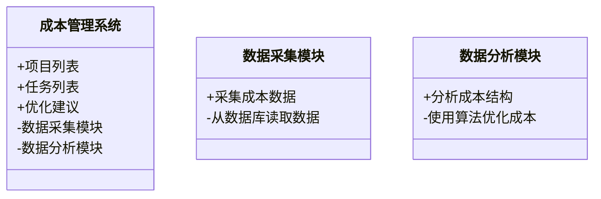
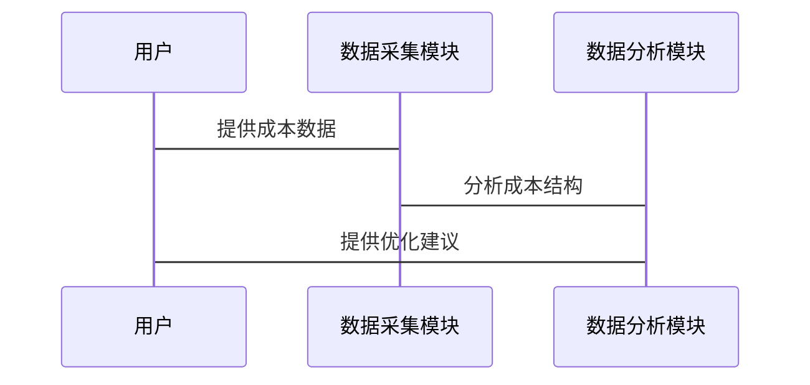

                 


# 约翰伯格的成本意识：为什么每一分钱都很重要

## 关键词：成本意识，财务管理，企业战略，资源优化，成本控制

## 摘要：  
约翰伯格的成本意识强调了在个人和企业层面，每一分钱的价值和重要性。本文从成本意识的核心概念出发，分析了成本结构、优化算法、系统架构设计，并通过项目实战和最佳实践，深入探讨了如何有效管理和优化成本。通过具体的案例分析和数学模型，文章展示了成本意识在实际应用中的重要性和实现方法。

---

# 正文

## 第1章：成本意识的背景与核心概念

### 1.1 成本意识的定义与重要性

**成本意识**是指对每一分钱的价值有清晰的认识，并在决策中优先考虑成本的最小化或合理利用。在个人和企业层面，成本意识是资源优化和效率提升的关键。它不仅关乎财务健康，还影响整体战略规划。

#### 1.1.1 成本意识的定义
成本意识是一种通过有效管理和优化资源分配，以最小化浪费并实现最大收益的思维方式。它强调在决策过程中考虑每一分钱的价值，避免不必要的开支，并确保资源的高效利用。

#### 1.1.2 成本意识的重要性
成本意识的重要性体现在以下几个方面：
- **资源优化**：通过合理分配资源，避免浪费，提高效率。
- **财务健康**：帮助企业或个人在财务上保持稳健，减少风险。
- **竞争力提升**：在企业层面，成本意识有助于降低产品或服务的成本，增强市场竞争力。

#### 1.1.3 成本意识的核心要素
- **成本核算**：准确计算每项支出，确保透明和可追溯。
- **预算管理**：制定合理的预算，并严格执行。
- **成本控制**：通过监控和调整，确保成本在预算范围内。

### 1.2 成本意识的背景与问题背景

#### 1.2.1 当前经济环境中的成本问题
在当前经济环境下，成本问题尤为突出。企业面临原材料价格上涨、人工成本增加等挑战，个人也面临通货膨胀和生活成本上升的压力。成本意识成为应对这些挑战的关键。

#### 1.2.2 成本意识与企业生存的关系
企业能否在竞争激烈的市场中生存，很大程度上取决于其成本控制能力。成本意识强的企业能够有效降低成本，提高利润率，增强市场竞争力。

#### 1.2.3 成本意识与个人财务管理的关系
个人通过成本意识可以更好地管理收支，避免不必要的开支，实现财务自由。例如，通过精打细算，个人可以在有限的收入下实现更高的生活质量。

---

## 第2章：成本结构分析

### 2.1 成本构成的分类

#### 2.1.1 固定成本与可变成本
- **固定成本**：如租金、 salaries，这些成本在一定范围内不变。
- **可变成本**：如原材料、运输费用，这些成本随产量变化。

#### 2.1.2 直接成本与间接成本
- **直接成本**：直接与产品或服务相关的成本，如原材料。
- **间接成本**：难以直接归因于特定产品或服务的成本，如工厂租金。

#### 2.1.3 短期成本与长期成本
- **短期成本**：短期内可以调整的成本，如劳动力。
- **长期成本**：长期规划中的成本，如设备投资。

### 2.2 成本与收益的关系

#### 2.2.1 成本收益分析模型
成本收益分析模型用于评估投资项目的可行性，公式如下：
$$ \text{净现值} = \sum_{t=1}^{n} \frac{CF_t}{(1 + r)^t} $$
其中，$CF_t$是第t年的现金流，$r$是贴现率。

#### 2.2.2 边际成本与边际收益
边际成本是指每增加一单位产品所增加的成本，边际收益是指每增加一单位产品所带来的收益。当边际成本等于边际收益时，企业利润最大化。

---

## 第3章：成本优化的算法原理

### 3.1 成本最小化模型

#### 3.1.1 线性规划模型
线性规划是一种优化技术，用于在满足约束条件下最大化或最小化目标函数。例如，企业可以使用线性规划来最小化生产成本，同时满足需求。

#### 3.1.2 使用Python实现线性规划的成本优化
以下是使用Python的`scipy.optimize`库实现线性规划的示例代码：
```python
from scipy.optimize import minimize
import numpy as np

# 定义目标函数
def objective(x):
    return np.dot(x, [2, 3])

# 定义约束条件
def constraint1(x):
    return 4*x[0] + 2*x[1] - 8 <= 0

x = minimize(objective, [0, 0], constraints=[{'type': 'ineq', 'fun': constraint1}])
print(x)
```

#### 3.1.3 示例问题：生产计划优化
假设企业生产两种产品，A和B。生产A需要2小时，B需要3小时，总工时限制为8小时。目标是最小化成本，每生产A成本2元，B成本3元。解得最优生产计划为A=2，B=0，总成本为4元。

### 3.2 成本预测模型

#### 3.2.1 时间序列分析
时间序列分析用于预测未来成本。例如，使用ARIMA模型预测未来的需求，从而优化库存管理。

#### 3.2.2 使用Python进行成本预测
以下是使用Python的`statsmodels`库实现ARIMA模型的示例代码：
```python
from statsmodels.tsa.arima_model import ARIMA
import pandas as pd

# 假设我们有一个成本时间序列data
data = [10, 12, 15, 13, 18, 20, 22]

# 创建ARIMA模型
model = ARIMA(data, order=(1, 1, 1))
model_fit = model.fit()

# 预测下一个值
forecast = model_fit.forecast()
print(forecast)
```

---

## 第4章：企业成本管理系统设计

### 4.1 系统架构设计

#### 4.1.1 系统功能模块划分
- **数据采集**：收集成本数据。
- **数据分析**：分析成本结构。
- **成本优化**：提供优化建议。
- **报表生成**：生成成本报告。

#### 4.1.2 系统架构的ER图
```mermaid
erd
  项目(Project) {
    id
    name
    budget
  }
  任务(Task) {
    id
    name
    cost
    project_id
  }
  负责人(Responsible) {
    id
    name
    task_id
  }
  关系：Task -> 负责人
```

#### 4.1.3 系统架构的类图


### 4.2 系统接口与交互设计

#### 4.2.1 系统接口设计
- **API接口**：提供RESTful API，供其他系统调用。
- **数据接口**：与数据库或其他系统的数据接口。

#### 4.2.2 系统交互流程图


---

## 第5章：成本管理项目实战

### 5.1 项目环境与工具安装

#### 5.1.1 开发环境配置
- **操作系统**：Windows 10或更高版本。
- **编程语言**：Python 3.8或更高版本。
- **工具安装**：安装Jupyter Notebook、Python、NumPy、Pandas、Matplotlib。

#### 5.1.2 工具安装与配置
安装步骤：
```bash
pip install numpy pandas matplotlib scipy statsmodels
```

### 5.2 核心代码实现

#### 5.2.1 成本优化代码
```python
import numpy as np
import matplotlib.pyplot as plt
from scipy.optimize import minimize

# 示例成本数据
costs = np.array([10, 15, 20, 25, 30])

# 定义目标函数：最小化总成本
def objective(x):
    return np.dot(x, costs)

# 定义约束条件：总数量为5
def constraint(x):
    return np.sum(x) - 5

# 使用minimize优化
x = minimize(objective, np.zeros(5), constraints=[{'type': 'eq', 'fun': constraint}])

# 可视化结果
plt.bar(np.arange(5), x.x, tick_label=['A', 'B', 'C', 'D', 'E'])
plt.title('成本优化结果')
plt.show()
```

#### 5.2.2 成本预测代码
```python
import pandas as pd
from statsmodels.tsa.arima_model import ARIMA

# 示例数据
data = pd.Series([10, 12, 15, 13, 18, 20, 22])

# 拟合ARIMA模型
model = ARIMA(data, order=(1, 1, 1))
model_fit = model.fit()

# 预测未来值
forecast = model_fit.forecast(steps=3)
print(forecast)
```

---

## 第6章：最佳实践与总结

### 6.1 最佳实践 tips
- **定期审查预算**：每月或每季度审查一次，确保成本在预算范围内。
- **使用工具辅助**：利用数据分析工具优化成本。
- **培训员工**：提高员工的成本意识，确保他们理解成本管理的重要性。

### 6.2 小结
成本意识是企业和个人财务管理中的核心原则。通过合理规划和优化，可以显著降低成本，提高效率和竞争力。

### 6.3 注意事项
- **避免过度优化**：过度优化可能导致资源分配不均，影响整体效率。
- **考虑外部因素**：如市场波动和政策变化，可能影响成本管理。

### 6.4 拓展阅读
- **《精益创业》**：埃里森·格雷厄姆著，介绍如何通过精益方法优化成本。
- **《成本会计学》**：柴纳·史密斯著，详细讲解成本会计原理和方法。

---

## 作者：AI天才研究院/AI Genius Institute & 禅与计算机程序设计艺术/Zen And The Art of Computer Programming

---

以上是关于《约翰伯格的成本意识：为什么每一分钱都很重要》的完整文章，涵盖了成本意识的背景、结构、算法、系统设计、项目实战和总结。通过这些内容，读者可以全面理解成本意识的重要性及其在实际中的应用。

