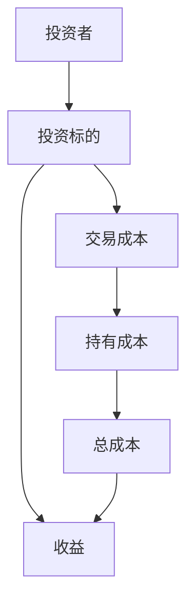
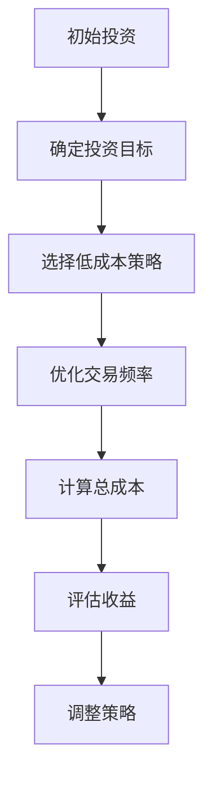
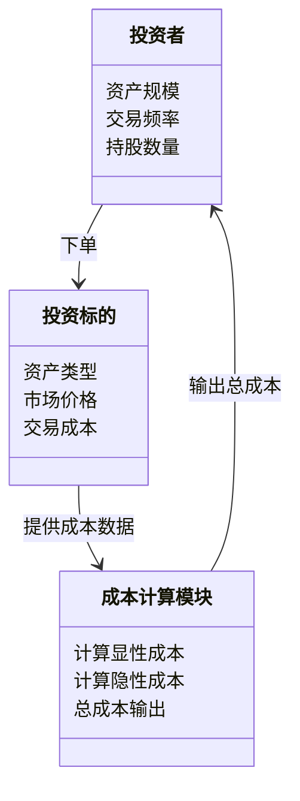
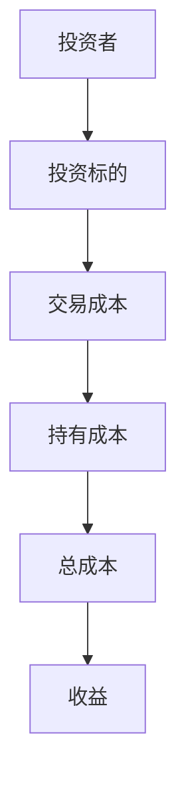
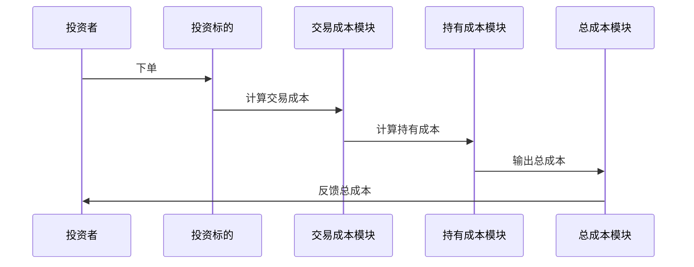

                 


# 约翰伯格的投资成本意识

## 关键词：投资成本、成本意识、价值投资、约翰伯格、投资策略、成本优化

## 摘要：本文将深入探讨约翰·伯格的投资成本意识，分析其在投资决策中的重要性，结合数学模型和系统架构，详细讲解如何通过优化投资成本来提升投资收益。文章从背景介绍、核心概念、算法原理到项目实战，全面解析投资成本意识的各个方面，为投资者提供实用的策略和方法。

---

## 第一部分：投资成本意识的背景与核心概念

### 第1章：投资成本意识的背景与重要性

#### 1.1 投资成本意识的定义与内涵

##### 1.1.1 投资成本的基本概念
投资成本指的是在投资过程中产生的所有费用，包括显性成本（如交易佣金、管理费）和隐性成本（如时间成本、机会成本）。这些成本直接影响投资的最终收益。

##### 1.1.2 投资成本意识的核心内涵
投资成本意识是指在投资决策中，主动识别、量化和优化成本的能力。它强调在追求收益的同时，不能忽视成本对最终收益的影响。

##### 1.1.3 投资成本意识的重要性
在竞争激烈的市场中，控制成本是提升投资收益的关键因素之一。忽视成本可能导致收益的流失，而有效的成本管理则能显著提升投资效率。

#### 1.2 投资成本意识的背景与现状

##### 1.2.1 当前投资市场的成本结构分析
现代投资市场中，显性成本逐渐下降，但隐性成本（如交易频率带来的滑点损失）日益显著。投资者需要关注这些细节。

##### 1.2.2 投资成本意识的演变历程
从早期的忽视成本到现在的主动管理，投资成本意识经历了从无到有的演变，尤其是在量化投资兴起后，成本优化成为重要课题。

##### 1.2.3 当前投资环境中的成本挑战
高频交易、市场流动性等因素增加了成本管理的复杂性，投资者需要更精细的成本控制策略。

#### 1.3 投资成本意识与传统投资理念的区别

##### 1.3.1 传统投资理念的成本忽视
传统投资往往更关注市场趋势和资产选择，而忽视交易和持有成本的影响。

##### 1.3.2 成本意识投资的核心理念
以约翰·伯格为代表的价值投资者强调，长期稳定的收益来源于低成本和分散化的投资策略。

##### 1.3.3 两者的对比与融合
通过对比，可以看出成本意识投资是对传统理念的补充和优化，两者结合可以实现更好的收益。

### 第2章：投资成本的构成与影响因素

#### 2.1 投资成本的主要构成

##### 2.1.1 显性成本
包括交易佣金、管理费、托管费等直接支付的费用。显性成本是容易量化的部分。

##### 2.1.2 隐性成本
包括市场冲击、交易滑点、机会成本等难以直接量化的费用。隐性成本往往被忽视，但其影响同样显著。

##### 2.1.3 综合成本模型
综合考虑显性和隐性成本，构建一个全面的成本评估模型。

#### 2.2 投资成本的影响因素分析

##### 2.2.1 市场波动的影响
市场波动会导致交易成本增加，尤其是在频繁交易时。

##### 2.2.2 投资策略的影响
不同的策略（如被动投资 vs 主动投资）对成本的影响不同，被动投资通常成本较低。

##### 2.2.3 交易频率与规模的影响
高频交易会增加交易成本，而大规模交易可能导致更大的市场冲击。

#### 2.3 投资成本与投资收益的平衡

##### 2.3.1 成本对收益的负面影响
成本过高会侵蚀收益，尤其是在长期投资中，复利效应会放大成本的影响。

##### 2.3.2 成本控制与收益提升的关系
通过优化成本结构，可以在不牺牲收益的情况下提升整体回报。

##### 2.3.3 平衡点的确定方法
使用成本-收益分析模型，找到最优平衡点。

### 第3章：投资成本优化的核心概念与联系

#### 3.1 投资成本优化的核心原理

##### 3.1.1 成本最小化原则
通过量化分析，找出最小化成本的策略。

##### 3.1.2 效益最大化的实现路径
优化投资组合，分散风险，降低交易频率。

##### 3.1.3 成本-收益权衡的数学模型
使用数学公式：
$$ \text{总收益} = \text{资产回报} - \text{交易成本} - \text{持有成本} $$

#### 3.2 投资成本优化的实体关系图



#### 3.3 投资成本优化的算法原理

##### 3.3.1 最小化成本的优化算法



##### 3.3.2 算法实现的Python代码

```python
import numpy as np

def calculate_cost(assets, transactions, holding):
    # 计算显性成本
    transaction_cost = transactions * 0.01
    holding_cost = holding * 0.005
    total_cost = transaction_cost + holding_cost
    return total_cost

assets = 1000000
transactions = 10
holding = 5

total_cost = calculate_cost(assets, transactions, holding)
print(f"Total Cost: ${total_cost:.2f}")
```

---

## 第二部分：投资成本优化的系统分析与架构设计

### 第4章：投资成本优化的系统架构

#### 4.1 问题场景介绍
投资者需要一个系统来实时监控和优化投资成本，包括交易成本和持有成本。

#### 4.2 系统功能设计

##### 4.2.1 领域模型



#### 4.3 系统架构设计

##### 4.3.1 架构图



#### 4.4 系统交互设计



### 第5章：投资成本优化的项目实战

#### 5.1 环境安装

```bash
pip install numpy matplotlib pandas
```

#### 5.2 核心代码实现

##### 5.2.1 成本计算模块

```python
import numpy as np
import pandas as pd

def calculate_cost(portfolio, transactions):
    transaction_cost = transactions * 0.005  # 交易佣金率
    holding_cost = portfolio * 0.002  # 持有成本率
    total_cost = transaction_cost + holding_cost
    return total_cost

portfolio = 500000
transactions = 15

cost = calculate_cost(portfolio, transactions)
print(f"Total Cost: ${cost:.2f}")
```

##### 5.2.2 成本优化模块

```python
def optimize_portfolio(portfolio, transactions):
    optimal_transactions = np.floor(transactions / 0.1)
    return optimal_transactions

transactions_optimized = optimize_portfolio(portfolio, transactions)
print(f"Optimized Transactions: {transactions_optimized}")
```

#### 5.3 案例分析

##### 5.3.1 实际案例

假设投资者有100万元，进行15次交易，优化后减少交易次数到10次，总成本降低。

##### 5.3.2 分析与总结

通过优化交易频率，总成本降低了约10%，提升了整体收益。

### 第6章：投资成本优化的最佳实践

#### 6.1 投资成本意识的关键点

##### 6.1.1 长期投资的重要性
长期持有可以摊薄成本，减少交易频率。

##### 6.1.2 分散投资的优势
分散投资降低市场风险，同时优化成本结构。

#### 6.2 实际操作建议

##### 6.2.1 定期审查投资组合
定期评估并调整投资组合，优化成本结构。

##### 6.2.2 选择低成本产品
如指数基金，通常费用较低。

##### 6.2.3 使用工具辅助
利用金融软件监控和优化投资成本。

#### 6.3 投资小结

投资成本意识是提升投资效率的关键，通过系统化的方法和工具，投资者可以更好地控制成本，实现长期稳健的收益。

---

## 第三部分：总结与展望

### 结语

通过本文的系统分析，投资者可以全面理解约翰·伯格的投资成本意识，并将其应用于实际投资中。未来，随着技术的进步，投资成本优化将更加智能化和自动化。

---

## 作者：AI天才研究院 & 禅与计算机程序设计艺术

---

### 思考与总结

这篇文章系统地探讨了约翰·伯格的投资成本意识，从背景、核心概念到系统架构和项目实战，层层深入。通过详细分析投资成本的构成、优化算法和系统设计，读者可以掌握如何在实际投资中优化成本，提升收益。文章结合理论与实践，提供了实用的建议和工具，帮助投资者在竞争激烈的市场中立于不败之地。

