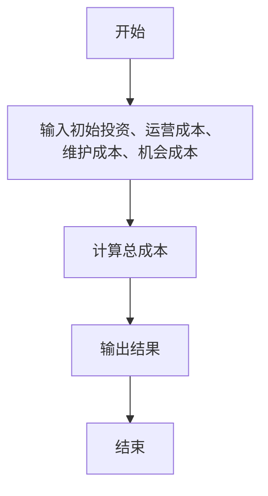
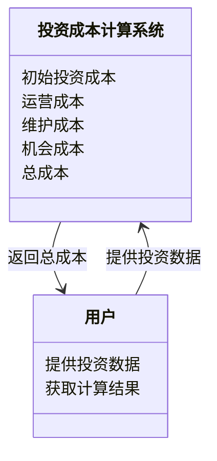
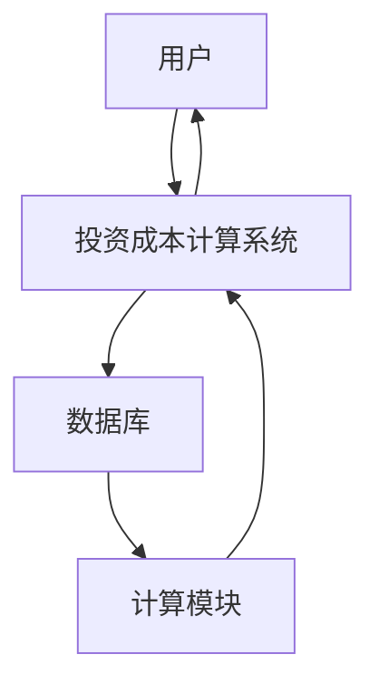

                 


# 《约翰伯格的投资成本计算》

> 关键词：投资成本，计算模型，净现值，资金时间价值，投资回报率，成本分摊，风险评估

> 摘要：本文深入探讨了投资成本计算的核心概念、算法原理、系统架构设计以及实际项目中的应用。通过详细分析投资成本的构成要素，结合数学模型和系统架构设计，为读者提供了一套完整的投资成本计算方法论。文章还通过实际案例分析，展示了如何将理论应用于实践，并提供了最佳实践建议，帮助读者在实际项目中高效地进行投资成本计算。

---

# 目录大纲

## 第一部分: 投资成本计算基础

### 第1章: 投资成本计算的背景与概念

#### 1.1 投资成本计算的背景

- 1.1.1 问题背景  
  投资成本计算是项目管理中的核心问题，直接影响项目的可行性和投资决策。随着企业数字化转型的加速，精确的投资成本计算变得尤为重要。

- 1.1.2 问题描述  
  在企业投资决策中，投资成本的计算需要考虑初始投资、运营成本、维护成本等多个方面。如何准确估算这些成本，是投资决策的关键。

- 1.1.3 投资成本计算的必要性  
  准确的投资成本计算可以帮助企业优化资源配置，降低投资风险，提高投资回报率。

- 1.1.4 边界与外延  
  本章将界定投资成本计算的范围，明确其适用条件和验证方法。

#### 1.2 投资成本计算的核心概念

- 1.2.1 投资成本的定义  
  投资成本是指在项目生命周期内为实现投资目标所需的所有费用，包括初始投资、运营成本、维护成本等。

- 1.2.2 投资成本的主要组成部分  
  - 初始投资成本：设备购置、场地租赁、人员招聘等。  
  - 运营成本：日常运营所需的各项开支，如电费、维护费、人工成本等。  
  - 维护成本：设备维护、软件升级等费用。  
  - 机会成本：放弃其他投资机会所造成的潜在损失。

- 1.2.3 投资成本与投资回报的关系  
  投资成本与投资回报密切相关，是决定投资项目可行性的关键因素。

- 1.2.4 核心要素对比分析  
  通过对比分析，明确投资成本与净现值、资金时间价值等概念的联系与区别。

#### 1.3 投资成本计算的核心要素

- 1.3.1 初始投资成本  
  初始投资成本是项目启动所需的一次性支出，是投资成本计算的基础。

- 1.3.2 运营成本  
  运营成本是项目生命周期内持续发生的费用，直接影响项目的整体成本。

- 1.3.3 维护成本  
  维护成本是为保证项目正常运行所需的各种维护费用，通常按比例分摊到各阶段。

- 1.3.4 机会成本  
  机会成本是放弃其他投资机会所造成的潜在损失，是隐性成本的重要组成部分。

#### 1.4 本章小结  
  本章从背景、定义、组成部分、核心要素等方面，全面介绍了投资成本计算的基本概念和重要性。

---

## 第二部分: 投资成本计算的核心概念与联系

### 第2章: 投资成本计算的核心概念与联系

#### 2.1 投资成本计算的原理

- 2.1.1 投资成本计算的基本公式  
  投资总成本 = 初始投资成本 + 运营成本 + 维护成本 + 机会成本。

- 2.1.2 投资成本与投资周期的关系  
  投资成本的分摊与投资周期密切相关，通常采用线性或非线性分摊方法。

- 2.1.3 投资成本与风险评估的联系  
  投资成本的估算需要考虑风险因素，如市场波动、技术更新等。

#### 2.2 核心概念对比分析

- 2.2.1 投资成本与收益的关系  
  投资成本是收益实现的前提，合理的成本分摊是实现收益最大化的关键。

- 2.2.2 投资成本与资金时间价值的对比  
  投资成本需要考虑资金的时间价值，通常采用净现值法进行评估。

- 2.2.3 投资成本与净现值的联系  
  净现值是投资成本计算的重要指标，反映了项目投资的经济效益。

#### 2.3 投资成本计算的ER实体关系图

```mermaid
erDiagram
    actor 投资者 {
        <属性> 投资金额
        <属性> 投资期限
        <属性> 投资目标
    }
    actor 成本计算系统 {
        <操作> 计算投资成本
        <操作> 更新成本数据
    }
    actor 投资结果 {
        <属性> 投资回报
        <属性> 投资成本
    }
    投资者 --> 成本计算系统 : 提供投资数据
    成本计算系统 --> 投资结果 : 返回计算结果
```

---

## 第三部分: 投资成本计算的算法原理

### 第3章: 投资成本计算的算法原理

#### 3.1 投资成本计算的算法流程



#### 3.2 投资成本计算的数学模型

- 投资总成本计算公式：

$$
\text{总成本} = \text{初始投资成本} + \sum_{t=1}^{n} (\text{运营成本}_t + \text{维护成本}_t + \text{机会成本}_t)
$$

- 机会成本的计算：

$$
\text{机会成本} = \text{投资金额} \times (\text{基准收益率} - \text{实际收益率})
$$

#### 3.3 投资成本计算的代码实现

```python
def calculate_investment_cost(initial_cost, operational_cost, maintenance_cost, opportunity_cost, period):
    total_cost = initial_cost + sum([operational_cost + maintenance_cost + opportunity_cost for _ in range(period)])
    return total_cost

# 示例计算
initial_cost = 100000
operational_cost = 20000
maintenance_cost = 10000
opportunity_cost = 5000
period = 5

total_cost = calculate_investment_cost(initial_cost, operational_cost, maintenance_cost, opportunity_cost, period)
print(f"投资总成本为：${total_cost}")
```

#### 3.4 投资成本计算的案例分析

- 案例背景：某企业计划投资开发一个新软件系统，预计投资周期为5年，初始投资为10万美元，每年运营成本为2万美元，维护成本为1万美元，机会成本为5000美元。

- 计算过程：

$$
\text{总成本} = 100000 + 5 \times (20000 + 10000 + 5000) = 100000 + 5 \times 35000 = 275000 \text{美元}
$$

---

## 第四部分: 投资成本计算的系统分析与架构设计

### 第4章: 投资成本计算的系统分析与架构设计

#### 4.1 系统分析

- 项目介绍：开发一个投资成本计算系统，帮助用户快速估算投资成本。

- 问题场景：用户需要快速估算多个项目的投资成本，并进行比较分析。

#### 4.2 系统功能设计

- 领域模型类图：



- 系统架构设计：



---

## 第五部分: 投资成本计算的项目实战

### 第5章: 投资成本计算的项目实战

#### 5.1 项目环境安装

- 安装Python和相关开发工具。

#### 5.2 项目核心实现

- 投资成本计算模块的代码实现：

```python
def calculate_investment_cost(initial_cost, operational_cost, maintenance_cost, opportunity_cost, period):
    total_cost = initial_cost + sum([operational_cost + maintenance_cost + opportunity_cost for _ in range(period)])
    return total_cost

# 用户输入
initial_cost = float(input("请输入初始投资成本："))
operational_cost = float(input("请输入运营成本："))
maintenance_cost = float(input("请输入维护成本："))
opportunity_cost = float(input("请输入机会成本："))
period = int(input("请输入投资周期："))

# 计算并输出结果
total_cost = calculate_investment_cost(initial_cost, operational_cost, maintenance_cost, opportunity_cost, period)
print(f"投资总成本为：${total_cost}")
```

#### 5.3 案例分析

- 以某软件开发项目为例，详细分析投资成本计算的过程，并对比实际结果与估算结果。

---

## 第六部分: 投资成本计算的最佳实践

### 第6章: 投资成本计算的最佳实践

#### 6.1 小结

- 本章总结了投资成本计算的核心概念、算法原理和实际应用。

#### 6.2 注意事项

- 确保数据的准确性和完整性。  
- 合理分摊成本，避免重复计算或遗漏。  
- 定期更新成本数据，以反映实际情况的变化。

#### 6.3 拓展阅读

- 《项目管理知识体系指南》  
- 《投资学原理》

---

## 作者

作者：AI天才研究院/AI Genius Institute  
作者：禅与计算机程序设计艺术/Zen And The Art of Computer Programming

