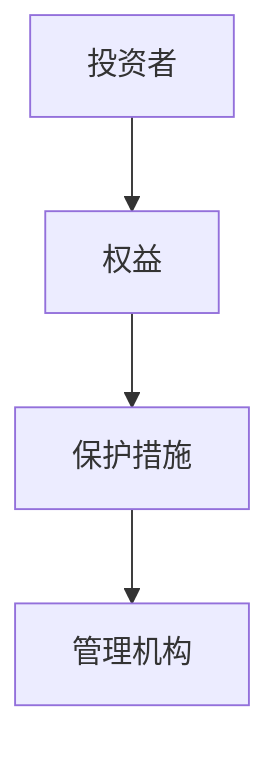

                 

# 约翰伯格的投资者权益保护

> 关键词：投资者权益保护、约翰伯格、投资策略、风险管理、金融科技创新、金融监管

> 摘要：本文深入探讨了投资者权益保护的重要性和实现方法，结合约翰伯格的投资者保护理念，系统分析了投资者权益保护的核心概念、算法原理、系统架构设计以及项目实战。通过本文，读者可以全面了解投资者权益保护的关键要素，并掌握实际应用的方法和技巧。

---

# 第一部分: 投资者权益保护的背景与核心概念

## 第1章: 投资者权益保护概述

### 1.1 投资者权益保护的背景与意义

#### 1.1.1 投资者权益保护的背景
在当前金融环境中，投资者权益保护已成为一个重要议题。随着金融市场的快速发展，投资者面临的风险也在不断增加，尤其是中小投资者，他们往往缺乏专业知识和资源，容易在投资过程中受到侵害。投资者权益保护的目的是确保投资者的合法权益得到尊重和维护，促进市场的公平与透明。

#### 1.1.2 投资者权益保护的重要性
投资者权益保护不仅是法律要求，也是维护市场秩序和投资者信心的关键。通过保护投资者权益，可以减少市场操纵、欺诈等不正当行为，促进金融市场的健康发展。此外，投资者权益保护还能提升投资者的信任感，吸引更多资金流入市场，推动经济的增长。

#### 1.1.3 投资者权益保护的法律框架
投资者权益保护的法律框架通常包括《证券法》、《公司法》等法律法规。这些法律法规规定了投资者的权利和义务，明确了市场的监管机构和责任主体。通过法律框架的完善，可以为投资者提供更加有力的保护。

### 1.2 投资者权益保护的核心概念

#### 1.2.1 投资者权益的定义
投资者权益是指投资者在投资过程中享有的权利，包括知情权、参与权、收益权、处分权等。这些权利是投资者在投资活动中应当享有的基本权利。

#### 1.2.2 投资者权益保护的范围
投资者权益保护的范围包括但不限于：
- **知情权**：投资者有权了解投资产品的基本信息、风险提示等。
- **参与权**：投资者有权参与投资决策，如投票选举董事会成员。
- **收益权**：投资者有权获得投资收益，包括股息、红利等。
- **处分权**：投资者有权处分其持有的资产。

#### 1.2.3 投资者权益保护的边界与外延
投资者权益保护的边界在于不干预市场的自由竞争和正常运作。外延则包括投资者教育、信息披露、风险管理等多个方面。

### 1.3 投资者权益保护的核心要素

#### 1.3.1 投资者权益保护的主体
投资者权益保护的主体包括：
- **投资者**：投资者是自身权益的保护者。
- **金融机构**：金融机构有责任保护投资者的合法权益。
- **监管机构**：监管机构负责监督市场，确保投资者权益不受侵害。

#### 1.3.2 投资者权益保护的对象
投资者权益保护的对象包括：
- **个人投资者**：包括散户投资者。
- **机构投资者**：包括基金公司、保险公司等。

#### 1.3.3 投资者权益保护的手段与方法
投资者权益保护的手段包括：
- **法律手段**：通过法律法规明确投资者的权利和义务。
- **市场手段**：通过市场竞争和信息披露，促进市场公平。
- **技术手段**：利用金融科技手段提升投资者保护水平。

## 第2章: 投资者权益保护的核心概念与联系

### 2.1 投资者权益保护的核心概念原理

#### 2.1.1 投资者权益保护的基本原理
投资者权益保护的基本原理在于通过制度设计和技术创新，确保投资者的合法权益得到实现和维护。

#### 2.1.2 投资者权益保护的逻辑框架
投资者权益保护的逻辑框架包括：
1. **识别风险**：识别投资者可能面临的风险。
2. **制定策略**：制定有效的风险管理策略。
3. **实施保护**：通过制度和技术手段实施保护。
4. **监督评估**：监督保护措施的实施效果，进行评估和改进。

#### 2.1.3 投资者权益保护的核心要素
投资者权益保护的核心要素包括：
- **风险识别**：准确识别投资者面临的风险。
- **风险管理**：制定和实施有效的风险管理策略。
- **信息披露**：确保投资者获得充分的信息。
- **法律保障**：通过法律法规保障投资者的合法权益。

### 2.2 投资者权益保护的概念属性特征对比

#### 2.2.1 投资者权益保护的属性特征
| 特征 | 描述 |
|------|------|
| **主体性** | 投资者是权益保护的主体 |
| **客体性** | 投资者权益是保护的对象 |
| **动态性** | 投资者权益保护需要动态调整和更新 |
| **法律性** | 投资者权益保护依赖于法律法规的保障 |

#### 2.2.2 投资者权益保护的概念对比
- **投资者权益保护与消费者权益保护**：投资者权益保护更注重投资过程中的权益，而消费者权益保护更广泛。
- **投资者权益保护与公司治理**：投资者权益保护是公司治理的重要组成部分。

#### 2.2.3 投资者权益保护的核心要素对比
- **风险识别**：投资者权益保护的核心是风险识别。
- **风险管理**：通过有效的风险管理策略，降低投资者的风险暴露。
- **信息披露**：通过充分的信息披露，提升市场的透明度。

### 2.3 投资者权益保护的ER实体关系图

---

通过以上分析，我们可以清晰地理解投资者权益保护的核心概念和实现路径。接下来，我们将从算法原理、系统架构设计、项目实战等方面进一步探讨投资者权益保护的实现方法。

---

