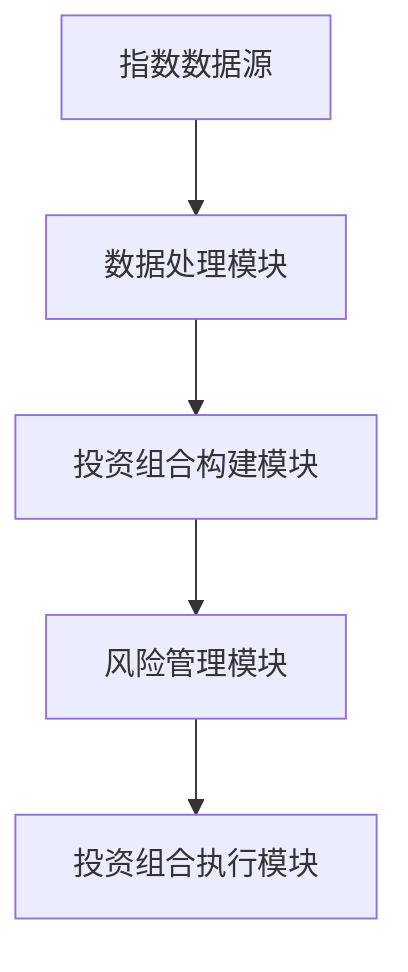

                 

# 约翰伯格的指数基金革命：为何主动管理难以胜出

> 关键词：指数基金，主动管理，被动投资，市场效率，投资策略

> 摘要：指数基金作为一种被动投资工具，以其低成本、高分散化和长期稳定的收益表现，正在改变传统的主动管理投资模式。本文深入分析了指数基金的运作机制、与主动管理的对比、长期表现、风险管理及投资策略，探讨了约翰·伯格在指数基金革命中的贡献，揭示了主动管理难以长期胜出的原因，并为投资者提供了科学的指数基金投资建议。

---

## 第1章：引言：指数基金的崛起与投资革命

### 1.1 指数基金的定义与背景

#### 1.1.1 指数基金的基本概念
指数基金是一种被动管理型基金，其投资策略是跟踪特定的市场指数，如标普500指数或纳斯达克指数。通过复制指数的成分股，指数基金旨在获得与指数相同或相似的收益。

#### 1.1.2 指数基金的历史发展
指数基金的概念可以追溯到20世纪70年代，但真正的发展始于20世纪80年代。1975年，第一只真正意义上的指数基金—— Vanguard Group 的第一只指数基金问世，标志着指数基金时代的开始。

#### 1.1.3 指数基金在现代投资中的地位
指数基金以其低成本和高分散化的特点，成为个人投资者和机构投资者的重要选择。随着技术的进步和市场的成熟，指数基金在全球范围内的规模迅速增长。

### 1.2 主动管理与被动管理的对比

#### 1.2.1 主动管理的定义与特点
主动管理型基金由基金经理主动选股和调整投资组合，目标是通过精选个股或择时交易超越市场指数的表现。

#### 1.2.2 被动管理的定义与特点
被动管理型基金（如指数基金）不主动干预投资组合，而是严格按照指数成分股的比例进行配置，追求与指数相匹配的收益。

#### 1.2.3 两者的优劣势分析
- **主动管理的劣势**：高管理费用、信息不对称、市场效率限制。
- **被动管理的优势**：低成本、分散化、长期稳定收益。

### 1.3 约翰·伯格的贡献与指数基金革命

#### 1.3.1 约翰·伯格的生平简介
约翰·伯格是指数基金的倡导者，他创立了Vanguard Group，并推出了第一只低成本指数基金，为被动投资奠定了基础。

#### 1.3.2 那些年，我们追过的指数基金
指数基金的崛起得益于其简单、透明和高效的特点，逐渐成为投资者的首选。

#### 1.3.3 指数基金革命的核心思想
市场有效性和低成本被动投资是指数基金革命的核心理念，强调长期投资和分散化的重要性。

---

## 第2章：指数基金的运作机制

### 2.1 指数基金的核心原理

#### 2.1.1 指数的定义与编制方法
指数是通过特定的规则和权重计算方法，从市场中选取一组代表性的股票或其他资产，作为投资组合的基准。

#### 2.1.2 指数基金的跟踪误差
跟踪误差是指数基金实际收益与指数收益之间的差异，反映了基金运作的效率。

#### 2.1.3 指数基金的成本优势
指数基金的管理费用通常低于主动管理型基金，这是因为被动管理减少了人力和交易成本。

### 2.2 指数基金的投资策略

#### 2.2.1 被动投资的核心理念
被动投资追求与市场指数相匹配的收益，避免主动选股和择时的风险。

#### 2.2.2 指数基金的分散化投资
通过投资多个成分股，指数基金有效降低了单一股票的风险，实现了风险分散化。

#### 2.2.3 指数基金的风险管理
指数基金通过跟踪指数，避免了主动管理的高风险，同时利用市场波动实现长期收益。

### 2.3 指数基金的运作流程

#### 2.3.1 指数基金的申购与赎回
投资者可以通过基金公司或经纪商申购或赎回指数基金，流程简单透明。

#### 2.3.2 指数基金的资产配置
指数基金严格按照指数成分股的比例进行配置，确保跟踪误差最小化。

#### 2.3.3 指数基金的费用结构
指数基金的管理费用通常低于主动管理型基金，降低了投资者的成本负担。

---

## 第3章：主动管理为何难以胜出

### 3.1 主动管理的理论基础

#### 3.1.1 主动管理的Alpha收益
Alpha收益是主动管理型基金超越市场指数的超额收益，理论上是基金经理选股能力的体现。

#### 3.1.2 主动管理的Beta收益
Beta收益是市场整体风险的收益，与市场指数相关，无法通过主动管理获得超额收益。

#### 3.1.3 主动管理的交易成本
主动管理型基金的频繁交易导致较高的交易成本，削弱了超额收益的可能性。

### 3.2 主动管理的实践挑战

#### 3.2.1 主动管理的选股难度
市场信息的不完全性和股价波动使得选股变得复杂且风险较高。

#### 3.2.2 主动管理的市场时机选择
准确预测市场时机几乎是不可能的，增加了主动管理的风险。

#### 3.2.3 主动管理的道德风险
基金经理的利益驱动可能导致短期行为，影响长期投资效果。

### 3.3 主动管理与被动管理的长期表现对比

#### 3.3.1 长期收益的实证分析
大多数主动管理型基金难以长期跑赢指数基金，指数基金在长期收益上更具优势。

#### 3.3.2 成本对收益的影响
主动管理的高费用显著降低了净收益，使得主动管理的超额收益难以实现。

#### 3.3.3 市场效率与主动管理的局限性
市场的有效性和信息的透明化使得主动管理的超额收益难以持续。

---

## 第4章：指数基金的长期表现与实际案例

### 4.1 指数基金的历史表现分析

#### 4.1.1 美国市场指数基金的长期表现
以标普500指数为例，指数基金在过去几十年的表现优于大多数主动管理型基金。

#### 4.1.2 新兴市场指数基金的表现
新兴市场指数基金的增长潜力巨大，但波动性较高，长期表现同样优秀。

#### 4.1.3 债券指数基金的表现
债券指数基金在稳定收益和风险控制方面表现出色，适合风险偏好较低的投资者。

### 4.2 指数基金的实际案例研究

#### 4.2.1 标普500指数基金的表现
标普500指数基金以其稳定的表现成为投资者的首选。

#### 4.2.2 全球指数基金的表现
全球指数基金通过投资全球市场，实现了更高的分散化和潜在收益。

#### 4.2.3 行业指数基金的表现
行业指数基金专注于特定行业，适合对行业趋势有明确判断的投资者。

### 4.3 指数基金与主动管理的对比分析

#### 4.3.1 长期收益对比
指数基金在长期收益上优于大多数主动管理型基金。

#### 4.3.2 风险调整后收益对比
指数基金的风险调整后收益更高，表明其投资效率优于主动管理。

#### 4.3.3 成本对收益的影响
主动管理的高费用显著降低了其净收益，使得被动投资更具吸引力。

---

## 第5章：指数基金的风险管理与投资策略

### 5.1 指数基金的风险管理

#### 5.1.1 风险分散化
通过投资多个成分股，指数基金有效降低了单一股票的风险。

#### 5.1.2 跟踪误差控制
通过严格跟踪指数，指数基金确保了与市场指数高度一致的收益。

#### 5.1.3 风险管理工具
利用衍生品和对冲工具，指数基金可以进一步降低风险。

### 5.2 指数基金的投资策略

#### 5.2.1 资产配置策略
根据投资者的风险承受能力和收益目标，选择合适的指数基金进行配置。

#### 5.2.2 定投策略
定期定额投资指数基金，平滑市场波动，优化投资回报。

#### 5.2.3 税务优化
通过选择合适的税收优化策略，降低投资税务负担，提高净收益。

---

## 第6章：指数基金的未来趋势与投资者的角色

### 6.1 指数基金的未来发展趋势

#### 6.1.1 智能投资与技术驱动
技术的进步推动指数基金向智能化方向发展，如智能Beta指数。

#### 6.1.2 可持续投资与ESG指数
ESG（环境、社会、治理）指数的兴起，推动了指数基金向可持续投资方向发展。

#### 6.1.3 全球化与多样化
随着全球市场的整合，指数基金将更加多样化，覆盖更多市场和资产类别。

### 6.2 投资者的角色与策略调整

#### 6.2.1 投资者的认知转变
投资者需要从主动管理转向被动管理，认识到长期投资的价值。

#### 6.2.2 投资者的风险管理
通过合理配置指数基金，投资者可以降低投资风险，实现稳健收益。

#### 6.2.3 投资者的长期视角
指数基金的成功依赖于长期投资，投资者需要坚持持有，避免短期波动的干扰。

---

## 附录：指数基金的核心算法与系统架构

### 附录1：指数基金的跟踪误差计算

#### 1.1 算法原理
跟踪误差是衡量指数基金表现的重要指标，计算公式为：
$$ \text{跟踪误差} = \sqrt{\text{平均跟踪偏离平方}} $$

#### 1.2 算法实现
通过统计分析工具计算指数基金的实际收益与指数收益的差异，计算跟踪误差。

### 附录2：指数基金的系统架构

#### 2.1 系统功能设计
- 数据采集：从市场数据源获取指数成分股的价格和权重。
- 资产配置：根据指数权重构建投资组合。
- 风险管理：实时监控跟踪误差和市场风险。

#### 2.2 系统架构图

---

## 作者：AI天才研究院/AI Genius Institute & 禅与计算机程序设计艺术 /Zen And The Art of Computer Programming

