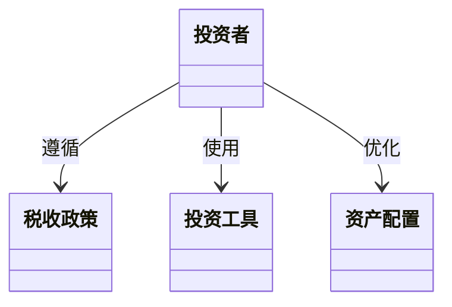
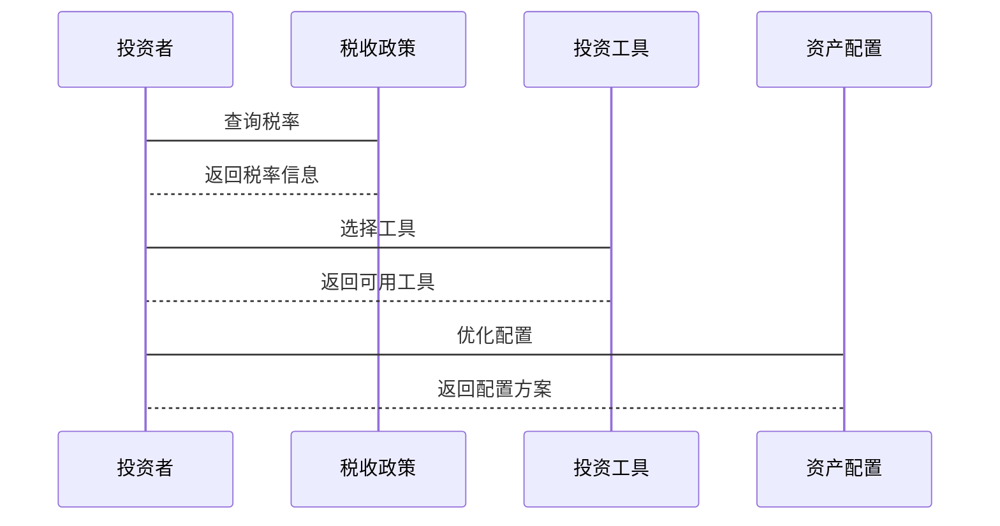

                 


# 约翰伯格的税收敏感投资：如何优化投资回报

## 关键词：约翰伯格, 税收敏感投资, 投资回报, 税务优化, 投资策略, 财务规划, 税收政策

## 摘要：本文详细探讨了约翰伯格的税收敏感投资策略，分析了如何通过优化税务规划来提升投资回报。从核心概念到系统架构，从项目实战到最佳实践，本文为读者提供了全面的指导。

---

## 第一部分: 税收敏感投资概述

## 第1章: 税收敏感投资的背景与概念

### 1.1 税收敏感投资的定义与背景

#### 1.1.1 投资回报与税务的关系
投资回报与税务密切相关。通过优化税务规划，投资者可以最大化收益。例如，资本利得税和股息税等都会影响最终的投资回报。

#### 1.1.2 税收敏感投资的定义
税收敏感投资是指在投资决策中考虑税务因素，以优化投资回报的投资策略。这种策略通过合理配置资产和选择合适的投资工具，降低税务负担。

#### 1.1.3 税收敏感投资的重要性
税收敏感投资的重要性体现在以下几个方面：
- 提高投资收益
- 降低税务负担
- 优化资产配置
- 避免税务风险

### 1.2 税收敏感投资的核心要素

#### 1.2.1 投资目标与税务优化
投资目标包括资本增值和收入生成。税务优化则需要考虑税率、税收优惠政策等因素。

#### 1.2.2 税收政策与法规
不同国家和地区的税收政策差异显著，了解并利用这些政策是税收敏感投资的关键。

#### 1.2.3 投资工具与税务处理
投资工具包括股票、债券、基金等，每种工具的税务处理不同。例如，股息收入可能需要缴纳所得税，而资本利得税可能税率较低。

---

## 第2章: 税收敏感投资的背景介绍

### 2.1 税收敏感投资的问题背景

#### 2.1.1 税收对投资回报的影响
税收对投资回报的影响是多方面的。例如，高税率可能降低投资收益，而合理的税务规划可以缓解这一影响。

#### 2.1.2 税收政策对企业投资的影响
税收政策的变化直接影响企业的投资决策。例如，降低企业所得税率可能激励企业增加投资。

### 2.2 税收敏感投资的问题描述

#### 2.2.1 税收对投资回报的具体影响
税收对投资回报的具体影响包括：
- 税后净收益的减少
- 投资成本的增加
- 资产配置的限制

#### 2.2.2 税收政策对企业投资决策的影响
税收政策直接影响企业的投资决策，例如：
- 税收优惠鼓励企业投资某些领域
- 税收负担加重可能导致企业减少投资

### 2.3 税收敏感投资的边界与外延

#### 2.3.1 税收敏感投资的边界
税收敏感投资的边界包括：
- 税收政策的限制
- 投资工具的选择
- 投资目标的范围

#### 2.3.2 税收敏感投资的外延
税收敏感投资的外延包括：
- 全球化视角下的税务规划
- 不同资产类别的税务处理
- 税收政策的变化与应对

### 2.4 税收敏感投资的概念结构与核心要素组成

#### 2.4.1 税收敏感投资的概念结构
税收敏感投资的概念结构包括：
- 投资目标
- 税收政策
- 投资工具
- 税务处理

#### 2.4.2 税收敏感投资的核心要素
税收敏感投资的核心要素包括：
- 投资目标
- 税收政策
- 投资工具
- 税务处理

---

## 第3章: 税收敏感投资的核心概念与联系

### 3.1 核心概念原理

#### 3.1.1 税收敏感投资的原理
税收敏感投资的原理是通过优化税务规划，降低税务负担，提高投资回报。

#### 3.1.2 税收敏感投资的核心机制
税收敏感投资的核心机制包括：
- 税收优惠政策的利用
- 资产配置的优化
- 税务风险的管理

### 3.2 概念属性特征对比表格

| 概念       | 税收敏感投资 | 非税收敏感投资 |
|------------|--------------|----------------|
| 核心目标   | 优化税务，提高回报 | 最大化投资回报，忽略税务因素 |
| 风险管理   | 重视税务风险 | 忽略税务风险 |
| 投资工具   | 税收优化工具 | 普通投资工具 |

### 3.3 ER实体关系图

```mermaid
er
    图片
```

---

## 第4章: 税收敏感投资的系统分析与架构设计

### 4.1 问题场景介绍

#### 4.1.1 税收敏感投资的问题场景
税收敏感投资需要解决的问题包括：
- 税务负担的优化
- 资产配置的合理性
- 投资回报的最大化

### 4.2 项目介绍

#### 4.2.1 项目目标
项目目标是通过优化税务规划，提高投资回报。

#### 4.2.2 项目范围
项目范围包括：
- 税收政策分析
- 投资工具选择
- 资产配置优化

### 4.3 系统功能设计

#### 4.3.1 领域模型类图



#### 4.3.2 系统架构设计


### 4.4 系统接口设计

#### 4.4.1 系统接口
系统接口包括：
- 税收政策查询接口
- 投资工具选择接口
- 资产配置优化接口

### 4.5 系统交互流程

#### 4.5.1 系统交互序列图



---

## 第5章: 税收敏感投资的项目实战

### 5.1 环境安装

#### 5.1.1 系统环境要求
系统环境要求包括：
- 操作系统：Windows/Mac/Linux
- 开发工具：Python/Java
- 数据库：MySQL/PostgreSQL

#### 5.1.2 软件依赖
软件依赖包括：
- Python 3.8+
- Pandas库
- Matplotlib库

### 5.2 系统核心实现源代码

#### 5.2.1 投资工具选择代码

```python
import pandas as pd

def choose_investment_tool(tax_policy):
    tools = ['股票', '债券', '基金', '房地产']
    # 根据税收政策选择最优工具
    optimal_tool = max(tools, key=lambda t: calculate_tax(tax_policy, t))
    return optimal_tool

def calculate_tax(tax_policy, tool):
    # 示例计算函数，实际根据具体政策调整
    if tax_policy['country'] == 'USA':
        return tool == '股票' * 0.15 + tool == '债券' * 0.10
    else:
        return 0
```

#### 5.2.2 资产配置优化代码

```python
import numpy as np

def optimize_asset_allocation(assets, tax_rates):
    # 示例优化函数，实际需要考虑更多因素
    return np.argmax(np.dot(assets, tax_rates))
```

### 5.3 代码应用解读与分析

#### 5.3.1 投资工具选择代码解读
上述代码根据税收政策选择最优的投资工具，考虑了不同工具的税率差异。

#### 5.3.2 资产配置优化代码解读
上述代码通过优化算法选择最优的资产配置，以最大化投资回报。

### 5.4 实际案例分析

#### 5.4.1 案例背景
假设一个投资者在美国，希望进行股票和债券的投资。

#### 5.4.2 税务计算
股票的资本利得税为15%，债券的利息税为10%。

#### 5.4.3 投资工具选择
根据代码计算，股票的税率更高，因此选择债券作为主要投资工具。

### 5.5 详细讲解剖析

#### 5.5.1 投资工具选择的细节
考虑税收政策时，债券的税率较低，更适合长期投资。

#### 5.5.2 资产配置优化的细节
通过优化算法，选择债券作为主要投资工具，可以有效降低税务负担。

### 5.6 项目小结

#### 5.6.1 项目成果
通过优化税务规划，提高了投资回报。

#### 5.6.2 项目经验
税收敏感投资需要综合考虑税收政策、投资工具和资产配置。

---

## 第6章: 税收敏感投资的最佳实践与优化技巧

### 6.1 税收敏感投资的优化技巧

#### 6.1.1 定期审查投资组合
定期审查投资组合，根据税收政策变化进行调整。

#### 6.1.2 利用税收优惠政策
利用税收优惠政策，例如税收递减、抵免等。

### 6.2 税收敏感投资的风险管理

#### 6.2.1 税务风险的识别与评估
识别和评估税务风险，制定应对策略。

#### 6.2.2 税务风险管理策略
制定税务风险管理策略，例如分散投资、保险等。

### 6.3 税收敏感投资的小结

#### 6.3.1 优化技巧总结
通过定期审查、利用税收优惠政策等优化技巧，提高投资回报。

#### 6.3.2 风险管理总结
识别和评估税务风险，制定应对策略，降低风险影响。

---

## 第7章: 税收敏感投资的总结与展望

### 7.1 总结

#### 7.1.1 核心观点总结
税收敏感投资通过优化税务规划，提高投资回报。

#### 7.1.2 核心内容回顾
从背景介绍到系统设计，从项目实战到最佳实践，全面探讨了税收敏感投资。

### 7.2 展望

#### 7.2.1 未来研究方向
未来研究方向包括：
- 全球化视角下的税收敏感投资
- 人工智能在税收敏感投资中的应用
- 新兴资产类别的税务处理

#### 7.2.2 未来发展趋势
随着税收政策的变化和技术的进步，税收敏感投资将更加重要。

---

## 作者：AI天才研究院/AI Genius Institute & 禅与计算机程序设计艺术 /Zen And The Art of Computer Programming

---

感谢您的耐心阅读，如需进一步探讨，请随时联系。

