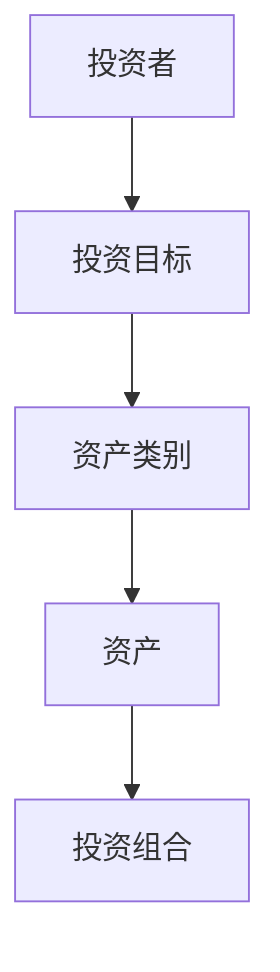
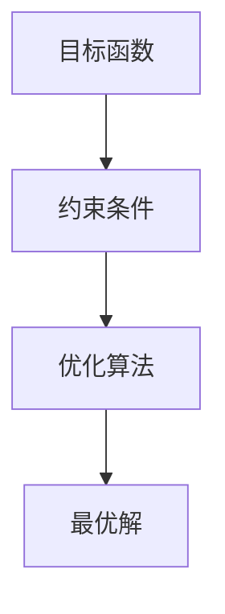
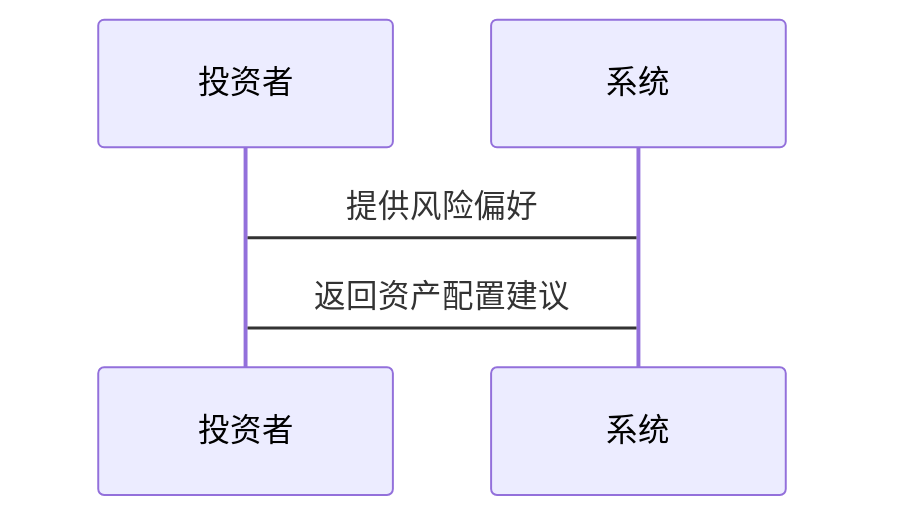

                 


# 约翰伯格的资产配置建议

> 关键词：资产配置，投资组合，约翰伯格，风险管理，现代投资组合理论，资本资产定价模型

> 摘要：本文深入探讨了约翰伯格的资产配置理论与实践，分析了资产配置的核心概念、数学模型、系统架构以及实际应用，结合案例和工具，提供了全面的资产配置建议。

---

# 第一部分: 资产配置的背景与基础

# 第1章: 资产配置的引言

## 1.1 资产配置的重要性

### 1.1.1 资产配置的定义

资产配置是指将资金分配到不同的资产类别（如股票、债券、房地产等）中，以实现投资目标的过程。它是投资组合管理的核心，旨在平衡风险与收益。

### 1.1.2 资产配置的目标

资产配置的目标是通过分散投资来降低风险，同时实现长期的资本增值。约翰·伯格认为，资产配置是投资成功的关键，因为它是控制风险的核心工具。

### 1.1.3 约翰·伯格的背景介绍

约翰·伯格是投资界的重要人物，他创立了先锋集团（Vanguard），并提出了指数基金的概念。他的研究成果为现代资产配置理论奠定了基础。

## 1.2 资产配置的核心概念

### 1.2.1 资产类别与风险收益特征

资产类别包括股票、债券、现金等。每种资产类别的风险和收益特征不同，股票风险高但收益高，债券风险低但收益稳定。

### 1.2.2 现代投资组合理论（MPT）

MPT由哈里·马科维茨提出，认为通过分散投资可以降低非系统性风险，从而优化投资组合的收益。

### 1.2.3 资产配置的边界与外延

资产配置的边界是指在给定风险水平下，收益最高的组合。外延则包括动态调整配置以应对市场变化。

## 1.3 资产配置的背景与现状

### 1.3.1 全球投资市场的现状

全球投资市场复杂多变，资产配置需要考虑全球经济、政治等因素。

### 1.3.2 资产配置在投资组合中的地位

资产配置是投资组合管理的核心，决定了组合的风险和收益。

### 1.3.3 资产配置的演变与趋势

随着市场的发展，资产配置从传统的股票债券配置扩展到包括另类资产的多样化配置。

## 1.4 本章小结

资产配置是投资成功的关键，其核心在于平衡风险与收益，约翰·伯格的理论为现代资产配置提供了重要指导。

---

# 第二部分: 资产配置的理论与方法

# 第2章: 资产配置的理论基础

## 2.1 投资组合理论

### 2.1.1 马科维茨的有效前沿

有效前沿是指在给定风险下，收益最高的投资组合所构成的曲线。它是MPT的核心概念。

### 2.1.2 资产配置的数学模型

数学模型包括优化问题，目标是最小化风险或最大化收益。

### 2.1.3 现代投资组合理论的优缺点

优点：分散化降低风险；缺点：假设市场有效，实际可能不符。

## 2.2 资本资产定价模型（CAPM）

### 2.2.1 CAPM的定义与公式

CAPM用于计算资产的预期收益，公式为：
$$ E(r_i) = r_f + \beta_i (E(r_m) - r_f) $$

### 2.2.2 CAPM的应用与局限性

应用：评估资产定价；局限：假设市场有效，忽略交易成本。

### 2.2.3 CAPM与资产配置的关系

CAPM帮助确定资产的预期收益，指导配置。

## 2.3 资产配置的属性特征对比

### 2.3.1 不同资产类别的风险收益对比

| 资产类别 | 风险 | 收益 |
|----------|------|------|
| 股票     | 高   | 高   |
| 债券     | 中   | 中   |
| 现金     | 低   | 低   |

### 2.3.2 资产配置的流动性与收益性分析

流动性高的资产容易变现，但可能收益较低。

### 2.3.3 资产配置的分散化效应

分散化降低非系统性风险。

## 2.4 资产配置的ER实体关系图



## 2.5 本章小结

理论基础为资产配置提供了数学模型和分析工具，CAPM和MPT是核心。

---

# 第3章: 资产配置的核心算法与数学模型

## 3.1 投资组合优化的数学模型

### 3.1.1 数学公式

目标函数：
$$ \text{目标函数：} \quad \min_w \left( \sigma^2 \right) $$

约束条件：
$$ \sum_{i=1}^n w_i = 1 $$

### 3.1.2 投资组合优化的步骤



## 3.2 资产配置的夏普比率

### 3.2.1 夏普比率的定义

夏普比率衡量投资组合的超额收益相对于其风险的表现：
$$ \text{夏普比率} = \frac{E[r_p] - r_f}{\sigma_p} $$

### 3.2.2 夏普比率的计算与应用

应用：评估投资组合的性价比。

### 3.2.3 夏普比率与资产配置的关系

夏普比率指导如何调整资产配置以优化收益风险比。

## 3.3 资产配置的代码实现

### 3.3.1 Python代码示例

```python
import numpy as np
from scipy.optimize import minimize

def portfolio_return(weights, returns):
    return np.sum(weights * returns)

def portfolio_variance(weights, cov_matrix):
    return np.dot(weights.T, np.dot(cov_matrix, weights))

def optimize_portfolio(returns, cov_matrix):
    n = len(weights)) 
    constraint = {'type': 'eq', 'fun': lambda w: sum(w) - 1}
    result = minimize(portfolio_variance, initial_guess, args=(cov_matrix,), constraints=[constraint])
    return result.x

# 示例数据
returns = np.array([0.1, 0.2, 0.15])
cov_matrix = np.array([
    [0.05, 0.02, 0.01],
    [0.02, 0.08, 0.03],
    [0.01, 0.03, 0.06]
])

optimal_weights = optimize_portfolio(returns, cov_matrix)
print(optimal_weights)
```

---

# 第三部分: 资产配置的系统架构与实现

# 第4章: 资产配置的系统架构

## 4.1 项目介绍

资产配置系统旨在根据市场数据和投资者需求，推荐最优的资产分配方案。

## 4.2 系统功能设计

### 4.2.1 领域模型


### 4.2.2 系统架构设计


### 4.2.3 系统接口设计

API接口：接收市场数据，返回配置建议。

### 4.2.4 系统交互设计



## 4.3 本章小结

系统架构为资产配置提供了框架，确保数据处理和算法计算高效执行。

---

# 第四部分: 资产配置的实战与案例分析

# 第5章: 资产配置的实战分析

## 5.1 环境安装

安装必要的库，如NumPy和SciPy。

## 5.2 核心实现

使用优化算法实现资产配置。

## 5.3 案例分析

以股票和债券为例，计算最优配置。

## 5.4 本章小结

通过案例分析，展示了资产配置的实际应用。

---

# 第五部分: 资产配置的未来趋势与总结

# 第6章: 资产配置的未来趋势

## 6.1 人工智能与大数据的应用

AI和大数据将提升资产配置的精准度。

## 6.2 资产配置的全球化与多元化

全球化和多元化将是未来趋势。

## 6.3 可持续投资与ESG因素

ESG因素将越来越重要。

## 6.4 本章小结

未来，资产配置将更加智能化和多元化。

---

# 作者信息

作者：AI天才研究院/AI Genius Institute & 禅与计算机程序设计艺术 /Zen And The Art of Computer Programming

---

* 版权声明：本文版权归作者所有，未经授权不得转载。

