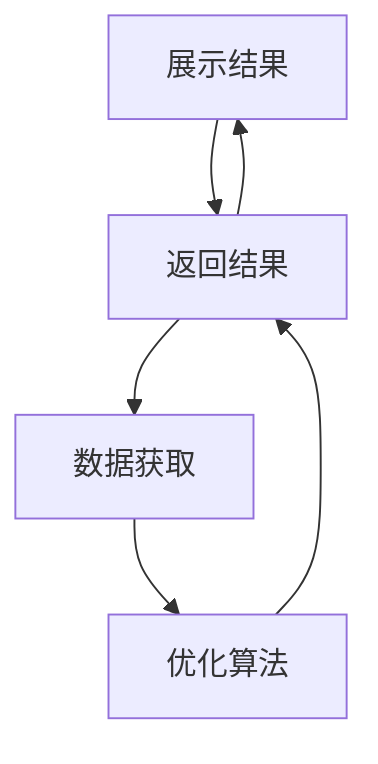

                 


# 《约翰·伯格的退休投资规划》

> 关键词：退休投资规划、个人财务、投资策略、风险管理、约翰·伯格、财务自由

> 摘要：本文系统地探讨了退休投资规划的核心概念、数学模型和实际应用，结合约翰·伯格的投资理念，提出了基于现代投资组合理论的退休投资策略。通过构建数学模型和算法，详细分析了如何通过投资组合优化实现退休资金的保值与增值，并通过实际案例展示了如何将理论应用于实践。

---

# 第一部分: 退休投资规划的背景与重要性

## 第1章: 退休投资规划的背景与目标

### 1.1 退休规划的重要性

#### 1.1.1 退休规划的定义与概念
退休规划是指个人或家庭为了在退休后维持一定的生活水平，通过合理的财务管理和投资策略，确保退休后的资金需求得到满足的过程。退休规划的核心在于平衡风险与收益，确保资金的长期稳健增长。

#### 1.1.2 退休规划的核心目标
退休规划的目标主要包括：
1. 确保退休后有足够的资金来源，维持基本生活需求。
2. 通过合理的投资策略，实现资金的保值与增值。
3. 应对突发的经济风险，如医疗费用、通货膨胀等。

#### 1.1.3 退休规划的必要性与紧迫性
随着人口老龄化加剧和社保体系的压力增大，个人退休后的财务保障越来越依赖于个人的投资规划。退休规划不仅是个人财务自由的基石，也是实现社会稳定的重要保障。

---

### 1.2 退休投资规划的现状与挑战

#### 1.2.1 当前退休规划的主要问题
1. **资金缺口问题**：许多人对退休后的资金需求估计不足，导致退休后生活质量下降。
2. **投资风险问题**：投资市场的波动性可能导致退休资金受损。
3. **通货膨胀问题**：通货膨胀会侵蚀资金的实际购买力，影响退休后的生活水平。

#### 1.2.2 投资市场的波动性对退休规划的影响
投资市场的波动性是退休规划的最大挑战之一。市场的波动可能导致投资组合的价值波动，进而影响退休资金的安全性。

#### 1.2.3 通货膨胀对退休资金的威胁
通货膨胀会使得货币的实际购买力下降，因此退休资金需要通过投资来抵御通货膨胀的影响。

---

### 1.3 约翰·伯格的退休投资理念

#### 1.3.1 约翰·伯格的投资哲学
约翰·伯格是指数投资的倡导者，他强调长期投资、分散投资和低成本投资的重要性。他认为，长期稳定的回报来源于分散投资和持续的资金投入。

#### 1.3.2 伯格的长期投资策略
伯格的投资策略主要包括：
1. **指数基金投资**：通过投资指数基金实现分散化投资。
2. **定期定额投资**：通过定期投入，降低市场的波动性风险。

#### 1.3.3 伯格对个人退休规划的启示
伯格的投资理念对个人退休规划有重要的启示，即通过长期投资和分散化投资实现资金的稳健增长。

---

### 1.4 本章小结
本章从退休规划的定义、目标和必要性入手，分析了当前退休投资规划的主要问题，并介绍了约翰·伯格的投资理念及其对退休规划的启示。

---

# 第二部分: 退休投资规划的核心概念与分析

## 第2章: 退休投资规划的核心要素

### 2.1 投资目标与风险承受能力

#### 2.1.1 投资目标的定义与分类
投资目标是投资者在退休规划中期望实现的财务目标，主要包括资金需求、投资期限和风险承受能力。

#### 2.1.2 风险承受能力的评估方法
风险承受能力是投资者在面对市场波动时愿意承担的风险水平。评估风险承受能力的关键因素包括年龄、收入水平、财务状况和心理承受能力。

#### 2.1.3 目标与风险的匹配策略
根据投资者的风险承受能力和投资目标，制定个性化的投资策略。

---

### 2.2 资金需求与时间规划

#### 2.2.1 资金需求的计算方法
资金需求的计算需要考虑退休后的基本生活支出、医疗费用和其他潜在支出。

#### 2.2.2 时间规划的重要性
投资时间越长，资金的复利效应越显著。因此，时间规划是退休投资规划的重要组成部分。

#### 2.2.3 资金需求与时间的动态调整
根据市场环境和个人财务状况的变化，动态调整资金需求和投资时间。

---

### 2.3 投资组合的构建与优化

#### 2.3.1 投资组合的基本构成
投资组合通常包括股票、债券、基金等多种资产，通过分散化投资降低风险。

#### 2.3.2 投资组合的优化策略
根据市场环境和个人风险偏好，调整投资组合的资产配置。

#### 2.3.3 不同生命周期阶段的投资组合调整
在不同的生命周期阶段，投资者的风险承受能力和资金需求会发生变化，需要相应调整投资组合。

---

### 2.4 核心概念对比分析

#### 2.4.1 投资目标与风险承受能力的对比
投资目标是投资者的财务目标，而风险承受能力是实现目标的能力。两者需要相互匹配。

#### 2.4.2 资金需求与时间规划的对比
资金需求是静态的，而时间规划是动态的。时间规划影响资金需求的实现。

#### 2.4.3 投资组合构建的优劣势分析
投资组合的优势在于分散化，劣势在于需要持续的市场监控和调整。

---

### 2.5 本章小结
本章详细分析了退休投资规划的核心要素，包括投资目标、风险承受能力、资金需求和时间规划，并通过对比分析明确了各要素之间的关系。

---

# 第三部分: 退休投资规划的数学模型与算法

## 第3章: 退休投资规划的数学模型

### 3.1 投资回报率的计算

#### 3.1.1 单利与复利的计算公式
- 单利公式：$$ I = P \times r \times t $$
- 复利公式：$$ A = P \times (1 + r)^t $$

#### 3.1.2 投资回报率的数学模型
投资回报率的数学模型可以表示为：
$$ R = \frac{A - P}{P} $$

#### 3.1.3 投资回报率的影响因素
投资回报率受市场环境、资产配置和投资期限的影响。

---

### 3.2 资金缺口的计算公式

#### 3.2.1 资金缺口的定义
资金缺口是指退休后实际资金需求与现有资金之间的差额。

#### 3.2.2 资金缺口的计算公式
$$ \text{资金缺口} = \text{退休后总需求} - \text{现有资金} $$

#### 3.2.3 资金缺口的动态调整
根据市场环境和个人财务状况的变化，动态调整资金缺口。

---

### 3.3 投资组合优化的数学模型

#### 3.3.1 现代投资组合理论（MPT）简介
现代投资组合理论（MPT）是由哈里·马科维茨提出的，旨在通过分散化投资降低风险。

#### 3.3.2 投资组合优化的数学模型
投资组合优化的目标是最大化收益，同时最小化风险。数学模型可以表示为：
$$ \min_w \sigma^2(w) $$
$$ \text{subject to} \quad \mathbb{E}[r(w)] = T \quad \text{和} \quad w^T \mathbf{1} = 1 $$

#### 3.3.3 投资组合优化的算法实现
以下是投资组合优化的Python代码示例：

```python
import numpy as np
import pandas as pd
from scipy.optimize import minimize

# 假设资产收益和协方差矩阵
returns = pd.DataFrame(...)
cov_matrix = pd.DataFrame(...)

# 定义优化目标函数
def objective(weights, returns, cov_matrix):
    return np.dot(weights.T, np.dot(cov_matrix, weights))

# 定义约束条件
def constraint(weights, returns, target_return):
    return np.dot(weights.T, returns) - target_return

# 初始化权重
initial_weights = np.array([1.0/len(returns.columns)] * len(returns.columns))

# 使用 scipy.optimize.minimize 进行优化
result = minimize(objective, initial_weights, args=(returns, cov_matrix), method='SLSQP', constraints={'type': 'eq', 'fun': lambda w: np.sum(w) - 1})

# 优化后的权重
optimal_weights = result.x
```

---

## 第4章: 投资组合优化的系统分析与设计

### 4.1 系统功能设计

#### 4.1.1 领域模型
以下是领域模型的Mermaid类图：


---

### 4.2 系统架构设计

#### 4.2.1 系统架构图
以下是系统架构的Mermaid图：


---

### 4.3 系统接口设计

#### 4.3.1 接口描述
1. **用户输入接口**：投资者输入风险承受能力和投资目标。
2. **数据接口**：获取市场数据和资产收益数据。
3. **优化接口**：调用优化算法进行投资组合优化。

#### 4.3.2 接口交互流程图
以下是接口交互的Mermaid流程图：



---

## 第5章: 项目实战与案例分析

### 5.1 环境安装与配置

#### 5.1.1 安装必要的库
```bash
pip install numpy pandas scipy matplotlib
```

---

### 5.2 核心代码实现

#### 5.2.1 投资组合优化代码
```python
import numpy as np
from scipy.optimize import minimize

def portfolio_optimizer(returns, cov_matrix, target_return=0.05):
    n = len(cov_matrix)
    initial_guess = np.array([1.0/n]*n)
    
    def objective(weights, returns, cov_matrix):
        return np.dot(weights.T, np.dot(cov_matrix, weights))
    
    def constraint(weights, returns, target_return):
        return np.dot(weights, returns) - target_return
    
    result = minimize(objective, initial_guess, args=(returns, cov_matrix), 
                      method='SLSQP', constraints={'type': 'eq', 'fun': lambda w: constraint(w, returns, target_return)})
    
    return result.x
```

---

### 5.3 实际案例分析

#### 5.3.1 案例背景
假设某投资者计划在10年后退休，预计退休后每年需要10万元的生活费，假设通货膨胀率为3%。

---

#### 5.3.2 投资组合优化
通过上述代码，我们可以计算出最优的投资组合权重。

---

### 5.4 项目小结
本章通过实际案例展示了如何将理论应用于实践，并通过代码实现投资组合优化。

---

## 第6章: 最佳实践与注意事项

### 6.1 最佳实践

#### 6.1.1 风险管理
定期评估和调整投资组合，以应对市场波动和通货膨胀。

#### 6.1.2 定期定额投资
通过定期定额投资，降低市场的波动性风险。

#### 6.1.3 税务优化
合理利用税收优惠政策，降低投资成本。

---

### 6.2 小结
退休投资规划是一项长期的系统工程，需要结合个人的财务状况和市场环境，制定个性化的投资策略。

---

### 6.3 注意事项

1. **定期评估**：定期评估投资组合的表现和风险。
2. **分散投资**：通过分散化投资降低风险。
3. **长期视角**：保持长期投资的耐心和信心。

---

## 第7章: 拓展阅读与进一步学习

### 7.1 推荐书籍
1. 《指数基金投资指南》
2. 《投资学》

### 7.2 在线资源
1. 约翰·伯格的著作
2. 现代投资组合理论的相关文献

---

# 作者：AI天才研究院/AI Genius Institute & 禅与计算机程序设计艺术 /Zen And The Art of Computer Programming

---

通过以上结构，我们系统地探讨了退休投资规划的核心概念、数学模型和实际应用，结合约翰·伯格的投资理念，提出了基于现代投资组合理论的退休投资策略。希望本文能为读者提供有价值的参考和启发。

