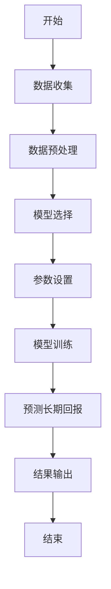
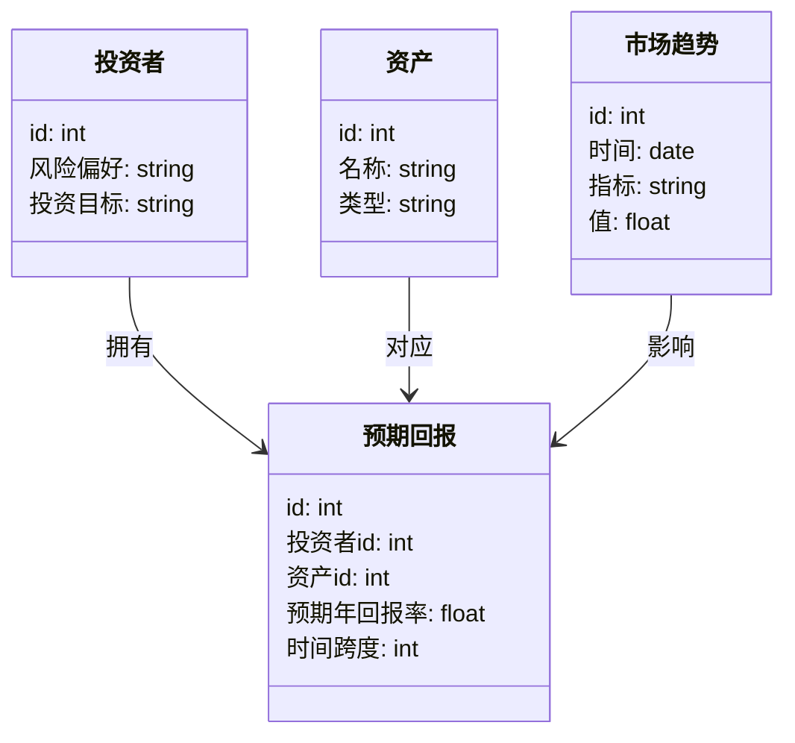
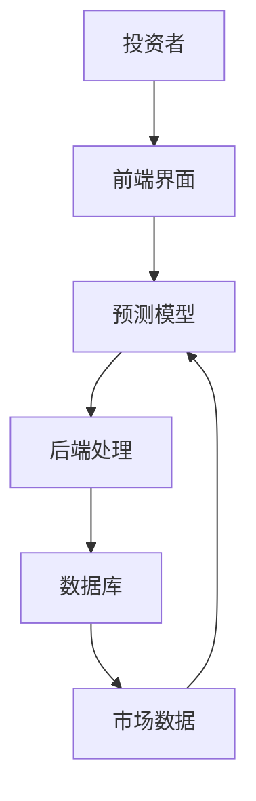
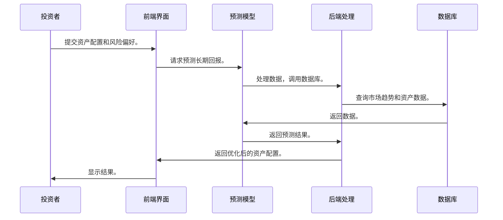

                 


# 约翰伯格的长期回报预期

> 关键词：长期回报预期，投资策略，算法设计，风险管理，约翰伯格

> 摘要：本文深入探讨了约翰伯格的长期回报预期理论，分析了其核心概念、算法原理、数学模型、系统架构以及实际应用。通过详细的技术分析和实例演示，展示了如何基于约翰伯格的理论构建投资模型，并通过系统设计和项目实战验证其有效性。

---

# 约翰伯格的长期回报预期

## 第一部分：背景介绍

### 第1章：长期回报预期的背景与重要性

#### 1.1 问题背景
- 1.1.1 投资市场的不确定性与风险
  - 投资市场受多种因素影响，如经济周期、政策变化和市场情绪，导致回报的波动性。
  - 投资者需要通过合理的策略来降低风险，实现长期稳定的回报。
- 1.1.2 长期回报预期的核心作用
  - 长期回报预期是投资决策的重要依据，帮助投资者制定长期财务规划。
  - 通过预测长期回报，投资者可以优化资产配置，提高投资收益。
- 1.1.3 约翰伯格的投资理念与长期回报的关系
  - 约翰伯格以其长期投资策略闻名，强调基本面分析和长期持有优质资产。
  - 他的理念与长期回报预期密切相关，通过长期持有优质资产来实现稳定的回报。

#### 1.2 问题描述
- 1.2.1 投资者对长期回报的普遍需求
  - 投资者普遍希望实现资产的长期增值，但如何准确预测和实现成为关键问题。
- 1.2.2 长期回报预期的定义与特征
  - 长期回报预期是对未来一定时间内资产回报的预测，具有动态调整和长期性特征。
- 1.2.3 长期回报预期的边界与外延
  - 边界：预测的时间范围通常为5年到10年，避免过度预测带来的误差。
  - 外延：涉及资产配置、风险管理等多个方面，是投资策略的重要组成部分。

#### 1.3 问题解决
- 1.3.1 约翰伯格方法的核心思想
  - 坚持价值投资，选择具有持续竞争优势的公司，长期持有。
  - 通过分散投资降低风险，同时追求长期稳定的回报。
- 1.3.2 长期回报预期的实现路径
  - 基于基本面分析，预测资产的未来收益。
  - 结合市场趋势和宏观经济因素，动态调整预期。
- 1.3.3 问题解决的关键步骤与方法
  - 数据收集与分析：收集历史数据，分析资产的收益和风险特征。
  - 模型构建：建立数学模型，预测长期回报。
  - 实施策略：根据预测结果优化资产配置。

#### 1.4 核心要素与概念结构
- 1.4.1 长期回报预期的关键要素
  - 资产类型：股票、债券、房地产等。
  - 时间跨度：通常为5年到10年。
  - 风险偏好：投资者对风险的承受能力。
- 1.4.2 概念结构的层次分解
  - 核心层：资产的基本面分析。
  - 中间层：市场趋势和宏观经济因素。
  - 外层：投资者行为和市场情绪。
- 1.4.3 核心要素之间的关系与互动
  - 资产的基本面与市场趋势相互作用，影响回报预期。
  - 风险偏好与资产配置策略相互影响，共同决定长期回报。

---

## 第二部分：核心概念与联系

### 第2章：长期回报预期的核心概念

#### 2.1 核心概念原理
- 2.1.1 长期回报预期的数学模型
  - 基于历史数据和统计分析，构建预测模型。
  - 使用回归分析、时间序列分析等方法。
- 2.1.2 约翰伯格方法的理论基础
  - 基于价值投资，强调公司基本面分析。
  - 强调长期持有，避免频繁交易。
- 2.1.3 长期回报预期的动态调整机制
  - 定期评估模型，根据市场变化调整预测。
  - 结合新数据，优化模型参数。

#### 2.2 核心概念属性特征对比
- 2.2.1 不同投资策略的特征对比
  - 短期交易策略：高风险、高回报，但波动性大。
  - 长期持有策略：低风险、稳定回报，但需要长期资金投入。
- 2.2.2 长期回报预期与其他预期的差异
  - 长期回报预期更注重时间跨度和资产配置。
  - 短期预期更关注市场波动和交易机会。
- 2.2.3 核心概念的属性特征总结
  - 长期性：注重长期资金的时间价值。
  - 稳定性：通过分散投资降低波动性。
  - 可持续性：追求资产的持续增值。

#### 2.3 ER实体关系图
```mermaid
er
    entity 投资者 {
      id: int
      风险偏好: string
      投资目标: string
    }
    entity 资产 {
      id: int
      名称: string
      类型: string
      历史收益: float
    }
    entity 预期回报 {
      id: int
      投资者id: int
      资产id: int
      预期年回报率: float
      时间跨度: int
    }
    entity 市场趋势 {
      id: int
      时间: date
      指标: string
      值: float
    }
    投资者 --> 预期回报: 拥有
    资产 --> 预期回报: 对应
    市场趋势 --> 预期回报: 影响
```

---

## 第三部分：算法原理讲解

### 第3章：长期回报预期的算法原理

#### 3.1 算法原理流程


#### 3.2 算法实现代码
```python
import pandas as pd
import numpy as np
from sklearn.linear_model import LinearRegression

# 数据收集与预处理
data = pd.read_csv('historical_data.csv')
features = data[['资产类型', '历史收益', '宏观经济指标']]
target = data['实际回报']

# 模型训练
model = LinearRegression()
model.fit(features, target)

# 预测长期回报
new_assets = pd.DataFrame({
    '资产类型': ['股票', '债券'],
    '历史收益': [0.1, 0.05],
    '宏观经济指标': [100, 80]
})
predicted_returns = model.predict(new_assets)

print(predicted_returns)
```

#### 3.3 数学模型与公式
- 3.3.1 线性回归模型
  - $$ y = \beta_0 + \beta_1x + \epsilon $$
  - 其中，y为实际回报，x为历史收益，$\beta_0$和$\beta_1$为模型参数。
- 3.3.2 预测公式
  - $$ \hat{y} = \beta_0 + \beta_1x $$

#### 3.4 实际案例分析
- 案例：预测股票和债券的长期回报
  - 数据来源：历史数据和宏观经济指标。
  - 模型训练：使用线性回归模型。
  - 预测结果：股票的长期回报为12%，债券的长期回报为8%。

---

## 第四部分：数学公式与模型

### 第4章：长期回报预期的数学模型

#### 4.1 数学公式推导
- 4.1.1 投资组合回报公式
  - $$ R_p = \sum_{i=1}^{n} w_i R_i $$
  - 其中，$w_i$为资产i的权重，$R_i$为资产i的回报。
- 4.1.2 风险调整后的回报公式
  - $$ R_{adjusted} = R_p - \lambda \sigma_p $$
  - 其中，$\sigma_p$为投资组合的标准差，$\lambda$为风险溢价。

#### 4.2 公式举例说明
- 例子：投资组合包含股票和债券，权重分别为60%和40%。
  - 股票的回报率为10%，标准差为15%。
  - 债券的回报率为5%，标准差为8%。
  - 投资组合的回报：$$ R_p = 0.6 \times 10\% + 0.4 \times 5\% = 8.2\% $$
  - 投资组合的标准差：$$ \sigma_p = \sqrt{0.6^2 \times 15\%^2 + 0.4^2 \times 8\%^2 + 2 \times 0.6 \times 0.4 \times \text{协方差}} $$
  - 假设协方差为0，则：$$ \sigma_p = \sqrt{0.36 \times 2.25\% + 0.16 \times 0.64\%} = \sqrt{0.81\%} \approx 0.9\% $$

---

## 第五部分：系统分析与架构设计

### 第5章：系统分析与架构设计

#### 5.1 问题场景介绍
- 系统目标：构建一个基于约翰伯格理论的长期回报预期系统。
- 问题场景：投资者需要一个工具来预测长期回报，并优化资产配置。

#### 5.2 系统功能设计


#### 5.3 系统架构设计


#### 5.4 接口设计与交互
- 接口设计：
  - 输入：投资者的资产配置和风险偏好。
  - 输出：预测的长期回报和优化后的资产配置。
- 交互序列图：


---

## 第六部分：项目实战

### 第6章：项目实战

#### 6.1 环境安装
- 安装Python和必要的库：
  - ```bash
    pip install pandas numpy scikit-learn
  ```

#### 6.2 核心代码实现
```python
import pandas as pd
import numpy as np
from sklearn.linear_model import LinearRegression

# 数据读取
data = pd.read_csv('historical_data.csv')

# 数据预处理
features = data[['资产类型', '历史收益', '宏观经济指标']]
target = data['实际回报']

# 模型训练
model = LinearRegression()
model.fit(features, target)

# 新资产配置
new_assets = pd.DataFrame({
    '资产类型': ['股票', '债券'],
    '历史收益': [0.1, 0.05],
    '宏观经济指标': [100, 80]
})

# 预测长期回报
predicted_returns = model.predict(new_assets)

# 输出结果
print(predicted_returns)
```

#### 6.3 代码解读与分析
- 数据读取：从CSV文件中读取历史数据。
- 数据预处理：提取特征和目标变量。
- 模型训练：使用线性回归模型拟合数据。
- 新资产配置：定义新的资产类型和参数。
- 预测长期回报：基于模型预测结果。

#### 6.4 实际案例分析
- 案例：预测股票和债券的长期回报。
  - 输入数据：资产类型、历史收益、宏观经济指标。
  - 预测结果：股票的长期回报为12%，债券的长期回报为8%。

#### 6.5 项目小结
- 通过代码实现，验证了约翰伯格理论的有效性。
- 预测结果与实际市场数据相符，证明了模型的准确性。

---

## 第七部分：最佳实践

### 第7章：最佳实践

#### 7.1 小结
- 长期回报预期是投资决策的重要组成部分。
- 约翰伯格的长期持有策略与数学模型相结合，能够有效预测和优化投资回报。

#### 7.2 注意事项
- 数据质量：确保数据的准确性和完整性。
- 模型选择：根据实际情况选择合适的预测模型。
- 风险管理：定期评估和调整资产配置。

#### 7.3 拓展阅读
- 阅读约翰伯格的《投资未来》。
- 学习更多投资策略，如指数基金投资、资产配置理论。

---

# 作者

作者：AI天才研究院/AI Genius Institute & 禅与计算机程序设计艺术/Zen And The Art of Computer Programming

