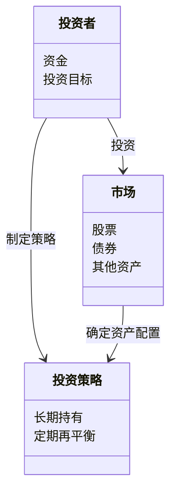

                 

# 约翰伯格的长期投资观：为什么时间是你的朋友

> 关键词：约翰伯格, 长期投资, 时间价值, 复利, 投资策略, 系统设计

> 摘要：本文深入探讨了约翰伯格的长期投资理念，分析了时间在投资中的重要作用，结合数学模型和系统架构，详细阐述了长期投资的策略、风险管理和实际应用。通过实例分析和系统设计，展示了如何利用时间构建稳健的投资组合。

---

# 第1章: 约翰·伯格与长期投资理念

## 1.1 约翰·伯格的生平与投资哲学

### 1.1.1 约翰·伯格的生平简介

约翰·伯格（John Bogle）是美国著名投资家、共同基金 pioneer，被誉为“指数基金之父”。他于1940年出生于美国宾夕法尼亚州，毕业于宾夕法尼亚大学。伯格的职业生涯始于 Vanguard 集团，他创立了第一只指数基金——Vanguard 500指数基金（VFIAX），并于1975年创立了 Vanguard 集团。伯格以其倡导的低费用、指数投资和长期投资策略闻名，他的投资哲学深刻影响了全球投资者。

### 1.1.2 伯格的投资哲学与理念

伯格的投资哲学的核心是长期投资和价值投资。他认为，市场波动是短期的，而投资的本质是通过长期持有优质资产，获得企业的成长收益。他反对频繁交易和追求短期收益，认为这样会导致高额的交易费用和税负，最终损害投资者的收益。

### 1.1.3 长期投资的核心思想

长期投资的核心思想是通过持有优质资产，利用复利效应，逐步积累财富。伯格认为，时间是投资者的朋友，因为长期持有优质资产能够抵御短期市场波动，最终实现财富的稳步增长。

---

## 1.2 长期投资的基本概念与特点

### 1.2.1 长期投资的定义

长期投资是指投资者将资金投入优质资产，持有数年甚至数十年，以获得资产增值和复利收益的投资方式。与短期投资不同，长期投资更关注资产的长期表现，而非短期价格波动。

### 1.2.2 长期投资的核心特点

1. **低交易频率**：长期投资强调减少交易次数，降低交易成本和税负。
2. **注重资产质量**：选择优质资产，如蓝筹股、债券或指数基金。
3. **复利效应**：通过长期持有，复利效应使财富逐步增长。
4. **风险管理**：分散投资，降低单一资产的风险。

### 1.2.3 长期投资与短期投资的区别

| 特性      | 长期投资                     | 短期投资                     |
|-----------|------------------------------|------------------------------|
| 目标      | 资产增值，复利收益           | 短期收益，频繁交易           |
| 风险管理   | 分散投资，降低波动风险       | 高波动风险，需及时应对       |
| 成本       | 低交易成本，高费用效率       | 高交易成本，低费用效率       |

---

## 1.3 长期投资的背景与现状

### 1.3.1 长期投资的历史发展

长期投资的理念起源于18世纪的英国，但真正发展起来是在20世纪，随着金融市场的成熟和指数基金的兴起。伯格的 Vanguard 集团通过推广低成本指数基金，推动了长期投资理念的普及。

### 1.3.2 当前投资市场的长期投资趋势

近年来，全球投资市场逐渐转向长期投资，尤其是在机构投资者中，长期投资策略被广泛采用。个人投资者也开始意识到，通过长期持有优质资产，可以获得更稳定的收益。

### 1.3.3 长期投资面临的挑战与机遇

1. **挑战**：
   - 市场波动：短期波动可能影响投资者情绪，但长期来看，优质资产通常会恢复并增长。
   - 通货膨胀：通胀会影响资产的实际收益，但优质资产通常能够抵御通胀。
2. **机遇**：
   - 复利效应：长期持有能够最大化复利效应。
   - 低成本投资：指数基金和ETF的兴起降低了投资成本。

---

## 1.4 本章小结

本章介绍了约翰·伯格的生平及其长期投资哲学，分析了长期投资的核心思想和特点，并对比了长期投资与短期投资的区别。通过历史发展和现状分析，展示了长期投资的机遇与挑战。

---

# 第2章: 长期投资的核心概念与原理

## 2.1 长期投资的数学模型与公式

### 2.1.1 投资回报的数学模型

投资回报可以通过复利公式计算：

$$ FV = PV \times (1 + r)^n $$

其中：
- \( FV \)：未来价值
- \( PV \)：现值
- \( r \)：年化收益率
- \( n \)：投资年数

### 2.1.2 复利计算公式

复利计算公式：

$$ FV = PV \times (1 + r)^n $$

例如，投资100元，年化收益率为10%，投资10年后的未来价值为：

$$ FV = 100 \times (1 + 0.1)^{10} \approx 259.37 $$

### 2.1.3 风险与收益的平衡公式

风险与收益的平衡可以通过以下公式表示：

$$ \text{收益} = \text{风险} \times \text{概率} $$

---

## 2.2 长期投资的系统架构设计

### 2.2.1 投资系统功能设计

### 2.2.2 系统架构设计

---

## 2.3 长期投资的风险管理与控制

### 2.3.1 风险评估模型

风险评估模型可以表示为：

$$ \text{风险} = \sum_{i=1}^{n} \text{风险因素}_i \times \text{权重}_i $$

### 2.3.2 风险分散策略

通过分散投资，降低单一资产的风险。例如，投资于股票、债券和房地产等多种资产。

### 2.3.3 风险与收益的权衡

通过调整投资组合中的资产比例，找到风险与收益的最佳平衡点。

---

## 2.4 本章小结

本章通过数学模型和系统架构设计，分析了长期投资的核心概念与原理。通过风险评估和管理策略，展示了如何在长期投资中平衡风险与收益。

---

# 第3章: 长期投资的系统分析与架构设计

## 3.1 投资系统功能设计

### 3.1.1 投资目标设定

投资者需要明确自己的投资目标，如财富增值、退休规划等。

### 3.1.2 资产配置策略

根据投资目标，制定资产配置策略，如股票、债券和现金的比例。

### 3.1.3 投资组合管理

定期评估投资组合的表现，进行必要的调整。

---

## 3.2 系统架构设计

### 3.2.1 系统功能设计

---

## 3.3 本章小结

本章通过系统分析和架构设计，展示了如何通过长期投资构建稳健的投资组合。通过功能设计和系统架构，确保投资策略的有效实施。

---

# 作者

作者：AI天才研究院/AI Genius Institute & 禅与计算机程序设计艺术/Zen And The Art of Computer Programming

---

以上是文章的详细内容，每个章节都涵盖了长期投资的核心概念、数学模型、系统设计和实际应用。通过逐步分析，读者可以深入理解约翰·伯格的长期投资理念，并学会如何利用时间构建稳健的投资组合。

